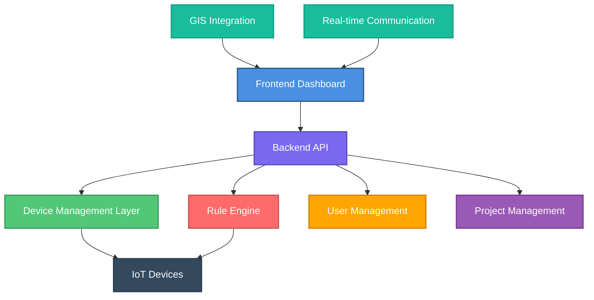
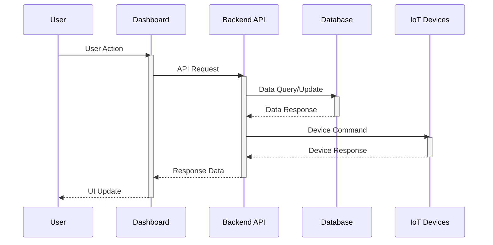

# 🔍 System Overview

> Complete architectural overview of SHUNCOM RULR IoT Platform


**Platform:** SHUNCOM RULR IoT Platform v1.1 | **Last Updated:** January 22, 2025


---

## 🏗️ System Architecture

### High-Level Architecture

### Core Components

1. **[Authentication System](../02-System-Architecture/02-Authentication%20System.md)** - User authentication and authorization
2. **[Device Management Hub](../03-Device-Management/03-Device%20Management%20Hub.md)** - IoT device lifecycle management
3. **[Rule Engine System](../04-Rule-Management/04-Rule%20Engine%20System.md)** - Automated rule processing
4. **[Project Management](../05-User-Management/05-Project%20Management.md)** - Project hierarchy and organization
5. **[Dashboard Interface](../06-Project-Management/06-Dashboard%20Interface.md)** - User interface and visualization

---

## 📊 Platform Capabilities

### Device Support


**Scalability:** The platform supports up to **5,000+ devices** per batch operation


- **7 Device Categories** supported
- **Real-time monitoring** and control
- **Multi-protocol support** (Zigbee, LoRa, NB-IoT, CAT.1)
- **Batch operations** for efficient management

### Rule Processing

- **Platform Rules**: Cloud-based automation
- **Local Rules**: Device-level autonomous operation
- **Alarm Rules**: Event-driven notifications
- **Multi-condition logic** with complex triggers

### User Management

- **Multi-tenant architecture**
- **Role-based permissions** (RBAC)
- **Hierarchical scopes** (Organization → Project → Group → Device)
- **Granular access control**

---

## 🔄 System Workflows

### Core User Journeys


**Quick Start:** Follow these workflows to get started with the platform


1. **Device Onboarding**: Register and configure new IoT devices
2. **Rule Configuration**: Create automated responses and actions
3. **Project Setup**: Organize devices into logical groups
4. **Alarm Handling**: Monitor and respond to system alerts

### Data Flow Patterns

---

## ⚡ Key Features

### Real-time Capabilities

- **Live device status** monitoring
- **Instant notifications** and alarms
- **Real-time dashboards** with auto-refresh
- **WebSocket connections** for live updates

### Integration Features

- **GIS mapping** with device positioning
- **Batch operations** for bulk management
- **Export/Import** functionality
- **Third-party integrations** ready

### Scalability Features

- **Multi-project support** with isolation
- **Hierarchical organization** structure
- **Configurable dashboards** per project
- **Performance optimization** for large datasets

---

## 🎯 Business Value

### Operational Efficiency


**Impact:** Automated operations reduce manual work by up to 60%


- **Automated device management** reduces manual work
- **Predictive maintenance** through alarm rules
- **Centralized monitoring** improves visibility
- **Batch operations** increase productivity

### Cost Savings

- **Remote monitoring** reduces site visits
- **Automated responses** minimize downtime
- **Energy management** through smart scheduling
- **Preventive maintenance** reduces failures

---

## 🔗 Related Documents

### Technical Deep Dives

- [Device Types Reference](../Device%20Types%20Reference.md) - Detailed device specifications
- [API Endpoints Map](../02-System-Architecture/API%20Endpoints%20Map.md) - Complete API documentation
- [Database Schema](../02-System-Architecture/Database%20Schema.md) - Data model and relationships
- [Performance Benchmarks](../08-Development-Guide/Performance%20Benchmarks.md) - System performance metrics

### Development Resources

- [Development Roadmap](../07-Dashboard/07-Development%20Roadmap.md) - Implementation timeline
- [UI Component Library](../08-Development-Guide/UI%20Component%20Library.md) - Reusable UI components
- [Testing Scenarios](../08-Development-Guide/Testing%20Scenarios.md) - Quality assurance guidelines

---

## 📋 System Requirements

### Technical Prerequisites


**Browser Compatibility:** Google Chrome is recommended for optimal performance


- **Browser**: Google Chrome (recommended)
- **Network**: Internet connectivity for cloud platform
- **Devices**: Compatible IoT devices with supported protocols
- **Integration**: GIS mapping service access

### Operational Prerequisites

- **Time Zone Configuration** (critical for rule execution)
- **User Role Definition** before system setup
- **Project Hierarchy Planning** for proper organization
- **Device Inventory** and location mapping

---


**Next Steps:** Start with [Authentication System](../02-System-Architecture/02-Authentication%20System.md) to understand user management, then proceed to [Device Management Hub](../03-Device-Management/03-Device%20Management%20Hub.md) for device onboarding procedures.

