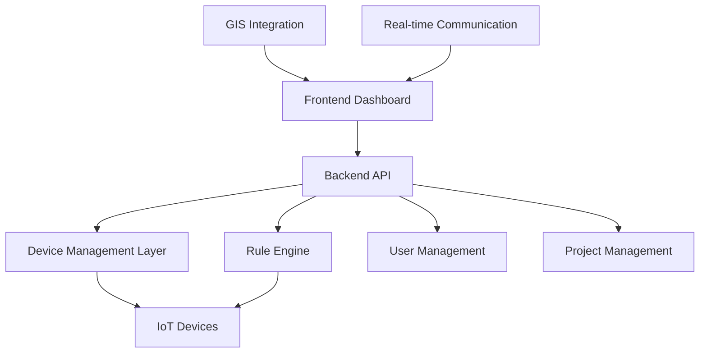
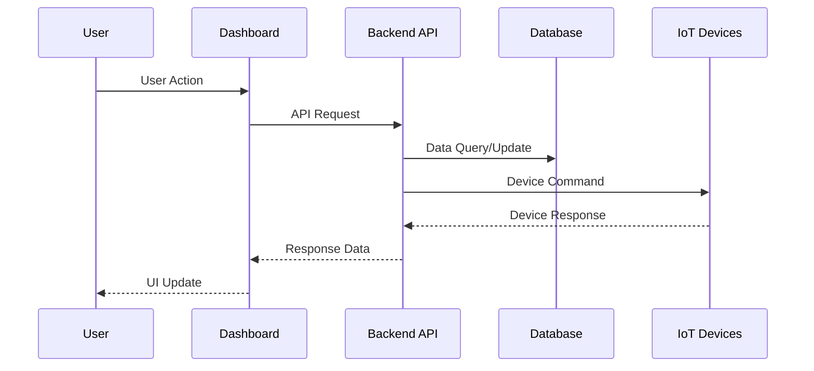

# 🔍 System Overview

> Complete architectural overview of SHUNCOM RULR IoT Platform

**Tags**: #shuncom-rulr #system-architecture #overview  
**Created**: 2025-01-22  
**Last Updated**: 2025-01-22

---

## 🏗️ System Architecture

### High-Level Architecture

### Core Components
1. **[[02-Authentication System]]** - User authentication and authorization
2. **[[03-Device Management Hub]]** - IoT device lifecycle management  
3. **[[04-Rule Engine System]]** - Automated rule processing
4. **[[05-Project Management]]** - Project hierarchy and organization
5. **[[06-Dashboard Interface]]** - User interface and visualization

---

## 📊 Platform Capabilities

### Device Support
- **7 Device Categories** supported
- **5,000+ devices** per batch operation
- **Real-time monitoring** and control
- **Multi-protocol support** (Zigbee, LoRa, NB-IoT, CAT.1)

### Rule Processing
- **Platform Rules**: Cloud-based automation
- **Local Rules**: Device-level autonomous operation  
- **Alarm Rules**: Event-driven notifications
- **Multi-condition logic** with complex triggers

### User Management
- **Multi-tenant architecture**
- **Role-based permissions** (RBAC)
- **Hierarchical scopes** (Organization → Project → Group → Device)
- **Granular access control**

---

## 🔄 System Workflows

### Core User Journeys
1. **Device Onboarding**: [[Device Registration Flow]]
2. **Rule Configuration**: [[Rule Creation Workflow]]  
3. **Project Setup**: [[Project Creation Process]]
4. **Alarm Handling**: [[Alarm Management Flow]]

### Data Flow Patterns

---

## ⚡ Key Features

### Real-time Capabilities
- **Live device status** monitoring
- **Instant notifications** and alarms
- **Real-time dashboards** with auto-refresh
- **WebSocket connections** for live updates

### Integration Features
- **GIS mapping** with device positioning
- **Batch operations** for bulk management
- **Export/Import** functionality
- **Third-party integrations** ready

### Scalability Features
- **Multi-project support** with isolation
- **Hierarchical organization** structure
- **Configurable dashboards** per project
- **Performance optimization** for large datasets

---

## 🎯 Business Value

### Operational Efficiency
- **Automated device management** reduces manual work
- **Predictive maintenance** through alarm rules
- **Centralized monitoring** improves visibility
- **Batch operations** increase productivity

### Cost Savings  
- **Remote monitoring** reduces site visits
- **Automated responses** minimize downtime
- **Energy management** through smart scheduling
- **Preventive maintenance** reduces failures

---

## 🔗 Related Documents

### Technical Deep Dives
- [[Device Types Reference]] - Detailed device specifications
- [[API Endpoints Map]] - Complete API documentation
- [[Database Schema]] - Data model and relationships
- [[Performance Benchmarks]] - System performance metrics

### Development Resources
- [[07-Development Roadmap]] - Implementation timeline
- [[UI Component Library]] - Reusable UI components
- [[Testing Scenarios]] - Quality assurance guidelines

---

## 📋 System Requirements

### Technical Prerequisites
- **Browser**: Google Chrome (recommended)
- **Network**: Internet connectivity for cloud platform
- **Devices**: Compatible IoT devices with supported protocols
- **Integration**: GIS mapping service access

### Operational Prerequisites  
- **Time Zone Configuration** (critical for rule execution)
- **User Role Definition** before system setup
- **Project Hierarchy Planning** for proper organization
- **Device Inventory** and location mapping

---

**Next Steps**: Start with [[02-Authentication System]] to understand user management, then proceed to [[03-Device Management Hub]] for device onboarding procedures.