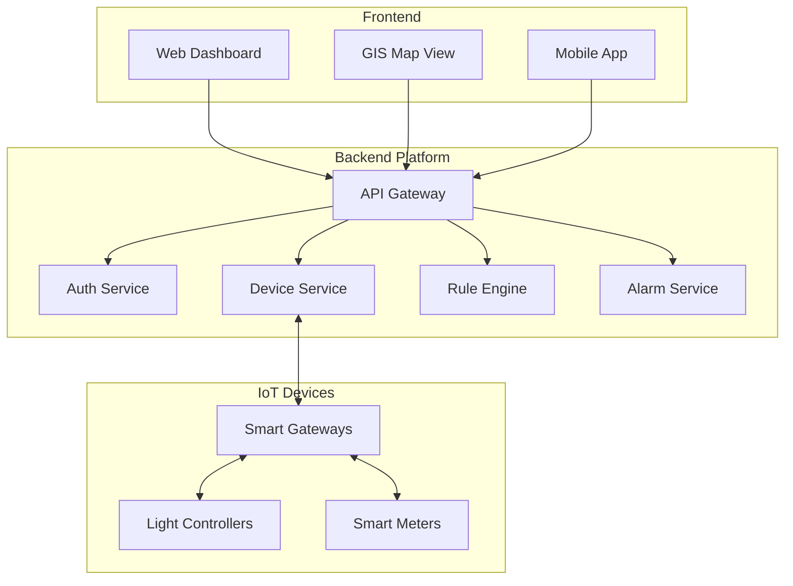
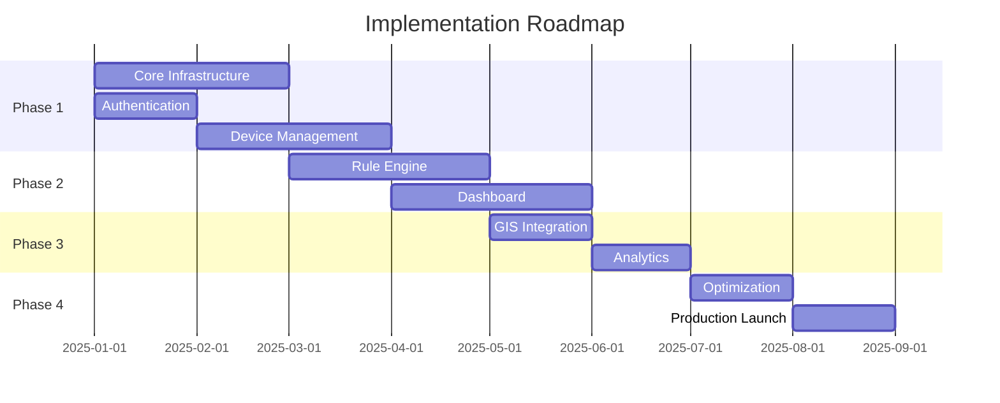

# 📊 Executive Summary

> High-level overview of SHUNCOM RULR IoT Platform for stakeholders and decision-makers

---

## 🎯 Platform Purpose

**SHUNCOM RULR** is a comprehensive IoT platform designed for **smart street lighting and urban infrastructure management**. It enables cities, industrial parks, and facility managers to:

- **Monitor** thousands of lighting devices in real-time
- **Control** lights individually or in groups with precision
- **Automate** operations through intelligent rule engines
- **Analyze** energy consumption and operational efficiency
- **Manage** multi-tenant deployments with granular access control

---

## 🏗️ System Architecture



---

## 📱 Supported Device Types

| Device Type | Purpose | Quantity Support |
|-------------|---------|------------------|
| **Smart Gateway** | Central hub for sub-devices | Up to 500 sub-devices each |
| **Light Controller** | Control individual lights (Zigbee/LoRa/NB-IoT/CAT.1) | 100,000+ per deployment |
| **Lighting Fixture** | Light status tracking | Paired with controllers |
| **Lighting Pole** | Physical infrastructure container | Unlimited |
| **Power Distribution** | Circuit management | As needed |
| **Loop Controller** | Circuit-level control | Gateway-dependent |
| **Smart Meter** | Energy monitoring | As needed |

---

## ⚙️ Core Capabilities

### 1. Device Management
- **Batch operations**: Import/export up to 5,000 devices
- **Real-time monitoring**: Status, metrics, location
- **Remote control**: On/off, dimming, scheduling
- **Protocol support**: Zigbee, LoRa (OTAA/ABP), NB-IoT, CAT.1

### 2. Rule Engine (3-Layer Architecture)
| Layer | Execution | Use Case |
|-------|-----------|----------|
| **Platform Rules** | Cloud-based | Complex scheduling, multi-device coordination |
| **Local Rules** | Gateway-based | Offline-capable, low-latency responses |
| **Alarm Rules** | Event-driven | Real-time notifications, threshold monitoring |

### 3. User Management
- **Role-Based Access Control (RBAC)**: Admin, Manager, Operator, Viewer
- **Management Scopes**: Project-level, group-level, device-level
- **Multi-tenant**: Organization isolation

### 4. Dashboard & Analytics
- **Real-time statistics**: Device counts, status distribution
- **GIS integration**: Map-based device visualization
- **Energy analytics**: Consumption tracking, cost analysis
- **Custom widgets**: Configurable dashboard layouts

---

## 📈 Key Metrics & Performance

```yaml
Scale:
  Maximum Devices: 100,000+ per deployment
  Concurrent Users: 200+
  API Throughput: 1,000+ requests/second

Performance:
  API Response Time: < 500ms (P95)
  Real-time Latency: < 1 second
  Dashboard Load: < 2 seconds

Reliability:
  Uptime Target: 99.9%
  Data Retention: 1 year (metrics)
  Backup: Daily automated
```

---

## 🔐 Security Features

| Area | Implementation |
|------|----------------|
| **Authentication** | JWT tokens, MFA support, account lockout |
| **Authorization** | RBAC + Management Scopes |
| **Data Protection** | TLS 1.2+, AES-256 encryption at rest |
| **Audit** | Complete audit logging, 2-year retention |
| **Device Security** | Certificate-based auth, secure protocols |

---

## 🚀 Implementation Phases



---

## 💰 Business Value

### Cost Savings
- **Energy reduction**: 30-50% through intelligent scheduling
- **Maintenance optimization**: Predictive alerts reduce truck rolls
- **Operational efficiency**: Centralized control reduces manual effort

### Operational Benefits
- **24/7 monitoring**: Real-time visibility into all assets
- **Rapid response**: Instant alarm notifications
- **Data-driven decisions**: Analytics and reporting

### Scalability
- **Start small**: Deploy with hundreds of devices
- **Grow seamlessly**: Scale to 100,000+ devices
- **Multi-site**: Manage multiple locations from one platform

---

## 🔗 Related Documents

- **[[01-System Overview]]**: Detailed technical architecture
- **[[07-Development Roadmap]]**: Implementation timeline
- **[[Feature Requirements Checklist]]**: Feature tracking
- **[[Performance Benchmarks]]**: Technical specifications

---

**Contact**: For implementation inquiries, contact the development team.
