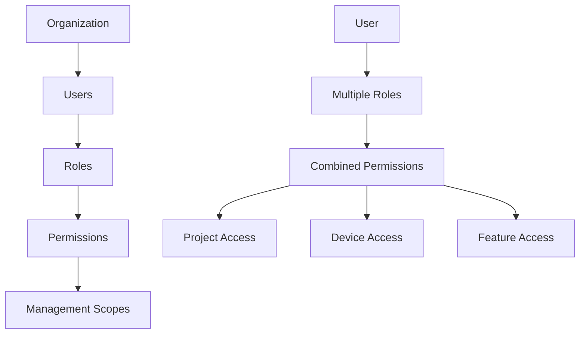
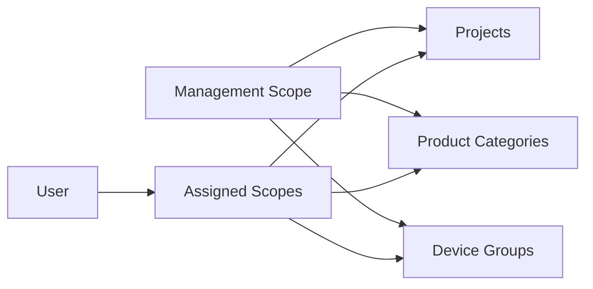
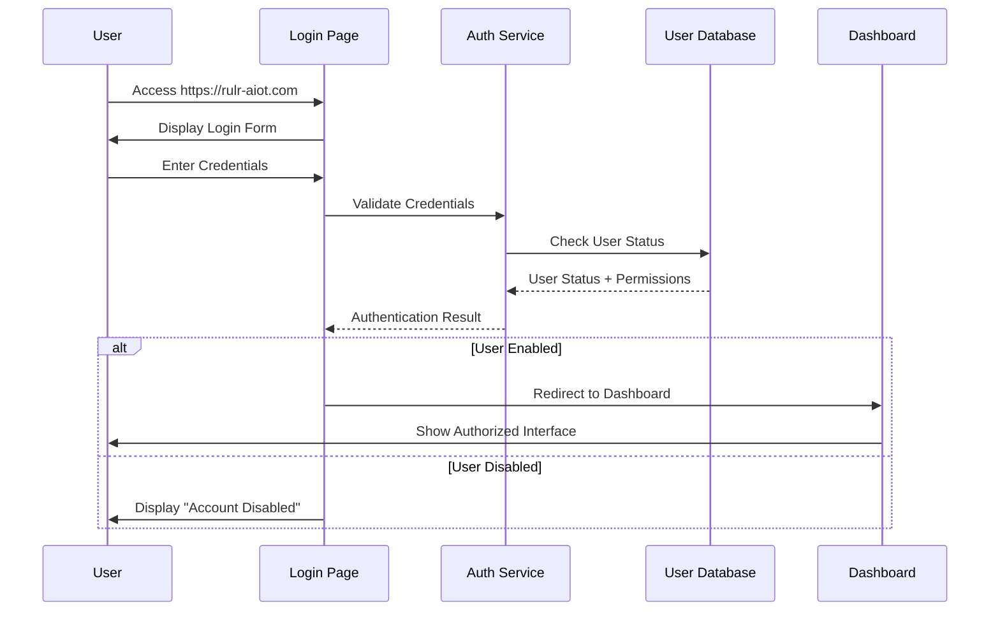
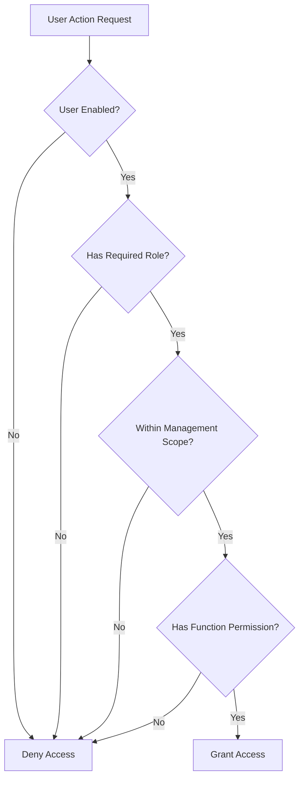

# 🔐 Authentication System

> User management, roles, permissions and organizational structure

**Tags**: #user-management #authentication #rbac #permissions  
**Created**: 2025-01-22  
**Last Updated**: 2025-01-22

---

## 🏢 System Architecture

### User Management Hierarchy


---

## 👤 User Management

### User Lifecycle
**Navigation**: `Settings > Basic Configuration > Organization and Users > User Management`

#### User States
- ✅ **Enabled**: Full system access
- ❌ **Disabled**: Login blocked
- 🗑️ **Deleted**: Permanent removal

#### Core User Operations
1. **[[User Creation Process]]** - Adding new users
2. **[[User Role Assignment]]** - Permission management
3. **[[Management Scope Configuration]]** - Access boundaries
4. **[[User Status Management]]** - Enable/disable accounts

### User Creation Requirements
```yaml
Required Fields:
  - Account Information
  - Platform Role (if available)
  - Management Scope (if configured)

Optional Fields:
  - User Description
  - Contact Information
  - Department Assignment
```

---

## 🎭 Role-Based Access Control (RBAC)

### Role Architecture
**Concept**: Roles = Function Rights Management

#### Role Features
- **Granular Permissions**: Page-level and function-level control
- **Multiple Assignment**: 1 user → multiple roles
- **Reusable Roles**: 1 role → multiple users  
- **Dynamic Configuration**: Real-time permission updates

### Role Configuration Process
**Navigation**: `Settings > Basic Configuration > Organization and Users > Permission Management > User Role`

#### Role Creation Steps
1. **Basic Information**
   ```yaml
   Role Name: "Device Manager"
   Description: "Manage all device operations"
   ```

2. **Permission Assignment**
   ```yaml
   Pages Access:
     - Device Management: ✅
     - Project Management: ✅
     - Rule Management: ❌
   
   Function Permissions:
     - View Devices: ✅
     - Add Devices: ✅
     - Delete Devices: ❌
     - Batch Operations: ✅
   ```

3. **User Association**
   - Select users for role assignment
   - Support bulk user assignment

---

## 🎯 Management Scope System

### Scope Hierarchy


### Scope Types
1. **Project Scope**: Which projects user can access
2. **Product Category Scope**: Which device types user can manage
3. **Group Scope**: Which device groups user can control

### Default Scopes
- **Tenant Admin**: All scopes by default
- **Regular Users**: Limited scopes configured by admin
- **Auto-Generated**: 
  - Unassigned projects group
  - 'Ungrouped' device group

### Scope Configuration
**Navigation**: `Settings > Basic Configuration > Organization and Users > Permission Management > Management Scope`

#### Configuration Process
```yaml
Scope Creation:
  Name: "Regional Manager - North"
  Product Categories: 
    - Smart Gateways ✅
    - Light Controllers ✅
    - Smart Meters ❌
  
  Projects:
    - North Region Projects ✅
    - Central Projects ❌
  
  Groups:
    - North Street Lights ✅
    - North Industrial ✅
```

---

## 🏢 Organization Management

### Organization Configuration
**Navigation**: `Settings > Basic Configuration > Organization and Users > Organization Management`

#### Organization Features
- **Logo Upload**: Displayed in upper-left corner
- **Company Information**: Complete organization details
- **Branding**: Custom platform appearance
- **Tenant Configuration**: Multi-tenant support

#### Organization Setup
```yaml
Organization Details:
  Company Name: "City Infrastructure Department"
  Logo: company_logo.png
  Address: "123 Government Building"
  Contact: "admin@city.gov"
  
Display Settings:
  Brand Colors: #custom-theme
  Logo Position: upper-left
  Company Footer: ✅
```

---

## 🔄 Authentication Workflows

### Login Process


### Permission Checking


---

## ⚙️ Implementation Guidelines

### User Creation Best Practices
1. **Pre-planning**: Define roles before creating users
2. **Scope Planning**: Map organizational structure to scopes
3. **Security**: Use strong password policies
4. **Documentation**: Maintain user role assignments

### Permission Design Patterns
```yaml
Role Design Strategy:
  Functional Roles:
    - "Device Operator": Day-to-day device management
    - "Rule Manager": Configure automation rules
    - "Report Viewer": Read-only dashboard access
    
  Hierarchical Roles:
    - "Site Manager": Full site control
    - "Regional Manager": Multiple site access  
    - "System Admin": Platform administration
    
  Combined Approach:
    - Assign multiple functional roles per user
    - Use management scopes for data isolation
```

### Security Considerations
- **Principle of Least Privilege**: Minimum required permissions
- **Regular Audits**: Periodic permission reviews
- **Segregation of Duties**: Critical operations require multiple roles
- **Temporal Access**: Time-bound permissions for contractors

---

## 🔗 Related Documentation

### Technical Implementation
- [[User Database Schema]] - Data model for users and permissions
- [[Authentication API]] - Login and session management endpoints
- [[Permission Engine]] - Runtime permission checking logic

### Operational Guides
- [[User Onboarding Checklist]] - New user setup procedures
- [[Role Management Workflows]] - Role lifecycle management
- [[Security Audit Procedures]] - Regular security reviews

### Integration Points
- [[05-Project Management]] - Project-user associations
- [[03-Device Management Hub]] - Device access control
- [[04-Rule Engine System]] - Rule execution permissions

---

## 📋 Quick Reference

### Critical Time Zone Impact
⚠️ **Important**: Time zone setting affects ALL rule executions
- **Location**: My Account > Preferences > Time Zone
- **Impact**: Platform Rules, Local Rules, Alarm Rules timing
- **Recommendation**: Set time zone before any rule configuration

### Default Permissions
```yaml
Tenant Administrator:
  - All management scopes ✅
  - All platform features ✅
  - User management ✅
  - System configuration ✅

New User (Default):
  - Limited scope (configured by admin)
  - Basic dashboard access
  - No administrative functions
  - Read-only permissions initially
```

---

**Next Steps**: Configure [[05-Project Management]] structure before assigning management scopes to users.