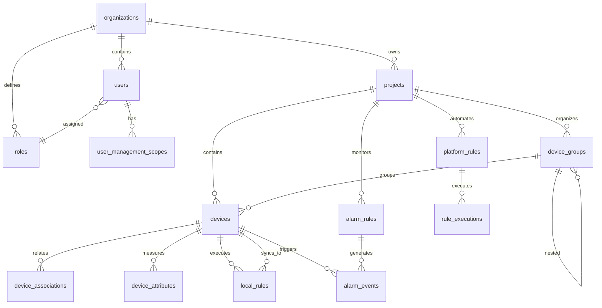

# 🗄️ Database Schema

> Complete data model and relationships for SHUNCOM RULR IoT Platform


**Platform:** SHUNCOM RULR IoT Platform v1.1 | **Last Updated:** January 2025


**Database**: PostgreSQL 14+
**ORM**: Prisma/TypeORM (TBD)

---

## 📋 Table of Contents

1. [Database Overview](#database-overview)
2. [Core Tables](#core-tables)
3. [Entity Relationships](#entity-relationships)
4. [Indexes & Performance](#indexes--performance)
5. [Data Integrity Rules](#data-integrity-rules)
6. [Migration Strategy](#migration-strategy)

---

## 🏗️ Database Overview

### Database Architecture
```yaml
Database Type: PostgreSQL 14+
Encoding: UTF-8
Timezone Storage: UTC
Connection Pool: 10-50 connections
Replication: Master-Slave (Read replicas)

Schemas:
  - public: Main application tables
  - audit: Audit log tables
  - analytics: Analytics and reporting tables
  - archive: Historical data archive
```

### Design Principles
- **Normalization**: 3NF for transactional data
- **Denormalization**: Strategic for analytics queries
- **Soft Deletes**: All entities support soft deletion
- **Audit Trail**: Complete change tracking
- **Multi-tenancy**: Organization-based data isolation

---

## 📊 Core Tables

### Authentication & Users

#### `users`
Primary table for user accounts and authentication.

```sql
CREATE TABLE users (
  id UUID PRIMARY KEY DEFAULT gen_random_uuid(),
  username VARCHAR(255) UNIQUE NOT NULL,
  email VARCHAR(255) UNIQUE NOT NULL,
  password_hash VARCHAR(255) NOT NULL,
  display_name VARCHAR(255) NOT NULL,
  phone VARCHAR(50),

  -- Relationships
  organization_id UUID NOT NULL REFERENCES organizations(id),
  role_id UUID NOT NULL REFERENCES roles(id),

  -- Status & Security
  status VARCHAR(20) DEFAULT 'active' CHECK (status IN ('active', 'disabled', 'locked')),
  failed_login_attempts INTEGER DEFAULT 0,
  last_login_at TIMESTAMP WITH TIME ZONE,
  password_changed_at TIMESTAMP WITH TIME ZONE,

  -- User Preferences
  timezone VARCHAR(50) DEFAULT 'UTC',
  language VARCHAR(10) DEFAULT 'en',
  theme VARCHAR(20) DEFAULT 'light',
  email_notifications BOOLEAN DEFAULT true,
  sms_notifications BOOLEAN DEFAULT false,

  -- Audit Fields
  created_at TIMESTAMP WITH TIME ZONE DEFAULT NOW(),
  created_by UUID REFERENCES users(id),
  updated_at TIMESTAMP WITH TIME ZONE DEFAULT NOW(),
  updated_by UUID REFERENCES users(id),
  deleted_at TIMESTAMP WITH TIME ZONE,
  deleted_by UUID REFERENCES users(id)
);

-- Indexes
CREATE INDEX idx_users_organization ON users(organization_id) WHERE deleted_at IS NULL;
CREATE INDEX idx_users_role ON users(role_id) WHERE deleted_at IS NULL;
CREATE INDEX idx_users_status ON users(status) WHERE deleted_at IS NULL;
CREATE INDEX idx_users_email ON users(email) WHERE deleted_at IS NULL;
```

#### `organizations`
Multi-tenant organization/company management.

```sql
CREATE TABLE organizations (
  id UUID PRIMARY KEY DEFAULT gen_random_uuid(),
  name VARCHAR(255) NOT NULL,
  logo_url TEXT,
  website VARCHAR(255),
  contact_email VARCHAR(255),
  contact_phone VARCHAR(50),

  -- Address
  country VARCHAR(100),
  province VARCHAR(100),
  city VARCHAR(100),
  district VARCHAR(100),
  address TEXT,

  -- Configuration
  settings JSONB DEFAULT '{}',

  -- Audit Fields
  created_at TIMESTAMP WITH TIME ZONE DEFAULT NOW(),
  created_by UUID REFERENCES users(id),
  updated_at TIMESTAMP WITH TIME ZONE DEFAULT NOW(),
  updated_by UUID REFERENCES users(id),
  deleted_at TIMESTAMP WITH TIME ZONE,
  deleted_by UUID REFERENCES users(id)
);

CREATE INDEX idx_organizations_name ON organizations(name) WHERE deleted_at IS NULL;
```

#### `roles`
Role-Based Access Control (RBAC) roles.

```sql
CREATE TABLE roles (
  id UUID PRIMARY KEY DEFAULT gen_random_uuid(),
  organization_id UUID NOT NULL REFERENCES organizations(id),
  name VARCHAR(100) NOT NULL,
  description TEXT,

  -- Permissions stored as JSON array
  permissions JSONB DEFAULT '[]',

  -- System Roles (cannot be deleted)
  is_system_role BOOLEAN DEFAULT false,

  -- Audit Fields
  created_at TIMESTAMP WITH TIME ZONE DEFAULT NOW(),
  created_by UUID REFERENCES users(id),
  updated_at TIMESTAMP WITH TIME ZONE DEFAULT NOW(),
  updated_by UUID REFERENCES users(id),
  deleted_at TIMESTAMP WITH TIME ZONE,
  deleted_by UUID REFERENCES users(id),

  CONSTRAINT unique_role_name_per_org UNIQUE(organization_id, name, deleted_at)
);

CREATE INDEX idx_roles_organization ON roles(organization_id) WHERE deleted_at IS NULL;
```

#### `user_management_scopes`
User access scope restrictions (projects, device groups, categories).

```sql
CREATE TABLE user_management_scopes (
  id UUID PRIMARY KEY DEFAULT gen_random_uuid(),
  user_id UUID NOT NULL REFERENCES users(id),

  -- Scope Configuration
  scope_type VARCHAR(50) NOT NULL CHECK (scope_type IN ('project', 'device_group', 'product_category')),
  scope_value VARCHAR(255) NOT NULL, -- '*' for all access

  -- Audit Fields
  created_at TIMESTAMP WITH TIME ZONE DEFAULT NOW(),
  created_by UUID REFERENCES users(id),

  CONSTRAINT unique_user_scope UNIQUE(user_id, scope_type, scope_value)
);

CREATE INDEX idx_user_scopes_user ON user_management_scopes(user_id);
CREATE INDEX idx_user_scopes_type ON user_management_scopes(scope_type);
```

---

### Projects & Locations

#### `projects`
IoT project/site management.

```sql
CREATE TABLE projects (
  id UUID PRIMARY KEY DEFAULT gen_random_uuid(),
  organization_id UUID NOT NULL REFERENCES organizations(id),
  name VARCHAR(255) NOT NULL,
  description TEXT,

  -- Location
  country VARCHAR(100),
  province VARCHAR(100),
  city VARCHAR(100),
  district VARCHAR(100),
  address TEXT,

  -- GIS Boundary (GeoJSON Polygon)
  boundary GEOGRAPHY(POLYGON, 4326),

  -- Project Settings
  timezone VARCHAR(50) DEFAULT 'UTC',
  settings JSONB DEFAULT '{}',

  -- Status
  status VARCHAR(20) DEFAULT 'active' CHECK (status IN ('active', 'inactive', 'archived')),

  -- Audit Fields
  created_at TIMESTAMP WITH TIME ZONE DEFAULT NOW(),
  created_by UUID REFERENCES users(id),
  updated_at TIMESTAMP WITH TIME ZONE DEFAULT NOW(),
  updated_by UUID REFERENCES users(id),
  deleted_at TIMESTAMP WITH TIME ZONE,
  deleted_by UUID REFERENCES users(id)
);

CREATE INDEX idx_projects_organization ON projects(organization_id) WHERE deleted_at IS NULL;
CREATE INDEX idx_projects_status ON projects(status) WHERE deleted_at IS NULL;
CREATE INDEX idx_projects_boundary ON projects USING GIST(boundary) WHERE deleted_at IS NULL;
```

#### `device_groups`
Logical grouping of devices for management.

```sql
CREATE TABLE device_groups (
  id UUID PRIMARY KEY DEFAULT gen_random_uuid(),
  project_id UUID NOT NULL REFERENCES projects(id),
  parent_group_id UUID REFERENCES device_groups(id),
  name VARCHAR(255) NOT NULL,
  description TEXT,

  -- Group Type
  group_type VARCHAR(50) DEFAULT 'manual' CHECK (group_type IN ('manual', 'automatic', 'geographic')),

  -- Automatic Group Criteria (for dynamic groups)
  criteria JSONB,

  -- Audit Fields
  created_at TIMESTAMP WITH TIME ZONE DEFAULT NOW(),
  created_by UUID REFERENCES users(id),
  updated_at TIMESTAMP WITH TIME ZONE DEFAULT NOW(),
  updated_by UUID REFERENCES users(id),
  deleted_at TIMESTAMP WITH TIME ZONE,
  deleted_by UUID REFERENCES users(id)
);

CREATE INDEX idx_device_groups_project ON device_groups(project_id) WHERE deleted_at IS NULL;
CREATE INDEX idx_device_groups_parent ON device_groups(parent_group_id) WHERE deleted_at IS NULL;
```

---

### Device Management

#### `devices`
Master device registry for all device types.

```sql
CREATE TABLE devices (
  id UUID PRIMARY KEY DEFAULT gen_random_uuid(),
  device_code VARCHAR(100) UNIQUE NOT NULL, -- User-friendly device identifier
  name VARCHAR(255) NOT NULL,

  -- Device Classification
  device_type VARCHAR(50) NOT NULL CHECK (device_type IN (
    'smart_gateway',
    'light_controller_zigbee',
    'light_controller_lora',
    'light_controller_nbiot',
    'light_controller_cat1',
    'lighting_fixture',
    'lighting_pole',
    'power_distribution',
    'loop_control_builtin',
    'loop_control_extended',
    'smart_meter'
  )),

  -- Project & Group Assignment
  project_id UUID NOT NULL REFERENCES projects(id),
  device_group_id UUID REFERENCES device_groups(id),

  -- Device Relationships
  gateway_id UUID REFERENCES devices(id), -- For sub-devices
  parent_device_id UUID REFERENCES devices(id), -- Hierarchical relationships

  -- Location
  latitude DECIMAL(10, 8),
  longitude DECIMAL(11, 8),
  altitude DECIMAL(8, 2),
  address TEXT,
  installation_location TEXT,

  -- Device Information
  manufacturer VARCHAR(100),
  model VARCHAR(100),
  serial_number VARCHAR(100),
  firmware_version VARCHAR(50),
  hardware_version VARCHAR(50),
  mac_address VARCHAR(17),

  -- Communication
  communication_protocol VARCHAR(50),
  ip_address INET,
  port INTEGER,

  -- Status
  status VARCHAR(20) DEFAULT 'offline' CHECK (status IN ('online', 'offline', 'maintenance', 'error')),
  last_seen_at TIMESTAMP WITH TIME ZONE,
  last_communication_at TIMESTAMP WITH TIME ZONE,

  -- Installation
  installation_date DATE,
  warranty_expiry_date DATE,

  -- Configuration (device-specific settings)
  configuration JSONB DEFAULT '{}',

  -- Metadata
  tags TEXT[],
  notes TEXT,

  -- Audit Fields
  created_at TIMESTAMP WITH TIME ZONE DEFAULT NOW(),
  created_by UUID REFERENCES users(id),
  updated_at TIMESTAMP WITH TIME ZONE DEFAULT NOW(),
  updated_by UUID REFERENCES users(id),
  deleted_at TIMESTAMP WITH TIME ZONE,
  deleted_by UUID REFERENCES users(id)
);

-- Indexes
CREATE INDEX idx_devices_project ON devices(project_id) WHERE deleted_at IS NULL;
CREATE INDEX idx_devices_group ON devices(device_group_id) WHERE deleted_at IS NULL;
CREATE INDEX idx_devices_gateway ON devices(gateway_id) WHERE deleted_at IS NULL;
CREATE INDEX idx_devices_type ON devices(device_type) WHERE deleted_at IS NULL;
CREATE INDEX idx_devices_status ON devices(status) WHERE deleted_at IS NULL;
CREATE INDEX idx_devices_location ON devices USING GIST(ll_to_earth(latitude, longitude)) WHERE deleted_at IS NULL AND latitude IS NOT NULL;
CREATE INDEX idx_devices_code ON devices(device_code) WHERE deleted_at IS NULL;
```

#### `device_associations`
Many-to-many relationships between devices.

```sql
CREATE TABLE device_associations (
  id UUID PRIMARY KEY DEFAULT gen_random_uuid(),
  source_device_id UUID NOT NULL REFERENCES devices(id),
  target_device_id UUID NOT NULL REFERENCES devices(id),

  -- Association Type
  association_type VARCHAR(50) NOT NULL CHECK (association_type IN (
    'controller_fixture', -- Light Controller to Lighting Fixture
    'pole_fixture',       -- Lighting Pole to Fixture
    'pole_controller',    -- Lighting Pole to Controller
    'gateway_subdevice',  -- Gateway to Sub-device
    'meter_distribution'  -- Smart Meter to Power Distribution
  )),

  -- Metadata
  metadata JSONB DEFAULT '{}',

  -- Audit Fields
  created_at TIMESTAMP WITH TIME ZONE DEFAULT NOW(),
  created_by UUID REFERENCES users(id),
  deleted_at TIMESTAMP WITH TIME ZONE,

  CONSTRAINT unique_device_association UNIQUE(source_device_id, target_device_id, association_type, deleted_at)
);

CREATE INDEX idx_device_assoc_source ON device_associations(source_device_id) WHERE deleted_at IS NULL;
CREATE INDEX idx_device_assoc_target ON device_associations(target_device_id) WHERE deleted_at IS NULL;
CREATE INDEX idx_device_assoc_type ON device_associations(association_type) WHERE deleted_at IS NULL;
```

#### `device_attributes`
Real-time device attribute values (time-series data).

```sql
CREATE TABLE device_attributes (
  id BIGSERIAL PRIMARY KEY,
  device_id UUID NOT NULL REFERENCES devices(id),

  -- Attribute Data
  attribute_name VARCHAR(100) NOT NULL,
  attribute_value JSONB NOT NULL,
  unit VARCHAR(50),

  -- Data Quality
  quality VARCHAR(20) DEFAULT 'good' CHECK (quality IN ('good', 'uncertain', 'bad')),

  -- Timestamp
  timestamp TIMESTAMP WITH TIME ZONE DEFAULT NOW(),

  -- Partitioning hint
  created_at TIMESTAMP WITH TIME ZONE DEFAULT NOW()
) PARTITION BY RANGE (created_at);

-- Create monthly partitions
CREATE TABLE device_attributes_2025_01 PARTITION OF device_attributes
  FOR VALUES FROM ('2025-01-01') TO ('2025-02-01');

-- Indexes
CREATE INDEX idx_device_attr_device ON device_attributes(device_id, timestamp DESC);
CREATE INDEX idx_device_attr_name ON device_attributes(attribute_name, timestamp DESC);
```

---

### Rule Engine

#### `platform_rules`
Platform-level automation rules.

```sql
CREATE TABLE platform_rules (
  id UUID PRIMARY KEY DEFAULT gen_random_uuid(),
  project_id UUID NOT NULL REFERENCES projects(id),
  name VARCHAR(255) NOT NULL,
  description TEXT,

  -- Rule Configuration
  conditions JSONB NOT NULL, -- Array of condition objects
  actions JSONB NOT NULL,    -- Array of action objects

  -- Schedule
  schedule_config JSONB,     -- Days, times, timezone

  -- Status
  status VARCHAR(20) DEFAULT 'enabled' CHECK (status IN ('enabled', 'disabled')),

  -- Execution Tracking
  last_executed_at TIMESTAMP WITH TIME ZONE,
  execution_count INTEGER DEFAULT 0,
  success_count INTEGER DEFAULT 0,
  failure_count INTEGER DEFAULT 0,

  -- Audit Fields
  created_at TIMESTAMP WITH TIME ZONE DEFAULT NOW(),
  created_by UUID REFERENCES users(id),
  updated_at TIMESTAMP WITH TIME ZONE DEFAULT NOW(),
  updated_by UUID REFERENCES users(id),
  deleted_at TIMESTAMP WITH TIME ZONE,
  deleted_by UUID REFERENCES users(id)
);

CREATE INDEX idx_platform_rules_project ON platform_rules(project_id) WHERE deleted_at IS NULL;
CREATE INDEX idx_platform_rules_status ON platform_rules(status) WHERE deleted_at IS NULL;
```

#### `local_rules`
Device/Gateway-level local rules.

```sql
CREATE TABLE local_rules (
  id UUID PRIMARY KEY DEFAULT gen_random_uuid(),
  gateway_id UUID NOT NULL REFERENCES devices(id),
  name VARCHAR(255) NOT NULL,
  description TEXT,

  -- Simple Rule (1 condition, 1 action)
  condition JSONB NOT NULL,
  action JSONB NOT NULL,

  -- Status
  status VARCHAR(20) DEFAULT 'enabled' CHECK (status IN ('enabled', 'disabled')),

  -- Sync Status
  sync_status VARCHAR(20) DEFAULT 'pending' CHECK (sync_status IN ('pending', 'syncing', 'synced', 'failed')),
  sync_error TEXT,
  last_synced_at TIMESTAMP WITH TIME ZONE,

  -- Audit Fields
  created_at TIMESTAMP WITH TIME ZONE DEFAULT NOW(),
  created_by UUID REFERENCES users(id),
  updated_at TIMESTAMP WITH TIME ZONE DEFAULT NOW(),
  updated_by UUID REFERENCES users(id),
  deleted_at TIMESTAMP WITH TIME ZONE,
  deleted_by UUID REFERENCES users(id)
);

CREATE INDEX idx_local_rules_gateway ON local_rules(gateway_id) WHERE deleted_at IS NULL;
CREATE INDEX idx_local_rules_sync_status ON local_rules(sync_status) WHERE deleted_at IS NULL;
```

#### `alarm_rules`
Alarm and notification rules.

```sql
CREATE TABLE alarm_rules (
  id UUID PRIMARY KEY DEFAULT gen_random_uuid(),
  project_id UUID NOT NULL REFERENCES projects(id),
  name VARCHAR(255) NOT NULL,
  description TEXT,

  -- Alarm Type
  alarm_type VARCHAR(50) NOT NULL CHECK (alarm_type IN (
    'platform_alarm',
    'offline_alarm',
    'device_event_alarm'
  )),

  -- Trigger Conditions
  conditions JSONB NOT NULL,

  -- Severity
  severity VARCHAR(20) DEFAULT 'medium' CHECK (severity IN ('low', 'medium', 'high', 'critical')),

  -- Notification Configuration
  notification_channels TEXT[], -- ['email', 'sms', 'push']
  recipient_groups UUID[],      -- Array of user group IDs
  recipient_users UUID[],        -- Array of user IDs

  -- Silent Period
  silent_period_start TIME,
  silent_period_end TIME,

  -- Escalation
  escalation_config JSONB,

  -- Status
  status VARCHAR(20) DEFAULT 'enabled' CHECK (status IN ('enabled', 'disabled')),

  -- Statistics
  triggered_count INTEGER DEFAULT 0,
  last_triggered_at TIMESTAMP WITH TIME ZONE,

  -- Audit Fields
  created_at TIMESTAMP WITH TIME ZONE DEFAULT NOW(),
  created_by UUID REFERENCES users(id),
  updated_at TIMESTAMP WITH TIME ZONE DEFAULT NOW(),
  updated_by UUID REFERENCES users(id),
  deleted_at TIMESTAMP WITH TIME ZONE,
  deleted_by UUID REFERENCES users(id)
);

CREATE INDEX idx_alarm_rules_project ON alarm_rules(project_id) WHERE deleted_at IS NULL;
CREATE INDEX idx_alarm_rules_status ON alarm_rules(status) WHERE deleted_at IS NULL;
CREATE INDEX idx_alarm_rules_type ON alarm_rules(alarm_type) WHERE deleted_at IS NULL;
```

#### `alarm_events`
Alarm event instances and handling.

```sql
CREATE TABLE alarm_events (
  id UUID PRIMARY KEY DEFAULT gen_random_uuid(),
  alarm_rule_id UUID NOT NULL REFERENCES alarm_rules(id),
  device_id UUID REFERENCES devices(id),

  -- Event Details
  severity VARCHAR(20) NOT NULL,
  message TEXT NOT NULL,
  event_data JSONB,

  -- Handling Status
  status VARCHAR(20) DEFAULT 'unhandled' CHECK (status IN ('unhandled', 'acknowledged', 'resolved', 'ignored')),
  acknowledged_at TIMESTAMP WITH TIME ZONE,
  acknowledged_by UUID REFERENCES users(id),
  resolved_at TIMESTAMP WITH TIME ZONE,
  resolved_by UUID REFERENCES users(id),
  resolution_notes TEXT,

  -- Timestamps
  triggered_at TIMESTAMP WITH TIME ZONE DEFAULT NOW(),

  -- Partitioning
  created_at TIMESTAMP WITH TIME ZONE DEFAULT NOW()
) PARTITION BY RANGE (created_at);

-- Create monthly partitions
CREATE TABLE alarm_events_2025_01 PARTITION OF alarm_events
  FOR VALUES FROM ('2025-01-01') TO ('2025-02-01');

CREATE INDEX idx_alarm_events_rule ON alarm_events(alarm_rule_id);
CREATE INDEX idx_alarm_events_device ON alarm_events(device_id);
CREATE INDEX idx_alarm_events_status ON alarm_events(status);
CREATE INDEX idx_alarm_events_triggered ON alarm_events(triggered_at DESC);
```

---

### Audit & Logging

#### `audit_logs`
Complete system audit trail.

```sql
CREATE TABLE audit_logs (
  id BIGSERIAL PRIMARY KEY,

  -- Actor
  user_id UUID REFERENCES users(id),
  organization_id UUID REFERENCES organizations(id),

  -- Action
  action VARCHAR(100) NOT NULL, -- 'create', 'update', 'delete', 'login', etc.
  entity_type VARCHAR(100) NOT NULL,
  entity_id UUID NOT NULL,

  -- Details
  changes JSONB, -- Before/after values
  metadata JSONB,

  -- Request Info
  ip_address INET,
  user_agent TEXT,

  -- Timestamp
  timestamp TIMESTAMP WITH TIME ZONE DEFAULT NOW(),

  -- Partitioning
  created_at TIMESTAMP WITH TIME ZONE DEFAULT NOW()
) PARTITION BY RANGE (created_at);

CREATE INDEX idx_audit_logs_user ON audit_logs(user_id, timestamp DESC);
CREATE INDEX idx_audit_logs_entity ON audit_logs(entity_type, entity_id, timestamp DESC);
```

---

## 🔗 Entity Relationships

### ER Diagram (Mermaid)


### Key Relationships

1. **Multi-tenancy**
   - `organizations` → `users`, `projects`, `roles`
   - Data isolation at organization level

2. **User Access Control**
   - `users` → `roles` → `permissions`
   - `users` → `user_management_scopes` → restricted access

3. **Device Hierarchy**
   - `projects` → `device_groups` → `devices`
   - `devices` (gateway) → `devices` (sub-devices)

4. **Device Associations**
   - Light Controller ↔ Lighting Fixtures (critical)
   - Gateway ↔ Sub-devices (communication)
   - Lighting Pole ↔ Fixtures/Controllers (physical)

5. **Rule Engine**
   - `platform_rules` → devices/groups (cloud-based)
   - `local_rules` → gateway (edge-based)
   - `alarm_rules` → `alarm_events` → notifications

---

## ⚡ Indexes & Performance

### Critical Indexes

```sql
-- User Authentication (high frequency)
CREATE INDEX idx_users_login ON users(email, password_hash) WHERE deleted_at IS NULL;

-- Device Queries (very high frequency)
CREATE INDEX idx_devices_project_status ON devices(project_id, status) WHERE deleted_at IS NULL;
CREATE INDEX idx_devices_type_status ON devices(device_type, status) WHERE deleted_at IS NULL;

-- Real-time Attributes (extremely high frequency)
CREATE INDEX idx_device_attr_latest ON device_attributes(device_id, timestamp DESC);

-- Geospatial Queries
CREATE INDEX idx_devices_geo ON devices USING GIST(ll_to_earth(latitude, longitude))
  WHERE deleted_at IS NULL AND latitude IS NOT NULL;
```

### Partitioning Strategy

```sql
-- Time-series tables partitioned by month
-- device_attributes: Monthly partitions, retain 12 months
-- alarm_events: Monthly partitions, retain 6 months
-- audit_logs: Monthly partitions, retain 24 months

-- Automated partition management
CREATE OR REPLACE FUNCTION create_monthly_partition()
RETURNS void AS $$
DECLARE
  partition_date DATE;
  partition_name TEXT;
  start_date TEXT;
  end_date TEXT;
BEGIN
  partition_date := date_trunc('month', NOW() + INTERVAL '1 month');

  -- Create device_attributes partition
  partition_name := 'device_attributes_' || to_char(partition_date, 'YYYY_MM');
  start_date := to_char(partition_date, 'YYYY-MM-DD');
  end_date := to_char(partition_date + INTERVAL '1 month', 'YYYY-MM-DD');

  EXECUTE format(
    'CREATE TABLE IF NOT EXISTS %I PARTITION OF device_attributes FOR VALUES FROM (%L) TO (%L)',
    partition_name, start_date, end_date
  );
END;
$$ LANGUAGE plpgsql;
```

---

## 🛡️ Data Integrity Rules

### Constraints

1. **Soft Delete Enforcement**
   - All queries must include `WHERE deleted_at IS NULL`
   - Unique constraints include `deleted_at` to allow re-creation

2. **Device Association Rules**
   - Light Controller must associate with Lighting Fixtures
   - Sub-devices must have a gateway
   - Circular references prevented by triggers

3. **Project Scope Enforcement**
   - All devices must belong to a project
   - Users can only access devices within their scope
   - Rules can only target devices in the same project

4. **Time Zone Consistency**
   - All timestamps stored in UTC
   - Time zone conversion at application layer
   - User time zone respected for display

### Triggers

```sql
-- Auto-update updated_at timestamp
CREATE OR REPLACE FUNCTION update_updated_at()
RETURNS TRIGGER AS $$
BEGIN
  NEW.updated_at = NOW();
  RETURN NEW;
END;
$$ LANGUAGE plpgsql;

CREATE TRIGGER devices_updated_at
  BEFORE UPDATE ON devices
  FOR EACH ROW
  EXECUTE FUNCTION update_updated_at();

-- Prevent circular device associations
CREATE OR REPLACE FUNCTION check_device_association_cycle()
RETURNS TRIGGER AS $$
BEGIN
  IF EXISTS (
    WITH RECURSIVE device_tree AS (
      SELECT target_device_id AS device_id, 1 AS depth
      FROM device_associations
      WHERE source_device_id = NEW.target_device_id

      UNION ALL

      SELECT da.target_device_id, dt.depth + 1
      FROM device_associations da
      JOIN device_tree dt ON da.source_device_id = dt.device_id
      WHERE dt.depth < 10
    )
    SELECT 1 FROM device_tree WHERE device_id = NEW.source_device_id
  ) THEN
    RAISE EXCEPTION 'Circular device association detected';
  END IF;

  RETURN NEW;
END;
$$ LANGUAGE plpgsql;

CREATE TRIGGER check_device_cycle
  BEFORE INSERT OR UPDATE ON device_associations
  FOR EACH ROW
  EXECUTE FUNCTION check_device_association_cycle();
```

---

## 🔄 Migration Strategy

### Version Control
```bash
# Using Prisma migrations
npx prisma migrate dev --name init
npx prisma migrate deploy

# Or using custom migration tool
npm run migrate:up
npm run migrate:down
npm run migrate:status
```

### Migration Best Practices
1. **Always create migrations** - Never modify production schema directly
2. **Test migrations** - Run on staging before production
3. **Backup before migration** - Always have rollback capability
4. **Zero-downtime migrations** - Use blue-green deployment
5. **Data migration scripts** - Separate from schema migrations

### Sample Migration
```sql
-- 2025-01-26_add_device_tags.sql
BEGIN;

-- Add tags column
ALTER TABLE devices ADD COLUMN tags TEXT[] DEFAULT '{}';

-- Create GIN index for array searching
CREATE INDEX idx_devices_tags ON devices USING GIN(tags) WHERE deleted_at IS NULL;

-- Migrate existing metadata.tags to new column
UPDATE devices
SET tags = ARRAY(SELECT jsonb_array_elements_text(configuration->'tags'))
WHERE configuration ? 'tags';

COMMIT;
```

---

## 📚 Related Documentation

- [API Endpoints Map](API%20Endpoints%20Map.md) - API specifications using this schema
- [02-Authentication System](02-Authentication%20System.md) - User authentication implementation
- [03-Device Management Hub](../03-Device-Management/03-Device%20Management%20Hub.md) - Device data model details
- [Performance Benchmarks](../08-Development-Guide/Performance%20Benchmarks.md) - Database performance targets
- [Security Architecture](../08-Development-Guide/Security%20Architecture.md) - Data security and encryption

---

**Database Version**: v1.0
**Maintained by**: Backend Development Team
