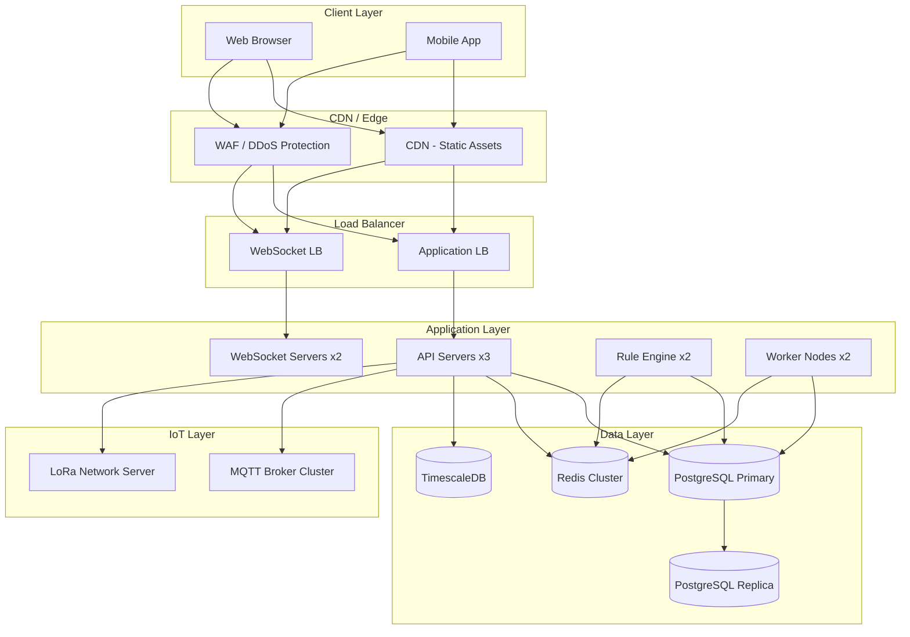
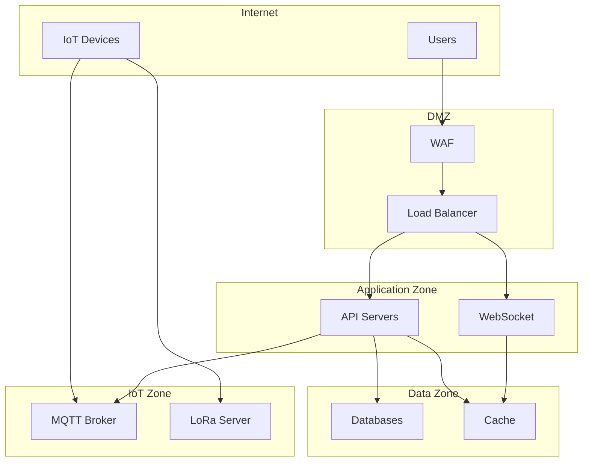

# 🏗️ Deployment Architecture

> Infrastructure and deployment patterns for SHUNCOM RULR IoT Platform


**Platform:** SHUNCOM RULR IoT Platform v1.1 | **Last Updated:** January 2025


---

## 📊 Architecture Overview

### High-Level Deployment


---

## 🖥️ Infrastructure Components

### Compute Resources

#### API Servers
```yaml
Specification:
  Instance Type: 4 vCPU, 8GB RAM
  Count: 3 (minimum for HA)
  Scaling: Horizontal auto-scaling
  
Software:
  OS: Ubuntu 22.04 LTS
  Runtime: Node.js 20 LTS / Python 3.11
  Container: Docker + Kubernetes
  
Responsibilities:
  - REST API handling
  - Business logic
  - Authentication/Authorization
  - Data validation
```

#### WebSocket Servers
```yaml
Specification:
  Instance Type: 2 vCPU, 4GB RAM
  Count: 2 (minimum for HA)
  Scaling: Based on connection count
  
Software:
  Runtime: Node.js 20 LTS
  Library: Socket.IO / ws
  
Responsibilities:
  - Real-time status updates
  - Live dashboard data
  - Alarm notifications
  
Performance:
  Connections per server: 5,000
  Total capacity: 10,000 concurrent
```

#### Rule Engine Servers
```yaml
Specification:
  Instance Type: 4 vCPU, 8GB RAM
  Count: 2 (active-passive or active-active)
  
Software:
  Language: Node.js / Python
  Scheduler: Bull / Celery
  
Responsibilities:
  - Platform rule execution
  - Scheduling
  - Alarm processing
  - Event handling
```

#### Worker Nodes
```yaml
Specification:
  Instance Type: 2 vCPU, 4GB RAM
  Count: 2-4 (scalable)
  
Responsibilities:
  - Background jobs
  - Report generation
  - Batch imports/exports
  - Email/SMS notifications
```

### Database Infrastructure

#### PostgreSQL (Primary)
```yaml
Specification:
  Instance Type: 8 vCPU, 32GB RAM
  Storage: 500GB SSD (expandable)
  IOPS: 5,000+
  
Configuration:
  Version: PostgreSQL 15
  Extensions: PostGIS, ltree
  Replication: Streaming to replica
  Backup: Daily automated, 30-day retention
  
Connection Pool:
  Tool: PgBouncer
  Pool Size: 100 connections
```

#### PostgreSQL (Read Replica)
```yaml
Specification:
  Instance Type: 4 vCPU, 16GB RAM
  Purpose: Read-heavy queries, reporting
  Lag: < 1 second
```

#### TimescaleDB (Metrics)
```yaml
Specification:
  Instance Type: 8 vCPU, 32GB RAM
  Storage: 1TB SSD (time-partitioned)
  
Configuration:
  Version: TimescaleDB 2.x on PostgreSQL 15
  Retention: 1 year raw, 5 years aggregated
  Compression: Enabled after 7 days
  
Hypertables:
  - device_metrics (1-minute chunks)
  - energy_readings (hourly chunks)
  - audit_logs (daily chunks)
```

#### Redis Cluster
```yaml
Specification:
  Instance Type: 2 vCPU, 8GB RAM
  Nodes: 3 (cluster mode)
  
Use Cases:
  - Session storage
  - Device status cache
  - Rate limiting
  - Job queues
  - Pub/Sub for real-time
  
Configuration:
  Persistence: RDB + AOF
  Eviction: volatile-lru
```

### IoT Infrastructure

#### MQTT Broker
```yaml
Specification:
  Software: EMQX / VerneMQ / Mosquitto
  Cluster: 3-node cluster
  Connections: 100,000+
  
Configuration:
  TLS: Required
  Authentication: Username/password or certificate
  QoS: Supports 0, 1, 2
  
Topics:
  - devices/{deviceId}/status
  - devices/{deviceId}/telemetry
  - devices/{deviceId}/commands
  - gateways/{gatewayId}/+
```

#### LoRa Network Server
```yaml
Software: ChirpStack / TTN
Specification:
  - LoRaWAN 1.0.x support
  - OTAA and ABP activation
  - Class A, B, C support
  
Integration:
  - MQTT bridge to platform
  - HTTP webhooks
```

---

## 🌐 Network Architecture

### Network Diagram


### Security Groups / Firewall Rules
```yaml
Load Balancer:
  Inbound:
    - 443/tcp from 0.0.0.0/0 (HTTPS)
    - 80/tcp from 0.0.0.0/0 (HTTP redirect)
  Outbound:
    - Application servers only

API Servers:
  Inbound:
    - 3000/tcp from Load Balancer
  Outbound:
    - Database, Cache, MQTT

Database:
  Inbound:
    - 5432/tcp from Application servers
  Outbound:
    - None (or backup storage)

MQTT Broker:
  Inbound:
    - 8883/tcp from 0.0.0.0/0 (MQTTS)
    - 1883/tcp from VPN only (development)
  Outbound:
    - Application servers
```

---

## 🐳 Container Architecture

### Kubernetes Deployment
```yaml
Namespaces:
  - shuncom-prod: Production workloads
  - shuncom-staging: Staging environment
  - monitoring: Prometheus, Grafana
  - logging: ELK stack

Deployments:
  api-server:
    replicas: 3
    resources:
      requests: {cpu: 500m, memory: 512Mi}
      limits: {cpu: 2000m, memory: 2Gi}
    hpa:
      minReplicas: 3
      maxReplicas: 10
      targetCPU: 70%
      
  websocket-server:
    replicas: 2
    resources:
      requests: {cpu: 250m, memory: 256Mi}
      limits: {cpu: 1000m, memory: 1Gi}
    affinity: anti-affinity (spread across nodes)
    
  rule-engine:
    replicas: 2
    resources:
      requests: {cpu: 500m, memory: 512Mi}
      limits: {cpu: 2000m, memory: 2Gi}
    
  worker:
    replicas: 2
    resources:
      requests: {cpu: 250m, memory: 256Mi}
      limits: {cpu: 1000m, memory: 1Gi}
```

### Docker Compose (Development)
```yaml
version: '3.8'
services:
  api:
    build: ./api
    ports: ["3000:3000"]
    environment:
      DATABASE_URL: postgres://...
      REDIS_URL: redis://redis:6379
    depends_on: [postgres, redis]
    
  websocket:
    build: ./websocket
    ports: ["3001:3001"]
    depends_on: [redis]
    
  postgres:
    image: timescale/timescaledb:latest-pg15
    volumes: [postgres_data:/var/lib/postgresql/data]
    
  redis:
    image: redis:7-alpine
    volumes: [redis_data:/data]
    
  mqtt:
    image: emqx/emqx:latest
    ports: ["1883:1883", "8883:8883"]
```

---

## 📈 Scaling Strategy

### Horizontal Scaling
```yaml
Triggers:
  API Servers:
    - CPU > 70% for 5 minutes
    - Request latency P95 > 500ms
    
  WebSocket Servers:
    - Connection count > 4000 per server
    - Memory > 80%
    
  Workers:
    - Queue depth > 1000
    - Job processing time > 30s

Actions:
  Scale Up: Add 1 instance, wait 5 minutes
  Scale Down: Remove 1 instance, wait 15 minutes
  Max Scale: 10x baseline
```

### Database Scaling
```yaml
Read Scaling:
  - Add read replicas
  - Connection pooling (PgBouncer)
  - Query caching (Redis)
  
Write Scaling:
  - Vertical scaling first
  - Sharding by organization (if needed)
  - TimescaleDB for time-series
  
Metrics Database:
  - Automatic partitioning
  - Compression after 7 days
  - Continuous aggregates
```

---

## 🔄 High Availability

### Redundancy
```yaml
Application Layer:
  - Minimum 3 API servers across AZs
  - 2 WebSocket servers (sticky sessions)
  - Active-active rule engines
  
Data Layer:
  - PostgreSQL: Primary + sync replica
  - Redis: 3-node cluster
  - TimescaleDB: Replication enabled
  
Network:
  - Multi-AZ load balancer
  - DNS failover
  - CDN for static assets
```

### Disaster Recovery
```yaml
RTO: 4 hours
RPO: 1 hour

Backup Strategy:
  Database: 
    - Continuous WAL archiving
    - Daily full backup
    - 30-day retention
    
  Configuration:
    - Git-based infrastructure as code
    - Encrypted secrets in vault
    
Recovery:
  - Automated restore scripts
  - Tested quarterly
  - Cross-region backup storage
```

---

## 📊 Monitoring Stack

### Components
```yaml
Metrics:
  Collection: Prometheus
  Visualization: Grafana
  Alerting: AlertManager
  
Logging:
  Collection: Fluentd / Filebeat
  Storage: Elasticsearch
  Visualization: Kibana
  
Tracing:
  Tool: Jaeger / Zipkin
  Sampling: 10% production
  
Uptime:
  Tool: Pingdom / UptimeRobot
  Endpoints: API health, dashboard
```

### Key Dashboards
```yaml
System Overview:
  - Request rate
  - Error rate
  - Response time percentiles
  - Active connections
  
Infrastructure:
  - CPU/Memory/Disk per service
  - Database connections
  - Redis memory
  - MQTT connections
  
Business:
  - Active devices
  - Online/offline ratio
  - Rule executions
  - Alarm counts
```

---

## 🔗 Related Documentation

- **[02-Authentication System](02-Authentication%20System.md)**: Security implementation
- **[Security Architecture](../08-Development-Guide/Security%20Architecture.md)**: Security details
- **[Performance Benchmarks](../08-Development-Guide/Performance%20Benchmarks.md)**: Performance targets
- **[07-Development Roadmap](../07-Dashboard/07-Development%20Roadmap.md)**: Deployment timeline
