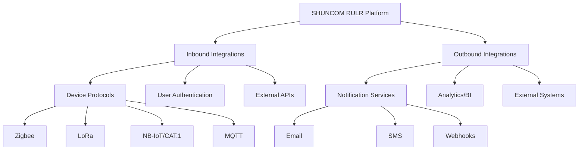

# 🔌 Integration Guide

> How to integrate SHUNCOM RULR with external systems and services

---

## 📋 Integration Overview

### Integration Points


---

## 🔐 Authentication Integration

### OAuth 2.0 / OpenID Connect
```yaml
Purpose: Single Sign-On (SSO) with enterprise identity providers

Supported Providers:
  - Azure AD
  - Google Workspace
  - Okta
  - Keycloak
  - Generic OIDC

Configuration:
  client_id: "your_client_id"
  client_secret: "your_client_secret"
  authorization_url: "https://provider/authorize"
  token_url: "https://provider/token"
  userinfo_url: "https://provider/userinfo"
  scopes: ["openid", "profile", "email"]
  
Flow:
  1. User clicks "Login with SSO"
  2. Redirect to identity provider
  3. User authenticates
  4. Callback with authorization code
  5. Exchange code for tokens
  6. Create/update user in platform
  7. Issue platform JWT
```

### LDAP/Active Directory
```yaml
Purpose: Authenticate against corporate directory

Configuration:
  server: "ldap://ldap.example.com:389"
  bind_dn: "cn=admin,dc=example,dc=com"
  bind_password: "secure_password"
  base_dn: "ou=users,dc=example,dc=com"
  user_filter: "(uid={username})"
  
Sync Options:
  - On-demand (login time only)
  - Scheduled sync (hourly/daily)
  - Real-time sync via webhooks
```

---

## 📡 Device Protocol Integration

### MQTT Integration
```yaml
Purpose: Primary device communication protocol

Broker Configuration:
  host: "mqtt.shuncom-rulr.com"
  port: 8883 (TLS)
  protocol: MQTT 3.1.1 / 5.0
  
Authentication:
  Method: Username/Password or Client Certificate
  Username: Device ID or API key
  Password: Device secret or token
  
Topic Structure:
  Telemetry (device → platform):
    shuncom/{orgId}/devices/{deviceId}/telemetry
    
  Status (device → platform):
    shuncom/{orgId}/devices/{deviceId}/status
    
  Commands (platform → device):
    shuncom/{orgId}/devices/{deviceId}/commands
    
  Response (device → platform):
    shuncom/{orgId}/devices/{deviceId}/response

Message Format:
  {
    "timestamp": "2025-01-23T10:00:00Z",
    "deviceId": "dev_123",
    "type": "telemetry",
    "data": {
      "voltage": 220.5,
      "current": 1.2,
      "power": 264.6,
      "brightness": 80
    }
  }
```

### HTTP/REST Device API
```yaml
Purpose: Direct device communication for cellular (NB-IoT/CAT.1)

Endpoints:
  POST /api/v1/devices/{id}/telemetry
  POST /api/v1/devices/{id}/status
  GET /api/v1/devices/{id}/commands

Authentication:
  Header: X-Device-Key: {device_api_key}
  
Rate Limits:
  Telemetry: 1 request/minute
  Status: On change or every 5 minutes
  Commands poll: Every 30 seconds
```

### LoRaWAN Integration
```yaml
Purpose: LoRa device connectivity

Network Server Integration:
  Supported: ChirpStack, TTN, custom
  
ChirpStack Integration:
  Method: HTTP Integration
  URL: https://api.shuncom-rulr.com/webhooks/chirpstack
  Events: up, join, ack, error
  
  Uplink Format:
    {
      "deviceInfo": {
        "devEui": "70b3d57ed005a4b2"
      },
      "data": "base64_encoded_payload",
      "rxInfo": [...]
    }
    
  Downlink API:
    POST /api/devices/{devEui}/queue
    {
      "confirmed": false,
      "fPort": 1,
      "data": "base64_encoded_command"
    }
```

---

## 📤 Outbound Integrations

### Webhook Notifications
```yaml
Purpose: Push events to external systems

Configuration:
  url: "https://your-system.com/webhooks/shuncom"
  secret: "webhook_signing_secret"
  events:
    - device.status_changed
    - alarm.created
    - alarm.resolved
    - rule.executed
    
Payload:
  {
    "event": "alarm.created",
    "timestamp": "2025-01-23T10:00:00Z",
    "data": {
      "alarmId": "alm_123",
      "deviceId": "dev_456",
      "severity": "critical",
      "message": "Device offline"
    },
    "signature": "sha256=..."
  }
  
Verification:
  const signature = crypto
    .createHmac('sha256', secret)
    .update(JSON.stringify(payload))
    .digest('hex');
  // Compare with header X-Webhook-Signature
```

### Email Integration
```yaml
Purpose: Alarm notifications, reports

Providers:
  - SMTP (custom server)
  - SendGrid
  - AWS SES
  - Mailgun
  
SMTP Configuration:
  host: "smtp.example.com"
  port: 587
  secure: true
  auth:
    user: "notifications@example.com"
    pass: "secure_password"
    
Templates:
  - alarm_notification
  - daily_report
  - password_reset
  - user_invitation
```

### SMS Integration
```yaml
Purpose: Critical alarm notifications

Providers:
  - Twilio
  - AWS SNS
  - Local SMS gateway
  
Twilio Configuration:
  account_sid: "AC..."
  auth_token: "..."
  from_number: "+1234567890"
  
Rate Limits:
  - Maximum 10 SMS per device per hour
  - Critical alarms bypass limits
```

---

## 🔄 Data Integration

### REST API Integration
```yaml
Purpose: External systems accessing platform data

Authentication:
  - API Key (for service accounts)
  - OAuth 2.0 (for user context)
  
API Key Usage:
  Header: X-API-Key: {api_key}
  Scopes: Read-only or Read-write
  Rate Limit: 1000 requests/hour
  
Common Use Cases:
  - BI/Analytics tools querying device data
  - External dashboards
  - Automated reporting
  - Third-party control systems
```

### Data Export
```yaml
Formats:
  - JSON (API)
  - CSV (bulk export)
  - Excel (reports)
  
Scheduled Exports:
  Frequency: Daily, Weekly, Monthly
  Delivery: Email, SFTP, S3
  Content: Device status, energy data, alarms
```

### Real-time Data Streaming
```yaml
WebSocket:
  URL: wss://api.shuncom-rulr.com/ws/v1
  Authentication: JWT token
  Topics: devices.status, alarms.new, metrics
  
Kafka (Enterprise):
  Topics:
    - shuncom.devices.status
    - shuncom.devices.metrics
    - shuncom.alarms
  Format: Avro / JSON
  Retention: 7 days
```

---

## 🗺️ GIS Integration

### Map Providers
```yaml
Supported:
  - Google Maps
  - Mapbox
  - OpenStreetMap / Leaflet
  - Baidu Maps (China)
  - Amap/Gaode (China)
  
Configuration:
  provider: "mapbox"
  api_key: "pk...."
  style: "mapbox://styles/mapbox/dark-v10"
  
Features:
  - Device markers
  - Clustering
  - Heatmaps
  - Custom overlays
  - Geocoding
```

### Location Services
```yaml
Geocoding:
  - Address → Coordinates
  - Coordinates → Address
  
Providers:
  - Google Geocoding API
  - Mapbox Geocoding
  - OpenStreetMap Nominatim
  
Sunrise/Sunset:
  Calculation: Based on device coordinates
  API: Internal calculation or SunCalc library
```

---

## 🏢 Enterprise Integrations

### Building Management Systems (BMS)
```yaml
Protocols:
  - BACnet
  - Modbus TCP
  - OPC UA
  
Integration Pattern:
  1. Platform exposes Modbus TCP server
  2. BMS connects as Modbus client
  3. Register mapping for device status/control
  
Register Map Example:
  40001: Device 1 status (0=off, 1=on)
  40002: Device 1 brightness (0-100)
  40003: Device 1 power (watts)
  ...
```

### SCADA Systems
```yaml
Protocol: OPC UA
  
Server Configuration:
  endpoint: "opc.tcp://platform:4840"
  security: Sign and Encrypt
  certificate: X.509
  
Node Structure:
  Objects/
    Devices/
      Device_001/
        Status
        Brightness
        Power
        Control/
          TurnOn()
          TurnOff()
          SetBrightness(value)
```

### ERP/Asset Management
```yaml
Integration Types:
  - REST API data sync
  - Webhook notifications
  - Scheduled data export
  
Common Data:
  - Device inventory
  - Maintenance records
  - Energy consumption
  - Cost allocation
  
SAP Integration:
  - RFC/BAPI for device master data
  - IDoc for event notifications
```

---

## 🔧 Integration Development

### SDK & Libraries
```yaml
Official SDKs:
  - JavaScript/TypeScript (npm)
  - Python (pip)
  - Java (Maven)
  
Installation:
  npm install @shuncom/rulr-sdk
  pip install shuncom-rulr
  
Usage Example (JavaScript):
  import { ShuncomClient } from '@shuncom/rulr-sdk';
  
  const client = new ShuncomClient({
    apiKey: 'your_api_key',
    baseUrl: 'https://api.shuncom-rulr.com/v1'
  });
  
  // Get devices
  const devices = await client.devices.list({ status: 'online' });
  
  // Control device
  await client.devices.control('dev_123', {
    action: 'dim',
    brightness: 80
  });
  
  // Subscribe to real-time
  client.subscribe('devices.status', (event) => {
    console.log('Device status changed:', event);
  });
```

### API Testing
```yaml
Postman Collection:
  - Import from: https://api.shuncom-rulr.com/docs/postman
  - Environment variables for different stages
  
OpenAPI Specification:
  - URL: https://api.shuncom-rulr.com/docs/openapi.json
  - Swagger UI: https://api.shuncom-rulr.com/docs
  
Sandbox Environment:
  - URL: https://sandbox.shuncom-rulr.com
  - Test API keys available
  - Simulated devices
```

---

## 📋 Integration Checklist

### Pre-Integration
- [ ] Identify integration requirements
- [ ] Choose integration method (API, webhook, protocol)
- [ ] Obtain API credentials
- [ ] Review rate limits and quotas
- [ ] Set up test environment

### Development
- [ ] Implement authentication
- [ ] Handle errors and retries
- [ ] Implement logging
- [ ] Test with sandbox
- [ ] Load testing

### Production
- [ ] Secure credentials storage
- [ ] Monitor integration health
- [ ] Set up alerts for failures
- [ ] Document integration
- [ ] Disaster recovery plan

---

## 🔗 Related Documentation

- **[[API Endpoints Map]]**: Complete API reference
- **[[API Design Patterns]]**: API standards
- **[[Security Architecture]]**: Security requirements
- **[[02-Authentication System]]**: Auth details
