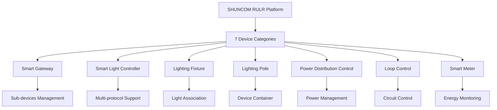
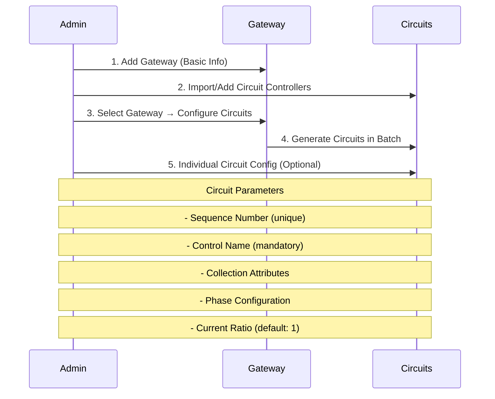
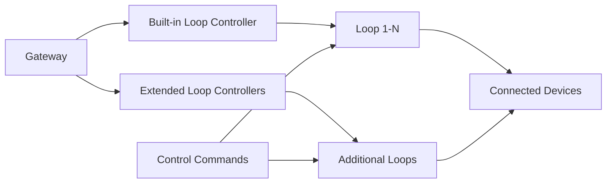
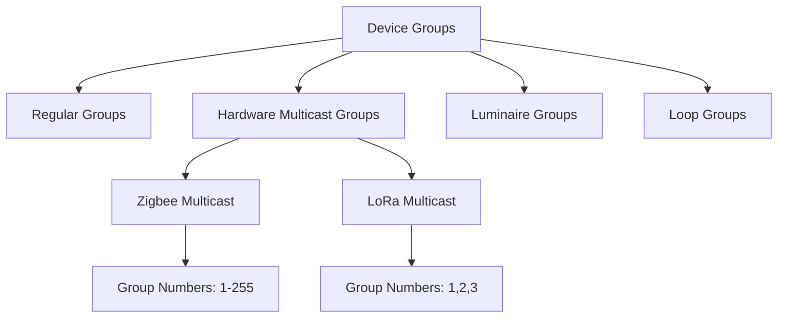
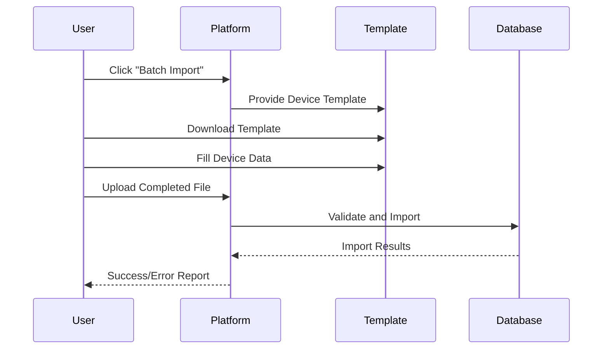
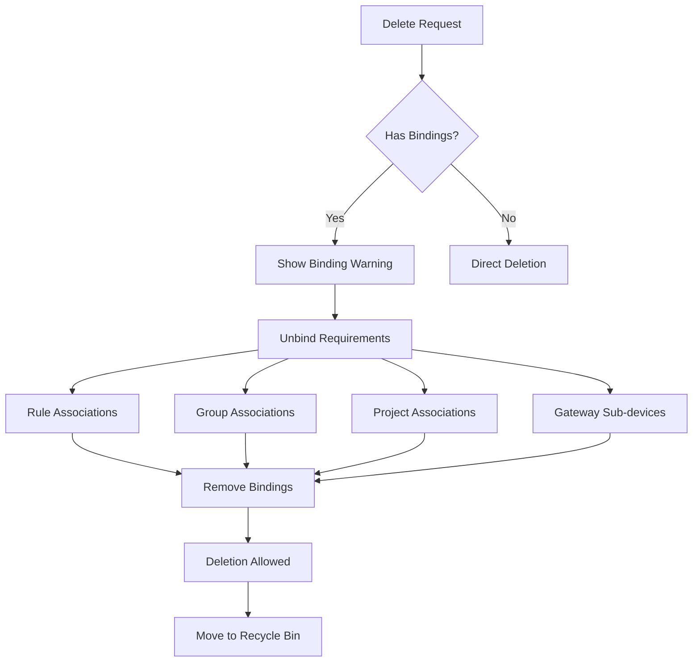
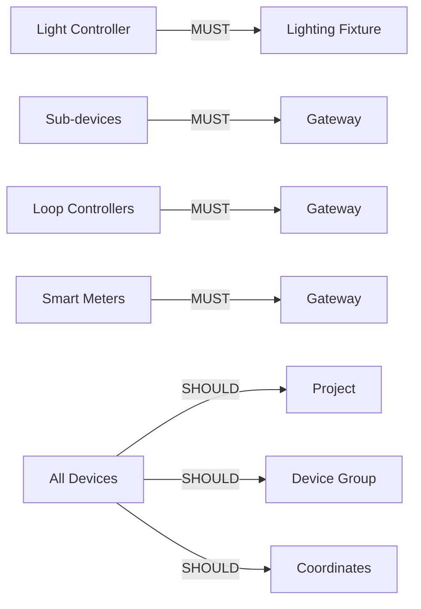

# 🔧 Device Management Hub

> Complete guide to IoT device lifecycle management across 7 device categories


**Platform:** SHUNCOM RULR IoT Platform v1.1 | **Last Updated:** January 2025



---

## 🏗️ Device Architecture Overview

### Supported Device Categories


**Navigation**: `Settings > Equipment Management > Device Configuration > Type`

---

## 📱 Device Categories Deep Dive

### 1. Smart Gateway
**[[Smart Gateway Configuration]]**

#### Core Capabilities
- **Sub-device Management**: Central hub for connected devices
- **Loop Control**: Circuit-level control (Star box gateways)
- **Three-phase Monitoring**: Electrical parameters tracking
- **Local Rule Storage**: Device-level automation

#### Display Fields
```yaml
Device Information:
  - Device Name ✅
  - Device Number (MAC Address) ✅  
  - Associated Product ✅
  - Online Status ✅
  - Three-Phase Electricity Info ✅
  - Loop Collection ✅
  - Local Time ✅
  - Screen Password ✅
  - Update Time ✅
```

#### Configuration Requirements
```yaml
Mandatory Fields:
  - Device Name: "Gateway_North_01"
  - Product Name: "Star Box Gateway" 
  - Device Number: "AA:BB:CC:DD:EE:FF"

Optional Fields:
  - Associated Distribution Box
  - Associated Circuit Control  
  - Coordinates: "Lat: 40.7128, Long: -74.0060"
  - Altitude: "10m"
  - Parent Project: "North Region"
  - Belonging Group: "Industrial Gateways"
```

#### Circuit Configuration Workflow


#### Gateway Operations
- **🔐 Screen Password**: Set 6-digit numeric password
- **🔄 Device Sync**: Sync sub-device info platform → device
- **⚙️ Bulk Circuit Config**: Configure unconfigured circuits
- **🧹 Clear Local Rules**: Remove all local automation
- **⚡ Electric Ratio**: Set three-phase transformer ratios

### 2. Smart Light Controller  
**[[Smart Light Controller Management]]**

#### Device Sub-types
1. **Pass-through Devices**: Zigbee_V3, Dual-way Zigbee_V3
2. **Direct Communication**: NB-IoT, CAT.1  
3. **LoRa Controllers**: OTAA and ABP modes

#### Protocol-Specific Configuration

##### Zigbee Controllers (Pass-through)
```yaml
Requirements:
  - Gateway Association: ✅ Required
  - Lighting Fixture Association: ✅ Required
  - Device Address: Zigbee network address
  
Configuration:
  Device Name: "Light_Controller_001"
  Product: "Zigbee_V3 Light Controller"
  Gateway: "Gateway_North_01"  
  Light Pole: "Pole_001"
  Associated Luminaries: "LED_Fixture_001"
```

##### NB-IoT/CAT.1 Controllers (Direct)
```yaml
Requirements:
  - No Gateway Required: ✅
  - Direct Platform Communication: ✅
  - Lighting Fixture Association: ✅ Required
  
Configuration:
  Device Name: "NB_Light_Controller_001" 
  Product: "Cat.1-V3 Light Controller"
  Device Address: "Device_ID_12345"
  Light Pole: "Pole_001"
  Associated Luminaires: "LED_Fixture_001"
```

##### LoRa Controllers
###### OTAA Mode Configuration
```yaml
Network Parameters:
  DEVEUI: "70B3D57ED005A4B2"
  DEV_PROFILE: "LoRaWAN_1.0.3_Class_A"
  APPEUI: "0000000000000001" # Can be duplicated
  APPKEY: "2B7E151628AED2A6ABF7158809CF4F3C"
  
Device Parameters:  
  Light Pole: "Pole_001"
  Associated Luminaire: "LED_Fixture_001" # Critical!
  Coordinates: "Lat: 40.7128, Long: -74.0060"
  Project: "North Region"
  Group: "LoRa Light Controllers"
```

###### ABP Mode Configuration  
```yaml
Network Parameters:
  DEVEUI: "70B3D57ED005A4B2"
  DEVE_PROFILE: "LoRaWAN_1.0.3_Class_A"
  DEVADDR: "26011D87"
  APPSKEY: "2B7E151628AED2A6ABF7158809CF4F3C"
  NWKSKEY: "1628AED2A6ABF7158809CF4F3C2B7E15"
```

#### Comprehensive Display Capabilities
```yaml
Monitoring Fields:
  Hardware:
    - Device Name, Number, Product Name ✅
    - Online Status, Signal Strength ✅
    - Version, IMSI, Connected Base Station ✅
    
  Electrical:
    - Lamp Status (after fixture association) ✅
    - Voltage, Current, Active Power ✅  
    - Power Factor, Active Energy ✅
    - Run Time, Frequency ✅
    
  Environmental:
    - Color Temperature, Illuminance ✅
    - Local Time, Update Time ✅
```

#### Control Operations
```yaml
Available Commands:
  - Clear: Reset device configuration
  - Timing Calibration: Sync device clock
  - Enable Local Rules: Activate device automation
  - Read Data: Retrieve current status
  - Device Synchronization: Sync with platform
  - GPS Switch: Enable/disable location services
```

### 3. Lighting Fixture
**[[Lighting Fixture Management]]**

#### Purpose & Requirements
- **Essential Association**: Must exist before light controller association
- **Control Dependency**: Without fixture association → lamp uncontrollable
- **Flexible Creation**: Create fixture first OR create controller first

#### Configuration
```yaml
Basic Fields:
  - Device Name: "LED_Fixture_001"
  - Device Number: "FIX_12345"
  - Product Name: "High-Power LED Streetlight"
  - Project: "North Region"
  - Belonging Group: "Street Lighting"
  - Associated Light Controller: "Light_Controller_001"
```

### 4. Lighting Pole
**[[Lighting Pole Configuration]]**

#### Structural Role
- **Device Container**: Houses multiple devices (controllers, fixtures, sensors)
- **Physical Reference**: Maps to real-world infrastructure
- **Hierarchical Organization**: Groups related devices by location

#### Configuration  
```yaml
Pole Configuration:
  Device Name: "Pole_North_Main_001"
  Device Number: "POLE_12345"
  Product Name: "Standard Street Light Pole"
  Project: "North Region Infrastructure"
  Belonging Group: "Main Street Poles"
  
Tracking:
  - Number of Subordinate Devices: Auto-calculated
  - Associated Controllers: Linked automatically
  - Associated Fixtures: Linked automatically
```

### 5. Power Distribution Control
**[[Power Distribution Management]]**

#### Distribution Cabinet Management
```yaml
Configuration Fields:
  - Device Name: "Distribution_Box_001"
  - Device Number: "DIST_54321" 
  - Product Name: "Smart Distribution Cabinet"
  - Project: "North Region"
  - Belonging Group: "Power Distribution"
  
Capabilities:
  - Circuit Monitoring: Individual circuit status
  - Power Distribution: Load balancing
  - Safety Controls: Emergency shutoffs
```

### 6. Loop Control  
**[[Loop Control Systems]]**

#### Loop Controller Types
##### Built-in Loop Controller
```yaml
Configuration:
  Device Number: 0 (Fixed)
  Downlink Channel: 11 (Fixed)
  Sub-device Protocol: GWLOOP (Fixed)
  Associated Gateway: Required selection
  
Use Case: Integrated gateway loop control
```

##### Extended Loop Controller  
```yaml
Configuration:
  Device Number: 4-255 (Range)
  Downlink Channel: 1 or 2 (Check port connection)
  Sub-device Protocol: Modbus (Fixed)
  Associated Gateway: Required selection
  
Use Case: External loop expansion
```

#### Loop Control Workflow


### 7. Smart Meter
**[[Smart Meter Configuration]]**

#### 485 Three-phase Electricity Meter
```yaml
Configuration Requirements:
  Device Name: "Smart_Meter_001"
  Product: "485 Three-phase Meter"
  Device Number: "123456789012" # 12-digit meter address
  Associated Gateway: "Gateway_North_01"
  Downlink Channel: 2 (Default)
  Sub-device Protocol: "dlt645_07"
  
Location:
  Coordinates: "Lat: 40.7128, Long: -74.0060"
  Altitude: "15m"
  Project: "North Region"
  Group: "Energy Meters"
```

#### Advanced Features
```yaml
Device Synchronization:
  - Sync sub-device info to gateway
  - Update meter configuration
  - Refresh communication parameters
  
Three-phase Transformer Ratio:
  - Current Transformer Ratio setting
  - Data multiplication display
  - Calibration support
```

#### Monitoring Capabilities
```yaml
Display Fields:
  Basic Info:
    - Device Name, Number, Product ✅
    - Online Status, Update Time ✅
    
  Electrical Data:
    - Data Preview (real-time values) ✅
    - Transformation Ratio display ✅
    
  Associations:
    - Gateway connection ✅
    - Associated Control Box ✅
    - Project and Group membership ✅
```

---

## 🔄 Device Group Management

### Group Types & Functionality


#### Regular Device Groups
**Navigation**: `Settings > Equipment Management > Device Configuration > Group`

```yaml
Group Creation:
  Group Name: "Main Street Lighting"
  Product Category: "Smart Light Controller"
  Frequency ID: "freq_001"
  Description: "Main street corridor lighting system"
  
Location Information:
  Coordinates: "Central reference point"
  Address: "Main Street, North Section"
  
Device Association:
  - Associate during creation OR
  - Add devices after group creation
```

#### Hardware Multicast Groups

##### Zigbee Multicast Configuration
```yaml
Multicast Setup:
  Group Number: 1-255 (Manual entry)
  Associated Lamps: Select target devices
  Group Number Assignment: Per-lamp configuration
  
Synchronization:
  - Automatic sync after association
  - Manual retry for failed devices
  - Sync status monitoring
```

##### LoRa Multicast Configuration  
```yaml
Multicast Setup:
  Group Number: 1, 2, or 3 (Limited options)
  Frequency Band: Required selection
  Multiple Groups: Independent control per group
  
Platform Features:
  - Multiple group creation support
  - Independent group control
  - Frequency coordination
```

#### Specialized Groups

##### Luminaire Grouping
```yaml
Use Case:
  - Dual-way light controllers
  - Group 2 lamps under 1 controller
  - Coordinated lighting control
  
Configuration:
  Group Name: "Dual_Light_Set_001" 
  Controller: "Dual_Controller_001"
  Fixture 1: "LED_Main_001"
  Fixture 2: "LED_Secondary_001"
```

##### Loop Grouping
```yaml
Use Case:
  - Gateway loop organization
  - Multiple loops in same group
  - Coordinated circuit control
  
Configuration:
  Group Name: "Industrial_Circuits_A"
  Gateway: "Gateway_Industrial_01"
  Loops: ["Loop_1", "Loop_2", "Loop_3"]
  Control Scope: Group-level circuit operations
```

---

## 📊 Batch Operations & Data Management

### Import/Export Capabilities
**Volume Limits**: 5,000 devices per operation

#### Batch Import Process


#### Template System
```yaml
Device-Specific Templates:
  Smart Gateway Template:
    - Required: Name, Product, MAC Address
    - Optional: Project, Group, Coordinates
    
  Light Controller Template:  
    - Required: Name, Product, Device Address
    - Optional: Gateway, Fixture Association
    
  Smart Meter Template:
    - Required: Name, Product, 12-digit Address  
    - Optional: Gateway, Transformer Ratio
```

#### Export Capabilities
```yaml
Export Options:
  Basic Data Export:
    - All devices in current view
    - Filtered device subsets
    - Maximum 5,000 devices per export
    
  Export Formats:
    - Excel (.xlsx) format
    - Complete device information
    - Relationship data included
```

### Device Lifecycle Management

#### Device Deletion Process


#### Recycle Bin System
**Navigation**: `Settings > Equipment Management > Recycle Bin`

```yaml
Recycle Bin Features:
  Data Retention:
    - Basic Information: ✅ Preserved
    - Device Configuration: ✅ Preserved  
    - Historical Data: ❌ Lost permanently
    
  Recovery Options:
    - Restore to Original Location: ✅
    - Bulk Restore: ✅ Multiple devices
    - Permanent Deletion: ⚠️ Irreversible
    
  Special Cases:
    - Gateway Deletion: Sub-devices NOT auto-deleted
    - Sub-device Recovery: Manual re-association required
```

---

## 🔗 Integration Points & Dependencies

### Critical Associations


### System Dependencies
1. **[05-Project Management](../05-User-Management/05-Project%20Management.md)**: Device-project associations
2. **[02-Authentication System](../02-System-Architecture/02-Authentication%20System.md)**: Device access permissions
3. **[04-Rule Engine System](../04-Rule-Management/04-Rule%20Engine%20System.md)**: Device control automation
4. **[06-Dashboard Interface](../06-Project-Management/06-Dashboard%20Interface.md)**: Device status visualization

---

## ⚠️ Critical Implementation Notes

### Must-Have Associations
```yaml
Critical Dependencies:
  Light Controllers:
    ❌ Without Fixture Association: "Lamp uncontrollable in list"
    ✅ With Fixture Association: Full control available
    
  Sub-devices:
    ❌ Without Gateway: Cannot communicate with platform
    ✅ With Gateway: Full platform integration
    
  Project Assignment:
    ❌ Unassigned Devices: Visible to all users (security risk)
    ✅ Project Assignment: Proper access control
```

### Time Zone Impact
⚠️ **Critical**: All device operations affected by platform time zone
- **Device Local Time**: Synced with platform time zone
- **Rule Execution**: Time-based triggers use platform time zone
- **Scheduling**: All automated operations depend on correct time zone

### Performance Considerations
```yaml
Scale Limitations:
  Batch Operations: 5,000 devices maximum
  Real-time Monitoring: Optimize for large device counts
  Map Rendering: Efficient display for 1000+ devices
  
Optimization Strategies:
  - Paginated device lists
  - Lazy loading for device details
  - Caching for frequently accessed data
  - Background sync for device status
```

---

**Next Steps**: Configure [05-Project Management](../05-User-Management/05-Project%20Management.md) structure before large-scale device deployment, then set up [04-Rule Engine System](../04-Rule-Management/04-Rule%20Engine%20System.md) for device automation.