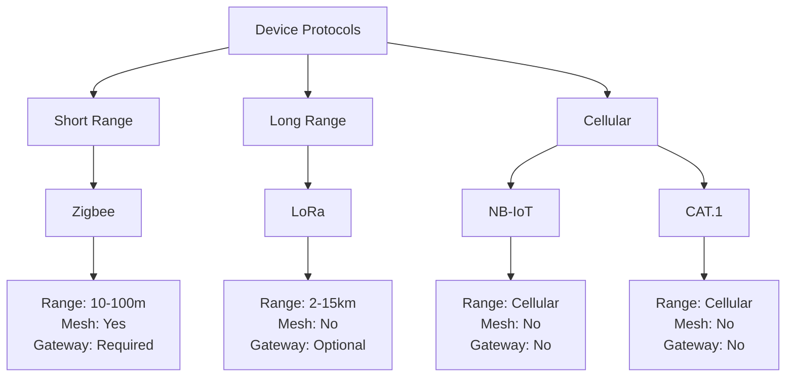
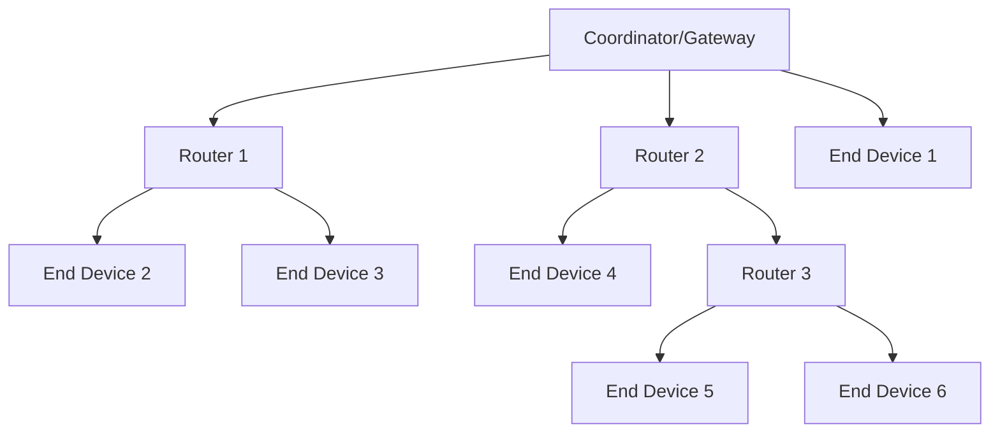
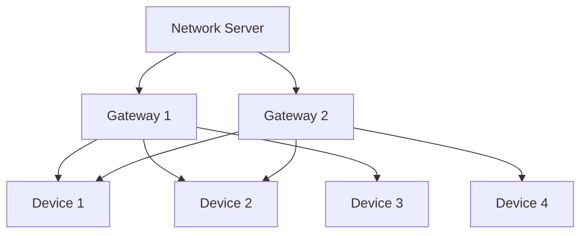
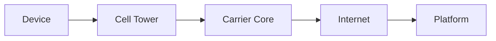

# 📡 Protocol Guides

> Technical reference for communication protocols in SHUNCOM RULR IoT Platform


**Platform:** SHUNCOM RULR IoT Platform v1.1 | **Last Updated:** January 2025


---

## 📊 Protocol Overview

### Protocol Comparison


### Selection Guide

| Criteria | Zigbee | LoRa | NB-IoT | CAT.1 |
|----------|--------|------|--------|-------|
| Range | Short | Long | Cellular | Cellular |
| Power | Very Low | Low | Medium | Medium |
| Data Rate | Medium | Low | Low | Medium |
| Latency | Low | Medium | Medium | Low |
| Cost/Device | Low | Low | Medium | Medium |
| Infrastructure | Gateway | Gateway/Direct | None | None |
| Best For | Dense urban | Wide area | Urban IoT | Higher bandwidth |

---

## 📶 Zigbee Protocol

### Overview
```yaml
Standard: IEEE 802.15.4
Frequency: 2.4 GHz
Data Rate: 250 kbps
Range: 10-100m (line of sight)
Topology: Star, Tree, Mesh
Max Devices: 65,000 (network), ~500 (practical per gateway)
```

### Network Architecture


### Device Types
```yaml
Coordinator:
  - One per network
  - Manages network formation
  - In SHUNCOM: Gateway acts as coordinator
  
Router:
  - Extends network range
  - Routes messages
  - Usually powered devices
  
End Device:
  - Low power
  - Can sleep
  - Relies on parent router
```

### Configuration Parameters
```yaml
Network Settings:
  PAN ID: 0x0001-0xFFFE (unique per network)
  Extended PAN ID: 64-bit unique identifier
  Channel: 11-26
  
Channel Selection:
  - Avoid Wi-Fi overlap
  - Wi-Fi Ch1 → Zigbee 11-14
  - Wi-Fi Ch6 → Zigbee 15-20
  - Wi-Fi Ch11 → Zigbee 21-24
  - Recommended: 15, 20, 25, 26
  
Device Address:
  Short Address: 16-bit (0x0000-0xFFFF)
  IEEE Address: 64-bit (unique per device)
```

### SHUNCOM Zigbee Configuration
```yaml
Light Controller Setup:
  Required:
    - Device Name
    - Product Name (Zigbee_V3, Dual-way Zigbee_V3)
    - Device Number (Zigbee address)
    - Gateway Association
    - Lighting Fixture Association
    
  Optional:
    - Pole Association
    - Coordinates
    - Project/Group
    
Gateway Circuit Config:
  Downlink Channel: 11 (built-in controller)
  Device Number: 0 (built-in)
  Protocol: GWLOOP
```

### Multicast Groups
```yaml
Zigbee Multicast:
  Group Numbers: 1-255
  Purpose: Simultaneous control
  
Setup:
  1. Create multicast group in platform
  2. Assign group number (1-255)
  3. Add devices to group
  4. Sync group to each device
  5. Verify sync status
  
Commands:
  - Multicast ON/OFF
  - Multicast dimming
  - Group commands via gateway
```

### Troubleshooting
```yaml
Device Not Joining:
  - Check PAN ID matches
  - Verify channel
  - Reset device, try rejoin
  - Check within range of coordinator/router
  
Communication Drops:
  - Check for interference
  - Add routers for better coverage
  - Change channel if Wi-Fi interference
  
Slow Response:
  - Network may be congested
  - Too many hops (add routers)
  - Check gateway performance
```

---

## 📻 LoRa/LoRaWAN Protocol

### Overview
```yaml
Standard: LoRaWAN (LoRa Alliance)
Frequency: Region-specific
  - EU868: 868 MHz
  - US915: 915 MHz
  - AS923: 923 MHz
  - CN470: 470 MHz
  
Data Rate: 0.3-50 kbps
Range: 2-15 km (urban), up to 30km (rural)
Topology: Star-of-stars
```

### Network Architecture


### Device Classes
```yaml
Class A:
  - Lowest power
  - Receive after transmit only
  - 2 receive windows
  - Best for: Battery devices, sensors
  - SHUNCOM: Default for light controllers
  
Class B:
  - Scheduled receive slots
  - Better latency than A
  - Higher power than A
  - Best for: Actuators needing faster response
  
Class C:
  - Continuous receive
  - Lowest latency
  - Highest power
  - Best for: Powered devices needing fast response
```

### Activation Methods

#### OTAA (Over-The-Air Activation)
```yaml
Description: Dynamic key negotiation
Security: Higher (keys derived from root key)
Recommended: Yes

Required Parameters:
  DevEUI: 8 bytes, globally unique
  AppEUI: 8 bytes, application identifier
  AppKey: 16 bytes, AES root key
  
Join Process:
  1. Device sends Join Request (DevEUI, AppEUI)
  2. Server validates and responds with Join Accept
  3. Keys derived: NwkSKey, AppSKey
  4. DevAddr assigned
  
SHUNCOM Configuration:
  DEVEUI: "70B3D57ED005A4B2"
  DEV_PROFILE: "LoRaWAN_1.0.3_Class_A"
  APPEUI: "0000000000000001"
  APPKEY: "2B7E151628AED2A6ABF7158809CF4F3C"
```

#### ABP (Activation by Personalization)
```yaml
Description: Pre-provisioned keys
Security: Lower (keys static)
Recommended: Only when OTAA not possible

Required Parameters:
  DevEUI: 8 bytes, for identification
  DevAddr: 4 bytes, network address
  NwkSKey: 16 bytes, network session key
  AppSKey: 16 bytes, application session key
  
SHUNCOM Configuration:
  DEVEUI: "70B3D57ED005A4B2"
  DEV_PROFILE: "LoRaWAN_1.0.3_Class_A"
  DEVADDR: "26011D87"
  APPSKEY: "2B7E151628AED2A6ABF7158809CF4F3C"
  NWKSKEY: "1628AED2A6ABF7158809CF4F3C2B7E15"
  
Frame Counter Management:
  - Server tracks uplink/downlink counters
  - Mismatch causes message rejection
  - Reset: Both device and server must reset
```

### Spreading Factors
```yaml
SF7:
  Range: Shortest
  Data Rate: Highest (5470 bps)
  Airtime: Shortest
  Battery: Best
  
SF8-SF11:
  Range: Increasing
  Data Rate: Decreasing
  Airtime: Increasing
  
SF12:
  Range: Longest
  Data Rate: Lowest (250 bps)
  Airtime: Longest
  Battery: Worst
  
Selection:
  - ADR (Adaptive Data Rate) recommended
  - Start with SF7, increase if needed
  - Consider duty cycle limits
```

### LoRa Multicast
```yaml
SHUNCOM LoRa Multicast:
  Group Numbers: 1, 2, 3 (limited)
  Frequency Band: Must specify
  
Setup:
  1. Create multicast group
  2. Select frequency band
  3. Assign group number (1, 2, or 3)
  4. Add devices
  5. Configure multicast session on network server
  
Limitations:
  - Class C devices only for multicast
  - Timing critical
  - No acknowledgment
```

### Troubleshooting
```yaml
Join Failed (OTAA):
  - Verify keys match exactly
  - Check DevEUI unique
  - Confirm gateway receiving join
  - Check network server logs
  
Frame Counter Error (ABP):
  - Reset counters on both sides
  - Consider switching to OTAA
  
No Downlinks:
  - Device must be in receive window
  - Check gateway TX capability
  - Verify duty cycle limits
```

---

## 📱 NB-IoT Protocol

### Overview
```yaml
Standard: 3GPP Release 13+
Frequency: Licensed LTE bands
Data Rate: ~200 kbps (DL), ~20 kbps (UL)
Range: Cellular coverage
Latency: 1-10 seconds
Power: Optimized for battery
```

### Network Architecture


### Configuration
```yaml
Required Parameters:
  IMEI: Device identifier
  SIM: Active with data plan
  APN: Carrier access point name
  
SHUNCOM Configuration:
  Device Name: "NB_Light_Controller_001"
  Product: "Cat.1-V3 Light Controller"
  Device Address: IMEI or custom ID
  Lighting Fixture: Required association
  
No Gateway Required:
  - Direct IP connectivity
  - Communicates with platform via MQTT/HTTP
```

### Operational Modes
```yaml
PSM (Power Saving Mode):
  - Deep sleep between transmissions
  - Wake on timer or external event
  - Best battery life
  
eDRX (Extended Discontinuous Reception):
  - Periodic listening windows
  - Balance of power and latency
  
Connected Mode:
  - Continuous connection
  - Lowest latency
  - Highest power
```

### Troubleshooting
```yaml
Not Registering:
  - Verify SIM active
  - Check APN settings
  - Confirm NB-IoT coverage
  - Check band support
  
Intermittent Connection:
  - Weak signal area
  - PSM timing issues
  - Network congestion
  
High Latency:
  - PSM/eDRX settings
  - Network load
  - Consider CAT.1 if latency critical
```

---

## 📞 CAT.1 (LTE Cat 1) Protocol

### Overview
```yaml
Standard: 3GPP LTE Category 1
Frequency: Licensed LTE bands
Data Rate: 10 Mbps (DL), 5 Mbps (UL)
Range: Cellular coverage
Latency: <100ms typical
Power: Higher than NB-IoT
```

### Comparison with NB-IoT
| Feature | NB-IoT | CAT.1 |
|---------|--------|-------|
| Data Rate | ~200 kbps | ~10 Mbps |
| Latency | 1-10s | <100ms |
| Power | Lower | Higher |
| Coverage | Deeper indoor | Standard LTE |
| Cost | Lower | Higher |
| Best For | Sensors | Actuators, video |

### Configuration
```yaml
Required Parameters:
  IMEI: Device identifier
  SIM: Active with data plan
  APN: Carrier access point name
  
SHUNCOM Configuration:
  Device Name: "CAT1_Light_Controller_001"
  Product: "Cat.1-V3 Light Controller"
  Device Address: IMEI
  Lighting Fixture: Required association
```

---

## 🔌 MQTT Protocol

### Overview
```yaml
Standard: MQTT 3.1.1 / 5.0
Transport: TCP/TLS
Port: 1883 (TCP), 8883 (TLS)
QoS Levels: 0, 1, 2
```

### SHUNCOM MQTT Topics
```yaml
Device Telemetry (device → platform):
  Topic: shuncom/{orgId}/devices/{deviceId}/telemetry
  Payload:
    {
      "timestamp": "ISO8601",
      "metrics": {
        "voltage": 220.5,
        "current": 1.2,
        "power": 264.6,
        "brightness": 80
      }
    }
    
Device Status (device → platform):
  Topic: shuncom/{orgId}/devices/{deviceId}/status
  Payload:
    {
      "online": true,
      "timestamp": "ISO8601"
    }
    
Commands (platform → device):
  Topic: shuncom/{orgId}/devices/{deviceId}/commands
  Payload:
    {
      "commandId": "cmd_123",
      "action": "dim",
      "params": {
        "brightness": 80
      }
    }
    
Response (device → platform):
  Topic: shuncom/{orgId}/devices/{deviceId}/response
  Payload:
    {
      "commandId": "cmd_123",
      "status": "success",
      "result": {...}
    }
```

### QoS Levels
```yaml
QoS 0 (At most once):
  - Fire and forget
  - May lose messages
  - Use for: Non-critical telemetry
  
QoS 1 (At least once):
  - Guaranteed delivery
  - May duplicate
  - Use for: Important telemetry, status
  
QoS 2 (Exactly once):
  - Guaranteed, no duplicates
  - Highest overhead
  - Use for: Critical commands
```

### Security
```yaml
TLS Configuration:
  - TLS 1.2+ required
  - Server certificate validation
  - Client certificate optional
  
Authentication:
  - Username/password
  - Client certificate
  - JWT token in password field
```

---

## 🔗 Related Documentation

- **[03-Device Management Hub](03-Device%20Management%20Hub.md)**: Device configuration
- **[Device Troubleshooting](Device%20Troubleshooting.md)**: Protocol troubleshooting
- **[Integration Guide](../02-System-Architecture/Integration%20Guide.md)**: External integrations
- **[Glossary](../01-Overview/Glossary.md)**: Protocol terminology
