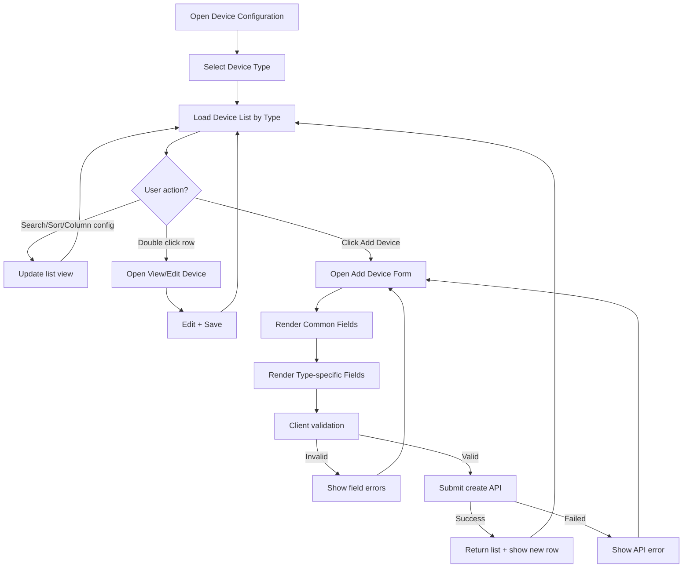

# Device Management & Add Device Flow (Frontend Spec)

## 1) Mục tiêu
Tài liệu này mô tả flow để FE dev implement màn **Device Management / Device Configuration / Add Device** dựa trên `03-Device Management Hub.md`.

---

## 2) Navigation
- Path: `Settings > Equipment Management > Device Configuration > Type`
- Type = 1 trong các nhóm thiết bị:
  1. Smart Gateway
  2. Smart Light Controller
  3. Lighting Fixture
  4. Lighting Pole
  5. Power Distribution Control
  6. Smart Electric Meter

---

## 3) Common Features of Device List (bắt buộc)
1. **Column settings**: cho phép bật/tắt tất cả cột trong list; cấu hình lưu theo account (persist lâu dài).
2. **Fuzzy search** theo:
   - `device_name`
   - `device_address`
3. **Sort** theo:
   - `device_name`
   - `device_number`
4. **Double click row** để vào trang view/edit device.
5. Nếu có alarm chưa xử lý: hiện badge/ký hiệu **"!"** ở đầu row.
6. Nếu device unavailable hoặc chưa add vào inventory: hiện ký hiệu trạng thái unavailable.

---

## 4) End-to-end Flow (List → Add → Save → View/Edit)



---

## 5) Form Schema Strategy cho FE

## 5.1 Base sections (dùng cho hầu hết type)
### A. Common fields
- `device_name` (string, optional, max 50)
- `product_name` (string, required)
- `project_id` (string/list, optional)
- `belonging_group` (string/list, optional)
- `latitude`, `longitude`, `altitude` (number, optional)
- Các field liên kết (tùy type):
  - `light_pole_id`
  - `associated_distribution_box`
  - `associated_luminaires`

### B. Asset Information (optional block)
- `manufacturer`, `price`, `purchase_date`, `installation_date`, `expiration_date`, `expiration_of_tariff`, `service_life`
- Một số type có thêm asset fields riêng (ví dụ pole_height, pole_type, pole_color, lamp_color...)

### C. Product Information (Dynamic)
Cho các type hỗ trợ dynamic fields:
- CRUD field động: `add_field`, `delete_field`, `delete_selected`, `select_all`, `import_excel`
- Lưu dưới dạng key-value (JSON) để linh hoạt theo product.

---

## 5.2 Type-specific rules (quan trọng)

### Smart Gateway
- Có các action vận hành sau khi tạo:
  - Set screen password (6 số)
  - Device sync
  - Clear local rules
  - Electric ratio

### Smart Light Controller
Có 3 nhóm protocol/sub-type, FE phải render field theo lựa chọn:
1. **Pass-through (Zigbee_V3, Dual-way Zigbee_V3)**
   - required: `device_number`, `gateway_id`
2. **Direct (NB-IoT, CAT.1)**
   - required: `device_number`
3. **LoRa**
   - required chung: `devui`, `dev_profile`, `access_mode`
   - nếu `access_mode = OTAA` → required `appkey`
   - nếu `access_mode = ABP` → required `devaddr`, `nwkskey`

### Lighting Fixture
- Phải support association với light controller.
- Lưu ý nghiệp vụ: fixture là dependency để điều khiển đèn.

### Lighting Pole / Power Distribution / Smart Electric Meter
- Có common + dynamic product info + asset info.
- Smart Electric Meter có các field liên kết đặc thù: `gateway`, `sub_device_protocol`, `associated_distribution_box`.

---

## 6) UI States cần implement
- Loading list
- Empty list (chưa có thiết bị)
- Search no-result
- API error
- Validation error theo field
- Row status:
  - Alarm unaddressed (`!`)
  - Unavailable / not in inventory (symbol trạng thái)

---

## 7) Validation rules (FE tối thiểu)
- `product_name`: bắt buộc.
- Các field protocol-specific bắt buộc theo điều kiện ở mục 5.2.
- Numeric fields (`latitude`, `longitude`, `altitude`, `price`, `service_life`) phải parse được number.
- Date fields parse được date hợp lệ.
- Với LoRa keys/address: enforce độ dài format theo spec (hex length từ source).

---

## 8) Suggested FE data model (để dev nhanh)

```ts
type DeviceType =
  | 'gateway'
  | 'light-controller'
  | 'lighting-fixture'
  | 'lighting-pole'
  | 'power-distribution'
  | 'smart-meter'

type DeviceForm = {
  device_type: DeviceType
  common: Record<string, unknown>
  type_specific: Record<string, unknown>
  asset_info?: Record<string, unknown>
  product_info_dynamic?: Array<{ key: string; value: string; type: 'text' | 'number' | 'image' }>
}
```

---

## 9) Acceptance Criteria cho FE
- Có thể add device thành công cho từng type.
- Với Smart Light Controller: chuyển protocol là form đổi field đúng ngay lập tức.
- List giữ được column settings theo account sau reload/login lại.
- Search/sort/double-click hoạt động đúng.
- Hiển thị đúng 2 trạng thái row: alarm (`!`) và unavailable.
- Validation message rõ ràng, không submit khi thiếu required theo điều kiện.

---

## 10) Gợi ý tách component (để maintain)
- `device-list-toolbar` (search/sort/column settings)
- `device-list-table`
- `device-row-status-badge`
- `device-form-common-section`
- `device-form-type-specific-section`
- `device-form-asset-section`
- `device-form-product-dynamic-section`

(Tránh gom toàn bộ vào 1 component lớn.)
