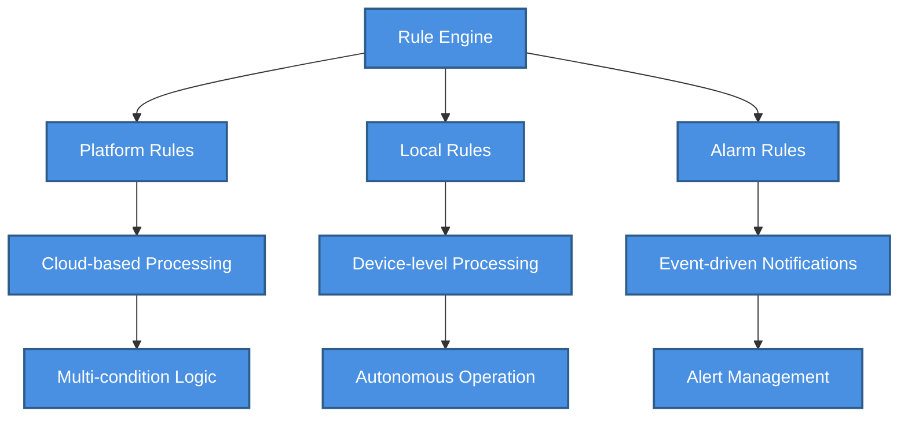
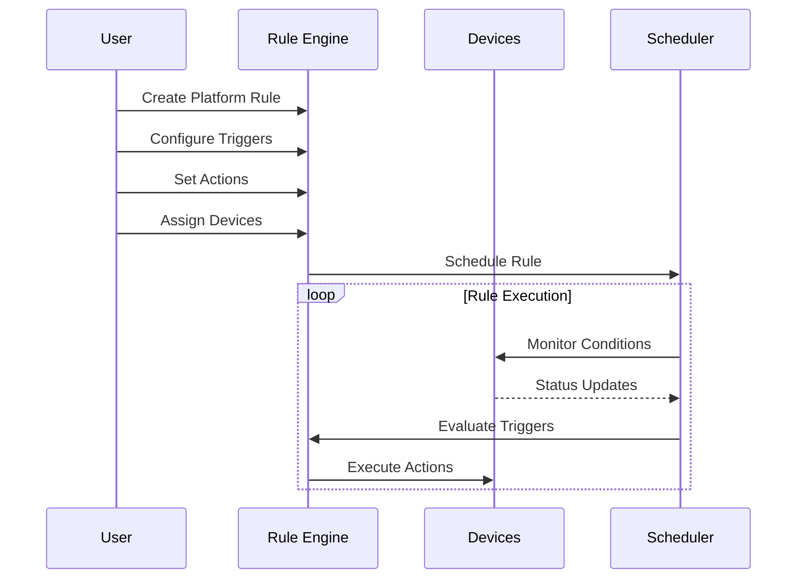
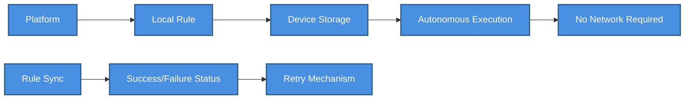
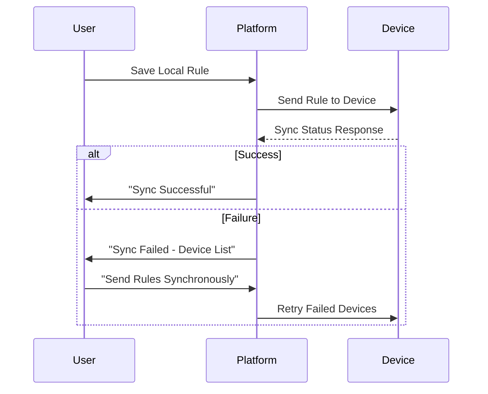
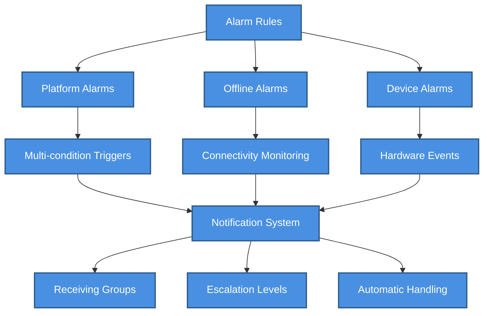
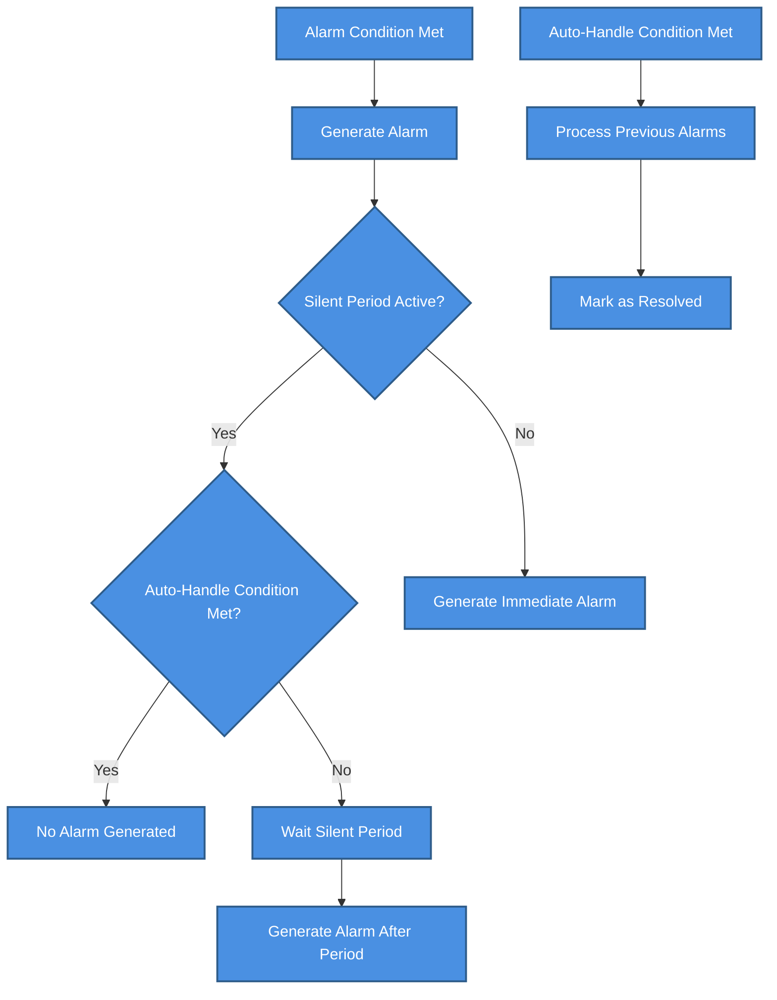

# ⚙️ Rule Engine System

> Comprehensive automation system with Platform Rules, Local Rules, and Alarm Rules


**Platform:** SHUNCOM RULR IoT Platform v1.1 | **Last Updated:** January 2025



---

## 🏗️ Rule System Architecture

### Three-Layer Rule System

    classDef default fill:#4A90E2,stroke:#2E5C8A,stroke-width:2px,color:#fff
    classDef primary fill:#7B68EE,stroke:#5A4FC4,stroke-width:2px,color:#fff
    classDef success fill:#50C878,stroke:#3A9B5C,stroke-width:2px,color:#fff
    classDef warning fill:#FFA500,stroke:#CC8400,stroke-width:2px,color:#fff
    classDef danger fill:#FF6B6B,stroke:#CC5555,stroke-width:2px,color:#fff


**Navigation**: `Rule Management > [Rule Type]`

---

## 🌐 Platform Rules System

### Architecture Overview
**[[Platform Rules Configuration]]**

#### Rule Structure
```yaml
Platform Rule:
  - Name: "Street Light Automation"
  - Type: "Lighting Control"
  - Multiple Sub-rules: ✅ Independent execution
  
Sub-rule Components:
  - Multiple Trigger Conditions: ✅ 
  - Condition Logic: AND / OR
  - Multiple Execute Actions: ✅
  - Device Scope: Same batch devices only
```

#### Rule Configuration Process


### Trigger Condition Types

#### 1. Attribute Trigger
**Function**: Use device-reported data to trigger actions

```yaml
Attribute Trigger Example:
  Device: "Light_Sensor_001"
  Attribute: "Illuminance"
  Condition: "< 50 lux"
  
Constraint:
  - 1 attribute trigger = 1 device only
  - Cannot combine multiple attribute triggers on same device
```

#### 2. Time Trigger  
**Function**: Schedule-based automation

```yaml
Time Trigger Options:
  Timing Trigger:
    - Specific Time: "18:00:00"
    - Daily/Weekly/Monthly: Repeat patterns
    
  Sunrise/Sunset:
    - Requires: Device coordinates (lat/long)
    - Dynamic: Calculated daily based on location
    
  Interval Trigger:
    - Every X minutes/hours
    - Continuous execution pattern
```

#### 3. Time Range
**Function**: Limit rule execution to specific periods

```yaml
Time Range Configuration:
  Start Time: "17:00"
  End Time: "23:00" 
  Days: ["Monday", "Tuesday", "Wednesday", "Thursday", "Friday"]
  
Constraints:
  - Cannot exist alone
  - Must combine with attribute triggers
  - Maximum 1 time range per sub-rule
```

#### 4. Other Triggers
```yaml
Online Status Trigger:
  Options: ["Online", "Offline"]
  Use Case: Device connectivity monitoring
  Constraint: Must combine with attribute triggers
  
Trigger Times:
  Logic: "In last X minutes, if Y triggers occur"
  Example: "In last 30 minutes, if illuminance < 50 occurs 3 times"
  Constraint: Must combine with attribute triggers
```

#### Condition Logic Rules
```yaml
Multi-condition Combinations:
  Meet Both Conditions: AND logic
    - All conditions must be true
    - Conservative triggering
    
  Meet Any Condition: OR logic  
    - Any single condition triggers
    - Aggressive triggering

Combination Restrictions:
  ❌ Time trigger + Time trigger: Cannot combine
  ❌ Online status alone: Needs additional trigger
  ❌ Time range alone: Needs additional trigger
  ✅ Attribute + Time range: Valid combination
  ✅ Time trigger + Online status: Valid combination
```

### Execute Actions

#### 1. Invoke Service
**Function**: Call device-specific services

```yaml
Service Categories:
  Smart Gateway Services:
    - Circuit Control: Connect/Disconnect
    - Data Reading: Status queries
    - Configuration: Parameter updates
    
  Smart Light Controller Services:
    - Light Control: On/Off/Dimming
    - Sensor Reading: Illuminance/Motion
    - Status Queries: Power/Energy data
```

#### 2. Control Lamp
**Function**: Direct lighting control

```yaml
Lamp Control Actions:
  Turn On: "brightness: 100%"
  Turn Off: "brightness: 0%"
  Dimming: "brightness: 1-100%"
  
Advanced Controls:
  Color Temperature: "2700K - 6500K"
  Scheduling: "Gradual brightness changes"
```

#### 3. Control Loop  
**Function**: Circuit-level control at gateways

```yaml
Loop Control Actions:
  Connect Circuit: "Enable power flow"
  Disconnect Circuit: "Disable power flow"
  
Safety Features:
  - Emergency disconnect capability
  - Load monitoring
  - Fault detection
```

### Device Selection Strategies

#### Device Selection Methods
```yaml
Select Device Method:
  Process: Associated Devices → Lamp Selection → Device Selection
  Granularity: Individual device selection
  Use Case: Precise control requirements
  
Select Group Method:  
  Process: Choose Group → All devices auto-selected
  Granularity: Group-level batch operations
  Use Case: Bulk device management
  
Specific Component Selection:
  Light Controllers: Select specific fixtures
    Example: "Fixture 1, Fixture 2" of all group devices
  Gateways: Select specific circuits  
    Example: "Circuit 1, Circuit 3" of all group gateways
```

### Platform Rules Examples

#### Example 1: Intelligent Street Lighting
```yaml
Rule Name: "Adaptive Street Lighting"
Type: "Smart Lighting Control"

Sub-rule 1:
  Trigger Conditions:
    - Time Range: "17:00 - 18:00"
    - Illuminance Sensor 1: "> 50 lux"
    - Illuminance Sensor 2: "> 50 lux"
    - Logic: "Meet both conditions"
    
  Execute Actions:
    - Control Lamp: "Turn On, 100% brightness"
    - Target: "Main Street Light Group"

Sub-rule 2:
  Trigger Conditions:
    - Time Trigger: "Sunset" (calculated from coordinates)
    
  Execute Actions:
    - Control Lamp: "Turn On, 80% brightness"  
    - Target: "All Street Lights"
```

#### Example 2: Energy Management
```yaml
Rule Name: "Energy Conservation"
Type: "Power Management"

Sub-rule 1:
  Trigger Conditions:
    - Time Trigger: "22:00"
    
  Execute Actions:
    - Control Lamp: "Dimming to 50%"
    - Target: "Non-critical lighting zones"
    
Sub-rule 2:  
  Trigger Conditions:
    - Time Trigger: "06:00"
    
  Execute Actions:
    - Control Loop: "Disconnect circuit"
    - Target: "Secondary lighting circuits"
```

---

## 📱 Local Rules System

### Local Rules Architecture
**Function**: Device-level autonomous operation


    classDef default fill:#4A90E2,stroke:#2E5C8A,stroke-width:2px,color:#fff
    classDef primary fill:#7B68EE,stroke:#5A4FC4,stroke-width:2px,color:#fff
    classDef success fill:#50C878,stroke:#3A9B5C,stroke-width:2px,color:#fff
    classDef warning fill:#FFA500,stroke:#CC8400,stroke-width:2px,color:#fff
    classDef danger fill:#FF6B6B,stroke:#CC5555,stroke-width:2px,color:#fff


#### Rule Structure Differences
```yaml
Platform Rules vs Local Rules:

Platform Rules:
  - Multi-condition support ✅
  - Multi-action support ✅  
  - Complex logic (AND/OR) ✅
  - Cloud processing ✅
  - Network dependency ✅
  
Local Rules:
  - Single condition only ✅
  - Single action only ✅
  - Simple logic ✅
  - Device processing ✅  
  - Autonomous operation ✅
```

### Smart Gateway Local Rules

#### Supported Triggers
```yaml
Trigger Conditions:
  Scheduled Trigger:
    - Specific time: "18:00"
    - Daily repetition
    
  Sunrise Time:
    - Calculated from device coordinates
    - Automatic daily adjustment
    
  Sunset Time:
    - Calculated from device coordinates  
    - Automatic daily adjustment
    
  Interval Trigger:
    - Every X minutes/hours
    - Continuous operation
```

#### Supported Actions
```yaml
Available Actions:
  Open Circuit: "Enable power flow to circuit"
  Close Circuit: "Disable power flow to circuit"
  
Circuit Selection:
  - Individual circuits
  - Multiple circuit selection  
  - All circuits option
```

### Smart Light Controller Local Rules

#### Enhanced Trigger Options
```yaml
Trigger Conditions:
  Scheduled Trigger:
    - Time-based activation
    - Daily/weekly patterns
    
  Latitude/Longitude Trigger:
    - Sunrise/sunset calculation
    - Location-based automation
    
  Light Sensitivity Trigger:
    - Illuminance threshold detection
    - Ambient light response
```

#### Light Control Actions
```yaml
Available Actions:
  Turn On Lights: "brightness: 100%"
  Turn Off Lights: "brightness: 0%"  
  Dim Lights: "brightness: 1-99%"
  
Advanced Features:
  - Gradual brightness transitions
  - Color temperature adjustment
  - Motion-based activation
```

### Local Rule Synchronization

#### Sync Process


#### Sync Status Management
```yaml
Synchronization Results:
  Success Status:
    - Device received rule ✅
    - Rule stored locally ✅
    - Rule activated ✅
    
  Failure Scenarios:
    - Device offline ❌
    - Communication timeout ❌
    - Rule validation error ❌
    - Storage full ❌
    
Retry Mechanisms:
  - Individual device retry
  - Bulk retry for failed devices
  - Manual sync trigger
  - Status monitoring dashboard
```

---

## 🚨 Alarm Rules System

### Alarm Architecture Overview

    classDef default fill:#4A90E2,stroke:#2E5C8A,stroke-width:2px,color:#fff
    classDef primary fill:#7B68EE,stroke:#5A4FC4,stroke-width:2px,color:#fff
    classDef success fill:#50C878,stroke:#3A9B5C,stroke-width:2px,color:#fff
    classDef warning fill:#FFA500,stroke:#CC8400,stroke-width:2px,color:#fff
    classDef danger fill:#FF6B6B,stroke:#CC5555,stroke-width:2px,color:#fff


### Platform Alarms

#### Alarm Rule Structure
```yaml
Platform Alarm Rule:
  - Rule Name: "Power Failure Detection"
  - Product Name: "Smart Light Controller" 
  - Effective Date: "2025-01-01 to 2025-12-31"
  - Repeat Cycle: "Daily/Weekly/Monthly"
  - Effective Time: "All day" or "Custom range"
  
Constraint: Same batch devices only per rule
```

#### Trigger Condition Types

##### 1. Attribute Trigger
```yaml
Attribute-based Alarms:
  Example: Power Consumption Monitoring
    Device: "Light_Controller_001"
    Attribute: "Active Power"
    Condition: "< 9W AND > 0.01W"
    
  Use Cases:
    - Power anomaly detection
    - Performance degradation
    - Sensor value thresholds
```

##### 2. Event Trigger
```yaml
Event-based Alarms:
  Offline Alarm Events:
    - Device communication lost
    - Network connectivity issues
    
  Device Alarm Events:
    - Hardware fault detection  
    - Internal device errors
    - Component failures
```

#### Execution Actions & Configuration
```yaml
Alarm Action Configuration:
  Silent Period: 
    - Default: "30 minutes" (lighting control)
    - Prevents alarm spam
    - Configurable per alarm type
    
  Alarm Level:
    - Critical: Immediate attention required
    - Warning: Monitor situation  
    - Info: Informational only
    
  Custom Alarm Name:
    - User-defined descriptive names
    - Context-specific messaging
    
  Notification Settings:
    - Enable/Disable notifications
    - Multiple recipient groups
    - Escalation paths
```

#### Automatic Alarm Handling

    classDef default fill:#4A90E2,stroke:#2E5C8A,stroke-width:2px,color:#fff
    classDef primary fill:#7B68EE,stroke:#5A4FC4,stroke-width:2px,color:#fff
    classDef success fill:#50C878,stroke:#3A9B5C,stroke-width:2px,color:#fff
    classDef warning fill:#FFA500,stroke:#CC8400,stroke-width:2px,color:#fff
    classDef danger fill:#FF6B6B,stroke:#CC5555,stroke-width:2px,color:#fff


#### Platform Alarm Example
```yaml
Alarm Rule: "Streetlight Power Monitoring"
Configuration:
  Product: "Dual-way Light Controller"
  Effective Time: "18:20 - 21:59" # Evening hours only
  
Trigger Conditions:
  Attribute Trigger:
    - Device: "All dual-way controllers"
    - Fixture: "Fixture 1"  
    - Attribute: "Active Power"
    - Condition: "< 9W AND > 0.01W"
    
Execution Action:
  - Alarm Name: "Main Light Power Low"
  - Silent Period: "20 minutes"
  - Level: "Warning"
  - Auto-Handle: If power > 9W (normal operation restored)
```

### Offline Alarms

#### Offline Detection System
```yaml
Offline Alarm Configuration:
  Custom Offline Time:
    - Threshold: "30 minutes" (recommended minimum)
    - Logic: No data received = offline status
    
  Alarm Settings:
    - Enable/Disable: Toggle offline monitoring
    - Effective Time: Alarm generation window
    - Silent Period: Prevent notification spam
    - Alarm Level: Severity classification
    
  Recipient Configuration:
    - Multiple recipient groups
    - Escalation based on duration
    
  Device Exclusions:
    - Maintenance mode devices
    - Temporarily offline devices
    - Test equipment
```

#### Offline Time Recommendations
```yaml
Offline Threshold Guidelines:
  ⚠️  Too Short (< 15 minutes):
    - Risk: Excessive false alarms
    - Cause: Network fluctuations
    - Result: Alarm fatigue
    
  ✅ Recommended (30-60 minutes):
    - Balance: Real issues vs false alarms
    - Tolerance: Temporary network issues
    - Efficiency: Meaningful notifications
    
  ❌ Too Long (> 2 hours):
    - Risk: Delayed problem detection  
    - Impact: Extended downtime
    - Result: Service degradation
```

### Device Alarms

#### Hardware Event Processing
```yaml
Device Alarm Sources:
  Hardware Events:
    - Component failures
    - Sensor malfunctions  
    - Power supply issues
    - Communication errors
    
  Self-Diagnostic Results:
    - Internal health checks
    - Performance monitoring
    - Temperature alerts
    - Battery status (if applicable)
```

#### Threshold Configuration Support
```yaml
Supported Devices:
  - All single-way light controllers ✅
  - All dual-way light controllers ✅
  - Smart gateways (selected models) ✅
  - Smart meters (advanced features) ✅
  
Configurable Thresholds:
  Electrical Parameters:
    - Voltage: Min/Max acceptable range
    - Current: Overcurrent protection
    - Power: Consumption anomaly detection
    
  Environmental Parameters:
    - Temperature: Operating range limits
    - Humidity: Moisture detection (if equipped)
    - Vibration: Tamper detection (if equipped)
```

---

## 🔧 Advanced Configuration

### Receiving Group Management
**Navigation**: `Rule Management > Other Configurations > Receiving Group Configuration`

#### Notification Channels
```yaml
Receiving Group Configuration:
  Group Name: "Maintenance Team Alpha"
  
  Notification Channels:
    - Email: "maintenance@company.com" ✅
    - SMS: "+1-555-0123" ✅  
    - Push Notifications: Mobile app ✅
    - Webhook: "https://api.company.com/alerts" ✅
    
  Notification Settings:
    - Interval: "Every 15 minutes" (re-notification)
    - Times: "Maximum 3 notifications per alarm"
    - Schedule: "24/7" or "Business hours only"
```

### Alarm Level System
**Navigation**: `Rule Management > Other Configurations > Alarm Level`

```yaml
Alarm Level Hierarchy:
  Critical:
    - Color: Red
    - Response: Immediate action required
    - Escalation: Auto-escalate after 30 minutes
    
  Warning:  
    - Color: Orange
    - Response: Monitor and plan action
    - Escalation: Manual escalation option
    
  Info:
    - Color: Blue  
    - Response: Informational only
    - Escalation: No escalation required
    
Custom Levels:
  - User-defined names
  - Custom color coding
  - Flexible escalation rules
```

### Update Rules System
**Navigation**: `Rule Management > Update Rules`

#### Data Refresh Automation
```yaml
Update Rule Configuration:
  Purpose: Automatic data refresh from devices
  
  Product-Specific Intervals:
    Smart Gateways: "Every 5 minutes"
    Light Controllers: "Every 10 minutes" 
    Smart Meters: "Every 15 minutes"
    
  Rule Activation:
    - Enable/Disable per product type
    - Platform sends read commands at intervals
    - Ensures fresh data for monitoring
    
Performance Impact:
  - Network bandwidth usage
  - Device battery consumption (if battery-powered)
  - Platform processing load
```

---

## ⚠️ Critical Implementation Considerations

### Time Zone Dependencies
```yaml
Critical Time Zone Impact:
  All Rule Types Affected:
    - Platform Rules: ✅ Server time calculations
    - Local Rules: ✅ Device time sync required
    - Alarm Rules: ✅ Effective time windows
    
  Time-based Features:
    - Sunrise/Sunset: ✅ Location + timezone required
    - Scheduled Triggers: ✅ Platform timezone used
    - Time Ranges: ✅ Local timezone interpretation
    
  Configuration Requirements:
    ⚠️  Set timezone BEFORE any rule configuration
    ⚠️  Coordinate device local time with platform
    ⚠️  Update timezone affects existing rules
```

### Rule Performance Optimization
```yaml
Performance Guidelines:
  Rule Complexity:
    ✅ Simple conditions: Fast execution
    ❌ Complex multi-condition: Higher processing load
    
  Device Scope:
    ✅ Small device groups: Efficient processing
    ❌ Large device groups: May impact performance
    
  Execution Frequency:
    ✅ Reasonable intervals: Sustainable operation
    ❌ High-frequency rules: Resource intensive
    
Optimization Strategies:
  - Group similar devices for batch operations
  - Use local rules for simple autonomous operations
  - Implement appropriate silent periods for alarms
  - Monitor system performance with rule complexity
```

### Error Handling & Recovery
```yaml
Failure Scenarios:
  Network Issues:
    - Local rules continue operation ✅
    - Platform rules suspended ❌
    - Alarm notifications may be delayed ❌
    
  Device Offline:
    - Local rules continue if device has power ✅
    - Platform communication lost ❌
    - Offline alarms triggered ✅
    
Recovery Mechanisms:
  - Automatic rule re-synchronization
  - Failed command retry logic
  - Status reconciliation after network recovery
  - Manual sync trigger options
```

---

## 🔗 Integration & Dependencies

### System Integrations
1. **[03-Device Management Hub](../03-Device-Management/03-Device%20Management%20Hub.md)**: Rule target devices
2. **[05-Project Management](../05-User-Management/05-Project%20Management.md)**: Project-scoped rules
3. **[02-Authentication System](../02-System-Architecture/02-Authentication%20System.md)**: Rule management permissions
4. **[06-Dashboard Interface](../06-Project-Management/06-Dashboard%20Interface.md)**: Rule status visualization

### Data Dependencies
```yaml
Required Data for Rules:
  Device Registration: ✅ Must exist before rule creation
  Project Association: ✅ For project-scoped rules
  Group Configuration: ✅ For group-based rules  
  Coordinate Data: ✅ For sunrise/sunset calculations
  
Rule Execution Dependencies:
  Device Online Status: For real-time execution
  Network Connectivity: For platform rule processing
  Time Synchronization: For schedule accuracy
  Permission Validation: For user rule access
```

---

**Next Steps**: Configure [03-Device Management Hub](../03-Device-Management/03-Device%20Management%20Hub.md) devices before creating rules, ensure [05-Project Management](../05-User-Management/05-Project%20Management.md) structure is established for proper rule scoping.