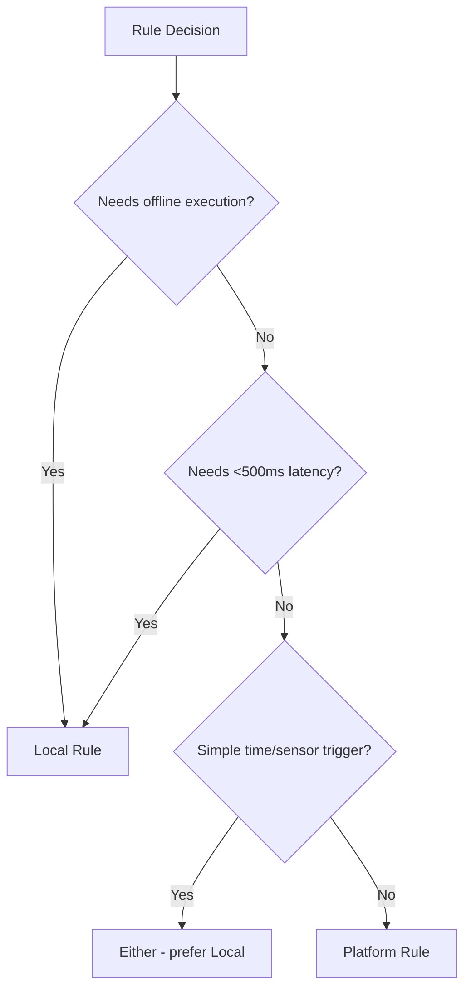

# 🏠 Local Rules Best Practices

> Guidelines for implementing gateway-based local rules in SHUNCOM RULR


**Platform:** SHUNCOM RULR IoT Platform v1.1 | **Last Updated:** January 2025


---

## 📋 Overview

### What Are Local Rules?
```yaml
Definition:
  Rules stored and executed on gateway devices
  
Key Characteristics:
  - Execute without platform connectivity
  - Lower latency than platform rules
  - Limited by gateway capabilities
  - Sync execution logs when online
```

### When to Use Local Rules


---

## ✅ Best Practices

### 1. Keep Rules Simple

**Good:** Simple trigger → Simple action
```yaml
Rule: Evening Lights On
Trigger: 18:00 daily
Action: Turn on all connected lights at 80%

# ✅ Simple, reliable, easy to debug
```

**Avoid:** Complex logic chains
```yaml
Rule: Complex Logic (DON'T DO THIS)
Trigger: 18:00 daily
Conditions:
  - IF day is weekday AND ambient < 50 lux
  - OR IF day is weekend AND time after sunset
  - AND power consumption < 5kW
  - AND no maintenance flag
Actions:
  - Turn on Group A at 80%
  - Wait 5 minutes
  - Turn on Group B at 60%
  - IF temperature > 30°C, reduce to 50%

# ❌ Too complex for gateway, use platform rule
```

### 2. Design for Offline Resilience

**Pattern: Backup Schedule**
```yaml
Strategy:
  Primary: Platform rules (full feature set)
  Backup: Local rules (essential operations)
  
Example:
  Platform Rule:
    - Smart astronomical timing
    - Weather-adjusted dimming
    - Energy optimization
    
  Local Backup Rule:
    - Fixed 18:00 on, 06:00 off
    - Fixed 80% brightness
    - Executes if platform offline
```

### 3. Use Appropriate Triggers

**Supported Local Triggers:**
```yaml
Time-Based:
  ✅ Fixed time (HH:MM)
  ✅ Daily/weekly repeat
  ✅ Gateway local time
  ⚠️ Astronomical (if gateway supports)
  
Sensor-Based:
  ✅ Local sensor input
  ✅ Digital input state change
  ✅ Threshold crossing
  
NOT Supported:
  ❌ Complex conditions
  ❌ Multi-device conditions
  ❌ External API triggers
  ❌ Platform events
```

### 4. Limit Rule Count per Gateway

```yaml
Recommendations:
  Maximum Rules: 20 per gateway
  Optimal: 5-10 rules
  
Why:
  - Limited gateway memory
  - Processing overhead
  - Sync complexity
  
If More Needed:
  - Split across multiple gateways
  - Move complex rules to platform
  - Consolidate similar rules
```

### 5. Test Before Deployment

**Testing Checklist:**
```yaml
Before Sync:
  [ ] Rule logic reviewed
  [ ] Target devices verified
  [ ] Time/trigger settings correct
  [ ] No conflicts with existing rules
  
After Sync:
  [ ] Sync status successful
  [ ] Rule appears on gateway
  [ ] Manual trigger test
  [ ] Wait for scheduled trigger
  
Offline Test:
  [ ] Disconnect gateway from platform
  [ ] Verify rule still executes
  [ ] Reconnect and check log sync
```

---

## 🔧 Implementation Guidelines

### Sync Process
```yaml
Sync Steps:
  1. Create/edit rule in platform
  2. Select "Sync to Gateway"
  3. Monitor sync status
  4. Verify on gateway (if accessible)
  5. Test execution
  
Sync Status:
  - Pending: Waiting to send
  - Syncing: In progress
  - Synced: Successfully on gateway
  - Failed: Error occurred (retry or investigate)
  
Retry Strategy:
  - Automatic retry: 3 attempts
  - Manual retry: "Sync" button
  - If persistent failure: Check gateway connectivity
```

### Rule Priority
```yaml
Local vs Platform Conflict:
  - Local rules execute independently
  - Platform rules may override
  - Define clear priority
  
Recommendation:
  Local Rules: Basic operations (on/off/dim)
  Platform Rules: Optimization, coordination
  
Avoid:
  - Same action from both local and platform
  - Conflicting brightness levels
  - Overlapping schedules
```

### Time Synchronization
```yaml
Critical:
  Gateway time MUST be accurate
  
Sync Methods:
  - NTP: Automatic if network available
  - Platform Sync: On connection
  - Manual: Last resort
  
Timezone:
  - Set correct timezone on gateway
  - Match platform timezone
  - Consider daylight saving
```

---

## 🚨 Common Pitfalls

### Pitfall 1: Overloading Gateway
```yaml
Problem:
  Too many complex rules exhaust gateway resources
  
Symptoms:
  - Slow rule execution
  - Gateway becomes unresponsive
  - Rules fail to trigger
  
Solution:
  - Reduce rule count
  - Simplify rule logic
  - Distribute across gateways
```

### Pitfall 2: Timezone Mismatch
```yaml
Problem:
  Gateway and platform in different timezones
  
Symptoms:
  - Rules execute at wrong time
  - Logs show unexpected times
  
Solution:
  - Verify gateway timezone setting
  - Use same timezone as platform
  - Test across DST transitions
```

### Pitfall 3: Sync Failures
```yaml
Problem:
  Rules not syncing to gateway
  
Causes:
  - Gateway offline
  - Network issues
  - Gateway storage full
  - Firmware incompatibility
  
Solutions:
  - Check gateway connectivity
  - Clear old rules if storage full
  - Update gateway firmware
  - Check sync logs for errors
```

### Pitfall 4: Orphaned Rules
```yaml
Problem:
  Rules on gateway not matching platform
  
Causes:
  - Rule deleted from platform but not gateway
  - Sync failure after modification
  - Manual gateway changes
  
Solution:
  - "Clear Local Rules" operation
  - Re-sync all rules
  - Regular audit of gateway rules
```

---

## 📊 Monitoring Local Rules

### Execution Logging
```yaml
What Gets Logged:
  - Rule ID and name
  - Trigger time (gateway local)
  - Execution status
  - Affected devices
  - Result (success/failure)
  
Log Sync:
  - Logs stored locally on gateway
  - Sync to platform when online
  - Retention: Based on gateway storage
```

### Health Checks
```yaml
Regular Checks:
  - Rule sync status
  - Execution success rate
  - Gateway time accuracy
  - Storage utilization
  
Alerts:
  - Sync failures
  - Execution failures
  - Gateway offline
```

---

## 📝 Local Rule Examples

### Example 1: Basic Schedule
```yaml
Name: "Local_Evening_On"
Gateway: Gateway_Park_01
Type: Local

Trigger:
  type: time
  value: "18:00"
  repeat: daily
  
Action:
  type: power_on
  brightness: 80
  targets: all_connected
  
Priority: 5
Enabled: true
```

### Example 2: Sensor Response
```yaml
Name: "Local_Motion_Response"
Gateway: Gateway_Entrance_01
Type: Local

Trigger:
  type: sensor
  input: motion_sensor_1
  condition: activated
  
Action:
  type: power_on
  brightness: 100
  targets: entrance_lights
  duration: 300  # Auto-off after 5 min
  
Priority: 1  # High priority for fast response
```

### Example 3: Backup Schedule
```yaml
Name: "Local_Backup_Schedule"
Gateway: Gateway_Main_01
Type: Local
Purpose: Operates when platform unavailable

Rules:
  - On: 18:00 daily, brightness 80%
  - Dim: 23:00 daily, brightness 50%
  - Off: 06:00 daily
  
Note: Platform rules override when available
```

---

## 🔗 Related Documentation

- **[04-Rule Engine System](04-Rule%20Engine%20System.md)**: Complete rule system
- **[Rule Configuration Patterns](Rule%20Configuration%20Patterns.md)**: Rule patterns
- **[03-Device Management Hub](../03-Device-Management/03-Device%20Management%20Hub.md)**: Gateway configuration
- **[Protocol Guides](../03-Device-Management/Protocol%20Guides.md)**: Device communication
