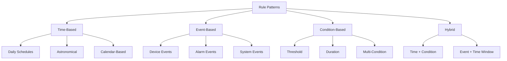

# 📋 Rule Configuration Patterns

> Common automation patterns and best practices for SHUNCOM RULR rule engine

---

## 🎯 Pattern Categories



---

## ⏰ Time-Based Patterns

### Pattern 1: Daily Schedule
**Use Case:** Turn lights on/off at fixed times

```yaml
Rule Name: Evening Lighting Schedule
Rule Type: Platform
Trigger Type: Time

Configuration:
  Trigger:
    type: scheduled
    time: "18:00"
    repeat: daily
    timezone: "Asia/Ho_Chi_Minh"
    
  Action:
    type: power_on
    brightness: 100
    targets:
      type: group
      id: "main_street_lights"
      
  Schedule:
    start_date: "2025-01-01"
    end_date: null  # No end date
    active_days: [Mon, Tue, Wed, Thu, Fri, Sat, Sun]
```

**Morning Off Schedule:**
```yaml
Rule Name: Morning Lights Off
Trigger:
  type: scheduled
  time: "06:00"
  repeat: daily
  
Action:
  type: power_off
  targets:
    type: project
    id: "north_region"
```

---

### Pattern 2: Astronomical Timing
**Use Case:** Sync with sunrise/sunset

```yaml
Rule Name: Sunset Auto-On
Rule Type: Platform
Trigger Type: Astronomical

Configuration:
  Trigger:
    type: astronomical
    event: sunset
    offset: -30  # 30 minutes before sunset
    location:
      lat: 10.7769
      lng: 106.7009
      
  Action:
    type: power_on
    brightness: 80
    targets:
      type: all_in_project
      id: "downtown"
```

**Sunrise Off with Offset:**
```yaml
Rule Name: Sunrise Auto-Off
Trigger:
  type: astronomical
  event: sunrise
  offset: +30  # 30 minutes after sunrise
  
Action:
  type: power_off
```

---

### Pattern 3: Dimming Schedule
**Use Case:** Adjust brightness throughout the night

```yaml
Rule Set Name: Night Dimming Profile

Rule 1 - Evening Full:
  Trigger: 18:00 daily
  Action: Set brightness 100%
  
Rule 2 - Late Night Dim:
  Trigger: 23:00 daily
  Action: Set brightness 60%
  
Rule 3 - Deep Night Dim:
  Trigger: 01:00 daily
  Action: Set brightness 40%
  
Rule 4 - Pre-Dawn Boost:
  Trigger: 05:00 daily
  Action: Set brightness 80%
  
Rule 5 - Morning Off:
  Trigger: sunrise + 30min
  Action: Power off
```

---

### Pattern 4: Weekend/Holiday Schedule
**Use Case:** Different schedules for weekends

```yaml
Rule Name: Weekday Schedule
Configuration:
  active_days: [Mon, Tue, Wed, Thu, Fri]
  trigger_time: "18:30"
  action: power_on, brightness 100%

Rule Name: Weekend Schedule
Configuration:
  active_days: [Sat, Sun]
  trigger_time: "19:00"  # Later on weekends
  action: power_on, brightness 80%
```

---

## 🎪 Event-Based Patterns

### Pattern 5: Device Status Response
**Use Case:** React to device state changes

```yaml
Rule Name: Gateway Failover Alert
Rule Type: Alarm

Configuration:
  Trigger:
    type: event
    source: device
    event: status_changed
    conditions:
      - field: status
        operator: equals
        value: "offline"
      - field: device_type
        operator: equals
        value: "gateway"
        
  Action:
    type: notification
    channels:
      - type: email
        template: "gateway_offline"
      - type: sms
        template: "urgent_gateway"
    severity: critical
```

---

### Pattern 6: Cascading Actions
**Use Case:** When one event triggers multiple actions

```yaml
Rule Name: Emergency Mode
Rule Type: Platform

Configuration:
  Trigger:
    type: event
    source: external_api
    event: emergency_activated
    
  Actions:
    - order: 1
      type: power_on
      brightness: 100
      targets: all_devices
      
    - order: 2
      type: notification
      channels: [email, sms, webhook]
      message: "Emergency lighting activated"
      
    - order: 3
      type: log_event
      event_type: "emergency_mode_started"
```

---

## 📊 Condition-Based Patterns

### Pattern 7: Threshold Monitoring
**Use Case:** Alert when metrics exceed limits

```yaml
Rule Name: High Power Consumption Alert
Rule Type: Alarm

Configuration:
  Trigger:
    type: condition
    source: device_metric
    device_type: smart_meter
    
  Conditions:
    - metric: active_power
      operator: greater_than
      value: 5000  # Watts
      duration: 300  # 5 minutes sustained
      
  Action:
    type: alarm
    severity: major
    title: "High Power Consumption"
    message: "Device {device_name} consuming {value}W"
```

---

### Pattern 8: Multi-Condition Logic
**Use Case:** Complex condition combinations

```yaml
Rule Name: Smart Energy Saving
Rule Type: Platform

Configuration:
  Trigger:
    type: condition
    logic: AND  # All conditions must be true
    
  Conditions:
    - source: time
      operator: between
      value: ["23:00", "05:00"]
      
    - source: device_metric
      metric: ambient_light
      operator: greater_than
      value: 50  # lux (moonlight/other light)
      
    - source: device_status
      metric: brightness
      operator: greater_than
      value: 50
      
  Action:
    type: dim
    brightness: 30  # Reduce brightness when ambient light sufficient
```

---

### Pattern 9: Duration-Based Trigger
**Use Case:** Only trigger after sustained condition

```yaml
Rule Name: Persistent Offline Alert
Rule Type: Alarm

Configuration:
  Trigger:
    type: condition
    
  Conditions:
    - source: device_status
      metric: online_status
      operator: equals
      value: false
      duration: 900  # 15 minutes
      
  Action:
    type: alarm
    severity: major
    title: "Device Offline for Extended Period"
    
  Recovery:
    auto_resolve: true
    when:
      - metric: online_status
        operator: equals
        value: true
```

---

## 🔄 Hybrid Patterns

### Pattern 10: Time-Bounded Events
**Use Case:** Only respond to events during certain hours

```yaml
Rule Name: After-Hours Motion Response
Rule Type: Platform

Configuration:
  Trigger:
    type: event
    source: sensor
    event: motion_detected
    
  Conditions:
    - source: time
      operator: between
      value: ["22:00", "06:00"]  # Only at night
      
  Action:
    type: power_on
    brightness: 100
    duration: 300  # Stay on for 5 minutes
    
  Auto_Revert:
    after: 300  # Seconds
    to_state: previous
```

---

### Pattern 11: Seasonal Adjustment
**Use Case:** Adjust schedules based on season

```yaml
Rule Set Name: Seasonal Lighting

Summer Rules (Jun-Aug):
  On Time: sunset - 15min
  Off Time: sunrise + 45min
  Night Dim: 40%
  
Winter Rules (Dec-Feb):
  On Time: sunset - 30min
  Off Time: sunrise + 30min
  Night Dim: 60%
  
Transition Rules (Mar-May, Sep-Nov):
  On Time: sunset
  Off Time: sunrise + 30min
  Night Dim: 50%
```

---

## 🏭 Local Rule Patterns

### Pattern 12: Gateway-Local Time Rule
**Use Case:** Schedule that works even when platform offline

```yaml
Rule Name: Local Backup Schedule
Rule Type: Local
Target Gateway: Gateway_Industrial_01

Configuration:
  Trigger:
    type: scheduled
    time: "18:00"
    repeat: daily
    use_gateway_time: true
    
  Action:
    type: power_on
    brightness: 80
    targets:
      - all_connected_devices
      
Benefits:
  - Executes even if platform offline
  - Uses gateway's local clock
  - Syncs execution log when online
```

---

### Pattern 13: Local Sensor Response
**Use Case:** Fast local response to sensor input

```yaml
Rule Name: Local Occupancy Response
Rule Type: Local
Target Gateway: Gateway_Parking_01

Configuration:
  Trigger:
    type: event
    source: local_sensor
    event: occupancy_detected
    
  Action:
    type: power_on
    brightness: 100
    targets: zone_lights
    
  Timeout:
    no_activity: 300  # 5 minutes
    action: dim
    to_brightness: 30
    
Latency:
  Local execution: <100ms
  Platform-dependent: 500-2000ms
```

---

## 🚨 Alarm Rule Patterns

### Pattern 14: Escalating Alerts
**Use Case:** Escalate notifications if not acknowledged

```yaml
Rule Name: Escalating Critical Alert
Rule Type: Alarm

Configuration:
  Trigger:
    type: condition
    metric: device_status
    condition: offline
    duration: 300  # 5 minutes
    
  Notification Escalation:
    Level 1 (0 min):
      channels: [email]
      recipients: [operators@company.com]
      
    Level 2 (15 min):
      channels: [email, sms]
      recipients: [supervisors@company.com]
      
    Level 3 (30 min):
      channels: [email, sms, phone]
      recipients: [managers@company.com]
      
  Stop Escalation:
    when: acknowledged OR resolved
```

---

### Pattern 15: Maintenance Window Suppression
**Use Case:** Suppress alarms during planned maintenance

```yaml
Rule Name: Suppress During Maintenance
Rule Type: Alarm Modifier

Configuration:
  Target Rules: [all_alarm_rules]
  
  Suppression Windows:
    - name: "Weekly Maintenance"
      schedule:
        day: Sunday
        time: "02:00-04:00"
      action: suppress_alarms
      
    - name: "Monthly Update"
      schedule:
        day: first_saturday
        time: "00:00-06:00"
      action: suppress_alarms
```

---

## ✅ Best Practices

### Rule Design Guidelines
```yaml
Naming:
  ✅ "Evening_On_MainStreet_18:00"
  ✅ "Sunset_Dim_Industrial_Zone"
  ❌ "Rule 1"
  ❌ "Test"

Priority:
  - Lower number = higher priority
  - Critical rules: 1-3
  - Normal rules: 4-7
  - Background rules: 8-10

Testing:
  1. Test in staging first
  2. Start with small device group
  3. Monitor first executions
  4. Expand gradually
```

### Common Pitfalls
```yaml
Avoid:
  ❌ Overlapping schedules with conflicting actions
  ❌ Too many rules on same trigger time
  ❌ Infinite loops (action triggers condition triggers action)
  ❌ Local rules too complex for gateway
  
Watch For:
  ⚠️ Timezone mismatches
  ⚠️ Daylight saving transitions
  ⚠️ Holiday schedules
  ⚠️ Device group membership changes
```

---

## 🔗 Related Documentation

- **[[04-Rule Engine System]]**: Rule engine overview
- **[[Local Rules Best Practices]]**: Local rule guidance
- **[[Rule Configuration Template]]**: Rule documentation template
- **[[Testing Scenarios]]**: Rule testing procedures
