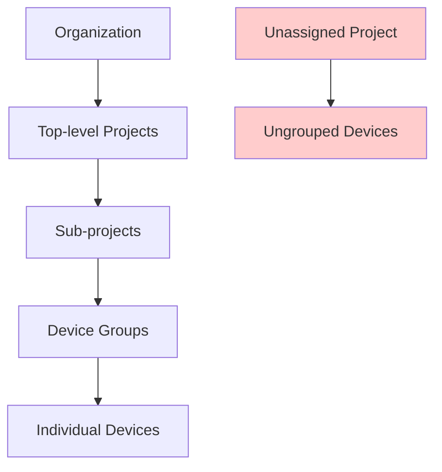
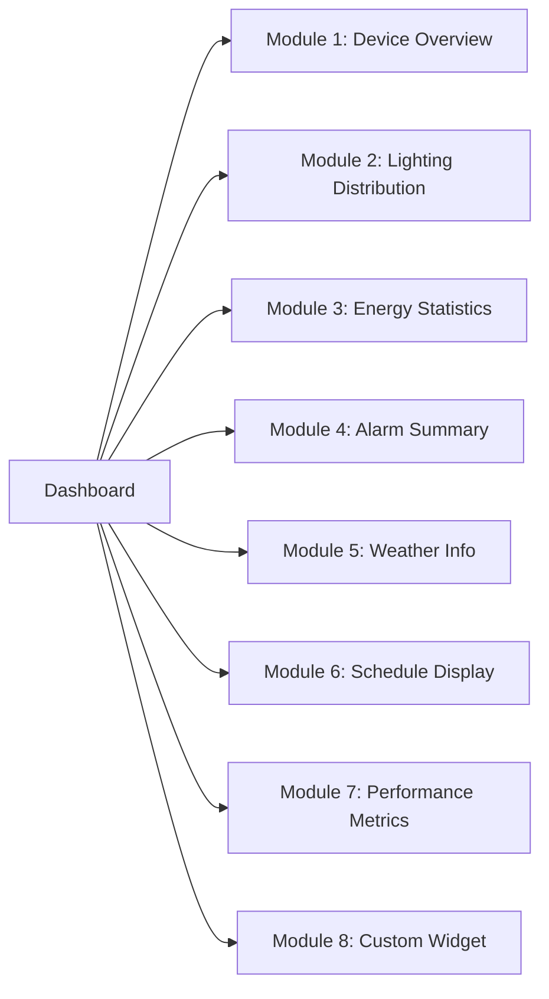
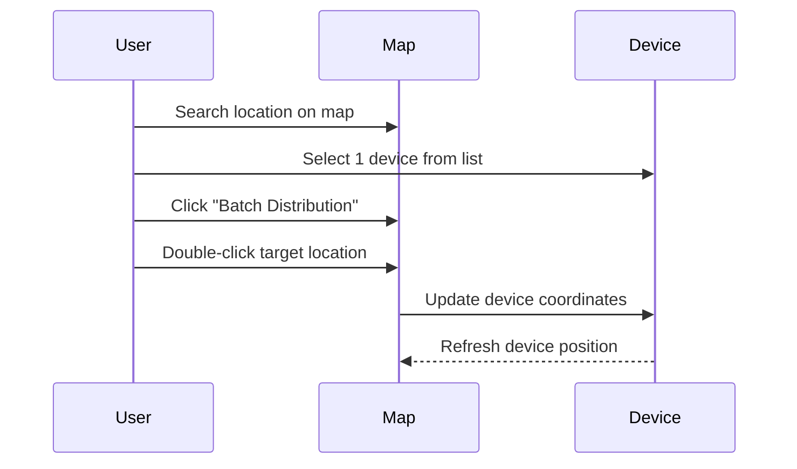
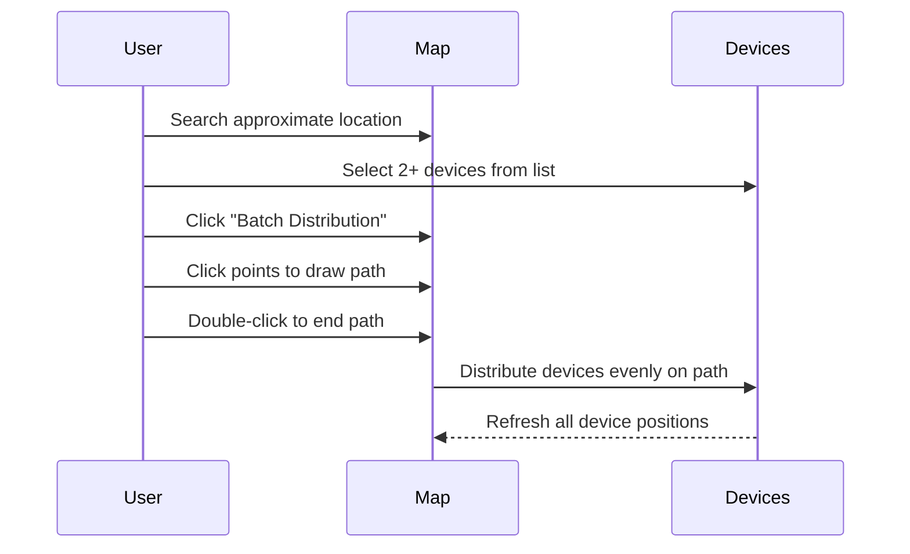

# 📋 Project Management

> Quản lý dự án, cấu trúc phân cấp và cấu hình hiển thị

**Tags**: #project-management #gis-integration #dashboard-config  
**Created**: 2025-01-22  
**Last Updated**: 2025-01-22

---

## 🏗️ Project Architecture

### Project Hierarchy


**Navigation**: `Settings > Equipment Management > Device Configuration > Project`

---

## 📊 Project Structure

### Default Projects (Auto-generated)
```yaml
System Projects:
  Top-level Projects:
    - Auto-generated ✅
    - Cannot be deleted ❌
    - Container for all sub-projects
    
  Unassigned Project:
    - Auto-generated ✅
    - Cannot be deleted ❌
    - Contains devices without project assignment
    - ⚠️ Visible to ALL users (security concern)
```

### Project Levels
| Level | Description | Features |
|-------|-------------|----------|
| **Top-level** | Root project container | Organization-wide settings |
| **Sub-project** | Operational project units | Device distribution, GIS mapping |
| **Device Groups** | Device organization | Multicast, batch operations |

---

## ➕ Project Creation

### Basic Information Configuration
```yaml
Required Fields:
  Project Name: "North Region Street Lighting"
  Parent Project: [Select from hierarchy]
  
Optional Fields:
  Description: "Municipal street lighting for north district"
  Location: "North District, City Center"
  Coordinates: "Lat: 40.7128, Long: -74.0060"
  Contact Person: "John Smith"
  Contact Email: "john.smith@city.gov"
```

### Project Operations
- **Add**: Create new projects at any hierarchy level
- **Edit**: Modify project information and settings
- **Delete**: Remove projects (with dependency checks)
- **Move**: Reorganize project hierarchy

---

## 🎨 Display Information Configuration

### Dashboard Module System
**Navigation**: `Settings > Equipment Management > Device Configuration > Edit Project > Display Information`

#### 8 Configurable Modules


### Style Configuration
```yaml
Display Styles:
  Technology Style:
    - Modern tech aesthetic
    - Blue/gray color scheme
    - Data-focused layout
    
  Future Style:
    - Futuristic design
    - Dynamic animations
    - Dark theme friendly

Title Settings:
  - Custom project name display
  - Font family selection
  - Font size adjustment
  - Color customization
```

### Module Switch System
```yaml
Module Visibility:
  Lighting Distribution: ON/OFF
  Energy Statistics: ON/OFF
  Alarm Summary: ON/OFF
  Weather Information: ON/OFF
  
Content Requirements:
  Some modules require data configuration:
    - Lighting Schedules: Need schedule setup
    - Energy Plan: Need ECP configuration
    - Statistics: Need data source selection
```

---

## ⏰ Lighting Schedules Configuration

### Schedule Setup
**Navigation**: `Display Information > Usage Scenario > Smart Lighting > Lighting Schedules Today`

#### Time Configuration Options
```yaml
Light On/Off Time Options:
  Fixed Time:
    - Manual time entry
    - Consistent daily schedule
    - Example: "18:00 ON, 06:00 OFF"
    
  Sunrise/Sunset:
    - Auto-calculated from coordinates
    - Daily adjustment based on location
    - Seasonal variation support
    
  Illuminance Sensor:
    - Threshold-based triggering
    - Light ON threshold: "< 50 lux"
    - Light OFF threshold: "> 200 lux"
```

#### Schedule Display
```yaml
Homepage Display:
  - Current day schedule
  - Next switching time
  - Countdown timer
  - Schedule status indicator
```

---

## ⚡ Electricity Consumption Plan (ECP)

### ECP Configuration
**Navigation**: `Display Information > ECP > Setting`

#### Annual Planning
```yaml
Configuration Steps:
  1. Select Year: "2025"
  2. Enter Annual Plan: "1,000,000 kWh"
  3. Auto-distribution: Divided evenly to months/days
  4. Manual Adjustment: Fine-tune monthly/daily values
  5. Warning Percentage: "90%" (threshold for alerts)
```

#### Energy Saving Calculation
```yaml
Energy Saving Rate Formula:
  Rate = [(Planned - Actual) / Planned] × 100%
  
  Where:
    Planned = Planned consumption accumulated to yesterday
    Actual = Actual consumption accumulated to yesterday
    
Display Colors:
  Green: Within normal range
  Red: Exceeded warning percentage
```

### Energy Saving Overview
**Navigation**: `Display Information > Energy Saving Overview`

```yaml
Data Source Configuration:
  Select Energy Sources:
    - Smart Meters: ✅
    - Gateway readings: ✅
    - Light controller data: ✅
    
  Aggregation Method:
    - Sum all sources
    - Weighted average
    - Primary source only
```

---

## 🖼️ Preview & Customization

### Dashboard Preview
**Navigation**: `Display Information > Preview`

#### Drag-and-Drop Interface
```yaml
Customization Features:
  Module Arrangement:
    - Drag modules to reposition
    - Resize module dimensions
    - Show/hide individual modules
    
  Layout Options:
    - Grid-based positioning
    - Responsive breakpoints
    - Mobile vs desktop layouts
```

### Batch Apply Configuration
**Navigation**: `Display Information > Batch Apply`

```yaml
Configuration Copying:
  Source Project: "North Region" (current)
  Target Projects: 
    - "South Region" ✅
    - "East Region" ✅
    - "West Region" ✅
    
  Copy Options:
    - Display style ✅
    - Module arrangement ✅
    - Title settings ✅
    - Schedule configuration ✅
```

---

## 🔗 Device Association

### Associate Devices to Project
**Navigation**: `Settings > Equipment Management > Project > Associated Devices`

#### Association Methods
```yaml
Method 1: From Project Page
  Steps:
    1. Select project
    2. Click "Associated Devices"
    3. Select devices from available list
    4. Confirm association
    
Method 2: During Device Import
  Steps:
    1. Prepare import file
    2. Include project column
    3. Import devices
    4. Auto-association applied

Method 3: Individual Device Edit
  Steps:
    1. Open device configuration
    2. Select "Parent Project" field
    3. Choose target project
    4. Save changes
```

#### Disassociation Process
```yaml
Remove Device from Project:
  1. Navigate to project's associated devices
  2. Select device(s) to remove
  3. Click "Disassociate" or "Move out"
  4. Device moves to "Unassigned Project"
  
⚠️ Warning: Unassigned devices visible to all users
```

---

## 🗺️ GIS Map Distribution

### Distribution Requirements
```yaml
Prerequisites:
  - Second-level project (sub-project) ✅
  - GIS map selected as environment ✅
  - Devices have coordinates ✅
  
Availability:
  ❌ Top-level projects: No distribution
  ✅ Sub-projects: Full distribution support
```

### Distribution Methods

#### Single Device Distribution


#### Batch Device Distribution


#### Coordinate Fine-tuning
```yaml
Prerequisites:
  - Device already distributed on map
  
Process:
  1. Click "Fine-tuning coordinate" mode
  2. Click on device marker
  3. Drag device to new position
  4. Click "Save"
  5. System refreshes device location
```

### Map Interface Features
```yaml
Search & Navigation:
  - Location search box
  - Device name search
  - Device number search
  - Product type filter
  
Display Options:
  - Device icons by category
  - Status-based colors
  - Clustering for dense areas
  - Info popup on click
```

---

## ⚠️ Critical Considerations

### Security Implications
```yaml
Unassigned Devices Risk:
  Problem: Devices without project = visible to ALL users
  Impact: Security and access control bypass
  Solution: Always assign devices to specific projects
  
Best Practice:
  ✅ Create project structure FIRST
  ✅ Assign devices during import
  ✅ Regular audit for unassigned devices
  ✅ Restrict "Unassigned Project" visibility
```

### Project Planning Best Practices
```yaml
Before Creating Projects:
  1. Define organizational hierarchy
  2. Plan device grouping strategy
  3. Determine access control needs
  4. Map physical locations to projects
  
Project Naming Conventions:
  Format: "[Region]_[Type]_[Identifier]"
  Examples:
    - "North_StreetLighting_Main"
    - "Industrial_Zone_A_Meters"
    - "Campus_Building_1_Lights"
```

---

## 🔗 Related Documentation

### Dependencies
- **[[02-Authentication System]]** - Project access permissions
- **[[03-Device Management Hub]]** - Device-project associations
- **[[04-Rule Engine System]]** - Project-scoped rules
- **[[06-Dashboard Interface]]** - Project dashboard views

### Configuration Guides
- **[[GIS Integration Guide]]** - Detailed mapping setup
- **[[Dashboard Configuration]]** - Module customization
- **[[Energy Management Setup]]** - ECP configuration
- **[[Multi-tenant Architecture]]** - Organization isolation

---

**Next Steps**: After project structure is established, proceed to [[03-Device Management Hub]] for device registration and association workflows.