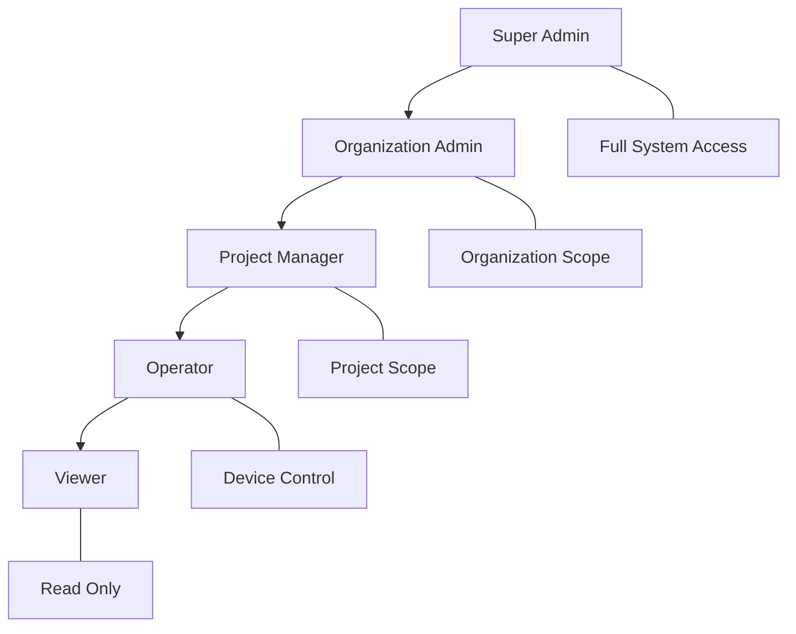
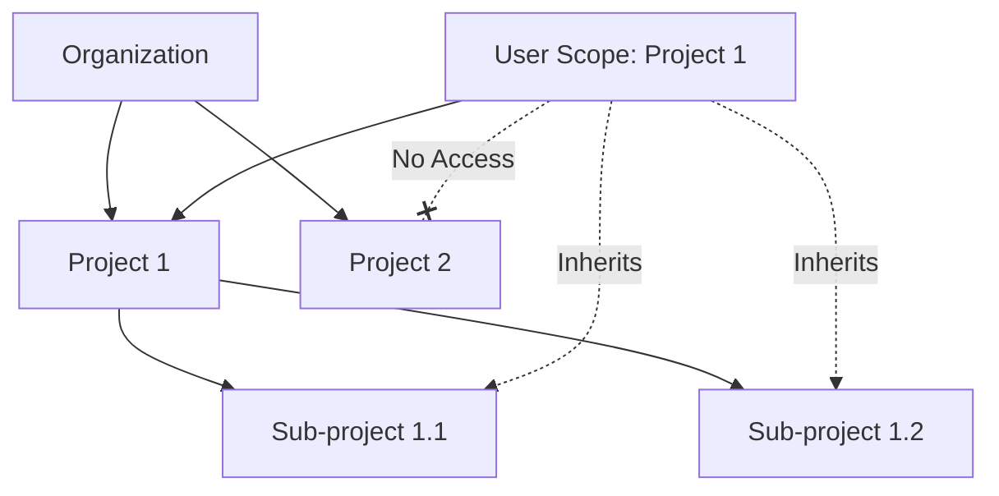
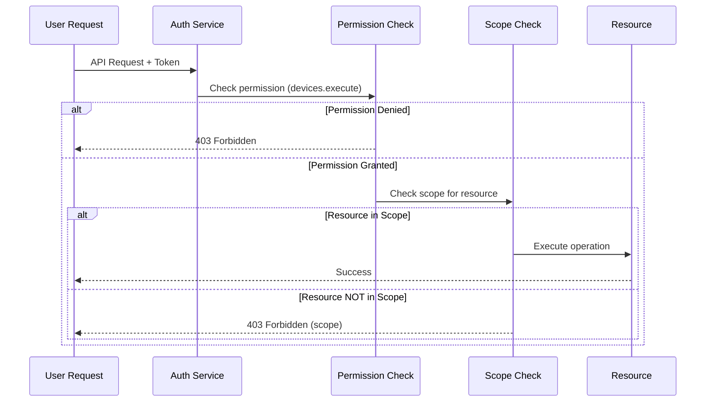

# 🔐 Permission Matrices

> Comprehensive permission mappings for SHUNCOM RULR role-based access control

---

## 📊 Role Overview

### Standard Roles


### Role Hierarchy
| Role | Level | Default Scope | Typical Users |
|------|-------|---------------|---------------|
| Super Admin | 0 | System-wide | Platform administrators |
| Org Admin | 1 | Organization | Company IT managers |
| Project Manager | 2 | Assigned projects | Regional managers |
| Operator | 3 | Assigned devices/groups | Field technicians |
| Viewer | 4 | Assigned resources | Stakeholders, auditors |

---

## 📋 Master Permission Matrix

### Device Permissions

| Permission | Super Admin | Org Admin | Project Mgr | Operator | Viewer |
|------------|:-----------:|:---------:|:-----------:|:--------:|:------:|
| `devices.read` | ✅ | ✅ | ✅ | ✅ | ✅ |
| `devices.write` | ✅ | ✅ | ✅ | ❌ | ❌ |
| `devices.delete` | ✅ | ✅ | ✅ | ❌ | ❌ |
| `devices.execute` | ✅ | ✅ | ✅ | ✅ | ❌ |
| `devices.import` | ✅ | ✅ | ✅ | ❌ | ❌ |
| `devices.export` | ✅ | ✅ | ✅ | ✅ | ✅ |

### Rule Permissions

| Permission | Super Admin | Org Admin | Project Mgr | Operator | Viewer |
|------------|:-----------:|:---------:|:-----------:|:--------:|:------:|
| `rules.read` | ✅ | ✅ | ✅ | ✅ | ✅ |
| `rules.write` | ✅ | ✅ | ✅ | ❌ | ❌ |
| `rules.delete` | ✅ | ✅ | ✅ | ❌ | ❌ |
| `rules.execute` | ✅ | ✅ | ✅ | ✅ | ❌ |
| `rules.local.manage` | ✅ | ✅ | ✅ | ❌ | ❌ |

### Alarm Permissions

| Permission | Super Admin | Org Admin | Project Mgr | Operator | Viewer |
|------------|:-----------:|:---------:|:-----------:|:--------:|:------:|
| `alarms.read` | ✅ | ✅ | ✅ | ✅ | ✅ |
| `alarms.acknowledge` | ✅ | ✅ | ✅ | ✅ | ❌ |
| `alarms.resolve` | ✅ | ✅ | ✅ | ✅ | ❌ |
| `alarms.configure` | ✅ | ✅ | ✅ | ❌ | ❌ |

### User Management Permissions

| Permission | Super Admin | Org Admin | Project Mgr | Operator | Viewer |
|------------|:-----------:|:---------:|:-----------:|:--------:|:------:|
| `users.read` | ✅ | ✅ | ✅* | ❌ | ❌ |
| `users.write` | ✅ | ✅ | ❌ | ❌ | ❌ |
| `users.delete` | ✅ | ✅ | ❌ | ❌ | ❌ |
| `users.admin` | ✅ | ✅ | ❌ | ❌ | ❌ |
| `roles.read` | ✅ | ✅ | ✅ | ❌ | ❌ |
| `roles.write` | ✅ | ✅ | ❌ | ❌ | ❌ |

*Project Manager can see users in their projects only

### Project Permissions

| Permission | Super Admin | Org Admin | Project Mgr | Operator | Viewer |
|------------|:-----------:|:---------:|:-----------:|:--------:|:------:|
| `projects.read` | ✅ | ✅ | ✅ | ✅ | ✅ |
| `projects.write` | ✅ | ✅ | ✅* | ❌ | ❌ |
| `projects.delete` | ✅ | ✅ | ❌ | ❌ | ❌ |
| `projects.admin` | ✅ | ✅ | ❌ | ❌ | ❌ |

*Project Manager can edit within their assigned projects

### Dashboard & Reports Permissions

| Permission | Super Admin | Org Admin | Project Mgr | Operator | Viewer |
|------------|:-----------:|:---------:|:-----------:|:--------:|:------:|
| `dashboard.read` | ✅ | ✅ | ✅ | ✅ | ✅ |
| `dashboard.configure` | ✅ | ✅ | ✅ | ❌ | ❌ |
| `reports.read` | ✅ | ✅ | ✅ | ✅ | ✅ |
| `reports.generate` | ✅ | ✅ | ✅ | ✅ | ❌ |
| `reports.schedule` | ✅ | ✅ | ✅ | ❌ | ❌ |

### System Settings Permissions

| Permission | Super Admin | Org Admin | Project Mgr | Operator | Viewer |
|------------|:-----------:|:---------:|:-----------:|:--------:|:------:|
| `settings.system.read` | ✅ | ✅ | ❌ | ❌ | ❌ |
| `settings.system.write` | ✅ | ❌ | ❌ | ❌ | ❌ |
| `settings.org.read` | ✅ | ✅ | ✅ | ❌ | ❌ |
| `settings.org.write` | ✅ | ✅ | ❌ | ❌ | ❌ |
| `audit.read` | ✅ | ✅ | ✅* | ❌ | ❌ |

*Project Manager sees audit for their scope only

---

## 🎯 Scope-Based Access

### Scope Types

```yaml
System Scope (Super Admin only):
  Access: All organizations, all resources
  Use: Platform maintenance, cross-org operations
  
Organization Scope:
  Access: Single organization, all projects
  Use: Org admins managing their company
  
Project Scope:
  Access: Specific projects and sub-projects
  Use: Regional/site managers
  
Group Scope:
  Access: Specific device groups
  Use: Team leads, zone operators
  
Device Scope:
  Access: Individual devices
  Use: Specialized technicians
```

### Scope + Permission Interaction

```yaml
Example: User with devices.execute + Project Scope [Project A, Project B]

Can:
  ✅ Control devices in Project A
  ✅ Control devices in Project B
  ✅ Control devices in sub-projects of A and B
  
Cannot:
  ❌ Control devices in Project C
  ❌ Control devices not in any project
  ❌ Create/modify devices (no devices.write)
```

### Scope Inheritance



---

## 📝 Custom Role Configuration

### Creating Custom Roles

```yaml
Role Definition:
  name: "Energy Manager"
  code: "energy_manager"
  type: custom
  organization_id: "org_123"
  
Permissions:
  - devices.read
  - devices.export
  - dashboard.read
  - dashboard.configure
  - reports.read
  - reports.generate
  - reports.schedule
  
Excluded (by omission):
  - devices.write
  - devices.execute
  - rules.*
  - users.*
```

### Permission Groups

```yaml
Read-Only Group:
  - *.read
  - devices.export
  - reports.read
  
Device Control Group:
  - devices.read
  - devices.execute
  - alarms.read
  - alarms.acknowledge
  
Full Management Group:
  - devices.*
  - rules.*
  - alarms.*
  - projects.read
  - projects.write
```

---

## 🔍 Permission Check Logic

### Authorization Flow



### Permission Evaluation Rules

```yaml
Rule 1 - Explicit Deny:
  If user has explicit deny → Deny (not currently implemented)
  
Rule 2 - Required Permission:
  If user lacks required permission → Deny
  
Rule 3 - Scope Check:
  If resource outside user's scope → Deny
  
Rule 4 - Grant:
  If permission exists AND resource in scope → Allow
```

---

## 📊 Common Role Configurations

### Configuration: IT Administrator
```yaml
Role: Organization Admin
Scope: Full organization
Permissions: Full management

Typical Tasks:
  - User management
  - System configuration
  - All device operations
  - Report generation
```

### Configuration: Regional Manager
```yaml
Role: Project Manager
Scope: Specific projects (North Region, South Region)
Permissions:
  - devices.* (within scope)
  - rules.* (within scope)
  - reports.* (within scope)
  - dashboard.configure

Typical Tasks:
  - Manage devices in region
  - Create automation rules
  - Generate regional reports
  - Customize dashboard
```

### Configuration: Field Technician
```yaml
Role: Operator
Scope: Assigned device groups
Permissions:
  - devices.read
  - devices.execute
  - alarms.read
  - alarms.acknowledge
  
Typical Tasks:
  - Monitor device status
  - Control devices
  - Respond to alarms
  - Basic troubleshooting
```

### Configuration: External Auditor
```yaml
Role: Viewer
Scope: Specific projects
Permissions:
  - *.read only
  - reports.read
  - dashboard.read
  
Typical Tasks:
  - View device status
  - Review reports
  - Compliance checking
```

---

## ⚠️ Security Considerations

### Least Privilege Principle
```yaml
Guidelines:
  - Start with minimum permissions
  - Add only what's needed
  - Regular permission audits
  - Remove unused permissions
  
Review Schedule:
  - New users: After 30 days
  - All users: Quarterly
  - After role change: Immediately
```

### Sensitive Operations
```yaml
High-Risk Operations:
  - users.admin → Can create admin users
  - settings.system.write → Can modify system config
  - devices.delete → Permanent data loss risk
  - rules.delete → Can disable automation
  
Recommendations:
  - Limit to minimum users
  - Enable MFA for these users
  - Audit all actions
  - Consider approval workflows
```

---

## 🔗 Related Documentation

- **[[02-Authentication System]]**: User authentication
- **[[Security Architecture]]**: Security implementation
- **[[Role Design Patterns]]**: Role configuration patterns
- **[[User Onboarding Guide]]**: New user setup
