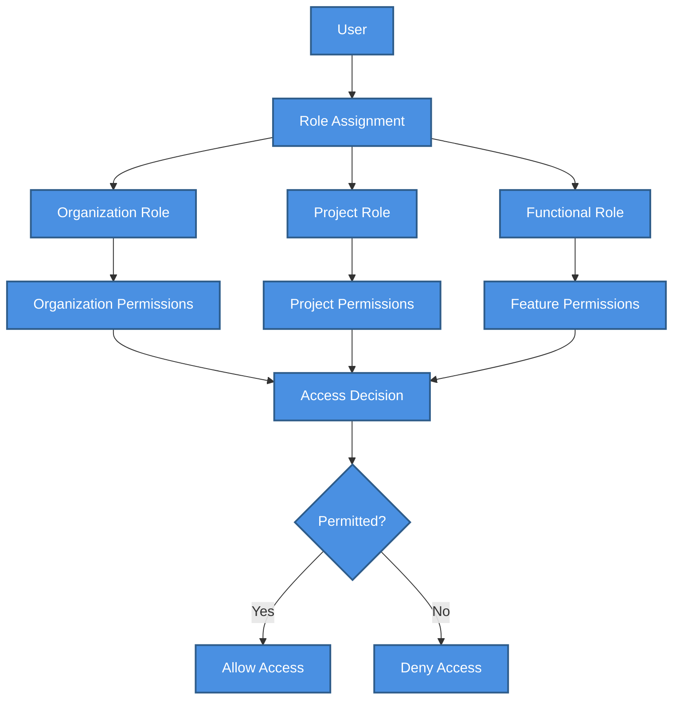

# 🔐 Role Design Patterns

> RBAC implementation patterns, role hierarchy design, and best practices for access control


**Platform:** SHUNCOM RULR IoT Platform v1.1 | **Last Updated:** January 2025



---

## 📋 RBAC Architecture

### Role-Based Access Control Overview


    classDef default fill:#4A90E2,stroke:#2E5C8A,stroke-width:2px,color:#fff
    classDef primary fill:#7B68EE,stroke:#5A4FC4,stroke-width:2px,color:#fff
    classDef success fill:#50C878,stroke:#3A9B5C,stroke-width:2px,color:#fff
    classDef warning fill:#FFA500,stroke:#CC8400,stroke-width:2px,color:#fff
    classDef danger fill:#FF6B6B,stroke:#CC5555,stroke-width:2px,color:#fff


### Core RBAC Concepts

```yaml
Subjects (Who):
  - Users: Individual accounts
  - Service Accounts: System integrations
  - API Keys: Programmatic access
  
Objects (What):
  - Projects: Data containers
  - Devices: IoT endpoints
  - Rules: Automation configurations
  - Reports: Analytics data
  - Settings: System configurations
  
Actions (How):
  - Create: Add new resources
  - Read: View existing resources
  - Update: Modify resources
  - Delete: Remove resources
  - Execute: Run operations/commands
  - Admin: Full control including sharing
```

---

## 🏗️ Role Hierarchy

### System-Level Roles

```yaml
Super Admin:
  Scope: Entire system
  Capabilities:
    - Full system access
    - Organization management
    - System configuration
    - User management across all orgs
    - Audit log access
    - Billing management
  Assignment: Platform operator only
  
Organization Admin:
  Scope: Single organization
  Capabilities:
    - Organization settings
    - User management within org
    - Project creation
    - Role assignment
    - Usage reports
  Assignment: Customer IT admin
  
Organization User:
  Scope: Assigned projects only
  Capabilities:
    - Access assigned projects
    - Permissions per project role
  Assignment: All regular users
```

### Project-Level Roles

```yaml
Project Owner:
  Permissions:
    Projects: Full control
    Devices: Full control
    Rules: Full control
    Users: Add/remove project members
    Reports: Full access
    Settings: Full configuration
  Use Case: Project manager, department head
  
Project Admin:
  Permissions:
    Projects: Read + Update
    Devices: Full control
    Rules: Full control
    Users: View members
    Reports: Full access
    Settings: Limited configuration
  Use Case: Technical lead, senior operator
  
Project Operator:
  Permissions:
    Projects: Read only
    Devices: Read + Execute (commands)
    Rules: Read + Enable/Disable
    Users: None
    Reports: Read only
    Settings: None
  Use Case: Control room operator, technician
  
Project Viewer:
  Permissions:
    Projects: Read only
    Devices: Read only
    Rules: Read only
    Users: None
    Reports: Read only
    Settings: None
  Use Case: Stakeholder, auditor, analyst
```

### Functional Roles

```yaml
Device Manager:
  Focus: Device lifecycle
  Permissions:
    - Add/remove devices
    - Configure device settings
    - Execute device commands
    - View device data
    - Manage device groups
  Use Case: Field technician, hardware admin

Rule Engineer:
  Focus: Automation configuration
  Permissions:
    - Create/edit rules
    - Configure schedules
    - Set alarm thresholds
    - Test rules
    - View rule execution logs
  Use Case: Automation specialist, energy manager

Report Analyst:
  Focus: Data analysis
  Permissions:
    - Access all reports
    - Create custom reports
    - Export data
    - Configure dashboards
    - Schedule report delivery
  Use Case: Business analyst, sustainability officer
```

---

## 📐 Design Patterns

### Pattern 1: Least Privilege

```yaml
Principle: Grant minimum permissions necessary
Implementation:
  1. Start with no permissions
  2. Add only required permissions
  3. Review periodically
  4. Remove unused permissions
  
Example:
  New Operator Role:
    ❌ Don't: Copy "Admin" and remove some permissions
    ✅ Do: Start blank, add: view devices, execute commands
```

#### Applying Least Privilege
```yaml
User Story: "Operator needs to turn lights on/off"

Minimum Permissions:
  devices.read: View device list and status
  devices.execute: Send on/off commands
  
NOT Needed:
  ❌ devices.create: Can't add devices
  ❌ devices.update: Can't change settings
  ❌ devices.delete: Can't remove devices
  ❌ rules.*: No rule access
  ❌ projects.*: No project settings
```

### Pattern 2: Role Inheritance

```yaml
Principle: Higher roles inherit lower role permissions

Hierarchy:
  Project Viewer
    ↳ Project Operator (inherits Viewer + adds execute)
      ↳ Project Admin (inherits Operator + adds configure)
        ↳ Project Owner (inherits Admin + adds user management)
        
Implementation:
  role_definitions:
    viewer:
      permissions: [view_devices, view_rules, view_reports]
      
    operator:
      inherits: viewer
      additional: [execute_commands, toggle_rules]
      
    admin:
      inherits: operator
      additional: [configure_devices, manage_rules]
      
    owner:
      inherits: admin
      additional: [manage_users, delete_project]
```

### Pattern 3: Separation of Duties

```yaml
Principle: Critical operations require multiple roles

Example: Rule Deployment
  Step 1 - Create Rule:
    Required Role: Rule Engineer
    Action: Draft and test rule
    
  Step 2 - Review Rule:
    Required Role: Project Admin (different user)
    Action: Validate and approve
    
  Step 3 - Deploy Rule:
    Required Role: Rule Engineer
    Action: Activate approved rule
    
Configuration:
  rules.deploy:
    requires_approval: true
    approver_role: project_admin
    cannot_self_approve: true
```

### Pattern 4: Context-Aware Access

```yaml
Principle: Permissions vary by context

Context Factors:
  - Time of day
  - Location (IP/geofence)
  - Device type
  - Project criticality
  - Emergency status
  
Example: Time-Based Access
  role: night_operator
  base_permissions: [view_devices, view_alarms]
  
  conditional_permissions:
    - condition: time_between(22:00, 06:00)
      grant: [execute_commands, acknowledge_alarms]
      reason: "Night shift emergency response"
      
    - condition: time_between(06:00, 22:00)
      deny: [execute_commands]
      reason: "Day shift - contact day operator"
```

### Pattern 5: Attribute-Based Access

```yaml
Principle: Permissions based on resource attributes

Example: Device Access by Zone
  role: zone_a_operator
  
  device_access:
    condition: device.zone == "zone_a"
    permissions: [read, execute]
    
  rule_access:
    condition: rule.affects_zone("zone_a")
    permissions: [read, toggle]
    
Example: Critical Device Protection
  device_attribute: criticality = "high"
  
  modified_permissions:
    - For operators: Read only (no execute)
    - For admins: Execute requires confirmation
    - For viewers: No access
```

---

## 🔧 Implementation Examples

### Creating Custom Roles

#### Example 1: Maintenance Technician
```yaml
Role Name: Maintenance Technician
Description: Field staff for device maintenance

Permissions:
  Devices:
    view: All devices in assigned zones
    execute: Diagnostic commands only
    update: Physical location fields only
    
  Rules:
    view: Rules affecting assigned devices
    toggle: Disable for maintenance only
    
  Alarms:
    view: All alarms
    acknowledge: Alarms in assigned zones
    
  Reports:
    view: Device health reports
    export: None (prevent data extraction)

Restrictions:
  - Cannot access billing/financial data
  - Cannot modify rule logic
  - Cannot add/remove devices
  - Session timeout: 8 hours
```

#### Example 2: Energy Manager
```yaml
Role Name: Energy Manager
Description: Responsible for energy optimization

Permissions:
  Devices:
    view: All meters and lighting devices
    execute: Read meter data
    
  Rules:
    full_access: Energy-related rules
    view: All other rules
    
  Reports:
    full_access: Energy consumption reports
    create: Custom energy reports
    schedule: Automated report delivery
    
  Dashboard:
    customize: Energy-focused widgets
    share: Energy dashboards

Special Access:
  - Energy consumption historical data (3 years)
  - Tariff configuration view
  - Energy saving goal setting
```

#### Example 3: Third-Party Integrator
```yaml
Role Name: API Integration
Description: External system integration access

Permissions:
  API:
    endpoints: [/devices/status, /energy/consumption, /alarms/current]
    methods: [GET]
    rate_limit: 1000/hour
    
  Data:
    real_time: Yes (via webhook)
    historical: Last 30 days
    
  Webhooks:
    subscribe: [device_status, alarm_triggered]
    
Restrictions:
  - No UI access
  - No command execution
  - Read-only data access
  - IP whitelist required
  - API key authentication only
```

---

## 📊 Role Matrix Templates

### Simplified Permission Matrix

| Permission | Viewer | Operator | Admin | Owner |
|------------|--------|----------|-------|-------|
| View Devices | ✅ | ✅ | ✅ | ✅ |
| Execute Commands | ❌ | ✅ | ✅ | ✅ |
| Configure Devices | ❌ | ❌ | ✅ | ✅ |
| Add/Remove Devices | ❌ | ❌ | ✅ | ✅ |
| View Rules | ✅ | ✅ | ✅ | ✅ |
| Toggle Rules | ❌ | ✅ | ✅ | ✅ |
| Edit Rules | ❌ | ❌ | ✅ | ✅ |
| View Reports | ✅ | ✅ | ✅ | ✅ |
| Export Reports | ❌ | ✅ | ✅ | ✅ |
| Manage Users | ❌ | ❌ | ❌ | ✅ |
| Project Settings | ❌ | ❌ | ✅ | ✅ |
| Delete Project | ❌ | ❌ | ❌ | ✅ |

### Device-Type Permission Matrix

| Role | Gateway | Controller | Meter | Fixture | Pole |
|------|---------|------------|-------|---------|------|
| Viewer | R | R | R | R | R |
| Operator | RE | RE | R | RE | R |
| Device Manager | CRUD | CRUD | CRUD | CRUD | CRUD |
| Admin | CRUD | CRUD | CRUD | CRUD | CRUD |

**Legend**: C=Create, R=Read, U=Update, D=Delete, E=Execute

### Feature Permission Matrix

| Role | Dashboard | GIS Map | Rules | Alarms | Reports | Users |
|------|-----------|---------|-------|--------|---------|-------|
| Viewer | View | View | View | View | View | - |
| Operator | Customize | Interact | Toggle | Ack | View | - |
| Admin | Full | Full | Full | Full | Full | View |
| Owner | Full | Full | Full | Full | Full | Full |

---

## 🛡️ Security Best Practices

### Role Assignment Guidelines

```yaml
1. Require Justification:
   - Document why each permission is needed
   - Approval workflow for elevated roles
   - Periodic review (quarterly recommended)

2. Time-Limited Access:
   - Temporary elevated permissions expire
   - Contractor access has end date
   - Emergency access is logged and reviewed

3. Audit Trail:
   - Log all role assignments
   - Log all permission usage
   - Alert on unusual patterns
   
4. Regular Review:
   - Quarterly access reviews
   - Remove inactive user access
   - Validate role assignments still needed
```

### Role Naming Conventions

```yaml
Format: [Scope]_[Function]_[Level]

Examples:
  org_user_admin         # Org-level user administrator
  project_device_operator # Project-level device operator
  system_report_viewer    # System-wide report viewer
  zone_a_maintenance      # Zone-specific maintenance role

Avoid:
  ❌ "Admin" (too vague)
  ❌ "User1" (not descriptive)
  ❌ "John_Role" (person-specific)
```

### Emergency Access Procedures

```yaml
Break Glass Protocol:
  Trigger: Critical system emergency
  
  Process:
    1. User requests emergency access
    2. System grants temporary elevated permissions
    3. All actions logged with emergency flag
    4. Access expires after 4 hours
    5. Mandatory review within 24 hours
    
  Post-Incident:
    - Document actions taken
    - Review necessity
    - Update regular permissions if needed
    - Security team sign-off
```

---

## 🔄 Role Lifecycle Management

### Creating New Roles

```yaml
Step 1: Requirements Analysis
  - What tasks does this role perform?
  - What data does this role need?
  - What actions are required?
  - What should be explicitly denied?

Step 2: Draft Permission Set
  - Start with minimum permissions
  - Reference similar existing roles
  - Consider separation of duties
  
Step 3: Review and Approval
  - Security team review
  - Business owner approval
  - Document justifications
  
Step 4: Test Role
  - Create test user with role
  - Verify intended access works
  - Verify denied access is blocked
  
Step 5: Deploy and Monitor
  - Assign to users
  - Monitor for issues
  - Gather feedback
```

### Modifying Existing Roles

```yaml
Change Process:
  1. Document proposed changes
  2. Impact analysis (who is affected?)
  3. Security review
  4. Approval from role owner
  5. Communicate to affected users
  6. Implement changes
  7. Verify functionality
  8. Update documentation
  
Rollback Plan:
  - Keep previous role definition
  - Quick restore capability
  - Communication template ready
```

### Deprecating Roles

```yaml
Deprecation Process:
  1. Identify replacement role(s)
  2. Migration plan for current users
  3. Communication timeline
  4. Disable new assignments
  5. Migrate existing users
  6. Monitoring period (30 days)
  7. Archive role definition
  8. Delete role
```

---

## 🔗 Related Documentation

### Permission References
- **[Permission Matrices](Permission%20Matrices.md)** - Detailed permission tables
- **[02-Authentication System](../02-System-Architecture/02-Authentication%20System.md)** - Authentication architecture
- **[User Onboarding Guide](User%20Onboarding%20Guide.md)** - New user role assignment

### Implementation Guides
- **[Security Architecture](../08-Development-Guide/Security%20Architecture.md)** - Security implementation
- **[API Design Patterns](../08-Development-Guide/API%20Design%20Patterns.md)** - API authorization
- **[Testing Scenarios](../08-Development-Guide/Testing%20Scenarios.md)** - Role testing procedures

### Management Guides
- **[05-Project Management](05-Project%20Management.md)** - Project-level access
- **[Troubleshooting Guide](../08-Development-Guide/Troubleshooting%20Guide.md)** - Access troubleshooting

---

**Next Steps**: Review [Permission Matrices](Permission%20Matrices.md) for specific permission details, or see [User Onboarding Guide](User%20Onboarding%20Guide.md) for assigning roles to new users.
