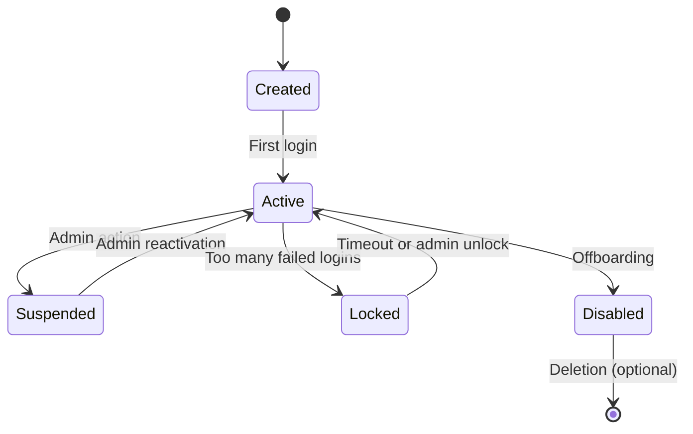

# 👋 User Onboarding Guide

> Step-by-step guide for adding and configuring new users in SHUNCOM RULR


**Platform:** SHUNCOM RULR IoT Platform v1.1 | **Last Updated:** January 2025


---

## 📋 Onboarding Checklist

### Pre-Onboarding
- [ ] Determine user's role and responsibilities
- [ ] Identify required permissions
- [ ] Define management scope (projects/groups)
- [ ] Prepare welcome materials
- [ ] Schedule training if needed

### Account Creation
- [ ] Create user account
- [ ] Assign role
- [ ] Configure management scope
- [ ] Set temporary password
- [ ] Send credentials securely

### Post-Creation
- [ ] Verify user can login
- [ ] Confirm access to required resources
- [ ] Complete initial training
- [ ] Document in user registry

---

## 🔧 Step-by-Step User Creation

### Step 1: Access User Management

```yaml
Navigation:
  Settings > User Management > Users > Add User
  
Required Permission:
  users.write or users.admin
```

### Step 2: Enter Basic Information

```yaml
Required Fields:
  Username: 
    - Unique identifier
    - Alphanumeric, 4-50 characters
    - Cannot be changed after creation
    
  Email:
    - Valid email address
    - Used for notifications and password reset
    
  Display Name:
    - Full name for display
    - Can contain spaces
    
  Phone (Optional):
    - For SMS notifications
    - Include country code
    
  Initial Password:
    - Minimum 8 characters
    - Must include: uppercase, lowercase, number, special char
    - Or use "Generate Random" option
```

### Step 3: Assign Role

```yaml
Role Selection:
  Consider:
    - What actions does user need to perform?
    - What data does user need to access?
    - Principle of least privilege
    
  Common Assignments:
    IT Staff → Organization Admin
    Site Manager → Project Manager
    Technician → Operator
    Stakeholder → Viewer
    
  Custom Role:
    - Select from pre-defined custom roles
    - Or create new role if needed
```

### Step 4: Configure Management Scope

```yaml
Scope Configuration:
  For Organization Admin:
    - Automatic: Full organization access
    
  For Project Manager:
    - Select specific projects
    - Include sub-projects automatically
    
  For Operator:
    - Select specific projects or groups
    - May limit to device groups
    
  For Viewer:
    - Select viewable projects
    - Read-only on selected scope

Example Scope Assignment:
  User: John Smith (Operator)
  Scope Type: Projects
  Selected:
    - ✅ North Region
    - ✅ Industrial Zone A
    - ❌ South Region (not assigned)
```

### Step 5: Configure Notifications (Optional)

```yaml
Notification Preferences:
  Email Notifications:
    - [ ] Critical alarms
    - [ ] Daily summary reports
    - [ ] System announcements
    
  SMS Notifications:
    - [ ] Critical alarms only
    
  In-App Notifications:
    - [x] All alarm notifications
    - [x] Rule execution failures
```

### Step 6: Review and Create

```yaml
Review Summary:
  Username: jsmith
  Email: john.smith@company.com
  Display Name: John Smith
  Role: Operator
  Scope: North Region, Industrial Zone A
  Notifications: Email (critical), In-app (all)
  
Actions:
  [Create User] [Cancel]
```

---

## 📧 Credential Delivery

### Secure Methods

```yaml
Option 1 - Email Invitation:
  Platform sends email with:
    - Login URL
    - Username
    - Temporary password link (expires in 24h)
    - Force password change on first login
  
Option 2 - Manual Communication:
  Admin provides via:
    - Encrypted email
    - Secure messaging app
    - In-person delivery
  
Option 3 - SSO/LDAP:
  - No password needed
  - User logs in with corporate credentials
  - Automatic provisioning on first login
```

### Welcome Email Template

```text
Subject: Welcome to SHUNCOM RULR Platform

Hello {Display Name},

Your account has been created for the SHUNCOM RULR IoT Platform.

Login Details:
- URL: https://app.shuncom-rulr.com
- Username: {username}
- Temporary Password: {password_link}

Please login within 24 hours and change your password.

Your assigned role: {role}
Your access scope: {scope}

If you have questions, contact your administrator.

Best regards,
SHUNCOM RULR Team
```

---

## 🎓 Training Checklist

### Basic Training (All Users)

```yaml
Module 1 - Platform Overview (15 min):
  - [ ] Platform purpose and capabilities
  - [ ] Navigation overview
  - [ ] Dashboard walkthrough
  
Module 2 - Account Management (10 min):
  - [ ] Change password
  - [ ] Update profile
  - [ ] Notification settings
  
Module 3 - Security Best Practices (10 min):
  - [ ] Password security
  - [ ] MFA setup (if available)
  - [ ] Session management
```

### Role-Specific Training

#### Operators
```yaml
Module - Device Operations (30 min):
  - [ ] View device status
  - [ ] Control individual devices
  - [ ] Control device groups
  - [ ] Respond to alarms
  - [ ] Basic troubleshooting
```

#### Project Managers
```yaml
Module - Management Functions (45 min):
  - [ ] Device configuration
  - [ ] Rule creation and management
  - [ ] Report generation
  - [ ] Dashboard customization
  - [ ] User overview in scope
```

#### Administrators
```yaml
Module - Administration (60 min):
  - [ ] User management
  - [ ] Role configuration
  - [ ] System settings
  - [ ] Audit log review
  - [ ] Integration management
```

---

## 🔍 Verification Steps

### Post-Creation Verification

```yaml
1. Login Test:
   - [ ] User can access login page
   - [ ] Credentials work correctly
   - [ ] Password change successful
   
2. Permission Test:
   - [ ] Can access dashboard
   - [ ] Can see devices in scope
   - [ ] Cannot see devices outside scope
   - [ ] Can perform assigned actions
   - [ ] Cannot perform restricted actions
   
3. Notification Test:
   - [ ] Trigger test alarm
   - [ ] Verify notification received
```

### Common Issues

| Issue | Cause | Solution |
|-------|-------|----------|
| Cannot login | Wrong credentials | Reset password |
| Cannot login | Account disabled | Enable account |
| No devices visible | Wrong scope | Adjust management scope |
| Cannot control devices | Missing permission | Add devices.execute |
| No alarms visible | Scope doesn't include alarming devices | Expand scope |

---

## 📝 User Documentation

### User Record Template

```yaml
User Information:
  Username: jsmith
  Full Name: John Smith
  Email: john.smith@company.com
  Phone: +1-555-123-4567
  Department: Operations
  Manager: Jane Doe
  
Account Details:
  Created Date: 2025-01-23
  Created By: admin
  Role: Operator
  Scope: North Region, Industrial Zone A
  Last Login: 2025-01-23 09:15:00
  Status: Active
  
Training:
  Basic Training: Completed 2025-01-23
  Role Training: Completed 2025-01-24
  Certification: N/A
  
Notes:
  - Primary contact for North Region field operations
  - Scheduled for advanced training Q2 2025
```

---

## 🔄 User Lifecycle

### Account States



### Offboarding Checklist

```yaml
When User Leaves:
  Immediate:
    - [ ] Disable account
    - [ ] Revoke active sessions
    - [ ] Remove from notification lists
    
  Within 24 Hours:
    - [ ] Transfer ownership of rules
    - [ ] Reassign managed resources
    - [ ] Update documentation
    
  Within 30 Days:
    - [ ] Archive user data (if required)
    - [ ] Delete account (if policy allows)
    - [ ] Update access audit records
```

---

## 🔗 Related Documentation

- **[02-Authentication System](../02-System-Architecture/02-Authentication%20System.md)**: Authentication details
- **[Permission Matrices](Permission%20Matrices.md)**: Permission reference
- **[Role Design Patterns](Role%20Design%20Patterns.md)**: Role configuration
- **[Security Architecture](../08-Development-Guide/Security%20Architecture.md)**: Security policies
