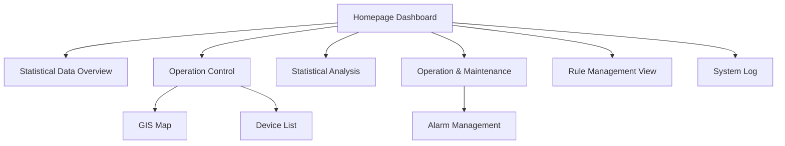
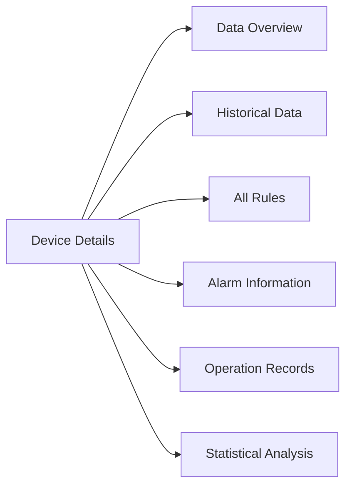
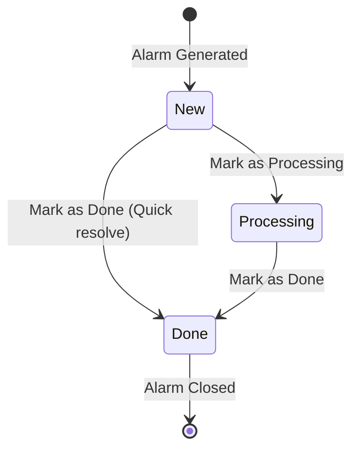

# 🖥️ Dashboard Interface

> Frontend dashboard features, operation control, và statistical analysis


**Platform:** SHUNCOM RULR IoT Platform v1.1 | **Last Updated:** January 2025



---

## 🏠 Homepage Dashboard Overview

### Dashboard Architecture


**Navigation**: `Homepage > [Section]`

---

## 📊 Statistical Data Overview

### Dashboard Configuration
```yaml
Configuration Source:
  Location: "2.3.1.2 Display Information"
  Project-based: Data for selected project only
  
Module Options:
  Maximum Modules: 8 (simultaneously displayed)
  Per-project Config: Different modules per project
  Real-time Updates: Auto-refresh enabled
```

### Device Overview Widget
```yaml
Display Features:
  Device Counts:
    - Total devices by category
    - Online vs offline status
    - Active vs inactive devices
    
  Quick Navigation:
    - Click product category
    - Redirect to operation control page
    - Filtered by selected category
```

### Statistical Modules
```yaml
Available Modules:
  1. Device Status Overview:
     - Total count per category
     - Online/offline distribution
     - Status change trends
     
  2. Energy Consumption:
     - Daily/weekly/monthly usage
     - Comparison with plan (ECP)
     - Energy saving rate
     
  3. Lighting Schedule:
     - Today's on/off times
     - Next switching event
     - Schedule compliance
     
  4. Alarm Summary:
     - Active alarms count
     - Alarm by severity
     - Recent alarm history
     
  5. Weather Integration:
     - Current conditions
     - Sunrise/sunset times
     - Weather forecast
     
  6. Performance Metrics:
     - System uptime
     - Communication success rate
     - Response times
```

---

## 🗺️ Operation Control - GIS Map

### GIS Map Interface
**Navigation**: `Homepage > Operation Control > GIS Map`

#### Display Requirements
```yaml
Prerequisites:
  - GIS map selected during project creation ✅
  - Devices added to project/type/group ✅
  - Devices have latitude/longitude coordinates ✅
  
Display Features:
  - Device distribution visualization
  - Category-specific icons
  - Status-based icon colors
  - Interactive device selection
```

### Device Icon System
```yaml
Icon Categories:
  Smart Gateway: [Gateway icon]
  Light Controller: [Light bulb icon]
  Smart Meter: [Meter icon]
  Distribution Box: [Box icon]
  
Status Colors:
  Online: Green indicator
  Offline: Red indicator
  Warning: Orange indicator
  Inactive: Gray indicator
```

### Map Control Features

#### Smart Light Controller Controls
```yaml
Available Operations:
  Turn On: "Activate light at 100%"
  Turn Off: "Deactivate light"
  Dimming: "Set brightness 1-99%"
  Read Light Data: "Fetch current status"
  Read Version Number: "Get firmware version"
  Read Local Time: "Sync device clock"
  
Group Control:
  - Select multiple devices on map
  - Apply operation to all selected
  - Batch status updates
```

#### Gateway Controls
```yaml
Available Operations:
  Full Circuit Disconnect: "Open all circuits"
  Full Circuit Connect: "Close all circuits"
  Read Local Time: "Sync gateway clock"
  Read Latitude/Longitude: "Get device location"
  
Advanced Features (3rd Gen Gateway):
  Read Three-phase Electricity: "Get power readings"
  Read Circuit Status: "Individual circuit states"
  
Group Control:
  Gateway Group Control: "Control all light controllers under gateway"
```

### Map Interaction Patterns
```yaml
Single Device:
  - Click device icon
  - View device popup info
  - Access quick actions
  - Navigate to device details

Multiple Devices:
  - Draw selection area
  - Multi-select with Ctrl+click
  - Apply group operations
  - Batch status viewing

Navigation:
  - Zoom in/out controls
  - Search by location
  - Search by device name/number
  - Filter by product type
```

---

## 📋 Operation Control - Device List

### Device List Interface
**Navigation**: `Homepage > Operation Control > Device List`

#### List Features
```yaml
View Options:
  All Devices: Complete project device list
  By Product Type: Filtered by category
  
Navigation:
  Double-click: Open device details
  Operation > View: Navigate to details
  
List Capabilities:
  - Pagination for large datasets
  - Column customization
  - Sorting by any column
  - Search and filtering
```

### Device Details Page
**6 Major Sections**



#### Section 1: Data Overview
```yaml
Real-time Status:
  - Current device state
  - Live measurements
  - Connection status
  - Last update timestamp
  
Quick Actions:
  - Send commands
  - Read data
  - Sync device
```

#### Section 2: Historical Data
```yaml
Features:
  - Time-series data display
  - Date range selection
  - Data export to Excel
  - Chart visualizations
  
Data Types:
  - Electrical measurements
  - Environmental readings
  - Status changes
  - Performance metrics
```

#### Section 3: All Rules
```yaml
Rule Types Displayed:
  Platform Rules: Cloud-based automation
  Local Rules: Device-stored rules
  
Local Rule Operations:
  Read Local Rules: "Fetch rules from device"
  Clear Local Rules: "Remove unknown/problematic rules"
  Sync Local Rules: "Redownload rules to device"
```

#### Section 4: Alarm Information
```yaml
Display:
  - All alarms for this device
  - Alarm history timeline
  - Current alarm status
  - Processing status
```

#### Section 5: Operation Records
```yaml
Tracking:
  - Command history
  - User actions logged
  - Timestamp for each action
  - Success/failure status
```

#### Section 6: Statistical Analysis
```yaml
Analytics:
  - Device performance trends
  - Usage patterns
  - Comparison with similar devices
  - Anomaly detection
```

---

## 📈 Statistical Analysis

### Analysis Dashboard
**Navigation**: `Homepage > Statistical Analysis`

#### Project-based Analysis
```yaml
Scope: Selected project devices only
Module Management: Column settings with show/hide
Time Periods: Day, week, month, year views
```

#### Statistical Modules
```yaml
Energy Consumption Analysis:
  - Daily usage charts
  - Weekly comparison
  - Monthly trends
  - Annual overview

Device Performance:
  - Uptime statistics
  - Communication success rate
  - Response time metrics
  - Error frequency

Lighting Statistics:
  - Operating hours
  - Dimming distribution
  - Schedule compliance
  - Energy savings
```

### Report Export Features
```yaml
Quick Export:
  Steps:
    1. Click "Export" button
    2. Select data items (single/multiple)
    3. Choose export time range
    4. Download Excel file
    
Export Options:
  - Selected modules only
  - Custom date range
  - All available data
  - Filtered subset
```

### Individual Module View
```yaml
Enlarged View Features:
  - Click module to expand
  - Full-screen visualization
  - Quick time period selection (day/week/month/year)
  - Detailed data table
  - Export from enlarged view
```

---

## 🔧 Operation & Maintenance

### Alarm Management Interface
**Navigation**: `Homepage > Operation & Maintenance`

#### Three-Dimensional Alarm Display
```yaml
Dimensions:
  Project: Alarm statistics by project
  Type: Alarm breakdown by device type
  Group: Alarm analysis by device group
  
History: Complete alarm history tracking
```

### Alarm Processing Workflow


#### Individual Alarm Processing
```yaml
Process Options:
  Mark as Processing: "Under investigation"
  Mark as Done: "Issue resolved"
  
Actions Available:
  - View alarm details
  - Navigate to device
  - Add processing notes
  - Assign to user
```

#### Batch Operations
```yaml
Batch Processing:
  - Select multiple alarms
  - Apply status change to all
  - Bulk status updates
  - Efficiency for large alarm volumes

Batch Dispatch:
  - Create work orders
  - Assign to maintenance team
  - Track work order status
```

### Alarm Filtering & Export
```yaml
Filter Options:
  Alarm Levels: Critical, Warning, Info
  Alarm Types: Platform, Offline, Device
  Processing Status: New, Processing, Done
  Time Period: Custom date range
  
Export Features:
  - Select time period
  - Apply current filters
  - Export to Excel
  - Include all alarm details
```

---

## 📜 Rule Management View

### Dashboard Rule Display
**Navigation**: `Homepage > Rule Management`

#### Three-Aspect Management
```yaml
Management Views:
  By Project: Rules for selected project
  By Type: Rules for device categories
  By Group: Rules for device groups
```

#### View-Only Interface
```yaml
Capabilities:
  View Content: ✅ See rule configurations
  Change Status: ✅ Enable/disable rules
  Edit Content: ❌ No editing allowed
  
Note: Full editing available in backend "Rule Management" section
```

#### Displayed Information
```yaml
Running Rules:
  - Platform rules status
  - Local rules sync status
  - Execution history
  
Alarm Rules:
  - Active alarm rules
  - Triggered alarms
  - Rule effectiveness
```

---

## 📝 System Log

### Log Interface
**Navigation**: `Homepage > System Log`

#### Log Organization
```yaml
Organization Options:
  By Project: Logs for selected project
  By Type: Logs for device categories
  By Group: Logs for device groups
```

#### Log Contents
```yaml
Operation Records:
  - User actions
  - System operations
  - Device commands
  - Configuration changes
  
Log Details:
  - Timestamp
  - User/system identifier
  - Action type
  - Target device/resource
  - Result status
```

### Log Features
```yaml
Viewing:
  - Chronological display
  - Search functionality
  - Filter by action type
  - Filter by user
  
Export:
  - Date range selection
  - Filtered export
  - Full log download
```

---

## 🎨 UI/UX Design Considerations

### Real-Time Update Requirements
```yaml
Live Updates:
  Device Status: Immediate reflection
  Alarm Notifications: Real-time alerts
  Dashboard Metrics: Auto-refresh
  Map Device States: Live icon updates

Implementation:
  WebSocket: For real-time communication
  Polling: Fallback for compatibility
  Cache: Performance optimization
```

### Performance Considerations
```yaml
Large Dataset Handling:
  Pagination: For device lists (1000+ devices)
  Lazy Loading: For detailed views
  Virtualization: For long lists
  Caching: For frequently accessed data
  
Map Performance:
  Clustering: For dense device areas
  Level of Detail: Based on zoom level
  Progressive Loading: As user navigates
```

### Responsive Design
```yaml
Screen Sizes:
  Desktop: Full feature set
  Tablet: Optimized layout
  Mobile: Essential features
  
Adaptations:
  - Collapsible sidebars
  - Touch-friendly controls
  - Responsive charts
  - Mobile-optimized maps
```

---

## 🔗 Related Documentation

### Technical Implementation
- **[UI Component Library](../08-Development-Guide/UI%20Component%20Library.md)** - Reusable components
- **[[Real-time Architecture]]** - WebSocket implementation
- **[[Performance Optimization]]** - Frontend optimization

### Feature Integration
- **[03-Device Management Hub](../03-Device-Management/03-Device%20Management%20Hub.md)** - Device data source
- **[04-Rule Engine System](../04-Rule-Management/04-Rule%20Engine%20System.md)** - Rule status display
- **[05-Project Management](../05-User-Management/05-Project%20Management.md)** - Project dashboard config

---

**Next Steps**: Review [Feature Requirements Checklist](../Feature%20Requirements%20Checklist.md) for implementation priorities and [UI Component Library](../08-Development-Guide/UI%20Component%20Library.md) for reusable interface elements.