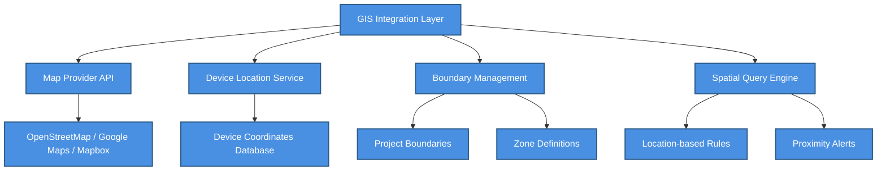

# 🗺️ GIS Setup Guide

> Complete guide for configuring GIS map integration, coordinates, boundaries, and location-based device management


**Platform:** SHUNCOM RULR IoT Platform v1.1 | **Last Updated:** January 2025



---

## 📋 Overview

### What is GIS Integration?

GIS (Geographic Information System) integration enables:
- Visual device distribution on interactive maps
- Location-based device management and control
- Geographic clustering and zone management
- Spatial analysis for device performance
- Route planning for maintenance operations

### GIS Architecture


    classDef default fill:#4A90E2,stroke:#2E5C8A,stroke-width:2px,color:#fff
    classDef primary fill:#7B68EE,stroke:#5A4FC4,stroke-width:2px,color:#fff
    classDef success fill:#50C878,stroke:#3A9B5C,stroke-width:2px,color:#fff
    classDef warning fill:#FFA500,stroke:#CC8400,stroke-width:2px,color:#fff
    classDef danger fill:#FF6B6B,stroke:#CC5555,stroke-width:2px,color:#fff


---

## 🚀 Initial GIS Configuration

### Step 1: Enable GIS for Project

```yaml
Project Creation Settings:
  1. Navigate: Backend > Project Management > Add Project
  2. Enable GIS: Toggle "GIS Map Integration" to ON
  3. Select Map Provider: Choose from available providers
  4. Set Default View:
     - Center Latitude: Project center point
     - Center Longitude: Project center point
     - Default Zoom Level: 12-16 recommended
```

### Step 2: Configure Map Provider

#### OpenStreetMap (Free)
```yaml
Configuration:
  Provider: OpenStreetMap
  Tile Server: https://tile.openstreetmap.org/{z}/{x}/{y}.png
  Attribution: "© OpenStreetMap contributors"
  
Advantages:
  - Free to use
  - Global coverage
  - Community maintained
  
Limitations:
  - Basic styling options
  - No traffic data
  - Limited satellite imagery
```

#### Google Maps (Commercial)
```yaml
Configuration:
  Provider: Google Maps
  API Key: [Your Google Maps API Key]
  Map Types:
    - roadmap: Default street view
    - satellite: Aerial imagery
    - hybrid: Satellite + labels
    - terrain: Topographic view
    
Required APIs:
  - Maps JavaScript API
  - Geocoding API (optional)
  - Places API (optional)
```

#### Mapbox (Commercial)
```yaml
Configuration:
  Provider: Mapbox
  Access Token: [Your Mapbox Token]
  Style Options:
    - mapbox://styles/mapbox/streets-v12
    - mapbox://styles/mapbox/satellite-v9
    - mapbox://styles/mapbox/dark-v11
    - Custom styles available
    
Features:
  - Custom map styling
  - 3D buildings
  - Real-time traffic
  - High-resolution imagery
```

### Step 3: Define Project Boundaries

```yaml
Boundary Configuration:
  Purpose: Define geographic scope of project
  
Methods:
  1. Rectangle Bounds:
     - Northwest Corner: [lat, lng]
     - Southeast Corner: [lat, lng]
     
  2. Polygon Bounds:
     - Define vertices as coordinate array
     - Minimum 3 points required
     - Close polygon (last point = first point)
     
  3. GeoJSON Import:
     - Upload boundary file
     - Support for MultiPolygon
     - Standard GeoJSON format
```

#### Example: Rectangle Bounds
```json
{
  "bounds": {
    "type": "rectangle",
    "northwest": {
      "latitude": 21.0285,
      "longitude": 105.8542
    },
    "southeast": {
      "latitude": 21.0185,
      "longitude": 105.8642
    }
  }
}
```

#### Example: Polygon Bounds
```json
{
  "bounds": {
    "type": "polygon",
    "coordinates": [
      [105.8500, 21.0300],
      [105.8700, 21.0300],
      [105.8700, 21.0100],
      [105.8500, 21.0100],
      [105.8500, 21.0300]
    ]
  }
}
```

---

## 📍 Device Coordinate Management

### Adding Coordinates to Devices

#### Method 1: Manual Entry
```yaml
Navigation: Device List > Select Device > Edit > Location Tab

Fields:
  Latitude: 
    Format: Decimal degrees (DD)
    Example: 21.028511
    Range: -90 to 90
    
  Longitude:
    Format: Decimal degrees (DD)
    Example: 105.804817
    Range: -180 to 180
    
  Altitude (Optional):
    Format: Meters above sea level
    Example: 15.5
```

#### Method 2: Map Click Selection
```yaml
Navigation: Device List > Select Device > Edit > Location Tab > "Select on Map"

Steps:
  1. Click "Select on Map" button
  2. Map popup displays
  3. Click desired location
  4. Coordinates auto-populate
  5. Confirm selection
  6. Save device
```

#### Method 3: Batch Import
```yaml
Import Template:
  Columns Required:
    - device_id or device_number
    - latitude
    - longitude
    - altitude (optional)
    
CSV Example:
  device_number,latitude,longitude,altitude
  LC-001,21.028511,105.804817,15
  LC-002,21.028612,105.804918,15
  LC-003,21.028713,105.805019,15
```

#### Method 4: GPS Auto-Detect
```yaml
Supported Devices:
  - 3rd Generation Gateways
  - NB-IoT devices with GPS
  - CAT.1 devices with GPS
  
Configuration:
  1. Enable GPS reporting on device
  2. Device reports coordinates periodically
  3. System auto-updates location
  4. Manual override available
```

### Coordinate Validation Rules

```yaml
Validation:
  Latitude:
    - Must be numeric
    - Range: -90.000000 to 90.000000
    - Precision: 6 decimal places recommended
    
  Longitude:
    - Must be numeric
    - Range: -180.000000 to 180.000000
    - Precision: 6 decimal places recommended
    
  Within Bounds:
    - Warning if outside project boundaries
    - Optional: Reject devices outside bounds
    
  Duplicate Detection:
    - Warning for identical coordinates
    - Minimum distance: 1 meter apart
```

---

## 🗂️ Zone and Area Management

### Creating Zones

```yaml
Zone Definition:
  Purpose: Group devices by geographic area
  
Zone Types:
  1. Administrative Zones:
     - Districts
     - Wards
     - Streets
     
  2. Functional Zones:
     - Main roads
     - Residential areas
     - Commercial districts
     - Industrial zones
     
  3. Maintenance Zones:
     - Team coverage areas
     - Priority zones
     - Scheduled maintenance areas
```

### Zone Configuration

```yaml
Zone Properties:
  zone_id: Unique identifier
  zone_name: Display name
  zone_type: administrative | functional | maintenance
  boundary: GeoJSON polygon
  parent_zone: Optional parent reference
  properties:
    color: Display color on map
    opacity: Fill opacity (0-1)
    priority: Zone priority level
    assigned_team: Maintenance team
```

#### Example: Zone Definition
```json
{
  "zone_id": "zone-001",
  "zone_name": "District A - Main Street",
  "zone_type": "functional",
  "boundary": {
    "type": "Polygon",
    "coordinates": [[
      [105.8500, 21.0300],
      [105.8550, 21.0300],
      [105.8550, 21.0250],
      [105.8500, 21.0250],
      [105.8500, 21.0300]
    ]]
  },
  "properties": {
    "color": "#3388ff",
    "opacity": 0.3,
    "priority": "high",
    "assigned_team": "team-north"
  }
}
```

### Auto-Assignment Rules

```yaml
Device-to-Zone Assignment:
  Mode: automatic | manual | hybrid
  
Automatic Rules:
  - Device coordinates checked against zone boundaries
  - Device assigned to smallest containing zone
  - Re-evaluated on coordinate change
  
Manual Override:
  - Administrators can manually assign
  - Override persists until removed
  - Audit trail maintained
```

---

## 🎨 Map Display Configuration

### Device Icon Configuration

```yaml
Icon System:
  Base Icons:
    gateway: gateway-icon.svg
    light_controller: light-icon.svg
    smart_fixture: fixture-icon.svg
    smart_pole: pole-icon.svg
    distribution_box: box-icon.svg
    loop_controller: loop-icon.svg
    smart_meter: meter-icon.svg
    
  Status Indicators:
    online: Green glow/border
    offline: Red glow/border
    warning: Orange glow/border
    inactive: Gray, reduced opacity
    
  Icon Sizes:
    default: 32x32 pixels
    selected: 48x48 pixels
    clustered: Dynamic based on count
```

### Status Color Scheme

```yaml
Color Definitions:
  online:
    primary: "#22c55e"  # Green
    glow: "0 0 10px rgba(34, 197, 94, 0.5)"
    
  offline:
    primary: "#ef4444"  # Red
    glow: "0 0 10px rgba(239, 68, 68, 0.5)"
    
  warning:
    primary: "#f97316"  # Orange
    glow: "0 0 10px rgba(249, 115, 22, 0.5)"
    
  inactive:
    primary: "#9ca3af"  # Gray
    opacity: 0.6
```

### Clustering Configuration

```yaml
Clustering Rules:
  Enable At:
    - More than 50 devices in viewport
    - Zoom level < 15
    
  Cluster Display:
    - Circle with device count
    - Color based on majority status
    - Click to expand/zoom
    
  Cluster Radius:
    - Adjustable: 40-120 pixels
    - Recommended: 80 pixels
    
  Spiderfy:
    - Enable for overlapping devices
    - Max spider legs: 10
    - Animation duration: 200ms
```

### Layer Configuration

```yaml
Map Layers:
  Base Layers (select one):
    - Street Map
    - Satellite
    - Hybrid
    - Terrain
    
  Overlay Layers (toggle):
    - Device Icons: ✅ Default ON
    - Zone Boundaries: ✅ Default ON
    - Project Boundary: ⬜ Default OFF
    - Heat Map: ⬜ Default OFF
    - Connection Lines: ⬜ Default OFF
    
  Layer Controls:
    - Position: Top-right corner
    - Collapsed by default
    - Expand on hover
```

---

## 🔍 Map Search and Navigation

### Device Search

```yaml
Search Methods:
  1. By Device Number:
     - Exact match
     - Partial match with wildcard
     
  2. By Device Name:
     - Full-text search
     - Case insensitive
     
  3. By Address:
     - Geocoding search
     - Returns nearby devices
     
  4. By Coordinates:
     - Direct lat/lng input
     - Center map and highlight nearby
```

### Navigation Controls

```yaml
Map Controls:
  Zoom:
    - Scroll wheel zoom
    - +/- buttons
    - Double-click zoom
    - Pinch zoom (touch)
    
  Pan:
    - Click and drag
    - Keyboard arrows
    - Touch drag
    
  Rotation:
    - Right-click drag (if enabled)
    - Two-finger rotate (touch)
    
  Tilt (3D):
    - Ctrl + drag (if enabled)
    - Three-finger gesture (touch)
```

### Quick Navigation Features

```yaml
Navigation Shortcuts:
  Fit to Project: Show all project devices
  Fit to Zone: Show all zone devices
  Fit to Selection: Show selected devices
  Go to Device: Center on specific device
  My Location: Center on user's location (if permitted)
  
Bookmarks:
  - Save current view as bookmark
  - Name and organize bookmarks
  - Quick access from dropdown
```

---

## 📊 Location-Based Features

### Heat Map Visualization

```yaml
Heat Map Options:
  Data Sources:
    - Device Density: Concentration of devices
    - Alarm Frequency: Problem hotspots
    - Energy Consumption: Usage patterns
    - Offline Devices: Reliability issues
    
  Configuration:
    radius: 25  # Influence radius in pixels
    blur: 15    # Edge blur
    max: 1.0    # Maximum intensity
    gradient:
      0.0: "blue"
      0.5: "lime"
      1.0: "red"
```

### Distance and Area Tools

```yaml
Measurement Tools:
  Distance:
    - Click points to measure
    - Shows distance in meters/km
    - Supports multiple waypoints
    
  Area:
    - Draw polygon to measure
    - Shows area in m²/km²
    - Device count within area
    
  Radius:
    - Click center, drag radius
    - Shows radius distance
    - Lists devices within radius
```

### Route Planning

```yaml
Route Features:
  Maintenance Routes:
    - Select devices to visit
    - Optimize route order
    - Estimate travel time
    - Export to navigation app
    
  Route Display:
    - Numbered waypoints
    - Connecting lines
    - Distance labels
    - Turn-by-turn (optional)
```

---

## 🔗 GIS-Rule Integration

### Location-Based Rules

```yaml
Rule Types:
  1. Geofence Rules:
     Trigger: Device enters/exits zone
     Actions: Alert, command, notification
     
  2. Proximity Rules:
     Trigger: Devices within distance
     Actions: Group commands, sync operations
     
  3. Coverage Rules:
     Trigger: Zone device status threshold
     Actions: Escalation, bulk commands
```

#### Example: Geofence Alert Rule
```yaml
Rule Configuration:
  name: "Gateway Left Zone Alert"
  type: geofence
  
  trigger:
    event: device_exit
    zone: "zone-001"
    device_type: gateway
    
  actions:
    - type: alarm
      level: critical
      message: "Gateway has left designated zone"
    - type: notification
      recipients: ["admin@example.com"]
```

### Zone-Based Scheduling

```yaml
Schedule by Zone:
  Example: Staggered Lighting Schedule
  
  zones:
    - zone_id: "downtown"
      sunset_offset: -15  # 15 min before sunset
      sunrise_offset: +15  # 15 min after sunrise
      
    - zone_id: "residential"
      sunset_offset: 0    # At sunset
      sunrise_offset: 0   # At sunrise
      
    - zone_id: "industrial"
      sunset_offset: -30  # 30 min before sunset
      sunrise_offset: +30  # 30 min after sunrise
```

---

## 🔧 Troubleshooting GIS Issues

### Common Problems

| Issue | Cause | Solution |
|-------|-------|----------|
| Map not loading | API key invalid | Verify API key configuration |
| Devices not showing | Missing coordinates | Add lat/lng to devices |
| Wrong device positions | Coordinate format | Use decimal degrees (DD) |
| Slow map performance | Too many devices | Enable clustering |
| Boundary not displaying | Invalid GeoJSON | Validate polygon closure |
| Search not working | Geocoding disabled | Enable geocoding API |

### Coordinate Format Conversion

```yaml
Format Conversions:
  DMS to DD:
    Input: 21° 1' 42.64" N, 105° 48' 17.34" E
    Formula: DD = D + M/60 + S/3600
    Output: 21.028511, 105.804817
    
  UTM to DD:
    Input: 48N 584234 2326456
    Use: UTM conversion library
    Output: Lat/Lng pair
    
  MGRS to DD:
    Input: 48QWM8423426456
    Use: MGRS conversion library
    Output: Lat/Lng pair
```

### Performance Optimization

```yaml
Optimization Strategies:
  1. Enable Clustering:
     - Reduces rendered markers
     - Improves pan/zoom performance
     
  2. Viewport Loading:
     - Only load visible devices
     - Progressive loading on pan
     
  3. Icon Caching:
     - Cache SVG icons locally
     - Reduce network requests
     
  4. Tile Caching:
     - Enable browser tile cache
     - Consider offline tile storage
```

---

## 🔗 Related Documentation

### Configuration Guides
- **[05-Project Management](../05-User-Management/05-Project%20Management.md)** - Project setup with GIS
- **[03-Device Management Hub](../03-Device-Management/03-Device%20Management%20Hub.md)** - Device coordinate management
- **[06-Dashboard Interface](06-Dashboard%20Interface.md)** - Map interface in dashboard

### Technical References
- **[Integration Guide](../02-System-Architecture/Integration%20Guide.md)** - Map provider integration
- **[API Endpoints Map](../02-System-Architecture/API%20Endpoints%20Map.md)** - GIS-related API endpoints
- **[Performance Benchmarks](../08-Development-Guide/Performance%20Benchmarks.md)** - Map performance targets

### Rule Integration
- **[04-Rule Engine System](../04-Rule-Management/04-Rule%20Engine%20System.md)** - Location-based rule setup
- **[Rule Configuration Patterns](../04-Rule-Management/Rule%20Configuration%20Patterns.md)** - Geofence rule patterns

---

**Next Steps**: After configuring GIS, proceed to [06-Dashboard Interface](06-Dashboard%20Interface.md) to customize the map display in your dashboard, or explore [Rule Configuration Patterns](../04-Rule-Management/Rule%20Configuration%20Patterns.md) for location-based automation.
