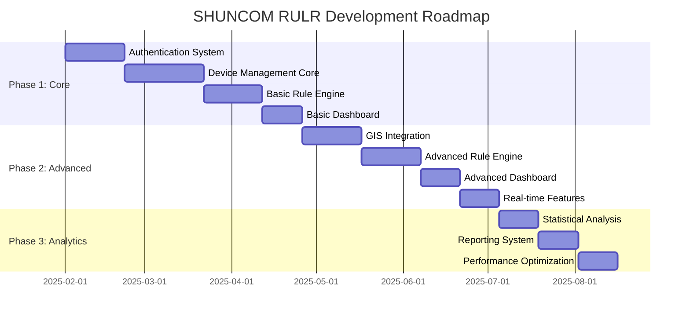

# 🚀 Development Roadmap

> Implementation timeline, priorities, và development phases cho SHUNCOM RULR IoT Platform


**Platform:** SHUNCOM RULR IoT Platform v1.1 | **Last Updated:** January 2025



---

## 📋 Implementation Overview

### Three-Phase Development Strategy


---

## 🎯 Phase 1: Core Infrastructure (8-12 weeks)

### Priority: CRITICAL ⭐⭐⭐⭐⭐

### 1.1 Authentication & User Management (Weeks 1-3)

#### Sprint 1: Basic Authentication
```yaml
Week 1 Deliverables:
  - Login page UI
  - JWT token implementation
  - Session management
  - Password validation
  
Dependencies: None
Complexity: Medium
Team: 2 Backend + 1 Frontend
```

#### Sprint 2: User & Role Management
```yaml
Week 2-3 Deliverables:
  - User CRUD operations
  - Role management system
  - Permission assignment UI
  - Management scope configuration
  - Organization settings
  
Dependencies: Basic auth complete
Complexity: High
Team: 2 Backend + 2 Frontend
```

### 1.2 Device Management Core (Weeks 4-7)

#### Sprint 3-4: Device Registration
```yaml
Week 4-5 Deliverables:
  - 7 device category support
  - Device configuration forms
  - Device association logic
  - Batch import system (5000 limit)
  - Batch export functionality
  
Dependencies: User management complete
Complexity: High
Team: 2 Backend + 2 Frontend
```

#### Sprint 5-6: Device Lifecycle
```yaml
Week 6-7 Deliverables:
  - Device status monitoring
  - Device relationship management
  - Recycle bin system
  - Device group management
  - Multicast group support
  
Dependencies: Device registration complete
Complexity: High
Team: 2 Backend + 1 Frontend
```

### 1.3 Basic Rule Engine (Weeks 8-10)

#### Sprint 7-8: Platform Rules
```yaml
Week 8-9 Deliverables:
  - Rule configuration interface
  - Trigger condition types (5 types)
  - Execute action types (3 types)
  - Device/group selection
  - Rule scheduling system
  
Dependencies: Device management complete
Complexity: Very High
Team: 2 Backend + 2 Frontend
```

#### Sprint 9: Local Rules & Basic Alarms
```yaml
Week 10 Deliverables:
  - Local rule configuration
  - Rule synchronization system
  - Basic platform alarms
  - Offline alarm detection
  - Device alarm processing
  
Dependencies: Platform rules complete
Complexity: High
Team: 2 Backend + 1 Frontend
```

### 1.4 Basic Dashboard (Weeks 11-12)

#### Sprint 10: Homepage Dashboard
```yaml
Week 11-12 Deliverables:
  - Statistical data overview
  - Device list interface
  - Device details page (6 sections)
  - Basic device control
  - System log viewer
  
Dependencies: All Phase 1 features
Complexity: Medium
Team: 1 Backend + 2 Frontend
```

### Phase 1 Milestones
```yaml
Milestone 1 (Week 3):
  ✅ Users can login and manage accounts
  ✅ Roles and permissions working
  
Milestone 2 (Week 7):
  ✅ All 7 device types configurable
  ✅ Batch operations functional
  ✅ Device relationships established
  
Milestone 3 (Week 10):
  ✅ Platform rules executing
  ✅ Local rules syncing to devices
  ✅ Basic alarms generating
  
Milestone 4 (Week 12):
  ✅ Dashboard displaying data
  ✅ Basic device control working
  ✅ Phase 1 Complete - MVP Ready
```

---

## 🔧 Phase 2: Advanced Features (6-10 weeks)

### Priority: HIGH ⭐⭐⭐⭐

### 2.1 GIS Integration (Weeks 13-15)

#### Sprint 11-12: Map Integration
```yaml
Week 13-14 Deliverables:
  - GIS map component integration
  - Device positioning interface
  - Single device distribution
  - Batch device distribution (path drawing)
  - Coordinate fine-tuning
  
Dependencies: Phase 1 complete
Complexity: High
Team: 1 Backend + 2 Frontend
```

#### Sprint 13: Location Features
```yaml
Week 15 Deliverables:
  - Sunrise/sunset calculations
  - Location-based rule triggers
  - Address geocoding
  - Map search functionality
  
Dependencies: Map integration
Complexity: Medium
Team: 1 Backend + 1 Frontend
```

### 2.2 Advanced Rule Engine (Weeks 16-18)

#### Sprint 14-15: Complex Rules
```yaml
Week 16-17 Deliverables:
  - Multi-condition combinations
  - Advanced time triggers
  - Rule templates system
  - Rule conflict detection
  - Rule performance optimization
  
Dependencies: GIS integration
Complexity: Very High
Team: 2 Backend + 1 Frontend
```

#### Sprint 16: Advanced Alarms
```yaml
Week 18 Deliverables:
  - Multi-dimensional alarm filtering
  - Automatic alarm handling
  - Notification system (Email/SMS/Push)
  - Receiving group management
  - Alarm escalation workflows
  
Dependencies: Complex rules
Complexity: High
Team: 2 Backend + 1 Frontend
```

### 2.3 Advanced Dashboard (Weeks 19-20)

#### Sprint 17: Enhanced Control
```yaml
Week 19 Deliverables:
  - GIS-based device control
  - Map group operations
  - Advanced device details
  - Operation history tracking
  
Dependencies: GIS + Advanced rules
Complexity: Medium
Team: 1 Backend + 2 Frontend
```

### 2.4 Real-time Features (Weeks 21-22)

#### Sprint 18: Live Monitoring
```yaml
Week 20-22 Deliverables:
  - WebSocket implementation
  - Live device status updates
  - Real-time alarm notifications
  - Dynamic chart updates
  - Connection status monitoring
  
Dependencies: Advanced dashboard
Complexity: High
Team: 2 Backend + 1 Frontend
```

### Phase 2 Milestones
```yaml
Milestone 5 (Week 15):
  ✅ GIS map fully functional
  ✅ Device distribution working
  ✅ Location-based triggers active
  
Milestone 6 (Week 18):
  ✅ Complex rule combinations working
  ✅ Full notification system operational
  ✅ Alarm automation complete
  
Milestone 7 (Week 22):
  ✅ Real-time updates throughout platform
  ✅ Advanced controls operational
  ✅ Phase 2 Complete - Full Feature Set
```

---

## 📊 Phase 3: Analytics & Optimization (4-6 weeks)

### Priority: MEDIUM ⭐⭐⭐

### 3.1 Statistical Analysis (Weeks 23-24)

#### Sprint 19: Analytics Dashboard
```yaml
Week 23-24 Deliverables:
  - Energy consumption analysis
  - Device performance trends
  - Usage pattern identification
  - Comparison analytics
  - KPI monitoring dashboard
  
Dependencies: Phase 2 complete
Complexity: Medium
Team: 1 Backend + 2 Frontend
```

### 3.2 Reporting System (Weeks 25-26)

#### Sprint 20: Report Generation
```yaml
Week 25-26 Deliverables:
  - Automated report scheduling
  - Custom report builder
  - Multiple export formats
  - Report template system
  - Data visualization options
  
Dependencies: Analytics dashboard
Complexity: Medium
Team: 1 Backend + 1 Frontend
```

### 3.3 Performance Optimization (Weeks 27-28)

#### Sprint 21: System Optimization
```yaml
Week 27-28 Deliverables:
  - Database query optimization
  - Caching implementation
  - Frontend performance tuning
  - API response optimization
  - Load testing and fixes
  
Dependencies: Full system operational
Complexity: Medium
Team: 2 Backend + 1 Frontend
```

### Phase 3 Milestones
```yaml
Milestone 8 (Week 24):
  ✅ Analytics providing insights
  ✅ Performance metrics tracked
  
Milestone 9 (Week 26):
  ✅ Automated reporting operational
  ✅ Custom reports available
  
Milestone 10 (Week 28):
  ✅ System optimized for production
  ✅ Phase 3 Complete - Production Ready
```

---

## 📈 Risk Management

### High-Risk Areas
```yaml
Device Communication:
  Risk: Protocol compatibility issues
  Mitigation: Early device testing, mock devices for development
  Contingency: Protocol adapter layer
  
Rule Engine Complexity:
  Risk: Performance degradation with many rules
  Mitigation: Rule execution optimization, caching
  Contingency: Rule prioritization system
  
GIS Integration:
  Risk: Map service reliability, costs
  Mitigation: Multiple provider support, offline fallback
  Contingency: Simplified coordinate-only mode
  
Real-time Scalability:
  Risk: WebSocket connection limits
  Mitigation: Connection pooling, message queuing
  Contingency: Polling fallback mechanism
```

### Dependency Risks
```yaml
External Services:
  - GIS map providers
  - SMS/Email services
  - Weather APIs
  
Mitigation Strategies:
  - Abstract provider interfaces
  - Fallback provider options
  - Graceful degradation
```

---

## 👥 Team Requirements

### Recommended Team Structure
```yaml
Core Team:
  Backend Developers: 3-4
  Frontend Developers: 2-3
  DevOps Engineer: 1
  QA Engineer: 1
  UI/UX Designer: 1 (part-time)
  Project Manager: 1
  
Skill Requirements:
  Backend:
    - Node.js/Python/Go
    - Database design (PostgreSQL/MongoDB)
    - WebSocket implementation
    - IoT protocols (MQTT, HTTP)
    
  Frontend:
    - React/Vue.js
    - Real-time UI updates
    - GIS/mapping libraries
    - Responsive design
    
  DevOps:
    - Docker/Kubernetes
    - CI/CD pipelines
    - Cloud platforms
    - Monitoring tools
```

---

## 🛠️ Technology Recommendations

### Tech Stack Proposal
```yaml
Frontend:
  Framework: React 18+ with TypeScript
  State Management: Redux Toolkit or Zustand
  UI Library: Ant Design or MUI
  Charts: ECharts or Recharts
  Maps: Leaflet or Mapbox GL
  Real-time: Socket.io client
  
Backend:
  Runtime: Node.js 18+ or Python 3.10+
  Framework: NestJS or FastAPI
  Database: PostgreSQL + Redis
  Real-time: Socket.io or WebSocket
  Message Queue: RabbitMQ or Redis Pub/Sub
  
Infrastructure:
  Container: Docker
  Orchestration: Kubernetes (production)
  CI/CD: GitHub Actions or GitLab CI
  Monitoring: Prometheus + Grafana
  Logging: ELK Stack or Loki
```

---

## 📋 Success Criteria

### Phase Completion Criteria
```yaml
Phase 1 Success:
  - All authentication features working
  - 7 device types fully supported
  - Basic rules executing correctly
  - Dashboard showing real data
  - No critical bugs
  
Phase 2 Success:
  - GIS integration complete
  - Complex rules functional
  - Real-time updates working
  - All notifications delivering
  - Performance acceptable
  
Phase 3 Success:
  - Analytics providing value
  - Reports generating correctly
  - System optimized
  - Production-ready quality
  - Documentation complete
```

### Quality Gates
```yaml
Code Quality:
  - Unit test coverage > 70%
  - Integration tests passing
  - No security vulnerabilities
  - Code review approved
  
Performance:
  - API response < 500ms (95th percentile)
  - Dashboard load < 3 seconds
  - Real-time delay < 2 seconds
  - Support 1000+ concurrent users
```

---

## 🔗 Related Documentation

### Planning Resources
- **[Feature Requirements Checklist](../Feature%20Requirements%20Checklist.md)** - Detailed requirements
- **[Testing Scenarios](../08-Development-Guide/Testing%20Scenarios.md)** - QA planning
- **[Performance Benchmarks](../08-Development-Guide/Performance%20Benchmarks.md)** - Performance targets

### Technical Guides
- **[01-System Overview](../01-Overview/01-System%20Overview.md)** - Architecture reference
- **[03-Device Management Hub](../03-Device-Management/03-Device%20Management%20Hub.md)** - Device implementation details
- **[04-Rule Engine System](../04-Rule-Management/04-Rule%20Engine%20System.md)** - Rule engine specifications

---

**Next Steps**: Review [Feature Requirements Checklist](../Feature%20Requirements%20Checklist.md) and begin Phase 1 Sprint 1 planning. Ensure team is assembled and development environment is ready.