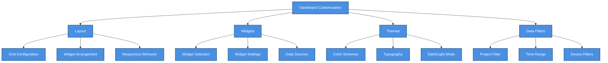

# 🎨 Dashboard Customization Guide

> Complete guide for customizing dashboard layouts, widgets, themes, and user preferences


**Platform:** SHUNCOM RULR IoT Platform v1.1 | **Last Updated:** January 2025



---

## 📋 Customization Overview

### What Can Be Customized?


    classDef default fill:#4A90E2,stroke:#2E5C8A,stroke-width:2px,color:#fff
    classDef primary fill:#7B68EE,stroke:#5A4FC4,stroke-width:2px,color:#fff
    classDef success fill:#50C878,stroke:#3A9B5C,stroke-width:2px,color:#fff
    classDef warning fill:#FFA500,stroke:#CC8400,stroke-width:2px,color:#fff
    classDef danger fill:#FF6B6B,stroke:#CC5555,stroke-width:2px,color:#fff


### Customization Levels

| Level | Scope | Persistence | Managed By |
|-------|-------|-------------|------------|
| **System Default** | All users | Permanent | Administrator |
| **Project Default** | Project users | Per-project | Project Admin |
| **User Preference** | Individual user | Per-user | User |
| **Session Temp** | Current session | Non-persistent | User |

---

## 🏗️ Layout Configuration

### Grid System

```yaml
Grid Specifications:
  Columns: 12 (desktop), 8 (tablet), 4 (mobile)
  Row Height: 80px (configurable)
  Gap: 16px between widgets
  Margin: 24px dashboard padding
  
Widget Sizing:
  Minimum: 1 column × 1 row
  Maximum: 12 columns × unlimited rows
  Snap: Widgets snap to grid
```

### Default Layouts

#### Executive Overview Layout
```yaml
Layout Name: Executive Overview
Best For: Management dashboards
Grid Arrangement:
  Row 1:
    - Device Overview (3x2)
    - Energy Consumption (3x2)
    - Alarm Summary (3x2)
    - System Health (3x2)
  Row 2:
    - Energy Trend Chart (6x3)
    - Device Status Distribution (6x3)
  Row 3:
    - Device Map (12x4)
```

#### Operations Center Layout
```yaml
Layout Name: Operations Center
Best For: Control room displays
Grid Arrangement:
  Row 1:
    - Device Map (8x5)
    - Live Alarm Feed (4x5)
  Row 2:
    - Quick Actions (3x2)
    - Dimming Control (3x2)
    - Schedule Overview (3x2)
    - Offline Devices (3x2)
```

#### Analytics Dashboard Layout
```yaml
Layout Name: Analytics Dashboard
Best For: Performance analysis
Grid Arrangement:
  Row 1:
    - Energy Trend Chart (6x3)
    - Performance Metrics (6x3)
  Row 2:
    - Top Consumers (4x3)
    - Alarm Frequency Chart (4x3)
    - Energy Consumption (4x3)
```

### Creating Custom Layouts

#### Step 1: Enter Edit Mode
```yaml
Navigation:
  1. Click dashboard menu (⋮ or ≡)
  2. Select "Customize Dashboard"
  3. Dashboard enters edit mode
  
Edit Mode Indicators:
  - Grid lines visible
  - Widgets show drag handles
  - Toolbar appears at top
```

#### Step 2: Add Widgets
```yaml
Adding Widgets:
  Method 1: Widget Panel
    1. Click "+ Add Widget" button
    2. Browse widget categories
    3. Click widget to add
    4. Widget appears in available space
    
  Method 2: Drag from Panel
    1. Open widget panel
    2. Drag widget to desired position
    3. Drop on grid
```

#### Step 3: Arrange Widgets
```yaml
Moving Widgets:
  - Click and drag widget header
  - Blue outline shows drop position
  - Widgets reflow automatically
  
Resizing Widgets:
  - Drag corner/edge handles
  - Minimum size enforced per widget
  - Maximum size: full grid width
  
Removing Widgets:
  - Click widget menu (⋮)
  - Select "Remove Widget"
  - Or drag to trash zone
```

#### Step 4: Save Layout
```yaml
Save Options:
  Save: Update current layout
  Save As: Create new named layout
  Save as Default: Set for all users (admin only)
  
Saving:
  1. Click "Save" button
  2. Enter layout name (if Save As)
  3. Confirm save
```

### Layout Templates

```yaml
Available Templates:
  - Blank Canvas: Empty 12-column grid
  - Executive Overview: High-level KPIs
  - Operations Center: Real-time control
  - Analytics Dashboard: Data analysis
  - Compact View: Minimal, dense display
  - Mobile Optimized: Touch-friendly
  
Using Templates:
  1. Enter edit mode
  2. Click "Templates"
  3. Preview template
  4. Click "Apply Template"
  5. Customize as needed
```

---

## 🧩 Widget Configuration

### Accessing Widget Settings

```yaml
Open Settings:
  Method 1: Widget menu (⋮) > Settings
  Method 2: Double-click widget header
  Method 3: Right-click widget > Configure
  
Settings Panel:
  - Appears as sidebar or modal
  - Changes preview in real-time
  - Apply/Cancel buttons
```

### Common Widget Settings

#### Display Settings
```yaml
Title Configuration:
  title: string              # Custom title text
  title_visible: boolean     # Show/hide title bar
  title_alignment: "left" | "center" | "right"
  
Appearance:
  background: string         # Background color or "transparent"
  border: "none" | "thin" | "medium" | "thick"
  border_radius: number      # Corner rounding (px)
  shadow: "none" | "small" | "medium" | "large"
  padding: "compact" | "normal" | "spacious"
```

#### Data Settings
```yaml
Data Source:
  auto_refresh: boolean      # Enable automatic refresh
  refresh_interval: number   # Seconds between refreshes
  
Filters:
  project_filter: string[]   # Limit to specific projects
  device_type_filter: string[] # Limit to device types
  group_filter: string[]     # Limit to device groups
  
Time Range:
  time_range_type: "relative" | "absolute"
  relative_range: "today" | "24h" | "7d" | "30d" | "custom"
  absolute_start: datetime
  absolute_end: datetime
```

#### Interaction Settings
```yaml
Click Behavior:
  click_action: "none" | "navigate" | "expand" | "filter"
  navigate_to: string        # Target page/route
  
Hover Behavior:
  show_tooltip: boolean
  tooltip_delay: number      # ms before showing
  
Drill-down:
  enable_drilldown: boolean
  drilldown_target: string   # Detail view
```

### Widget-Specific Settings

#### Chart Widgets
```yaml
Chart Configuration:
  chart_type: "line" | "bar" | "area" | "pie" | "donut"
  
  Colors:
    color_scheme: "default" | "monochrome" | "gradient" | "custom"
    custom_colors: string[]  # Hex color array
    
  Axes:
    show_x_axis: boolean
    show_y_axis: boolean
    x_axis_label: string
    y_axis_label: string
    y_axis_min: number | "auto"
    y_axis_max: number | "auto"
    
  Legend:
    show_legend: boolean
    legend_position: "top" | "bottom" | "left" | "right"
    
  Data Labels:
    show_values: boolean
    value_format: "number" | "percent" | "currency"
    decimal_places: number
```

#### Map Widgets
```yaml
Map Configuration:
  Map Provider:
    provider: "osm" | "google" | "mapbox"
    style: string            # Map style ID
    
  View:
    center_latitude: number
    center_longitude: number
    zoom_level: number
    
  Markers:
    show_markers: boolean
    cluster_markers: boolean
    cluster_threshold: number
    marker_size: "small" | "medium" | "large"
    
  Layers:
    show_zones: boolean
    show_heatmap: boolean
    show_routes: boolean
    
  Controls:
    show_zoom_controls: boolean
    show_layer_switcher: boolean
    enable_fullscreen: boolean
```

#### List Widgets
```yaml
List Configuration:
  Display:
    items_per_page: number
    show_pagination: boolean
    row_height: "compact" | "normal" | "comfortable"
    
  Columns:
    visible_columns: string[]
    column_order: string[]
    sort_by: string
    sort_direction: "asc" | "desc"
    
  Row Actions:
    show_row_actions: boolean
    available_actions: string[]
```

---

## 🎨 Theme Customization

### Theme Modes

```yaml
Available Modes:
  Light Mode:
    Background: White/Light gray
    Text: Dark gray/Black
    Best for: Well-lit environments
    
  Dark Mode:
    Background: Dark gray/Black
    Text: White/Light gray
    Best for: Low-light, control rooms
    
  Auto Mode:
    Follows: System preference
    Schedule: Optional time-based switching
```

### Color Schemes

```yaml
Default Color Palettes:
  Primary:
    - Blue (Professional): #3B82F6
    - Green (Success): #22C55E
    - Purple (Modern): #8B5CF6
    
  Status Colors:
    online: "#22C55E"   # Green
    offline: "#EF4444"  # Red
    warning: "#F59E0B"  # Amber
    inactive: "#9CA3AF" # Gray
    
  Chart Colors:
    series_1: "#3B82F6" # Blue
    series_2: "#22C55E" # Green
    series_3: "#F59E0B" # Amber
    series_4: "#EF4444" # Red
    series_5: "#8B5CF6" # Purple
```

### Custom Themes

```yaml
Creating Custom Theme:
  1. Navigate: Settings > Themes > Create Theme
  
  2. Define Colors:
     primary_color: string       # Main brand color
     secondary_color: string     # Accent color
     background_color: string    # Page background
     surface_color: string       # Card/widget background
     text_primary: string        # Main text color
     text_secondary: string      # Secondary text color
     
  3. Typography:
     font_family: string         # e.g., "Inter, sans-serif"
     base_font_size: number      # Base size in px
     heading_scale: number       # Heading size multiplier
     
  4. Spacing:
     base_spacing: number        # Base unit in px
     border_radius: number       # Default corner radius
     
  5. Save and Apply:
     - Name your theme
     - Set as personal default
     - Share with organization (admin)
```

### Applying Themes

```yaml
Per-User:
  1. Click user avatar > Preferences
  2. Select Themes tab
  3. Choose theme from list
  4. Theme applies immediately
  
Per-Project:
  1. Navigate: Project Settings > Display
  2. Select default theme for project
  3. Users can override with personal preference
  
Per-Dashboard:
  1. Enter dashboard edit mode
  2. Click Theme button
  3. Select theme for this dashboard only
```

---

## 🔧 Advanced Customization

### Dashboard Templates

#### Creating Templates
```yaml
Steps:
  1. Design dashboard layout
  2. Configure all widgets
  3. Click "Save as Template"
  4. Name and describe template
  5. Set visibility: Personal / Project / System
```

#### Sharing Templates
```yaml
Export Template:
  1. Select template in template manager
  2. Click "Export"
  3. Download JSON file
  
Import Template:
  1. Click "Import Template"
  2. Upload JSON file
  3. Review and apply
```

### Conditional Formatting

```yaml
Value-Based Formatting:
  Widget: Device Overview
  Field: Offline Count
  Rules:
    - Condition: value > 50
      Style: background: red, text: white
    - Condition: value > 20
      Style: background: orange, text: white
    - Condition: value > 0
      Style: background: yellow, text: black
    - Default:
      Style: background: green, text: white
```

### Alert Overlays

```yaml
Critical Alert Overlay:
  Trigger: Critical alarm count > 0
  Display:
    - Red border around dashboard
    - Alert banner at top
    - Optional: Audio notification
    
Configuration:
  enable_overlay: boolean
  overlay_color: string
  show_banner: boolean
  banner_message: string
  enable_sound: boolean
  sound_file: string
```

### Custom Dashboard URLs

```yaml
URL Parameters:
  Base: /dashboard
  
  Layout Selection:
    /dashboard?layout=operations-center
    
  Project Filter:
    /dashboard?project=project-123
    
  Time Range:
    /dashboard?timeRange=24h
    /dashboard?start=2025-01-01&end=2025-01-31
    
  Theme:
    /dashboard?theme=dark
    
  Combined:
    /dashboard?layout=analytics&project=project-123&timeRange=7d&theme=dark
```

---

## 👤 User Preferences

### Personal Dashboard Settings

```yaml
Accessible Via: User Menu > Preferences > Dashboard

Settings:
  Default Layout:
    preferred_layout: string      # Layout to load on login
    remember_last_layout: boolean # Remember last used
    
  Display Preferences:
    density: "compact" | "comfortable" | "spacious"
    animation_enabled: boolean
    real_time_updates: boolean
    
  Notifications:
    show_desktop_notifications: boolean
    notification_sound: boolean
    notification_types: string[]  # Which to show
```

### Saving Widget States

```yaml
Remembered States:
  - Expanded/collapsed state
  - Selected time ranges
  - Applied filters
  - Scroll positions
  - Sort orders
  
Persistence:
  saved_to: "local_storage" | "server"
  sync_across_devices: boolean
```

---

## 📱 Responsive Customization

### Breakpoint Configurations

```yaml
Desktop (>1200px):
  columns: 12
  widget_min_width: 2
  show_all_features: true
  
Tablet (768-1200px):
  columns: 8
  widget_min_width: 2
  collapse_sidebar: true
  simplify_charts: true
  
Mobile (<768px):
  columns: 4
  widget_min_width: 4
  stack_widgets: true
  touch_optimized: true
  hide_complex_widgets: true
```

### Mobile-Specific Layouts

```yaml
Mobile Dashboard:
  - Simplified navigation
  - Swipeable widget carousel
  - Large touch targets
  - Essential widgets only
  - Bottom action bar
  
Recommended Mobile Widgets:
  - Alarm Summary (compact)
  - Quick Actions
  - Device Overview (simplified)
  - Mini Map
```

---

## 🔄 Sync and Backup

### Cross-Device Sync

```yaml
Sync Settings:
  enable_sync: boolean
  sync_includes:
    - layouts: boolean
    - widget_settings: boolean
    - themes: boolean
    - preferences: boolean
    
Conflict Resolution:
  strategy: "newest_wins" | "ask_user" | "merge"
```

### Backup and Restore

```yaml
Backup:
  1. Settings > Dashboard > Backup
  2. Select items to backup
  3. Download JSON/ZIP file
  
Restore:
  1. Settings > Dashboard > Restore
  2. Upload backup file
  3. Select items to restore
  4. Confirm and apply
  
Auto-Backup:
  enabled: boolean
  frequency: "daily" | "weekly"
  retention: number  # Days to keep
```

---

## 🔗 Related Documentation

### Widget Details
- **[Widget Reference](Widget%20Reference.md)** - Complete widget catalog
- **[06-Dashboard Interface](../06-Project-Management/06-Dashboard%20Interface.md)** - Dashboard system overview

### Design Standards
- **[UI Design Guidelines](../08-Development-Guide/UI%20Design%20Guidelines.md)** - Design system standards
- **[UI Component Library](../08-Development-Guide/UI%20Component%20Library.md)** - Available UI components

### User Management
- **[Permission Matrices](../05-User-Management/Permission%20Matrices.md)** - Dashboard access permissions
- **[User Onboarding Guide](../05-User-Management/User%20Onboarding%20Guide.md)** - New user setup

---

**Next Steps**: Review [Widget Reference](Widget%20Reference.md) for detailed widget configurations, or see [UI Design Guidelines](../08-Development-Guide/UI%20Design%20Guidelines.md) for design consistency standards.
