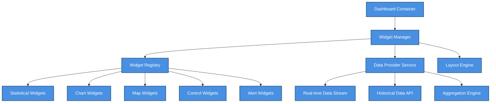

# 📊 Widget Reference

> Complete reference for all dashboard widgets including configuration options, data sources, and customization


**Platform:** SHUNCOM RULR IoT Platform v1.1 | **Last Updated:** January 2025



---

## 📋 Widget Overview

### Widget System Architecture


    classDef default fill:#4A90E2,stroke:#2E5C8A,stroke-width:2px,color:#fff
    classDef primary fill:#7B68EE,stroke:#5A4FC4,stroke-width:2px,color:#fff
    classDef success fill:#50C878,stroke:#3A9B5C,stroke-width:2px,color:#fff
    classDef warning fill:#FFA500,stroke:#CC8400,stroke-width:2px,color:#fff
    classDef danger fill:#FF6B6B,stroke:#CC5555,stroke-width:2px,color:#fff


### Widget Categories

| Category | Purpose | Refresh Rate |
|----------|---------|--------------|
| **Statistical** | Numeric KPIs and counts | 30s - 5min |
| **Chart** | Time-series and comparisons | 1min - 15min |
| **Map** | Geographic visualization | Real-time |
| **Control** | Quick device operations | On-demand |
| **Alert** | Alarm notifications | Real-time |
| **List** | Tabular data display | 1min - 5min |

---

## 📈 Statistical Widgets

### 1. Device Overview Widget

```yaml
Widget ID: device-overview
Category: Statistical
Size Options: 1x1, 2x1, 2x2

Display Features:
  Total Devices: Count by category
  Online Count: Active devices
  Offline Count: Disconnected devices
  Status Percentage: Online/total ratio
  
Data Source:
  API: /api/v1/devices/statistics
  Refresh: 60 seconds
  
Configuration Options:
  show_categories: boolean  # Show breakdown by type
  show_percentages: boolean # Show percentage bars
  click_navigation: boolean # Navigate to device list on click
  highlight_offline: boolean # Emphasize offline count
```

#### Visual Layout
```
┌─────────────────────────────────┐
│     Device Overview             │
├─────────────────────────────────┤
│  🌐 Total Devices    1,247      │
│  ✅ Online           1,198 (96%)│
│  ❌ Offline            49  (4%) │
├─────────────────────────────────┤
│  Gateway      │████████░░│  45  │
│  Controller   │█████████░│ 892  │
│  Meter        │███████░░░│ 310  │
└─────────────────────────────────┘
```

### 2. Energy Consumption Widget

```yaml
Widget ID: energy-consumption
Category: Statistical
Size Options: 2x1, 2x2, 3x2

Display Features:
  Current Usage: Today's consumption (kWh)
  Comparison: vs Yesterday / Last Week / Plan
  Savings Rate: Energy saving percentage
  Cost Estimate: Based on tariff rates
  
Data Source:
  API: /api/v1/energy/current
  Refresh: 300 seconds (5 min)
  
Configuration Options:
  comparison_period: "yesterday" | "last_week" | "last_month" | "plan"
  show_cost: boolean
  currency: "VND" | "USD" | "EUR"
  tariff_rate: number
  show_trend: boolean
```

#### Visual Layout
```
┌─────────────────────────────────┐
│     Energy Consumption          │
├─────────────────────────────────┤
│        Today                    │
│      ⚡ 4,528 kWh               │
│                                 │
│  vs Yesterday:  ↓ 12.3%        │
│  vs Plan (ECP): ↓  8.7%        │
├─────────────────────────────────┤
│  💰 Est. Cost: 9,056,000 VND   │
│  🌱 Energy Saved: 523 kWh      │
└─────────────────────────────────┘
```

### 3. Alarm Summary Widget

```yaml
Widget ID: alarm-summary
Category: Statistical
Size Options: 1x1, 2x1, 2x2

Display Features:
  Active Alarms: Current unresolved count
  By Severity: Critical/Warning/Info breakdown
  Trend: 24h alarm trend indicator
  Latest: Most recent alarm preview
  
Data Source:
  API: /api/v1/alarms/summary
  Refresh: 30 seconds (real-time push available)
  
Configuration Options:
  show_severity_breakdown: boolean
  show_trend: boolean
  show_latest_alarm: boolean
  click_navigation: boolean
  blink_critical: boolean  # Visual alert for critical
```

### 4. System Health Widget

```yaml
Widget ID: system-health
Category: Statistical
Size Options: 1x1, 2x1

Display Features:
  Uptime: System availability percentage
  Response Time: Average API response
  Communication: Device communication success rate
  Last Check: Timestamp of last health check
  
Data Source:
  API: /api/v1/system/health
  Refresh: 60 seconds
  
Configuration Options:
  show_details: boolean
  warning_threshold: number  # % below which to warn
  critical_threshold: number # % below which to alert
```

### 5. Weather Widget

```yaml
Widget ID: weather-info
Category: Statistical
Size Options: 1x1, 2x1

Display Features:
  Current Conditions: Temperature, humidity, sky
  Sunrise/Sunset: Today's times
  Forecast: Next 24h summary
  Location: Project location name
  
Data Source:
  API: /api/v1/weather/current
  External: Weather service API
  Refresh: 900 seconds (15 min)
  
Configuration Options:
  show_forecast: boolean
  show_sunrise_sunset: boolean
  temperature_unit: "C" | "F"
  location_override: string  # Custom location
```

---

## 📊 Chart Widgets

### 6. Energy Trend Chart

```yaml
Widget ID: energy-trend-chart
Category: Chart
Size Options: 2x2, 3x2, 4x2

Chart Type: Line / Area / Bar
Time Ranges: Day, Week, Month, Year

Display Features:
  Time Series: Energy consumption over time
  Multiple Series: Compare periods
  Annotations: Mark events (holidays, maintenance)
  Zoom: Interactive zoom and pan
  
Data Source:
  API: /api/v1/energy/history
  Parameters: start_date, end_date, granularity
  
Configuration Options:
  chart_type: "line" | "area" | "bar"
  show_comparison: boolean
  comparison_period: "previous" | "year_ago"
  granularity: "hour" | "day" | "week" | "month"
  show_annotations: boolean
  enable_zoom: boolean
```

#### Visual Layout
```
┌────────────────────────────────────────────┐
│     Energy Trend - This Week               │
├────────────────────────────────────────────┤
│  kWh                                       │
│  5k ┤                    ╭──╮              │
│     │           ╭──╮    ╭╯  │   ╭──╮      │
│  4k ┤    ╭──╮  ╭╯  │   ╭╯   │  ╭╯  ╰╮     │
│     │   ╭╯  ╰──╯   ╰───╯    ╰──╯    │     │
│  3k ┤──╯                            ╰──   │
│     ├────┬────┬────┬────┬────┬────┬────┤  │
│       Mon  Tue  Wed  Thu  Fri  Sat  Sun   │
├────────────────────────────────────────────┤
│  Total: 28,456 kWh    Avg: 4,065 kWh/day  │
└────────────────────────────────────────────┘
```

### 7. Device Status Distribution

```yaml
Widget ID: device-status-pie
Category: Chart
Size Options: 2x2, 2x3

Chart Type: Pie / Donut / Sunburst

Display Features:
  Status Distribution: Online/Offline/Warning
  Category Breakdown: By device type
  Interactive: Click to filter
  
Data Source:
  API: /api/v1/devices/status-distribution
  Refresh: 60 seconds
  
Configuration Options:
  chart_type: "pie" | "donut" | "sunburst"
  show_legend: boolean
  show_percentages: boolean
  group_by: "status" | "type" | "group"
  click_action: "filter" | "navigate" | "none"
```

### 8. Alarm Frequency Chart

```yaml
Widget ID: alarm-frequency-chart
Category: Chart
Size Options: 2x2, 3x2

Chart Type: Bar / Stacked Bar / Heatmap

Display Features:
  Frequency: Alarms over time
  By Severity: Color-coded stacking
  Pattern Detection: Highlight recurring patterns
  
Data Source:
  API: /api/v1/alarms/frequency
  Parameters: start_date, end_date, granularity
  
Configuration Options:
  chart_type: "bar" | "stacked" | "heatmap"
  show_severity: boolean
  granularity: "hour" | "day" | "week"
  highlight_peaks: boolean
```

### 9. Performance Metrics Chart

```yaml
Widget ID: performance-metrics
Category: Chart
Size Options: 2x2, 3x2, 4x2

Chart Type: Multi-line / Gauge Array

Display Features:
  Response Time: API latency trend
  Throughput: Requests per second
  Error Rate: Failed request percentage
  Communication: Device connection success
  
Data Source:
  API: /api/v1/metrics/performance
  Refresh: 60 seconds
  
Configuration Options:
  metrics: ["response_time", "throughput", "error_rate", "comm_success"]
  show_thresholds: boolean
  time_range: "1h" | "6h" | "24h" | "7d"
```

---

## 🗺️ Map Widgets

### 10. Device Distribution Map

```yaml
Widget ID: device-map
Category: Map
Size Options: 2x2, 3x3, 4x3, Full Screen

Display Features:
  Device Markers: All project devices
  Status Colors: Online/Offline indication
  Clustering: Group dense device areas
  Zones: Optional zone boundaries
  
Data Source:
  API: /api/v1/devices/locations
  Refresh: Real-time via WebSocket
  
Configuration Options:
  map_provider: "osm" | "google" | "mapbox"
  show_clusters: boolean
  cluster_threshold: number
  show_zones: boolean
  show_offline_only: boolean
  enable_popup: boolean
  enable_controls: boolean
```

### 11. Alarm Heatmap

```yaml
Widget ID: alarm-heatmap
Category: Map
Size Options: 2x2, 3x3

Display Features:
  Heat Visualization: Alarm concentration
  Time Filter: Current / Last 24h / Last Week
  Severity Filter: By alarm severity
  
Data Source:
  API: /api/v1/alarms/locations
  Refresh: 300 seconds
  
Configuration Options:
  heat_radius: number
  heat_blur: number
  severity_filter: ["critical", "warning", "info"]
  time_range: "current" | "24h" | "7d" | "30d"
```

### 12. Mini Map Widget

```yaml
Widget ID: mini-map
Category: Map
Size Options: 1x1, 2x1

Display Features:
  Overview: Simplified project view
  Quick Stats: Device counts overlay
  Click: Expand to full map
  
Data Source:
  API: /api/v1/devices/locations/summary
  Refresh: 300 seconds
  
Configuration Options:
  show_stats_overlay: boolean
  click_action: "expand" | "navigate"
```

---

## 🎮 Control Widgets

### 13. Quick Actions Widget

```yaml
Widget ID: quick-actions
Category: Control
Size Options: 1x1, 2x1, 2x2

Display Features:
  Action Buttons: Common operations
  Confirmation: Before destructive actions
  Status Feedback: Success/failure indication
  
Available Actions:
  - All Lights On
  - All Lights Off
  - All Lights Dim (configurable %)
  - Read All Devices
  - Sync All Rules
  
Configuration Options:
  actions: ActionConfig[]  # Which actions to show
  require_confirmation: boolean
  show_feedback_duration: number  # seconds
```

### 14. Dimming Control Widget

```yaml
Widget ID: dimming-control
Category: Control
Size Options: 2x1, 2x2

Display Features:
  Slider: 0-100% dimming level
  Presets: Quick preset buttons
  Target: Group/Type/Project selector
  Status: Current average dimming level
  
Configuration Options:
  presets: number[]  # e.g., [0, 25, 50, 75, 100]
  default_target: "project" | "type" | "group"
  show_current_level: boolean
```

### 15. Schedule Overview Widget

```yaml
Widget ID: schedule-overview
Category: Control
Size Options: 2x2, 3x2

Display Features:
  Today's Schedule: Upcoming on/off events
  Next Event: Countdown timer
  Quick Toggle: Enable/disable schedule
  Calendar View: Weekly overview
  
Data Source:
  API: /api/v1/rules/schedules
  Refresh: 60 seconds
  
Configuration Options:
  show_countdown: boolean
  show_weekly_calendar: boolean
  allow_quick_toggle: boolean
```

---

## 🚨 Alert Widgets

### 16. Live Alarm Feed

```yaml
Widget ID: live-alarm-feed
Category: Alert
Size Options: 2x2, 2x3, 3x3

Display Features:
  Real-time Feed: New alarms as they occur
  Severity Icons: Color-coded by level
  Quick Actions: Mark as processing/done
  Sound Alert: Optional audio notification
  
Data Source:
  WebSocket: /ws/alarms
  Fallback API: /api/v1/alarms/recent
  
Configuration Options:
  max_items: number  # Visible items (default: 10)
  auto_scroll: boolean
  enable_sound: boolean
  sound_severity: ["critical"]  # Which severities trigger sound
  show_quick_actions: boolean
```

#### Visual Layout
```
┌─────────────────────────────────┐
│  🔔 Live Alarms                 │
├─────────────────────────────────┤
│  🔴 2s ago                      │
│  Gateway GW-001 offline         │
│  [Mark Processing] [Details]    │
├─────────────────────────────────┤
│  🟠 5m ago                      │
│  LC-042 voltage abnormal        │
│  [Mark Processing] [Details]    │
├─────────────────────────────────┤
│  🟡 12m ago                     │
│  Communication timeout LC-088   │
│  [Mark Processing] [Details]    │
└─────────────────────────────────┘
```

### 17. Alarm Statistics Widget

```yaml
Widget ID: alarm-stats
Category: Alert
Size Options: 1x1, 2x1

Display Features:
  Today's Count: Alarms generated today
  Resolved: Processed alarms
  Pending: Awaiting action
  Average Response: Mean resolution time
  
Data Source:
  API: /api/v1/alarms/statistics
  Refresh: 60 seconds
  
Configuration Options:
  show_response_time: boolean
  show_comparison: boolean
  comparison_period: "yesterday" | "last_week"
```

---

## 📋 List Widgets

### 18. Recent Operations Widget

```yaml
Widget ID: recent-operations
Category: List
Size Options: 2x2, 3x2

Display Features:
  Operation Log: Recent commands sent
  User Info: Who performed action
  Status: Success/failure indicator
  Timestamp: When performed
  
Data Source:
  API: /api/v1/operations/recent
  Refresh: 30 seconds
  
Configuration Options:
  max_items: number
  show_user: boolean
  filter_by_type: string[]
```

### 19. Top Consumers Widget

```yaml
Widget ID: top-consumers
Category: List
Size Options: 2x2, 2x3

Display Features:
  Ranking: Devices by energy consumption
  Trend: Increase/decrease indicator
  Click: Navigate to device details
  
Data Source:
  API: /api/v1/energy/top-consumers
  Parameters: period, limit
  Refresh: 900 seconds (15 min)
  
Configuration Options:
  limit: number  # Top N devices
  period: "day" | "week" | "month"
  show_trend: boolean
```

### 20. Offline Devices Widget

```yaml
Widget ID: offline-devices
Category: List
Size Options: 2x2, 2x3

Display Features:
  Offline List: Currently offline devices
  Duration: How long offline
  Last Seen: Last communication time
  Quick Actions: Ping/locate device
  
Data Source:
  API: /api/v1/devices/offline
  Refresh: 60 seconds
  
Configuration Options:
  sort_by: "duration" | "last_seen" | "name"
  show_duration: boolean
  enable_quick_actions: boolean
  max_items: number
```

---

## ⚙️ Widget Configuration

### Common Configuration Options

```yaml
All Widgets Support:
  title: string           # Custom widget title
  title_visible: boolean  # Show/hide title bar
  refresh_interval: number # Override default refresh (seconds)
  background_color: string # Widget background
  border_style: string    # Border styling
  padding: number         # Internal padding
  
Sizing:
  min_width: number   # Minimum grid columns
  min_height: number  # Minimum grid rows
  max_width: number   # Maximum grid columns
  max_height: number  # Maximum grid rows
  
Permissions:
  required_role: string[] # Roles that can view
  edit_role: string[]     # Roles that can configure
```

### Data Filtering

```yaml
Filter Options (where applicable):
  project_filter: string[]    # Specific projects
  device_type_filter: string[] # Specific device types
  group_filter: string[]      # Specific device groups
  zone_filter: string[]       # Specific GIS zones
  
Time Filters:
  time_range: "today" | "yesterday" | "this_week" | "this_month" | "custom"
  custom_start: datetime
  custom_end: datetime
```

### Real-time Updates

```yaml
Update Mechanisms:
  Polling:
    - Default method
    - Configurable interval
    - Automatic retry on failure
    
  WebSocket:
    - Real-time push updates
    - Efficient for high-frequency data
    - Automatic reconnection
    
  Hybrid:
    - WebSocket primary
    - Polling fallback
    - Guaranteed data freshness
```

---

## 🎨 Widget Styling

### Theme Support

```yaml
Theme Variables:
  --widget-bg: Widget background color
  --widget-border: Border color
  --widget-title-bg: Title bar background
  --widget-title-color: Title text color
  --widget-text: Body text color
  --widget-accent: Accent/highlight color
  --widget-success: Success state color
  --widget-warning: Warning state color
  --widget-error: Error state color
```

### Responsive Behavior

```yaml
Breakpoints:
  Desktop (>1200px): Full widget grid
  Tablet (768-1200px): Reduced columns
  Mobile (<768px): Single column stack
  
Adaptation:
  - Widgets reflow based on container
  - Charts simplify at small sizes
  - Maps enable touch controls
  - Lists reduce visible items
```

---

## 🔗 Related Documentation

### Dashboard Configuration
- **[Customization Guide](Customization%20Guide.md)** - Full dashboard customization
- **[06-Dashboard Interface](../06-Project-Management/06-Dashboard%20Interface.md)** - Dashboard interface overview

### Data Sources
- **[API Endpoints Map](../02-System-Architecture/API%20Endpoints%20Map.md)** - Widget data endpoints
- **[[Real-time Architecture]]** - WebSocket implementation

### Development
- **[UI Component Library](../08-Development-Guide/UI%20Component%20Library.md)** - Component reference
- **[UI Design Guidelines](../08-Development-Guide/UI%20Design%20Guidelines.md)** - Design standards

---

**Next Steps**: See [Customization Guide](Customization%20Guide.md) for arranging widgets on your dashboard, or [06-Dashboard Interface](../06-Project-Management/06-Dashboard%20Interface.md) for the complete dashboard system overview.
