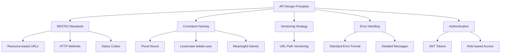
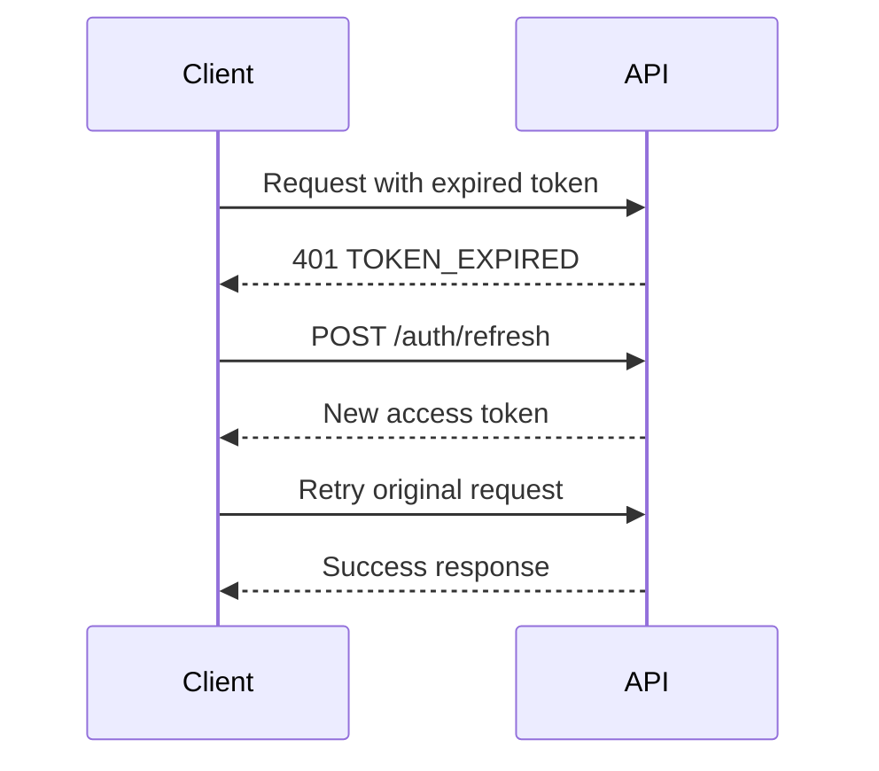

# 🔌 API Design Patterns

> RESTful API standards and patterns for SHUNCOM RULR IoT Platform backend


**Platform:** SHUNCOM RULR IoT Platform v1.1 | **Last Updated:** January 2025



---

## 🏗️ API Architecture Overview

### Design Principles


---

## 📍 URL Structure & Naming

### Base URL Pattern
```yaml
Production: https://api.shuncom-rulr.com/v1
Staging: https://api-staging.shuncom-rulr.com/v1
Development: http://localhost:3000/api/v1

URL Components:
  Protocol: https://
  Domain: api.shuncom-rulr.com
  Version: /v1
  Resource: /devices
  Sub-resource: /devices/{id}/alarms
```

### Resource Naming Conventions
```yaml
Naming Rules:
  - Use plural nouns for collections: /devices, /users, /rules
  - Use lowercase with hyphens: /device-groups, /alarm-rules
  - Use path parameters for specific resources: /devices/{deviceId}
  - Use query parameters for filtering: /devices?status=online

Examples:
  Good:
    - GET /devices
    - GET /devices/{id}
    - GET /devices/{id}/alarms
    - GET /device-groups
    - POST /rules/platform-rules
    
  Bad:
    - GET /getDevices ❌ (verb in URL)
    - GET /device ❌ (singular)
    - GET /Device_List ❌ (wrong case)
```

### Resource Hierarchy
```yaml
Top-Level Resources:
  /auth                 # Authentication
  /users                # User management
  /organizations        # Organization management
  /projects             # Project hierarchy
  /devices              # Device management
  /rules                # Rule engine
  /alarms               # Alarm management
  /dashboard            # Dashboard data
  /reports              # Reporting

Nested Resources (max 2 levels):
  /devices/{id}/metrics
  /devices/{id}/alarms
  /devices/{id}/history
  /projects/{id}/devices
  /rules/{id}/executions
  /users/{id}/permissions
```

---

## 🔧 HTTP Methods & Operations

### Method Usage
```yaml
GET - Read Operations:
  Collection: GET /devices → List devices
  Single: GET /devices/{id} → Get device details
  Nested: GET /devices/{id}/alarms → Get device alarms
  
POST - Create Operations:
  Create: POST /devices → Create new device
  Batch: POST /devices/batch → Batch create devices
  Action: POST /devices/{id}/sync → Trigger sync action
  
PUT - Full Replace:
  Update: PUT /devices/{id} → Replace entire device
  
PATCH - Partial Update:
  Update: PATCH /devices/{id} → Update specific fields
  
DELETE - Remove Operations:
  Single: DELETE /devices/{id} → Delete device
  Batch: DELETE /devices/batch → Batch delete (body contains IDs)
```

### Action Endpoints
```yaml
Device Actions:
  POST /devices/{id}/actions/power-on
  POST /devices/{id}/actions/power-off
  POST /devices/{id}/actions/dim
  POST /devices/{id}/actions/sync
  POST /devices/{id}/actions/reboot

Bulk Actions:
  POST /devices/actions/bulk
  Body:
    action: "power-on"
    deviceIds: ["id1", "id2", "id3"]
    
Rule Actions:
  POST /rules/{id}/actions/enable
  POST /rules/{id}/actions/disable
  POST /rules/{id}/actions/execute
```

---

## 📋 Request & Response Formats

### Request Headers
```yaml
Required Headers:
  Content-Type: application/json
  Accept: application/json
  Authorization: Bearer {jwt_token}
  
Optional Headers:
  X-Request-ID: {uuid}           # Request tracing
  X-Timezone: Asia/Shanghai      # User timezone
  Accept-Language: en-US         # Localization
  X-Organization-ID: {org_id}    # Multi-tenant context
```

### Pagination Pattern
```yaml
Request:
  GET /devices?page=1&limit=20&sort=name&order=asc
  
Query Parameters:
  page: 1           # Page number (1-indexed)
  limit: 20         # Items per page (max 100)
  sort: name        # Sort field
  order: asc        # Sort direction (asc/desc)
  
Response:
  {
    "data": [...],
    "pagination": {
      "page": 1,
      "limit": 20,
      "total": 150,
      "totalPages": 8,
      "hasNext": true,
      "hasPrev": false
    }
  }
```

### Filtering Pattern
```yaml
Simple Filters:
  GET /devices?status=online
  GET /devices?type=gateway
  GET /devices?projectId=123
  
Multiple Values:
  GET /devices?status=online,offline
  GET /devices?type=gateway,controller
  
Range Filters:
  GET /devices?createdAt[gte]=2025-01-01
  GET /devices?createdAt[lte]=2025-01-31
  
Search:
  GET /devices?search=gateway
  GET /devices?q=north%20region
  
Combined:
  GET /devices?status=online&type=gateway&search=north&page=1&limit=20
```

### Standard Response Format
```yaml
Success Response (Single):
  {
    "success": true,
    "data": {
      "id": "dev_123",
      "name": "Gateway_North_01",
      "type": "gateway",
      ...
    }
  }
  
Success Response (Collection):
  {
    "success": true,
    "data": [
      { "id": "dev_123", ... },
      { "id": "dev_124", ... }
    ],
    "pagination": {
      "page": 1,
      "limit": 20,
      "total": 150,
      "totalPages": 8
    }
  }
  
Error Response:
  {
    "success": false,
    "error": {
      "code": "DEVICE_NOT_FOUND",
      "message": "Device with ID 'dev_123' not found",
      "details": {
        "deviceId": "dev_123",
        "suggestion": "Check if device exists or has been deleted"
      }
    }
  }
```

---

## 🚦 HTTP Status Codes

### Success Codes
```yaml
200 OK:
  Use: Successful GET, PUT, PATCH
  Body: Requested/updated resource
  
201 Created:
  Use: Successful POST (resource created)
  Body: Created resource
  Header: Location: /devices/{new_id}
  
204 No Content:
  Use: Successful DELETE
  Body: Empty
  
202 Accepted:
  Use: Long-running operations (async)
  Body: Operation status URL
```

### Client Error Codes
```yaml
400 Bad Request:
  Use: Invalid request body, validation errors
  Code: VALIDATION_ERROR, INVALID_PARAMETER
  
401 Unauthorized:
  Use: Missing or invalid authentication
  Code: INVALID_TOKEN, TOKEN_EXPIRED
  
403 Forbidden:
  Use: Authenticated but lacks permission
  Code: PERMISSION_DENIED, INSUFFICIENT_ROLE
  
404 Not Found:
  Use: Resource doesn't exist
  Code: RESOURCE_NOT_FOUND
  
409 Conflict:
  Use: Resource already exists, state conflict
  Code: DUPLICATE_RESOURCE, STATE_CONFLICT
  
422 Unprocessable Entity:
  Use: Semantic validation failure
  Code: BUSINESS_RULE_VIOLATION
  
429 Too Many Requests:
  Use: Rate limit exceeded
  Header: Retry-After: 60
```

### Server Error Codes
```yaml
500 Internal Server Error:
  Use: Unexpected server errors
  Code: INTERNAL_ERROR
  
502 Bad Gateway:
  Use: Upstream service failure
  Code: SERVICE_UNAVAILABLE
  
503 Service Unavailable:
  Use: Server temporarily unavailable
  Header: Retry-After: 300
```

---

## 🔐 Authentication & Authorization

### JWT Token Structure
```yaml
Token Request:
  POST /auth/login
  Body:
    {
      "username": "admin",
      "password": "secure_password"
    }
    
Token Response:
  {
    "success": true,
    "data": {
      "accessToken": "eyJhbGciOiJIUzI1...",
      "refreshToken": "eyJhbGciOiJIUzI1...",
      "expiresIn": 3600,
      "tokenType": "Bearer"
    }
  }
  
Token Usage:
  Authorization: Bearer eyJhbGciOiJIUzI1...
```

### Token Refresh Flow


### Permission Checks
```yaml
Resource-Level Permissions:
  /devices: devices.read, devices.write, devices.delete
  /rules: rules.read, rules.write, rules.execute
  /users: users.read, users.write, users.delete
  
Scope-Based Access:
  - User can only access devices within their management scope
  - Organization isolation (multi-tenant)
  - Project-level permissions

API Response for Permission Denied:
  {
    "success": false,
    "error": {
      "code": "PERMISSION_DENIED",
      "message": "You don't have permission to access this device",
      "details": {
        "requiredPermission": "devices.read",
        "resource": "devices/dev_123"
      }
    }
  }
```

---

## 📊 API Endpoints Reference

### Authentication Endpoints
```yaml
POST /auth/login:
  Description: Authenticate user
  Body: { username, password }
  Response: Access token + refresh token
  
POST /auth/refresh:
  Description: Refresh access token
  Body: { refreshToken }
  Response: New access token
  
POST /auth/logout:
  Description: Invalidate tokens
  Body: { refreshToken }
  Response: 204 No Content
  
GET /auth/me:
  Description: Get current user profile
  Response: User details with permissions
```

### Device Endpoints
```yaml
GET /devices:
  Description: List all devices
  Query: page, limit, type, status, projectId, search
  Response: Paginated device list
  
GET /devices/{id}:
  Description: Get device details
  Response: Full device information
  
POST /devices:
  Description: Create new device
  Body: Device configuration
  Response: Created device
  
PATCH /devices/{id}:
  Description: Update device
  Body: Partial device data
  Response: Updated device
  
DELETE /devices/{id}:
  Description: Delete device (to recycle bin)
  Response: 204 No Content
  
POST /devices/{id}/actions/{action}:
  Description: Execute device action
  Actions: power-on, power-off, dim, sync, reboot
  Body: Action parameters
  Response: Action result
  
GET /devices/{id}/metrics:
  Description: Get device metrics
  Query: from, to, interval
  Response: Time-series data
  
GET /devices/{id}/alarms:
  Description: Get device alarms
  Query: status, severity, page, limit
  Response: Paginated alarm list
```

### Rule Endpoints
```yaml
GET /rules:
  Description: List all rules
  Query: type, status, page, limit
  Response: Paginated rule list
  
GET /rules/{id}:
  Description: Get rule details
  Response: Full rule configuration
  
POST /rules:
  Description: Create new rule
  Body: Rule configuration
  Response: Created rule
  
PATCH /rules/{id}:
  Description: Update rule
  Body: Partial rule data
  Response: Updated rule
  
DELETE /rules/{id}:
  Description: Delete rule
  Response: 204 No Content
  
POST /rules/{id}/actions/enable:
  Description: Enable rule
  Response: Updated rule
  
POST /rules/{id}/actions/disable:
  Description: Disable rule
  Response: Updated rule
  
POST /rules/{id}/actions/execute:
  Description: Manually execute rule
  Response: Execution result
```

### Dashboard Endpoints
```yaml
GET /dashboard/statistics:
  Description: Get dashboard statistics
  Query: projectId
  Response: Device counts, status distribution
  
GET /dashboard/energy:
  Description: Get energy consumption data
  Query: from, to, interval, projectId
  Response: Energy metrics over time
  
GET /dashboard/alarms:
  Description: Get alarm summary
  Query: projectId
  Response: Alarm counts by severity
  
GET /dashboard/map-data:
  Description: Get device map data
  Query: projectId, bounds
  Response: GIS data for map display
```

---

## ⚡ Real-time API (WebSocket)

### WebSocket Connection
```yaml
Connection URL: wss://api.shuncom-rulr.com/ws/v1
Authentication: Query param or first message
  wss://api.shuncom-rulr.com/ws/v1?token={jwt}

Connection Flow:
  1. Connect with JWT token
  2. Server sends connection confirmation
  3. Subscribe to topics
  4. Receive real-time updates
```

### Message Format
```yaml
Client → Server (Subscribe):
  {
    "type": "subscribe",
    "topics": [
      "devices.status",
      "devices.dev_123.metrics",
      "alarms.new"
    ]
  }
  
Server → Client (Data):
  {
    "type": "update",
    "topic": "devices.status",
    "data": {
      "deviceId": "dev_123",
      "status": "online",
      "timestamp": "2025-01-23T10:30:00Z"
    }
  }
  
Server → Client (Alarm):
  {
    "type": "alarm",
    "topic": "alarms.new",
    "data": {
      "alarmId": "alm_456",
      "deviceId": "dev_123",
      "severity": "critical",
      "message": "Device offline",
      "timestamp": "2025-01-23T10:30:00Z"
    }
  }
```

### Available Topics
```yaml
Device Topics:
  devices.status: All device status changes
  devices.{id}.status: Specific device status
  devices.{id}.metrics: Specific device metrics
  
Alarm Topics:
  alarms.new: New alarm notifications
  alarms.{severity}: Alarms by severity
  
Rule Topics:
  rules.execution: Rule execution events
  
Dashboard Topics:
  dashboard.statistics: Updated statistics
```

---

## 🔗 Related Documentation

### Implementation Guides
- **[Database Schema](../02-System-Architecture/Database%20Schema.md)**: Data model design
- **[02-Authentication System](../02-System-Architecture/02-Authentication%20System.md)**: Auth implementation details
- **[07-Development Roadmap](../07-Dashboard/07-Development%20Roadmap.md)**: API implementation timeline

### Testing & Quality
- **[Testing Scenarios](Testing%20Scenarios.md)**: API testing procedures
- **[Performance Benchmarks](Performance%20Benchmarks.md)**: API performance requirements

---

**Next Steps**: Use this guide as the API contract for frontend-backend integration. All endpoints should be documented in OpenAPI/Swagger format.
