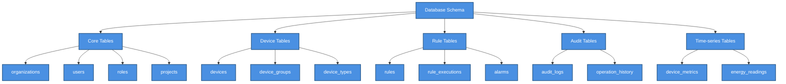
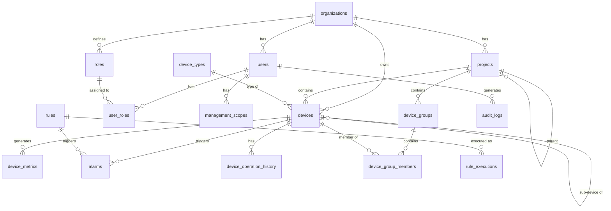

# 🗄️ Database Schema

> Data model design for SHUNCOM RULR IoT Platform


**Platform:** SHUNCOM RULR IoT Platform v1.1 | **Last Updated:** January 2025



---

## 🏗️ Database Architecture Overview

### Technology Stack
```yaml
Primary Database: PostgreSQL 15+
  Use: Relational data, transactions, complex queries
  
Time-series Database: TimescaleDB (PostgreSQL extension)
  Use: Device metrics, historical data, analytics
  
Cache Layer: Redis
  Use: Session management, real-time status, caching
  
Search Engine: Elasticsearch (optional)
  Use: Full-text search, log aggregation
```

### Schema Organization

    classDef default fill:#4A90E2,stroke:#2E5C8A,stroke-width:2px,color:#fff
    classDef primary fill:#7B68EE,stroke:#5A4FC4,stroke-width:2px,color:#fff
    classDef success fill:#50C878,stroke:#3A9B5C,stroke-width:2px,color:#fff
    classDef warning fill:#FFA500,stroke:#CC8400,stroke-width:2px,color:#fff
    classDef danger fill:#FF6B6B,stroke:#CC5555,stroke-width:2px,color:#fff


---

## 👥 Core Tables

### organizations
```sql
CREATE TABLE organizations (
    id UUID PRIMARY KEY DEFAULT gen_random_uuid(),
    name VARCHAR(255) NOT NULL,
    code VARCHAR(50) UNIQUE NOT NULL,
    type VARCHAR(50) DEFAULT 'standard',
    parent_id UUID REFERENCES organizations(id),
    settings JSONB DEFAULT '{}',
    status VARCHAR(20) DEFAULT 'active',
    created_at TIMESTAMPTZ DEFAULT NOW(),
    updated_at TIMESTAMPTZ DEFAULT NOW(),
    deleted_at TIMESTAMPTZ
);

-- Indexes
CREATE INDEX idx_organizations_parent ON organizations(parent_id);
CREATE INDEX idx_organizations_status ON organizations(status);
CREATE INDEX idx_organizations_code ON organizations(code);
```

### users
```sql
CREATE TABLE users (
    id UUID PRIMARY KEY DEFAULT gen_random_uuid(),
    organization_id UUID REFERENCES organizations(id),
    username VARCHAR(100) UNIQUE NOT NULL,
    email VARCHAR(255) UNIQUE,
    phone VARCHAR(50),
    password_hash VARCHAR(255) NOT NULL,
    display_name VARCHAR(255),
    avatar_url VARCHAR(500),
    status VARCHAR(20) DEFAULT 'active',
    last_login_at TIMESTAMPTZ,
    password_changed_at TIMESTAMPTZ,
    settings JSONB DEFAULT '{}',
    created_at TIMESTAMPTZ DEFAULT NOW(),
    updated_at TIMESTAMPTZ DEFAULT NOW(),
    deleted_at TIMESTAMPTZ
);

-- Indexes
CREATE INDEX idx_users_organization ON users(organization_id);
CREATE INDEX idx_users_username ON users(username);
CREATE INDEX idx_users_email ON users(email);
CREATE INDEX idx_users_status ON users(status);
```

### roles
```sql
CREATE TABLE roles (
    id UUID PRIMARY KEY DEFAULT gen_random_uuid(),
    organization_id UUID REFERENCES organizations(id),
    name VARCHAR(100) NOT NULL,
    code VARCHAR(50) NOT NULL,
    type VARCHAR(20) DEFAULT 'custom',  -- system, custom
    description TEXT,
    permissions JSONB NOT NULL DEFAULT '[]',
    is_default BOOLEAN DEFAULT false,
    created_at TIMESTAMPTZ DEFAULT NOW(),
    updated_at TIMESTAMPTZ DEFAULT NOW(),
    
    UNIQUE(organization_id, code)
);

-- Sample permissions structure:
-- ["devices.read", "devices.write", "rules.read", "rules.write"]
```

### user_roles
```sql
CREATE TABLE user_roles (
    user_id UUID REFERENCES users(id) ON DELETE CASCADE,
    role_id UUID REFERENCES roles(id) ON DELETE CASCADE,
    assigned_at TIMESTAMPTZ DEFAULT NOW(),
    assigned_by UUID REFERENCES users(id),
    
    PRIMARY KEY (user_id, role_id)
);
```

### management_scopes
```sql
CREATE TABLE management_scopes (
    id UUID PRIMARY KEY DEFAULT gen_random_uuid(),
    user_id UUID REFERENCES users(id) ON DELETE CASCADE,
    scope_type VARCHAR(50) NOT NULL,  -- project, device_group, region
    scope_id UUID NOT NULL,
    permissions JSONB DEFAULT '["read"]',
    created_at TIMESTAMPTZ DEFAULT NOW(),
    
    UNIQUE(user_id, scope_type, scope_id)
);

-- Index for fast scope lookups
CREATE INDEX idx_management_scopes_user ON management_scopes(user_id);
CREATE INDEX idx_management_scopes_scope ON management_scopes(scope_type, scope_id);
```

### projects
```sql
CREATE TABLE projects (
    id UUID PRIMARY KEY DEFAULT gen_random_uuid(),
    organization_id UUID REFERENCES organizations(id),
    parent_id UUID REFERENCES projects(id),
    name VARCHAR(255) NOT NULL,
    code VARCHAR(100),
    level INT NOT NULL DEFAULT 1,
    path LTREE,  -- Hierarchical path (requires ltree extension)
    description TEXT,
    location JSONB,  -- {lat, lng, address}
    boundaries GEOMETRY(POLYGON, 4326),  -- GIS boundaries
    settings JSONB DEFAULT '{}',
    status VARCHAR(20) DEFAULT 'active',
    created_at TIMESTAMPTZ DEFAULT NOW(),
    updated_at TIMESTAMPTZ DEFAULT NOW(),
    deleted_at TIMESTAMPTZ
);

-- Indexes
CREATE INDEX idx_projects_organization ON projects(organization_id);
CREATE INDEX idx_projects_parent ON projects(parent_id);
CREATE INDEX idx_projects_path ON projects USING GIST(path);
CREATE INDEX idx_projects_boundaries ON projects USING GIST(boundaries);
```

---

## 🔧 Device Tables

### device_types
```sql
CREATE TABLE device_types (
    id UUID PRIMARY KEY DEFAULT gen_random_uuid(),
    code VARCHAR(50) UNIQUE NOT NULL,
    name VARCHAR(100) NOT NULL,
    category VARCHAR(50) NOT NULL,
    icon VARCHAR(100),
    description TEXT,
    capabilities JSONB DEFAULT '[]',
    config_schema JSONB,  -- JSON Schema for configuration
    metrics_schema JSONB,  -- JSON Schema for metrics
    created_at TIMESTAMPTZ DEFAULT NOW()
);

-- Initial device types
INSERT INTO device_types (code, name, category, capabilities) VALUES
('gateway', 'Smart Gateway', 'gateway', '["sub_device_management", "loop_control", "three_phase_monitoring"]'),
('light_controller_zigbee', 'Zigbee Light Controller', 'light_controller', '["dimming", "on_off", "metering"]'),
('light_controller_nb', 'NB-IoT Light Controller', 'light_controller', '["dimming", "on_off", "metering"]'),
('light_controller_cat1', 'CAT.1 Light Controller', 'light_controller', '["dimming", "on_off", "metering"]'),
('light_controller_lora', 'LoRa Light Controller', 'light_controller', '["dimming", "on_off", "metering"]'),
('fixture', 'Lighting Fixture', 'fixture', '["status_reporting"]'),
('pole', 'Lighting Pole', 'pole', '["device_container"]'),
('distribution', 'Power Distribution Control', 'distribution', '["circuit_monitoring", "power_control"]'),
('loop_controller', 'Loop Controller', 'loop_controller', '["circuit_control"]'),
('meter', 'Smart Meter', 'meter', '["energy_monitoring", "three_phase"]');
```

### devices
```sql
CREATE TABLE devices (
    id UUID PRIMARY KEY DEFAULT gen_random_uuid(),
    organization_id UUID REFERENCES organizations(id),
    project_id UUID REFERENCES projects(id),
    device_type_id UUID REFERENCES device_types(id),
    
    -- Identification
    name VARCHAR(255) NOT NULL,
    device_number VARCHAR(100) NOT NULL,  -- MAC, IMEI, etc.
    serial_number VARCHAR(100),
    
    -- Associations
    parent_device_id UUID REFERENCES devices(id),  -- For sub-devices
    gateway_id UUID REFERENCES devices(id),        -- Associated gateway
    fixture_id UUID REFERENCES devices(id),        -- For light controllers
    
    -- Location
    coordinates GEOMETRY(POINT, 4326),
    altitude DECIMAL(10, 2),
    address VARCHAR(500),
    
    -- Status
    status VARCHAR(20) DEFAULT 'inactive',  -- active, inactive, alarm
    online_status VARCHAR(20) DEFAULT 'offline',  -- online, offline
    last_online_at TIMESTAMPTZ,
    
    -- Configuration
    config JSONB DEFAULT '{}',
    
    -- Protocol-specific (LoRa, Zigbee, etc.)
    protocol_config JSONB DEFAULT '{}',
    
    -- Metadata
    firmware_version VARCHAR(50),
    hardware_version VARCHAR(50),
    manufacturer VARCHAR(100),
    model VARCHAR(100),
    
    created_at TIMESTAMPTZ DEFAULT NOW(),
    updated_at TIMESTAMPTZ DEFAULT NOW(),
    deleted_at TIMESTAMPTZ,
    
    UNIQUE(organization_id, device_number)
);

-- Indexes
CREATE INDEX idx_devices_organization ON devices(organization_id);
CREATE INDEX idx_devices_project ON devices(project_id);
CREATE INDEX idx_devices_type ON devices(device_type_id);
CREATE INDEX idx_devices_parent ON devices(parent_device_id);
CREATE INDEX idx_devices_gateway ON devices(gateway_id);
CREATE INDEX idx_devices_status ON devices(status, online_status);
CREATE INDEX idx_devices_coordinates ON devices USING GIST(coordinates);
CREATE INDEX idx_devices_device_number ON devices(device_number);
```

### device_groups
```sql
CREATE TABLE device_groups (
    id UUID PRIMARY KEY DEFAULT gen_random_uuid(),
    organization_id UUID REFERENCES organizations(id),
    project_id UUID REFERENCES projects(id),
    
    name VARCHAR(255) NOT NULL,
    type VARCHAR(50) DEFAULT 'regular',  -- regular, zigbee_multicast, lora_multicast, luminaire, loop
    description TEXT,
    
    -- For multicast groups
    multicast_config JSONB,  -- {groupNumber, frequencyBand}
    
    -- Location
    coordinates GEOMETRY(POINT, 4326),
    address VARCHAR(500),
    
    created_at TIMESTAMPTZ DEFAULT NOW(),
    updated_at TIMESTAMPTZ DEFAULT NOW()
);

-- Many-to-many: devices <-> groups
CREATE TABLE device_group_members (
    device_id UUID REFERENCES devices(id) ON DELETE CASCADE,
    group_id UUID REFERENCES device_groups(id) ON DELETE CASCADE,
    multicast_number INT,  -- For multicast groups
    sync_status VARCHAR(20) DEFAULT 'pending',
    added_at TIMESTAMPTZ DEFAULT NOW(),
    
    PRIMARY KEY (device_id, group_id)
);
```

### device_metrics (TimescaleDB hypertable)
```sql
CREATE TABLE device_metrics (
    time TIMESTAMPTZ NOT NULL,
    device_id UUID NOT NULL REFERENCES devices(id),
    metric_type VARCHAR(50) NOT NULL,
    value DOUBLE PRECISION,
    unit VARCHAR(20),
    metadata JSONB DEFAULT '{}'
);

-- Convert to hypertable for time-series optimization
SELECT create_hypertable('device_metrics', 'time');

-- Indexes
CREATE INDEX idx_device_metrics_device_time ON device_metrics(device_id, time DESC);
CREATE INDEX idx_device_metrics_type ON device_metrics(metric_type, time DESC);

-- Retention policy: Keep 1 year of data
SELECT add_retention_policy('device_metrics', INTERVAL '1 year');

-- Continuous aggregates for hourly/daily rollups
CREATE MATERIALIZED VIEW device_metrics_hourly
WITH (timescaledb.continuous) AS
SELECT
    time_bucket('1 hour', time) AS bucket,
    device_id,
    metric_type,
    AVG(value) as avg_value,
    MIN(value) as min_value,
    MAX(value) as max_value,
    COUNT(*) as sample_count
FROM device_metrics
GROUP BY bucket, device_id, metric_type;
```

---

## ⚙️ Rule Tables

### rules
```sql
CREATE TABLE rules (
    id UUID PRIMARY KEY DEFAULT gen_random_uuid(),
    organization_id UUID REFERENCES organizations(id),
    
    name VARCHAR(255) NOT NULL,
    type VARCHAR(50) NOT NULL,  -- platform, local, alarm
    description TEXT,
    
    -- Trigger configuration
    trigger_type VARCHAR(50) NOT NULL,  -- time, event, condition
    trigger_config JSONB NOT NULL,
    
    -- Condition configuration
    conditions JSONB DEFAULT '[]',
    condition_logic VARCHAR(10) DEFAULT 'and',  -- and, or
    
    -- Action configuration
    actions JSONB NOT NULL,
    
    -- Target selection
    target_type VARCHAR(50),  -- device, group, project
    target_ids UUID[] DEFAULT '{}',
    
    -- Schedule (for time-based rules)
    schedule JSONB,  -- {startDate, endDate, repeatType, timezone}
    
    -- Status
    status VARCHAR(20) DEFAULT 'enabled',  -- enabled, disabled
    priority INT DEFAULT 5,
    
    created_by UUID REFERENCES users(id),
    created_at TIMESTAMPTZ DEFAULT NOW(),
    updated_at TIMESTAMPTZ DEFAULT NOW()
);

-- Indexes
CREATE INDEX idx_rules_organization ON rules(organization_id);
CREATE INDEX idx_rules_type ON rules(type);
CREATE INDEX idx_rules_status ON rules(status);
CREATE INDEX idx_rules_targets ON rules USING GIN(target_ids);
```

### rule_executions
```sql
CREATE TABLE rule_executions (
    id UUID PRIMARY KEY DEFAULT gen_random_uuid(),
    rule_id UUID REFERENCES rules(id),
    
    triggered_at TIMESTAMPTZ NOT NULL,
    trigger_source VARCHAR(100),  -- What triggered: schedule, event, manual
    
    -- Execution details
    status VARCHAR(20) NOT NULL,  -- pending, executing, success, partial, failed
    started_at TIMESTAMPTZ,
    completed_at TIMESTAMPTZ,
    
    -- Results
    affected_devices INT DEFAULT 0,
    successful_devices INT DEFAULT 0,
    failed_devices INT DEFAULT 0,
    
    execution_log JSONB DEFAULT '[]',
    error_message TEXT,
    
    created_at TIMESTAMPTZ DEFAULT NOW()
);

-- Partition by month for performance
CREATE INDEX idx_rule_executions_rule ON rule_executions(rule_id, triggered_at DESC);
CREATE INDEX idx_rule_executions_status ON rule_executions(status);
```

### alarms
```sql
CREATE TABLE alarms (
    id UUID PRIMARY KEY DEFAULT gen_random_uuid(),
    organization_id UUID REFERENCES organizations(id),
    device_id UUID REFERENCES devices(id),
    rule_id UUID REFERENCES rules(id),
    
    -- Alarm identification
    alarm_type VARCHAR(100) NOT NULL,
    severity VARCHAR(20) NOT NULL,  -- critical, major, minor, warning, info
    
    -- Alarm content
    title VARCHAR(255) NOT NULL,
    message TEXT,
    metadata JSONB DEFAULT '{}',
    
    -- Status
    status VARCHAR(20) DEFAULT 'active',  -- active, acknowledged, resolved
    
    -- Timestamps
    triggered_at TIMESTAMPTZ NOT NULL DEFAULT NOW(),
    acknowledged_at TIMESTAMPTZ,
    acknowledged_by UUID REFERENCES users(id),
    resolved_at TIMESTAMPTZ,
    resolved_by UUID REFERENCES users(id),
    
    -- Resolution
    resolution_notes TEXT,
    auto_resolved BOOLEAN DEFAULT false
);

-- Indexes
CREATE INDEX idx_alarms_organization ON alarms(organization_id);
CREATE INDEX idx_alarms_device ON alarms(device_id);
CREATE INDEX idx_alarms_status_severity ON alarms(status, severity);
CREATE INDEX idx_alarms_triggered ON alarms(triggered_at DESC);
```

---

## 📝 Audit Tables

### audit_logs
```sql
CREATE TABLE audit_logs (
    id UUID PRIMARY KEY DEFAULT gen_random_uuid(),
    organization_id UUID,
    user_id UUID,
    
    -- What happened
    action VARCHAR(100) NOT NULL,  -- create, update, delete, login, etc.
    resource_type VARCHAR(100) NOT NULL,  -- device, rule, user, etc.
    resource_id UUID,
    
    -- Details
    old_values JSONB,
    new_values JSONB,
    metadata JSONB DEFAULT '{}',
    
    -- Context
    ip_address INET,
    user_agent TEXT,
    request_id VARCHAR(100),
    
    created_at TIMESTAMPTZ DEFAULT NOW()
);

-- Partition by month
CREATE INDEX idx_audit_logs_org_time ON audit_logs(organization_id, created_at DESC);
CREATE INDEX idx_audit_logs_user ON audit_logs(user_id, created_at DESC);
CREATE INDEX idx_audit_logs_resource ON audit_logs(resource_type, resource_id);
```

### device_operation_history
```sql
CREATE TABLE device_operation_history (
    id UUID PRIMARY KEY DEFAULT gen_random_uuid(),
    device_id UUID REFERENCES devices(id),
    
    operation_type VARCHAR(50) NOT NULL,  -- power_on, power_off, dim, config_change
    parameters JSONB DEFAULT '{}',
    
    -- Execution result
    status VARCHAR(20) NOT NULL,  -- success, failed, timeout
    result JSONB,
    error_message TEXT,
    
    -- Context
    triggered_by VARCHAR(50),  -- user, rule, schedule
    user_id UUID REFERENCES users(id),
    rule_id UUID REFERENCES rules(id),
    
    executed_at TIMESTAMPTZ DEFAULT NOW()
);

-- Indexes
CREATE INDEX idx_device_operations_device ON device_operation_history(device_id, executed_at DESC);
CREATE INDEX idx_device_operations_type ON device_operation_history(operation_type);
```

---

## 🗺️ Entity Relationship Diagram



---

## 🔗 Related Documentation

### Implementation
- **[API Design Patterns](API%20Design%20Patterns.md)**: How APIs interact with this schema
- **[07-Development Roadmap](../07-Dashboard/07-Development%20Roadmap.md)**: Database implementation timeline

### Reference
- **[03-Device Management Hub](../03-Device-Management/03-Device%20Management%20Hub.md)**: Device data requirements
- **[04-Rule Engine System](../04-Rule-Management/04-Rule%20Engine%20System.md)**: Rule data structure
- **[02-Authentication System](../02-System-Architecture/02-Authentication%20System.md)**: User/role data requirements

---

**Next Steps**: Set up database migrations, implement repository patterns, and create seed data for development/testing.
