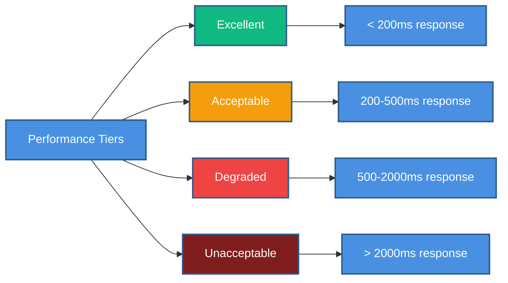

# ⚡ Performance Benchmarks

> System performance requirements and benchmarks for SHUNCOM RULR IoT Platform


**Platform:** SHUNCOM RULR IoT Platform v1.1 | **Last Updated:** January 2025



---

## 🎯 Performance Goals Overview

### Performance Tiers

    classDef default fill:#4A90E2,stroke:#2E5C8A,stroke-width:2px,color:#fff
    classDef primary fill:#7B68EE,stroke:#5A4FC4,stroke-width:2px,color:#fff
    classDef success fill:#50C878,stroke:#3A9B5C,stroke-width:2px,color:#fff
    classDef warning fill:#FFA500,stroke:#CC8400,stroke-width:2px,color:#fff
    classDef danger fill:#FF6B6B,stroke:#CC5555,stroke-width:2px,color:#fff


---

## 📊 Response Time Benchmarks

### API Response Times
```yaml
Authentication APIs:
  POST /auth/login:
    Excellent: < 200ms
    Acceptable: < 500ms
    Target P95: 300ms
    Target P99: 500ms
    
  POST /auth/refresh:
    Excellent: < 100ms
    Acceptable: < 200ms
    Target P95: 150ms
    Target P99: 250ms

Device APIs:
  GET /devices (paginated):
    Excellent: < 200ms
    Acceptable: < 500ms
    Target P95: 300ms
    Conditions: Page size ≤ 100
    
  GET /devices/{id}:
    Excellent: < 100ms
    Acceptable: < 200ms
    Target P95: 150ms
    
  POST /devices (create):
    Excellent: < 300ms
    Acceptable: < 600ms
    Target P95: 400ms
    
  POST /devices/{id}/actions/*:
    Excellent: < 500ms
    Acceptable: < 1000ms
    Target P95: 700ms
    Note: Includes device communication

Rule APIs:
  GET /rules:
    Excellent: < 200ms
    Acceptable: < 400ms
    Target P95: 300ms
    
  POST /rules (create):
    Excellent: < 400ms
    Acceptable: < 800ms
    Target P95: 500ms

Dashboard APIs:
  GET /dashboard/statistics:
    Excellent: < 500ms
    Acceptable: < 1000ms
    Target P95: 700ms
    Conditions: Up to 100,000 devices
    
  GET /dashboard/map-data:
    Excellent: < 800ms
    Acceptable: < 1500ms
    Target P95: 1000ms
    Conditions: Up to 10,000 visible devices
```

### Frontend Performance
```yaml
Initial Page Load:
  Login Page:
    Target: < 1.5s (First Contentful Paint)
    Max: 3s
    
  Dashboard:
    Target: < 2s (Time to Interactive)
    Max: 4s
    
  Device List:
    Target: < 1.5s (Time to Interactive)
    Max: 3s

Subsequent Navigation:
  Page Transitions:
    Target: < 300ms
    Max: 500ms
    
  Modal Opens:
    Target: < 100ms
    Max: 200ms

Core Web Vitals:
  LCP (Largest Contentful Paint):
    Target: < 2.5s
    Max: 4s
    
  FID (First Input Delay):
    Target: < 100ms
    Max: 300ms
    
  CLS (Cumulative Layout Shift):
    Target: < 0.1
    Max: 0.25
```

---

## 📈 Throughput Benchmarks

### API Throughput
```yaml
Authentication:
  Login requests/second: 100
  Token refresh/second: 500
  
Device Operations:
  Read operations/second: 1000
  Write operations/second: 200
  Control commands/second: 500
  
Rule Operations:
  Rule evaluations/second: 1000
  Rule executions/minute: 10,000
  
WebSocket:
  Concurrent connections: 10,000
  Messages/second (broadcast): 50,000
  Messages/second (per client): 10
```

### Database Throughput
```yaml
PostgreSQL:
  Read queries/second: 5000
  Write queries/second: 1000
  Transaction/second: 500
  
TimescaleDB (Metrics):
  Inserts/second: 10,000
  Time-range queries/second: 500
  
Redis (Cache):
  Operations/second: 50,000
  Hit rate target: > 90%
```

---

## 🔢 Scalability Benchmarks

### Device Scale
```yaml
Device Counts:
  Tier 1 (Small):
    Devices: 1,000
    Concurrent users: 10
    Expected performance: Excellent
    
  Tier 2 (Medium):
    Devices: 10,000
    Concurrent users: 50
    Expected performance: Excellent
    
  Tier 3 (Large):
    Devices: 50,000
    Concurrent users: 100
    Expected performance: Acceptable
    
  Tier 4 (Enterprise):
    Devices: 100,000+
    Concurrent users: 200+
    Expected performance: Acceptable with optimization

Performance by Device Count:
  1,000 devices:
    Device list load: < 200ms
    Dashboard statistics: < 300ms
    Map rendering: < 500ms
    
  10,000 devices:
    Device list load: < 400ms
    Dashboard statistics: < 600ms
    Map rendering: < 1000ms
    
  50,000 devices:
    Device list load: < 800ms
    Dashboard statistics: < 1200ms
    Map rendering: < 2000ms (with clustering)
    
  100,000 devices:
    Device list load: < 1500ms
    Dashboard statistics: < 2000ms
    Map rendering: < 3000ms (with clustering + viewport)
```

### User Concurrency
```yaml
Concurrent Users:
  10 users:
    API response degradation: 0%
    WebSocket stability: 100%
    
  50 users:
    API response degradation: < 5%
    WebSocket stability: 100%
    
  100 users:
    API response degradation: < 10%
    WebSocket stability: 99.9%
    
  200 users:
    API response degradation: < 20%
    WebSocket stability: 99.5%
    
  500 users:
    API response degradation: < 30%
    WebSocket stability: 99%
    Note: Requires horizontal scaling
```

---

## 💾 Resource Utilization Benchmarks

### Server Resources
```yaml
API Server (per instance):
  CPU:
    Idle: < 5%
    Normal load: < 40%
    Peak load: < 80%
    Alert threshold: 85%
    
  Memory:
    Base usage: 512MB
    Normal operation: < 2GB
    Maximum: 4GB
    Alert threshold: 80% of allocated
    
  Network:
    Bandwidth per 1000 RPS: ~10 Mbps
    WebSocket overhead: ~1KB per connection

Database Server:
  CPU:
    Normal load: < 50%
    Peak load: < 75%
    Alert threshold: 80%
    
  Memory:
    PostgreSQL buffer: 25% of RAM
    Shared buffers: 4GB minimum
    Working memory: 256MB per connection
    
  Storage IOPS:
    Read: 5000 IOPS minimum
    Write: 2000 IOPS minimum
    
  Connection Pool:
    Minimum: 20 connections
    Maximum: 100 connections
    Target utilization: 60-70%

Redis Server:
  Memory:
    Session cache: 100 bytes per session
    Device status cache: 500 bytes per device
    Total for 100K devices: ~50MB
    
  Eviction policy: volatile-lru
  Max memory: 1GB
```

### Frontend Resources
```yaml
Browser Performance:
  JavaScript bundle size:
    Initial: < 200KB (gzipped)
    Lazy loaded: < 100KB per chunk
    Total: < 500KB
    
  Memory usage:
    Initial: < 50MB
    With 1000 devices loaded: < 100MB
    With map open: < 150MB
    Maximum: 300MB
    
  CPU (during interactions):
    Idle: < 1%
    Normal interaction: < 20%
    Heavy operations: < 50%
```

---

## ⏱️ Latency Benchmarks

### Real-time Updates
```yaml
Device Status Change:
  Device → Platform: < 500ms
  Platform → Dashboard: < 200ms
  Total end-to-end: < 1s

Control Command:
  User click → Platform: < 100ms
  Platform → Device: < 500ms
  Device response → User: < 500ms
  Total round-trip: < 1.5s

Alarm Notification:
  Event detection: < 100ms
  Alarm creation: < 200ms
  WebSocket broadcast: < 100ms
  Email/SMS delivery: < 5s
  Total (in-app): < 500ms
```

### Data Freshness
```yaml
Dashboard Statistics:
  Refresh interval: 30 seconds
  Maximum staleness: 60 seconds
  
Device Metrics:
  Collection interval: 1 minute
  Display delay: < 5 seconds
  
Historical Data:
  Aggregation delay: < 5 minutes
  Report generation: < 30 seconds
```

---

## 🧪 Benchmark Test Scenarios

### Load Test Configuration
```yaml
Test Environment:
  Tool: k6, JMeter, or Locust
  Duration: 30 minutes minimum
  Ramp-up: 5 minutes
  
Scenario 1 - Normal Load:
  Virtual Users: 50
  Think Time: 3-5 seconds
  Actions:
    - Login (5%)
    - Dashboard view (30%)
    - Device list browse (25%)
    - Device control (15%)
    - Rule management (10%)
    - Report generation (5%)
    - Other (10%)
    
Scenario 2 - Peak Load:
  Virtual Users: 200
  Think Time: 2-3 seconds
  Duration: 15 minutes
  Focus: Dashboard and device control
  
Scenario 3 - Stress Test:
  Virtual Users: Ramp to failure
  Think Time: 1 second
  Goal: Find breaking point
  
Scenario 4 - Endurance Test:
  Virtual Users: 100
  Duration: 24 hours
  Goal: Memory leaks, connection exhaustion
```

### Benchmark Validation
```yaml
Pass Criteria:
  - P95 response times within acceptable range
  - Error rate < 0.1%
  - No memory leaks (< 5% growth over 24h)
  - No connection exhaustion
  - Graceful degradation under overload
  
Fail Criteria:
  - P99 response times exceed max thresholds
  - Error rate > 1%
  - System crash or hang
  - Data corruption
  - Security degradation under load
```

---

## 📋 Performance Optimization Checklist

### Backend Optimization
```yaml
Database:
  - [ ] Proper indexing on frequently queried columns
  - [ ] Query optimization (EXPLAIN ANALYZE)
  - [ ] Connection pooling configured
  - [ ] Read replicas for heavy read loads
  - [ ] Partitioning for large tables (metrics, logs)
  
Caching:
  - [ ] Redis for session data
  - [ ] API response caching (GET endpoints)
  - [ ] Database query caching
  - [ ] CDN for static assets
  
API:
  - [ ] Pagination on all list endpoints
  - [ ] Response compression (gzip)
  - [ ] Efficient serialization
  - [ ] Rate limiting implemented
```

### Frontend Optimization
```yaml
Bundle:
  - [ ] Code splitting implemented
  - [ ] Tree shaking enabled
  - [ ] Lazy loading for routes
  - [ ] Asset optimization (images, fonts)
  
Rendering:
  - [ ] Virtual scrolling for long lists
  - [ ] Debounced search inputs
  - [ ] Memoization for expensive computations
  - [ ] Web Workers for heavy processing
  
Network:
  - [ ] Service Worker for offline support
  - [ ] Request deduplication
  - [ ] Optimistic UI updates
  - [ ] WebSocket connection management
```

---

## 🔗 Related Documentation

### Implementation
- **[Testing Scenarios](Testing%20Scenarios.md)**: Performance test procedures
- **[07-Development Roadmap](../07-Dashboard/07-Development%20Roadmap.md)**: Optimization timeline
- **[Database Schema](../02-System-Architecture/Database%20Schema.md)**: Query optimization context

### Monitoring
- **[API Design Patterns](API%20Design%20Patterns.md)**: API performance patterns

---

**Next Steps**: Set up performance monitoring, implement baseline measurements, and establish alerting thresholds.
