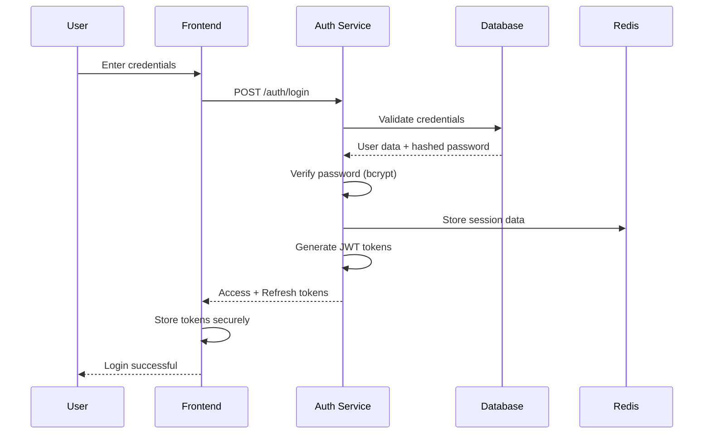
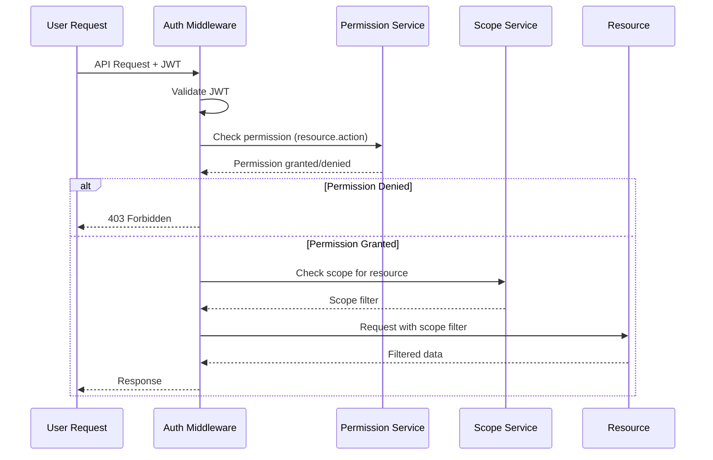

# 🔐 Security Architecture

> Security implementation design for SHUNCOM RULR IoT Platform


**Platform:** SHUNCOM RULR IoT Platform v1.1 | **Last Updated:** January 2025



---

## 🏗️ Security Architecture Overview

### Security Layers

    classDef default fill:#4A90E2,stroke:#2E5C8A,stroke-width:2px,color:#fff
    classDef primary fill:#7B68EE,stroke:#5A4FC4,stroke-width:2px,color:#fff
    classDef success fill:#50C878,stroke:#3A9B5C,stroke-width:2px,color:#fff
    classDef warning fill:#FFA500,stroke:#CC8400,stroke-width:2px,color:#fff
    classDef danger fill:#FF6B6B,stroke:#CC5555,stroke-width:2px,color:#fff

```mermaid
graph TB
    A[Security Architecture] --> B[Network Security]
    A --> C[Application Security]
    A --> D[Data Security]
    A --> E[Device Security]
    
    B --> F[TLS/HTTPS]
    B --> G[Firewall]
    B --> H[DDoS Protection]
    
    C --> I[Authentication]
    C --> J[Authorization]
    C --> K[Input Validation]
    C --> L[Session Management]
    
    D --> M[Encryption at Rest]
    D --> N[Encryption in Transit]
    D --> O[Data Masking]
    
    E --> P[Device Authentication]
    E --> Q[Secure Communication]
    E --> R[Firmware Security]

    classDef default fill:#4A90E2,stroke:#2E5C8A,stroke-width:2px,color:#fff
    classDef primary fill:#7B68EE,stroke:#5A4FC4,stroke-width:2px,color:#fff
    classDef success fill:#50C878,stroke:#3A9B5C,stroke-width:2px,color:#fff
    classDef warning fill:#FFA500,stroke:#CC8400,stroke-width:2px,color:#fff
    classDef danger fill:#FF6B6B,stroke:#CC5555,stroke-width:2px,color:#fff
```


---

## 🔑 Authentication System

### Authentication Flow


### JWT Token Structure
```yaml
Access Token:
  Header:
    alg: "RS256"
    typ: "JWT"
  Payload:
    sub: "user_id"
    iss: "shuncom-rulr"
    aud: "shuncom-rulr-api"
    exp: 3600  # 1 hour
    iat: timestamp
    jti: "unique_token_id"
    
    # Custom claims
    org_id: "organization_id"
    role: "admin"
    permissions: ["devices.read", "devices.write"]
    scope_type: "project"
    scope_ids: ["proj_1", "proj_2"]
    
  Signature: RS256 signed
  
Refresh Token:
  Expiry: 7 days
  Storage: HttpOnly cookie + Redis
  Rotation: On each refresh
```

### Password Security
```yaml
Password Requirements:
  Minimum Length: 8 characters
  Required Elements:
    - Uppercase letter
    - Lowercase letter
    - Number
    - Special character
  Prohibited:
    - Common passwords (dictionary check)
    - User-related info (username, email)
    
Hashing:
  Algorithm: bcrypt
  Cost Factor: 12
  Salt: Auto-generated per password
  
Password History:
  Track Last: 5 passwords
  Prevent Reuse: Yes
  
Password Expiry:
  Admin Users: 90 days
  Regular Users: Optional (configurable)
```

### Multi-Factor Authentication (Optional)
```yaml
MFA Methods:
  TOTP:
    Algorithm: SHA-1
    Digits: 6
    Period: 30 seconds
    Issuer: "SHUNCOM RULR"
    
  SMS OTP:
    Length: 6 digits
    Expiry: 5 minutes
    Rate Limit: 3 per 10 minutes
    
Recovery:
  Backup Codes: 10 codes, single-use
  Admin Reset: Requires identity verification
```

### Account Security
```yaml
Brute Force Protection:
  Failed Attempts Threshold: 5
  Lockout Duration: 15 minutes
  Progressive Lockout: 15min → 1hr → 24hr
  
  IP-based:
    Track: Failed logins per IP
    Threshold: 20 per hour
    Action: Temporary IP block
    
Session Security:
  Concurrent Sessions: Configurable (default: 5)
  Session Timeout: 30 minutes inactivity
  Forced Logout: On password change
  
Audit:
  Log All: Login attempts, password changes, MFA changes
  Retention: 1 year
```

---

## 🛡️ Authorization System

### Role-Based Access Control (RBAC)
```yaml
Role Hierarchy:
  Super Admin:
    Level: 0
    Scope: System-wide
    Permissions: All
    
  Organization Admin:
    Level: 1
    Scope: Organization
    Permissions: Full org management
    
  Project Manager:
    Level: 2
    Scope: Assigned projects
    Permissions: Device, rule, user management within scope
    
  Operator:
    Level: 3
    Scope: Assigned devices/groups
    Permissions: Device control, monitoring
    
  Viewer:
    Level: 4
    Scope: Assigned resources
    Permissions: Read-only access
```

### Permission System
```yaml
Permission Format: "resource.action"

Resources:
  - devices
  - rules
  - alarms
  - users
  - roles
  - projects
  - reports
  - settings
  
Actions:
  - read
  - write
  - delete
  - execute
  - admin

Example Permissions:
  - devices.read: View device list and details
  - devices.write: Create, update devices
  - devices.delete: Delete devices
  - devices.execute: Control devices (on/off/dim)
  - rules.read: View rules
  - rules.write: Create, modify rules
  - rules.execute: Manually trigger rules
  - users.admin: Full user management
```

### Management Scope
```yaml
Scope Types:
  All:
    Description: Access to all resources
    Assignment: Super Admin only
    
  Organization:
    Description: All resources in organization
    Filter: org_id match
    
  Project:
    Description: Resources within specific projects
    Filter: project_id IN scope_ids
    Hierarchy: Includes sub-projects
    
  Device Group:
    Description: Specific device groups
    Filter: group_id IN scope_ids
    
  Custom:
    Description: Explicit resource list
    Filter: resource_id IN scope_ids

Scope Enforcement:
  API Level: Middleware checks scope before data access
  Database Level: Row-level security policies
  UI Level: Hide inaccessible resources
```

### Authorization Flow


---

## 🔒 Data Security

### Encryption at Rest
```yaml
Database Encryption:
  Method: Transparent Data Encryption (TDE)
  Algorithm: AES-256
  Key Management: AWS KMS / Azure Key Vault / HashiCorp Vault
  
Sensitive Fields:
  Encrypted:
    - User passwords (hashed, not encrypted)
    - API keys
    - Device credentials
    - Personal data (PII)
    
  Encryption Method: Application-level AES-256-GCM
  Key Rotation: Quarterly

Backup Encryption:
  Method: AES-256
  Key Storage: Separate from backup location
```

### Encryption in Transit
```yaml
TLS Configuration:
  Minimum Version: TLS 1.2
  Preferred Version: TLS 1.3
  
  Cipher Suites (TLS 1.2):
    - ECDHE-RSA-AES256-GCM-SHA384
    - ECDHE-RSA-AES128-GCM-SHA256
    - DHE-RSA-AES256-GCM-SHA384
    
  Disabled:
    - SSLv2, SSLv3, TLS 1.0, TLS 1.1
    - RC4, DES, 3DES
    - MD5, SHA1 for signatures

Certificate Management:
  Type: EV or OV SSL certificates
  Renewal: Automated (Let's Encrypt) or manual
  HSTS: Enabled (max-age=31536000)
```

### Data Masking
```yaml
PII Masking Rules:
  Email: "j***@example.com"
  Phone: "***-***-1234"
  IP Address: "192.168.***.***"
  
Log Sanitization:
  Remove: Passwords, tokens, API keys
  Mask: User IDs, device IDs (in non-debug logs)
  
Export Controls:
  PII Export: Requires admin permission
  Audit: All exports logged
```

---

## 🌐 Network Security

### API Security
```yaml
Rate Limiting:
  Anonymous:
    Limit: 20 requests/minute
    
  Authenticated:
    Default: 100 requests/minute
    Heavy operations: 10 requests/minute
    
  Headers:
    X-RateLimit-Limit: 100
    X-RateLimit-Remaining: 95
    X-RateLimit-Reset: 1640000000

CORS Policy:
  Allowed Origins: Configured whitelist
  Allowed Methods: GET, POST, PUT, PATCH, DELETE
  Allowed Headers: Content-Type, Authorization, X-Request-ID
  Expose Headers: X-RateLimit-*
  Max Age: 86400
  Credentials: true

Security Headers:
  Strict-Transport-Security: max-age=31536000; includeSubDomains
  X-Content-Type-Options: nosniff
  X-Frame-Options: DENY
  X-XSS-Protection: 1; mode=block
  Content-Security-Policy: default-src 'self'
  Referrer-Policy: strict-origin-when-cross-origin
```

### Input Validation
```yaml
Validation Rules:
  All Inputs:
    - Sanitize HTML/JavaScript
    - Validate against schema
    - Check length limits
    - Type coercion prevention
    
  SQL Injection Prevention:
    - Parameterized queries only
    - ORM with prepared statements
    - No dynamic query building
    
  XSS Prevention:
    - Output encoding
    - Content-Security-Policy
    - HttpOnly cookies
    
  Path Traversal:
    - Whitelist allowed paths
    - Canonicalize paths
    - Block .. sequences
```

### DDoS Protection
```yaml
Layer 7 Protection:
  WAF Rules:
    - Rate limiting
    - Geographic restrictions (if needed)
    - Bot detection
    - Payload inspection
    
  Challenge Mechanisms:
    - CAPTCHA for suspicious traffic
    - JavaScript challenge
    
Layer 3/4 Protection:
  Provider: Cloudflare / AWS Shield / Azure DDoS
  Features:
    - Traffic scrubbing
    - Volumetric attack mitigation
```

---

## 📱 Device Security

### Device Authentication
```yaml
Authentication Methods:
  Certificate-based:
    Type: X.509 client certificates
    Validation: Certificate chain verification
    Revocation: CRL or OCSP
    
  Token-based:
    Type: Device-specific API tokens
    Rotation: Every 90 days
    Scope: Device-specific operations only
    
  Mutual TLS:
    Client Certificate: Required
    Server Certificate: Validated
```

### Device Communication Security
```yaml
Protocols:
  MQTT:
    TLS: Required
    Authentication: Username/password or certificate
    Authorization: Topic-level ACLs
    
  HTTP/HTTPS:
    TLS: Required (TLS 1.2+)
    Authentication: API token in header
    
  CoAP (if used):
    DTLS: Required
    Authentication: PSK or certificate

Message Integrity:
  Signing: HMAC-SHA256
  Timestamp: Required (prevent replay)
  Nonce: Required for sensitive operations
```

### Firmware Security
```yaml
Firmware Updates:
  Signing: Code signing certificate
  Verification: Signature verification before install
  Rollback: Secure rollback mechanism
  
Boot Security:
  Secure Boot: Recommended
  Verified Boot: Chain of trust
```

---

## 📝 Audit & Compliance

### Audit Logging
```yaml
Events Logged:
  Authentication:
    - Login success/failure
    - Logout
    - Password change
    - MFA enable/disable
    
  Authorization:
    - Permission denied events
    - Role changes
    - Scope changes
    
  Data Access:
    - Sensitive data access
    - Export operations
    - Bulk operations
    
  System:
    - Configuration changes
    - User management
    - Device provisioning

Log Format:
  timestamp: ISO 8601
  event_type: string
  user_id: string
  ip_address: string
  user_agent: string
  resource: string
  action: string
  result: success/failure
  details: object
  
Retention:
  Security Events: 2 years
  Access Logs: 1 year
  System Logs: 90 days
```

### Compliance Considerations
```yaml
Data Protection:
  GDPR (if applicable):
    - Right to access
    - Right to deletion
    - Data portability
    - Privacy by design
    
  Data Localization:
    - Store data in required regions
    - Cross-border transfer controls

Security Standards:
  Reference:
    - OWASP Top 10
    - NIST Cybersecurity Framework
    - ISO 27001 (guidance)
```

---

## 🚨 Incident Response

### Security Incident Handling
```yaml
Classification:
  Critical:
    - Data breach
    - System compromise
    - Active attack
    Response Time: Immediate
    
  High:
    - Vulnerability exploitation attempt
    - Unauthorized access attempt
    Response Time: 1 hour
    
  Medium:
    - Policy violation
    - Suspicious activity
    Response Time: 4 hours
    
  Low:
    - Informational security events
    Response Time: 24 hours

Response Procedures:
  1. Detection & Analysis
  2. Containment
  3. Eradication
  4. Recovery
  5. Post-Incident Review
```

---

## 🔗 Related Documentation

### Implementation
- **[02-Authentication System](../02-System-Architecture/02-Authentication%20System.md)**: Auth system details
- **[API Design Patterns](API%20Design%20Patterns.md)**: API security implementation
- **[Database Schema](../02-System-Architecture/Database%20Schema.md)**: Data security at database level

### Testing
- **[Testing Scenarios](Testing%20Scenarios.md)**: Security test cases

---

**Next Steps**: Implement security controls layer by layer, starting with authentication, then authorization, followed by data protection measures.
