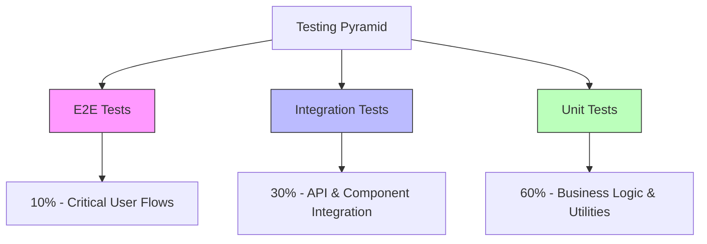

# 🧪 Testing Scenarios

> Comprehensive test cases for SHUNCOM RULR IoT Platform quality assurance


**Platform:** SHUNCOM RULR IoT Platform v1.1 | **Last Updated:** January 2025



---

## 🏗️ Testing Strategy Overview

### Testing Pyramid


### Test Categories
```yaml
Unit Tests:
  Coverage Target: 80%
  Focus: Business logic, utilities, validators
  
Integration Tests:
  Coverage Target: 70%
  Focus: API endpoints, database operations, service interactions
  
E2E Tests:
  Coverage Target: Critical paths
  Focus: User journeys, cross-system workflows
  
Performance Tests:
  Focus: Load testing, stress testing, scalability
  
Security Tests:
  Focus: Authentication, authorization, vulnerability scanning
```

---

## 👥 Authentication & User Management Tests

### Login Flow Tests
```yaml
TC-AUTH-001:
  Name: Successful login with valid credentials
  Priority: Critical
  Steps:
    1. Navigate to login page
    2. Enter valid username
    3. Enter valid password
    4. Click login button
  Expected:
    - User redirected to dashboard
    - JWT token stored in session
    - User info loaded correctly
    
TC-AUTH-002:
  Name: Login failure with invalid password
  Priority: Critical
  Steps:
    1. Navigate to login page
    2. Enter valid username
    3. Enter invalid password
    4. Click login button
  Expected:
    - Error message displayed
    - No token generated
    - Remain on login page
    
TC-AUTH-003:
  Name: Login failure with non-existent user
  Priority: High
  Steps:
    1. Navigate to login page
    2. Enter non-existent username
    3. Enter any password
    4. Click login button
  Expected:
    - Generic error message (no user enumeration)
    - No token generated
    
TC-AUTH-004:
  Name: Account lockout after failed attempts
  Priority: High
  Steps:
    1. Attempt login with wrong password 5 times
  Expected:
    - Account locked after 5 attempts
    - Lockout message displayed
    - Cannot login even with correct password
    
TC-AUTH-005:
  Name: Token refresh before expiry
  Priority: High
  Steps:
    1. Login successfully
    2. Wait until token near expiry
    3. Make API request
  Expected:
    - Token automatically refreshed
    - Request succeeds
    - New token stored
    
TC-AUTH-006:
  Name: Session timeout handling
  Priority: Medium
  Steps:
    1. Login successfully
    2. Remain inactive beyond session timeout
    3. Attempt to navigate
  Expected:
    - Redirect to login page
    - Session expired message
    - Previous work state preserved (if applicable)
```

### User Management Tests
```yaml
TC-USER-001:
  Name: Create new user with all required fields
  Priority: High
  Steps:
    1. Navigate to User Management
    2. Click "Add User"
    3. Fill all required fields
    4. Assign role
    5. Save
  Expected:
    - User created successfully
    - Appears in user list
    - Can login with new credentials
    
TC-USER-002:
  Name: Create user with duplicate username
  Priority: High
  Steps:
    1. Attempt to create user with existing username
  Expected:
    - Validation error displayed
    - User not created
    
TC-USER-003:
  Name: Assign management scope to user
  Priority: High
  Steps:
    1. Edit existing user
    2. Add management scope (specific projects)
    3. Save
  Expected:
    - User can only see devices in assigned scope
    - Other devices not visible
    
TC-USER-004:
  Name: Role permission enforcement
  Priority: Critical
  Steps:
    1. Login as user with limited role
    2. Attempt to access restricted feature
  Expected:
    - Access denied message
    - Action not performed
```

---

## 🔧 Device Management Tests

### Device CRUD Tests
```yaml
TC-DEV-001:
  Name: Add new gateway device
  Priority: Critical
  Steps:
    1. Navigate to Device Configuration
    2. Select "Smart Gateway" type
    3. Click "Add Device"
    4. Fill device name, MAC address, product
    5. Save
  Expected:
    - Device created successfully
    - Appears in device list
    - Status shows "Offline" initially
    
TC-DEV-002:
  Name: Add light controller with fixture association
  Priority: Critical
  Steps:
    1. Create lighting fixture first
    2. Create light controller
    3. Associate controller with fixture
    4. Save
  Expected:
    - Both devices created
    - Association visible
    - Lamp controllable in list
    
TC-DEV-003:
  Name: Add light controller without fixture
  Priority: High
  Steps:
    1. Create light controller
    2. Do not associate fixture
    3. Save
  Expected:
    - Device created
    - Warning: "Lamp uncontrollable without fixture"
    - Control buttons disabled
    
TC-DEV-004:
  Name: Batch import devices
  Priority: High
  Steps:
    1. Download device template
    2. Fill 100 device records
    3. Upload file
    4. Confirm import
  Expected:
    - All 100 devices imported
    - Import summary displayed
    - Error report for any failures
    
TC-DEV-005:
  Name: Batch import exceeds 5000 limit
  Priority: Medium
  Steps:
    1. Attempt to import file with 6000 devices
  Expected:
    - Error: "Maximum 5000 devices per import"
    - No devices imported
    
TC-DEV-006:
  Name: Delete device with bindings
  Priority: High
  Steps:
    1. Select device associated with rules/groups
    2. Click delete
  Expected:
    - Warning about existing bindings
    - List of bindings displayed
    - Must unbind before deletion
    
TC-DEV-007:
  Name: Restore device from recycle bin
  Priority: Medium
  Steps:
    1. Delete a device
    2. Navigate to Recycle Bin
    3. Select device
    4. Click Restore
  Expected:
    - Device restored to original location
    - Configuration preserved
    - Historical data lost (warning shown)
```

### Device Status & Control Tests
```yaml
TC-DEV-CTRL-001:
  Name: Turn on single light
  Priority: Critical
  Steps:
    1. Select online light controller
    2. Click "Turn On" button
  Expected:
    - Command sent successfully
    - Status updates to "On"
    - Real-time feedback
    
TC-DEV-CTRL-002:
  Name: Adjust brightness (dimming)
  Priority: Critical
  Steps:
    1. Select online light controller
    2. Set brightness to 50%
    3. Apply
  Expected:
    - Brightness command sent
    - Device reports 50% brightness
    - UI reflects new state
    
TC-DEV-CTRL-003:
  Name: Control offline device
  Priority: High
  Steps:
    1. Select offline device
    2. Attempt control operation
  Expected:
    - Warning: "Device is offline"
    - Option to queue command or cancel
    
TC-DEV-CTRL-004:
  Name: Bulk control multiple devices
  Priority: High
  Steps:
    1. Select 10 devices
    2. Click "Bulk Actions"
    3. Select "Turn On"
    4. Confirm
  Expected:
    - Commands sent to all devices
    - Progress indicator
    - Summary of success/failures
    
TC-DEV-CTRL-005:
  Name: Gateway sync operation
  Priority: High
  Steps:
    1. Select gateway with sub-devices
    2. Click "Sync" operation
  Expected:
    - Sub-device info synced
    - Sync status displayed
    - Errors reported for failed syncs
```

### Device Group Tests
```yaml
TC-GROUP-001:
  Name: Create regular device group
  Priority: High
  Steps:
    1. Navigate to Device Groups
    2. Click "Add Group"
    3. Enter group name
    4. Select devices to add
    5. Save
  Expected:
    - Group created
    - Devices associated
    - Group appears in list
    
TC-GROUP-002:
  Name: Create Zigbee multicast group
  Priority: High
  Steps:
    1. Select "Zigbee Multicast" type
    2. Enter group number (1-255)
    3. Add Zigbee light controllers
    4. Save and sync
  Expected:
    - Group created
    - Sync initiated to devices
    - Sync status tracked per device
    
TC-GROUP-003:
  Name: Control device group
  Priority: High
  Steps:
    1. Select device group
    2. Send control command
  Expected:
    - Command sent to all group members
    - Results aggregated
```

---

## ⚙️ Rule Engine Tests

### Platform Rule Tests
```yaml
TC-RULE-001:
  Name: Create time-based platform rule
  Priority: Critical
  Steps:
    1. Navigate to Platform Rules
    2. Click "Add Rule"
    3. Set trigger: Daily at 18:00
    4. Set action: Turn on lights at 80%
    5. Select target devices
    6. Save and enable
  Expected:
    - Rule created and enabled
    - Executes at scheduled time
    - All target devices respond
    
TC-RULE-002:
  Name: Create sunrise/sunset rule
  Priority: High
  Steps:
    1. Create rule with astronomical trigger
    2. Set action: Turn off at sunrise + 30 min
    3. Configure location for calculation
    4. Save
  Expected:
    - Rule calculates correct sunrise time
    - Adjusts daily based on date
    - Executes at correct time
    
TC-RULE-003:
  Name: Rule with multiple actions
  Priority: High
  Steps:
    1. Create rule with trigger
    2. Add action 1: Turn on Group A at 100%
    3. Add action 2: Turn on Group B at 50%
    4. Save
  Expected:
    - Both actions execute
    - Correct brightness per group
    
TC-RULE-004:
  Name: Rule execution conflict
  Priority: Medium
  Steps:
    1. Create Rule A: Turn on at 18:00
    2. Create Rule B: Turn off at 18:00
    3. Wait for execution
  Expected:
    - Both rules execute
    - Priority determines final state
    - Execution log shows both
    
TC-RULE-005:
  Name: Disable rule
  Priority: High
  Steps:
    1. Select enabled rule
    2. Click "Disable"
    3. Wait past trigger time
  Expected:
    - Rule marked disabled
    - No execution at trigger time
```

### Local Rule Tests
```yaml
TC-LOCAL-001:
  Name: Create local rule on gateway
  Priority: High
  Steps:
    1. Navigate to Local Rules
    2. Select gateway
    3. Create rule: If power > threshold, turn off
    4. Sync to gateway
  Expected:
    - Rule synced to gateway
    - Executes locally without platform
    - Platform shows execution log
    
TC-LOCAL-002:
  Name: Local rule with platform offline
  Priority: Critical
  Steps:
    1. Create local rule
    2. Sync to gateway
    3. Disconnect platform
    4. Trigger rule condition
  Expected:
    - Rule executes on gateway
    - Actions performed locally
    - Logs sync when platform reconnects
    
TC-LOCAL-003:
  Name: Clear local rules
  Priority: Medium
  Steps:
    1. Gateway has multiple local rules
    2. Click "Clear Local Rules"
    3. Confirm
  Expected:
    - All local rules removed
    - Gateway confirms deletion
```

### Alarm Rule Tests
```yaml
TC-ALARM-001:
  Name: Create device offline alarm
  Priority: Critical
  Steps:
    1. Navigate to Alarm Rules
    2. Create rule: Device offline > 5 minutes
    3. Set severity: Major
    4. Configure notification
    5. Save
  Expected:
    - Rule active
    - Alarm triggered when device offline
    - Notification sent
    
TC-ALARM-002:
  Name: Alarm acknowledgment
  Priority: High
  Steps:
    1. View active alarm
    2. Click "Acknowledge"
    3. Add notes
    4. Confirm
  Expected:
    - Alarm status: Acknowledged
    - Acknowledger and time recorded
    - Still visible until resolved
    
TC-ALARM-003:
  Name: Alarm auto-recovery
  Priority: High
  Steps:
    1. Alarm triggered (device offline)
    2. Device comes back online
  Expected:
    - Alarm auto-resolved
    - Resolution noted as automatic
    - New alarm if device goes offline again
    
TC-ALARM-004:
  Name: Alarm notification delivery
  Priority: High
  Steps:
    1. Configure email notification
    2. Trigger alarm condition
  Expected:
    - Email sent to configured recipients
    - Includes alarm details
    - Link to alarm in platform
```

---

## 📊 Dashboard Tests

### Dashboard Display Tests
```yaml
TC-DASH-001:
  Name: Dashboard loads with statistics
  Priority: Critical
  Steps:
    1. Login as user
    2. Navigate to Dashboard
  Expected:
    - Statistics widgets load
    - Device counts accurate
    - Charts render correctly
    
TC-DASH-002:
  Name: Real-time status updates
  Priority: High
  Steps:
    1. Open dashboard
    2. Change device status externally
  Expected:
    - Dashboard updates without refresh
    - Status change reflected immediately
    - No page reload required
    
TC-DASH-003:
  Name: Dashboard with project filter
  Priority: High
  Steps:
    1. Select specific project
    2. View dashboard
  Expected:
    - Statistics filtered to project
    - Only project devices shown
    - Charts reflect project data
    
TC-DASH-004:
  Name: GIS map device display
  Priority: High
  Steps:
    1. Navigate to Map view
    2. Zoom to project area
  Expected:
    - Devices displayed on map
    - Status colors correct
    - Click shows device info
    
TC-DASH-005:
  Name: Map clustering at zoom levels
  Priority: Medium
  Steps:
    1. View map with 1000+ devices
    2. Zoom out
    3. Zoom in
  Expected:
    - Devices cluster when zoomed out
    - Clusters expand on zoom
    - Performance remains smooth
```

---

## ⚡ Performance Tests

### Load Testing Scenarios
```yaml
TC-PERF-001:
  Name: Concurrent user login
  Parameters:
    Users: 100 concurrent
    Duration: 5 minutes
  Expected:
    - All logins complete
    - Response time < 2 seconds
    - No errors
    
TC-PERF-002:
  Name: Device list pagination
  Parameters:
    Total devices: 50,000
    Page size: 100
  Expected:
    - Page load < 500ms
    - Smooth pagination
    - No memory leaks
    
TC-PERF-003:
  Name: Bulk device control
  Parameters:
    Devices: 1000
    Concurrent commands: 100
  Expected:
    - Commands queued efficiently
    - Progress feedback
    - Complete within 30 seconds
    
TC-PERF-004:
  Name: Real-time dashboard updates
  Parameters:
    Active devices: 10,000
    Update frequency: 1 second
  Expected:
    - WebSocket stable
    - No dropped updates
    - CPU usage < 50%
    
TC-PERF-005:
  Name: Report generation
  Parameters:
    Data range: 1 year
    Devices: 10,000
  Expected:
    - Report generates < 30 seconds
    - Progress indicator shown
    - Export completes successfully
```

### Stress Testing Scenarios
```yaml
TC-STRESS-001:
  Name: System under extreme load
  Parameters:
    Users: 500 concurrent
    Duration: 1 hour
  Expected:
    - Graceful degradation
    - No crashes
    - Recovery after load reduces
    
TC-STRESS-002:
  Name: Database connection exhaustion
  Parameters:
    Connections: Max pool + 50%
  Expected:
    - Connection queuing works
    - Appropriate error messages
    - No data corruption
```

---

## 🔐 Security Tests

### Authentication Security
```yaml
TC-SEC-001:
  Name: SQL injection in login
  Steps:
    1. Enter "admin' OR '1'='1" as username
    2. Attempt login
  Expected:
    - Login fails
    - No SQL error exposed
    - Input sanitized
    
TC-SEC-002:
  Name: XSS in user input fields
  Steps:
    1. Enter "<script>alert('xss')</script>" in device name
    2. Save and view
  Expected:
    - Script not executed
    - Content escaped
    
TC-SEC-003:
  Name: CSRF protection
  Steps:
    1. Craft request without CSRF token
    2. Attempt state-changing operation
  Expected:
    - Request rejected
    - CSRF error returned
    
TC-SEC-004:
  Name: JWT token validation
  Steps:
    1. Modify JWT token payload
    2. Send request with modified token
  Expected:
    - Token validation fails
    - 401 Unauthorized returned
    
TC-SEC-005:
  Name: Authorization bypass attempt
  Steps:
    1. Login as limited user
    2. Directly access admin API endpoint
  Expected:
    - 403 Forbidden
    - Action not performed
    - Audit log entry created
```

---

## 🔗 Related Documentation

### Test Implementation
- **[07-Development Roadmap](../07-Dashboard/07-Development%20Roadmap.md)**: Testing phase timeline
- **[API Design Patterns](API%20Design%20Patterns.md)**: API testing reference
- **[Database Schema](../02-System-Architecture/Database%20Schema.md)**: Data for test fixtures

### Quality Standards
- **[Performance Benchmarks](Performance%20Benchmarks.md)**: Performance requirements
- **[Feature Requirements Checklist](../Feature%20Requirements%20Checklist.md)**: Feature coverage tracking

---

**Next Steps**: Implement test automation framework, create test data generators, and integrate with CI/CD pipeline.
