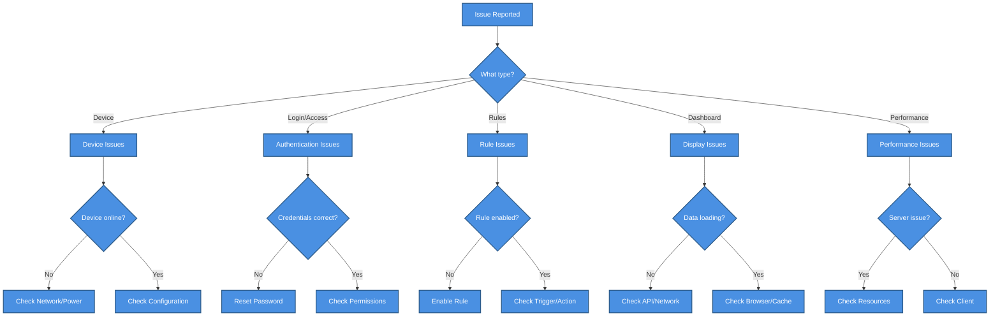

# 🔧 Troubleshooting Guide

> Common issues and solutions for SHUNCOM RULR IoT Platform


**Platform:** SHUNCOM RULR IoT Platform v1.1 | **Last Updated:** January 2025



---

## 📋 Quick Diagnostic Flowchart


    classDef default fill:#4A90E2,stroke:#2E5C8A,stroke-width:2px,color:#fff
    classDef primary fill:#7B68EE,stroke:#5A4FC4,stroke-width:2px,color:#fff
    classDef success fill:#50C878,stroke:#3A9B5C,stroke-width:2px,color:#fff
    classDef warning fill:#FFA500,stroke:#CC8400,stroke-width:2px,color:#fff
    classDef danger fill:#FF6B6B,stroke:#CC5555,stroke-width:2px,color:#fff


---

## 🔌 Device Issues

### DEV-001: Device Shows Offline

**Symptoms:**
- Device status shows "Offline" in platform
- Cannot control device
- No data updates from device

**Diagnostic Steps:**
1. Check physical device power
2. Check network connectivity
3. Verify device configuration
4. Check gateway status (for sub-devices)

**Solutions:**

| Cause | Solution |
|-------|----------|
| Power issue | Verify power supply, check circuit breakers |
| Network issue | Check cables, WiFi signal, firewall rules |
| Configuration error | Verify device number, gateway association |
| Gateway offline | Resolve gateway issues first |
| Device malfunction | Restart device, check hardware |

**Verification:**
```yaml
Steps:
  1. Device status changes to "Online"
  2. Real-time data starts updating
  3. Control commands work
```

---

### DEV-002: Light Controller Not Controlling Lamp

**Symptoms:**
- Light controller is online
- Control commands are sent
- Lamp does not respond

**Root Cause Checklist:**
- [ ] Lighting fixture associated with controller?
- [ ] Physical connection between controller and lamp?
- [ ] Lamp/fixture functional?
- [ ] Dimming range configured correctly?

**Solutions:**

```yaml
Missing Fixture Association:
  1. Navigate to Device Configuration
  2. Edit the light controller
  3. Associate with lighting fixture
  4. Save and verify
  
Physical Connection:
  1. Check wiring between controller and lamp
  2. Verify voltage compatibility
  3. Test with multimeter if needed
  
Lamp Malfunction:
  1. Test lamp directly (bypass controller)
  2. Replace lamp if faulty
```

**Key Point:** Controller MUST have fixture association to control lamps.

---

### DEV-003: Gateway Not Syncing Sub-devices

**Symptoms:**
- Gateway online but sub-devices not appearing
- Sync operation fails or times out
- Sub-devices show stale data

**Diagnostic Steps:**
```yaml
1. Check Gateway Status:
   - Online status: ✓
   - Communication status: ✓
   - Last sync time: Check timestamp

2. Check Sub-device Configuration:
   - Correct gateway association
   - Valid device addresses
   - Protocol compatibility

3. Check Network:
   - Gateway-platform connectivity
   - Internal network (Zigbee/LoRa)
```

**Solutions:**

| Issue | Action |
|-------|--------|
| Gateway overloaded | Reduce number of sub-devices, restart gateway |
| Network congestion | Check Zigbee channels, reduce interference |
| Protocol mismatch | Verify sub-device protocol matches gateway |
| Outdated firmware | Update gateway firmware |

**Manual Sync:**
1. Navigate to Device Configuration → Gateways
2. Select the gateway
3. Click "Device Sync" operation
4. Monitor sync progress

---

### DEV-004: LoRa Device Not Joining Network

**Symptoms:**
- LoRa device shows offline
- Join requests failing
- No data from device

**OTAA Mode Checklist:**
```yaml
Check Parameters:
  - [ ] DEVEUI correct and unique
  - [ ] APPEUI matches LoRa server configuration
  - [ ] APPKEY correct (32 hex characters)
  - [ ] DEV_PROFILE matches device class

Common Issues:
  - APPEUI/APPKEY mismatch with server
  - Device already joined with different keys
  - Frequency band mismatch
```

**ABP Mode Checklist:**
```yaml
Check Parameters:
  - [ ] DEVADDR assigned and unique
  - [ ] APPSKEY correct
  - [ ] NWKSKEY correct
  - [ ] Frame counters synced
```

**Solutions:**
1. Verify all keys match between device and LoRa server
2. Reset device and rejoin
3. Check LoRa server logs for join failures
4. Verify frequency plan matches regional settings

---

## 🔐 Authentication Issues

### AUTH-001: Cannot Login

**Symptoms:**
- Login page accessible
- Credentials rejected
- No error message or generic error

**Diagnostic Steps:**
```yaml
1. Verify Credentials:
   - Username correct (case-sensitive)
   - Password correct
   - No leading/trailing spaces

2. Check Account Status:
   - Account not locked
   - Account not disabled
   - Password not expired

3. Check System:
   - Auth service running
   - Database accessible
   - Network connectivity
```

**Solutions:**

| Cause | Solution |
|-------|----------|
| Wrong password | Use "Forgot Password" or admin reset |
| Account locked | Wait for lockout period or admin unlock |
| Account disabled | Contact administrator |
| Password expired | Reset password through admin |
| System issue | Check server logs, restart services |

---

### AUTH-002: Permission Denied Errors

**Symptoms:**
- User can login
- Certain features/pages inaccessible
- "Permission Denied" or 403 errors

**Diagnostic Steps:**
```yaml
1. Identify Required Permission:
   - What action was attempted?
   - What resource was accessed?

2. Check User's Role:
   - Current role assignment
   - Role's permission list

3. Check Management Scope:
   - User's assigned scope
   - Resource within scope?
```

**Solutions:**
```yaml
Add Permission:
  1. Admin navigates to User Management
  2. Edit user's role or assign new role
  3. Verify role has required permission

Extend Scope:
  1. Admin edits user's management scope
  2. Add required projects/groups to scope
  3. User logs out and back in
```

---

### AUTH-003: Session Expired Unexpectedly

**Symptoms:**
- User logged out without action
- "Session Expired" messages
- Frequent re-login required

**Causes & Solutions:**

| Cause | Solution |
|-------|----------|
| Inactivity timeout | Configure longer timeout if appropriate |
| Token expiry | Check token refresh mechanism |
| Multiple sessions | Check concurrent session limits |
| Clock skew | Sync server time (NTP) |
| Cookie issues | Clear browser cookies, check cookie settings |

---

## ⚙️ Rule Issues

### RULE-001: Platform Rule Not Executing

**Symptoms:**
- Rule enabled and configured
- Trigger time passed
- No execution in history

**Diagnostic Checklist:**
```yaml
Rule Configuration:
  - [ ] Rule status is "Enabled"
  - [ ] Valid date range (start/end dates)
  - [ ] Correct trigger configuration
  - [ ] Target devices selected
  - [ ] Target devices online

System Checks:
  - [ ] Rule engine service running
  - [ ] Correct timezone configured
  - [ ] No conflicting rules
```

**Solutions:**

```yaml
Time-based Rule Not Triggering:
  1. Verify platform timezone setting
  2. Check rule's scheduled time matches intended time
  3. Verify date range includes today
  4. Check rule execution logs for errors

Event-based Rule Not Triggering:
  1. Verify trigger event is occurring
  2. Check event conditions are met
  3. Verify event source is correct
```

---

### RULE-002: Local Rule Not Working Offline

**Symptoms:**
- Local rule configured
- Gateway offline from platform
- Rule not executing locally

**Diagnostic Steps:**
```yaml
1. Verify Rule Synced:
   - Check sync status in platform
   - Verify rule present on gateway

2. Check Gateway:
   - Gateway powered and running
   - Local rule storage not full
   - No local rule errors

3. Test Trigger:
   - Manually trigger condition
   - Check gateway logs
```

**Solutions:**
1. Re-sync local rules to gateway
2. Clear gateway rule storage and re-sync
3. Check gateway firmware supports local rules
4. Verify trigger conditions can be evaluated locally

---

### RULE-003: Alarm Rule Not Generating Alarms

**Symptoms:**
- Alarm condition should trigger
- No alarm generated
- No notification sent

**Checklist:**
```yaml
Rule Configuration:
  - [ ] Alarm rule enabled
  - [ ] Correct condition configured
  - [ ] Severity level set
  - [ ] Notification configured

Condition Check:
  - [ ] Device reporting correct metrics
  - [ ] Threshold value appropriate
  - [ ] Duration requirement met

Notification Check:
  - [ ] Email/SMS configured
  - [ ] Recipients valid
  - [ ] Notification service running
```

---

## 📊 Dashboard Issues

### DASH-001: Dashboard Not Loading Data

**Symptoms:**
- Dashboard page loads
- Widgets show loading or empty
- Statistics not displaying

**Diagnostic Steps:**
```yaml
1. Browser Console:
   - Open developer tools (F12)
   - Check for JavaScript errors
   - Check network requests for failures

2. API Check:
   - Are dashboard APIs responding?
   - Check for 401/403/500 errors

3. Data Check:
   - Are there devices in the system?
   - Is user's scope correct?
```

**Solutions:**

| Issue | Solution |
|-------|----------|
| API errors | Check backend services, review logs |
| No data in scope | Verify user management scope |
| Browser cache | Clear cache and reload |
| JavaScript error | Check for frontend bugs, update browser |

---

### DASH-002: Map Not Displaying Devices

**Symptoms:**
- Map loads but no markers
- Devices exist but not on map
- Cluster markers not expanding

**Checklist:**
```yaml
Device Location:
  - [ ] Devices have coordinates set
  - [ ] Coordinates within visible map bounds
  - [ ] GIS data format correct

Map Configuration:
  - [ ] Map service accessible
  - [ ] API key valid (if required)
  - [ ] User has map viewing permission
```

**Solutions:**
1. Set coordinates for devices without location
2. Zoom/pan map to device locations
3. Check map service configuration
4. Verify map API quotas not exceeded

---

### DASH-003: Real-time Updates Not Working

**Symptoms:**
- Dashboard shows stale data
- Device status not updating
- Manual refresh required

**Diagnostic Steps:**
```yaml
1. WebSocket Connection:
   - Check browser console for WS errors
   - Verify WS connection established
   - Check for disconnection messages

2. Network:
   - WebSocket port accessible?
   - Firewall blocking WS?
   - Proxy configured for WS?

3. Backend:
   - WebSocket service running?
   - Message broker functioning?
```

**Solutions:**
1. Refresh page to re-establish WebSocket
2. Check network/firewall for WebSocket support
3. Verify WebSocket service is running
4. Check browser compatibility

---

## ⚡ Performance Issues

### PERF-001: Slow Page Loading

**Symptoms:**
- Pages take long to load
- Timeouts on data loading
- Slow navigation

**Diagnostic Approach:**
```yaml
Client-side:
  - Browser developer tools → Network tab
  - Identify slow requests
  - Check bundle sizes

Server-side:
  - Check API response times
  - Database query performance
  - Server resource utilization
```

**Solutions:**

| Bottleneck | Solution |
|------------|----------|
| Large data sets | Implement pagination, reduce page size |
| Slow queries | Add database indexes, optimize queries |
| High server load | Scale resources, add caching |
| Large frontend bundle | Enable lazy loading, code splitting |
| Network latency | Use CDN, optimize API calls |

---

### PERF-002: High Memory Usage

**Symptoms:**
- Browser becomes slow
- Server memory alerts
- Out of memory errors

**Client-side Solutions:**
```yaml
Actions:
  1. Close unused browser tabs
  2. Clear browser cache
  3. Reduce data displayed (pagination)
  4. Avoid keeping many devices in view
```

**Server-side Solutions:**
```yaml
Actions:
  1. Check for memory leaks in application
  2. Increase server memory
  3. Implement connection pooling
  4. Review cache eviction policies
  5. Optimize large data processing
```

---

## 🔗 Quick Reference Links

### Related Documentation
- **[03-Device Management Hub](../03-Device-Management/03-Device%20Management%20Hub.md)**: Device configuration details
- **[04-Rule Engine System](../04-Rule-Management/04-Rule%20Engine%20System.md)**: Rule configuration
- **[02-Authentication System](../02-System-Architecture/02-Authentication%20System.md)**: User management
- **[06-Dashboard Interface](../06-Project-Management/06-Dashboard%20Interface.md)**: Dashboard features
- **[Performance Benchmarks](Performance%20Benchmarks.md)**: Expected performance

### Templates
- **[Troubleshooting Template](../99-Templates/Troubleshooting%20Template.md)**: Document new issues
- **[Device Configuration Template](../99-Templates/Device%20Configuration%20Template.md)**: Device setup reference

---

## 📞 Escalation Path

```yaml
Level 1 - Self-Service:
  - Check this troubleshooting guide
  - Review related documentation
  - Check system status page

Level 2 - Support Team:
  - Submit support ticket with details
  - Include error messages and screenshots
  - Provide steps to reproduce

Level 3 - Engineering:
  - Complex technical issues
  - Bug reports
  - Feature limitations
```

---

**Tip:** Always collect error messages, timestamps, and steps to reproduce before escalating issues. This speeds up resolution significantly.
