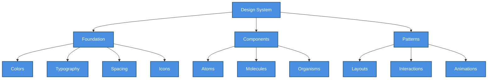

# 🎨 UI Component Library

> Reusable UI components for SHUNCOM RULR IoT Platform frontend development


**Platform:** SHUNCOM RULR IoT Platform v1.1 | **Last Updated:** January 2025



---

## 🏗️ Component Architecture Overview

### Design System Structure

    classDef default fill:#4A90E2,stroke:#2E5C8A,stroke-width:2px,color:#fff
    classDef primary fill:#7B68EE,stroke:#5A4FC4,stroke-width:2px,color:#fff
    classDef success fill:#50C878,stroke:#3A9B5C,stroke-width:2px,color:#fff
    classDef warning fill:#FFA500,stroke:#CC8400,stroke-width:2px,color:#fff
    classDef danger fill:#FF6B6B,stroke:#CC5555,stroke-width:2px,color:#fff


---

## 🎨 Foundation Layer

### Color Palette
```yaml
Primary Colors:
  primary-500: "#2563EB"      # Main brand color
  primary-600: "#1D4ED8"      # Hover states
  primary-700: "#1E40AF"      # Active states
  primary-100: "#DBEAFE"      # Light backgrounds

Status Colors:
  success: "#10B981"          # Online, success states
  warning: "#F59E0B"          # Warning, caution
  error: "#EF4444"            # Errors, offline states
  info: "#3B82F6"             # Information

Device Status Colors:
  online: "#10B981"           # Device connected
  offline: "#6B7280"          # Device disconnected
  alarm: "#EF4444"            # Device in alarm
  warning: "#F59E0B"          # Device warning state

Neutral Colors:
  gray-50: "#F9FAFB"          # Page background
  gray-100: "#F3F4F6"         # Card backgrounds
  gray-200: "#E5E7EB"         # Borders
  gray-500: "#6B7280"         # Secondary text
  gray-700: "#374151"         # Primary text
  gray-900: "#111827"         # Headings
```

### Typography Scale
```yaml
Font Family:
  primary: "Inter, -apple-system, BlinkMacSystemFont, sans-serif"
  monospace: "JetBrains Mono, Monaco, Consolas, monospace"

Font Sizes:
  xs: "0.75rem"     # 12px - Captions, badges
  sm: "0.875rem"    # 14px - Secondary text
  base: "1rem"      # 16px - Body text
  lg: "1.125rem"    # 18px - Subheadings
  xl: "1.25rem"     # 20px - Card titles
  2xl: "1.5rem"     # 24px - Section headers
  3xl: "1.875rem"   # 30px - Page titles

Line Heights:
  tight: 1.25
  normal: 1.5
  relaxed: 1.75
```

### Spacing System
```yaml
Spacing Scale:
  0: "0"
  1: "0.25rem"    # 4px
  2: "0.5rem"     # 8px
  3: "0.75rem"    # 12px
  4: "1rem"       # 16px
  5: "1.25rem"    # 20px
  6: "1.5rem"     # 24px
  8: "2rem"       # 32px
  10: "2.5rem"    # 40px
  12: "3rem"      # 48px
  16: "4rem"      # 64px

Border Radius:
  none: "0"
  sm: "0.125rem"   # 2px
  default: "0.25rem" # 4px
  md: "0.375rem"   # 6px
  lg: "0.5rem"     # 8px
  xl: "0.75rem"    # 12px
  2xl: "1rem"      # 16px
  full: "9999px"   # Circular
```

---

## 🔷 Atom Components

### Button Component
```yaml
Button Variants:
  Primary:
    background: primary-500
    hover: primary-600
    text: white
    use: Main actions, form submissions
    
  Secondary:
    background: gray-100
    hover: gray-200
    text: gray-700
    use: Secondary actions, cancel buttons
    
  Danger:
    background: error
    hover: error-dark
    text: white
    use: Destructive actions, delete operations
    
  Ghost:
    background: transparent
    hover: gray-100
    text: gray-700
    use: Tertiary actions, inline actions

Button Sizes:
  xs: "h-6 px-2 text-xs"
  sm: "h-8 px-3 text-sm"
  md: "h-10 px-4 text-base"
  lg: "h-12 px-6 text-lg"

Button States:
  - Default
  - Hover
  - Active
  - Disabled
  - Loading (with spinner)
```

### Status Badge Component
```yaml
Status Badges:
  Online:
    dot: success
    background: success-light
    text: "Online"
    
  Offline:
    dot: gray-500
    background: gray-100
    text: "Offline"
    
  Alarm:
    dot: error
    background: error-light
    text: "Alarm"
    animation: pulse
    
  Warning:
    dot: warning
    background: warning-light
    text: "Warning"

Badge Sizes:
  sm: "h-5 px-2 text-xs"
  md: "h-6 px-3 text-sm"
  lg: "h-7 px-4 text-base"
```

### Icon System
```yaml
Icon Categories:
  Device Icons:
    - gateway: Gateway device
    - light-controller: Smart light controller
    - fixture: Lighting fixture
    - pole: Lighting pole
    - distribution: Power distribution
    - loop: Loop control
    - meter: Smart meter
    
  Action Icons:
    - switch-on: Turn on
    - switch-off: Turn off
    - dim: Adjust brightness
    - configure: Settings
    - delete: Remove
    - edit: Modify
    - sync: Synchronize
    
  Status Icons:
    - check-circle: Success
    - x-circle: Error
    - alert-triangle: Warning
    - info-circle: Information
    - clock: Pending
    
  Navigation Icons:
    - home: Dashboard
    - devices: Device management
    - rules: Rule engine
    - users: User management
    - settings: Configuration
    - map: GIS view

Icon Sizes:
  xs: "12px"
  sm: "16px"
  md: "20px"
  lg: "24px"
  xl: "32px"
```

### Input Components
```yaml
Text Input:
  States:
    - Default (gray-200 border)
    - Focus (primary-500 border + ring)
    - Error (error border + message)
    - Disabled (gray-100 background)
    
  Variants:
    - Standard
    - With left icon
    - With right icon
    - With prefix/suffix
    - Search input

Select Input:
  Features:
    - Single select
    - Multi-select
    - Searchable
    - Grouped options
    - Custom option rendering

Number Input:
  Features:
    - Stepper controls
    - Range validation
    - Percentage mode
    - Unit suffix
```

---

## 🔶 Molecule Components

### Device Card Component
```yaml
Device Card:
  Layout:
    - Status indicator (top-left dot)
    - Device type icon (top-right)
    - Device name (title)
    - Device ID/MAC (subtitle)
    - Status badge
    - Quick actions (bottom)
    
  Variants:
    Compact:
      height: "auto"
      content: Name, status, ID
      
    Standard:
      height: "180px"
      content: Name, status, ID, metrics preview
      
    Detailed:
      height: "240px"
      content: Full info, controls, charts

  Interactive States:
    - Default
    - Hover (elevation + border highlight)
    - Selected (primary border)
    - Loading (skeleton)
```

### Data Table Component
```yaml
Table Features:
  Core:
    - Sortable columns
    - Column resizing
    - Row selection (checkbox)
    - Pagination
    - Row actions menu
    
  Advanced:
    - Bulk actions
    - Column visibility toggle
    - Search/filter row
    - Export functionality
    - Custom cell renderers
    
  Specialized Renderers:
    StatusCell: Status badge with icon
    DeviceCell: Device name + type icon
    DateCell: Formatted date/time
    ActionCell: Action buttons
    MetricCell: Value + unit + trend
```

### Search & Filter Component
```yaml
Search Features:
  - Real-time search
  - Debounced input
  - Clear button
  - Search history
  
Filter Panel:
  Filter Types:
    - Select filter (single/multi)
    - Date range filter
    - Numeric range filter
    - Status filter (checkbox group)
    - Tag filter
    
  Behavior:
    - Collapsible panel
    - Active filter count badge
    - Clear all filters
    - Save filter presets
```

### Metric Card Component
```yaml
Metric Card:
  Elements:
    - Metric label
    - Metric value (large)
    - Unit indicator
    - Trend indicator (up/down/neutral)
    - Comparison period
    - Mini sparkline (optional)
    
  Variants:
    Simple: Label + value + unit
    WithTrend: + trend indicator + percentage
    WithChart: + mini line/bar chart
    
  Sizes:
    sm: Single metric, compact
    md: Standard dashboard card
    lg: Featured metric with chart
```

---

## 🔷 Organism Components

### Device List View
```yaml
Device List:
  Views:
    Table View:
      - Sortable columns
      - Inline status
      - Quick actions
      - Batch selection
      
    Grid View:
      - Device cards
      - Configurable columns (2-6)
      - Load more / infinite scroll
      
    Map View:
      - GIS integration
      - Device markers
      - Cluster markers
      - Status-based coloring
      
  Common Features:
    - View toggle (table/grid/map)
    - Search bar
    - Filter panel
    - Bulk operations toolbar
    - Export button
    - Refresh button
```

### Rule Configuration Panel
```yaml
Rule Builder:
  Sections:
    Basic Info:
      - Rule name
      - Rule type (platform/local/alarm)
      - Description
      
    Trigger Configuration:
      - Time-based trigger
      - Event-based trigger
      - Condition-based trigger
      
    Action Configuration:
      - Target selection (devices/groups)
      - Action type (on/off/dim/custom)
      - Action parameters
      
    Schedule (if applicable):
      - Execution time
      - Repeat pattern
      - Active period
      
  UI Pattern:
    - Wizard-style steps OR
    - Accordion sections
    - Visual rule preview
    - Test/simulate button
```

### Dashboard Widget System
```yaml
Widget Types:
  Statistical Widgets:
    - Total device count
    - Online/offline ratio
    - Alarm count
    - Energy consumption
    
  Chart Widgets:
    - Energy trend (line)
    - Device status distribution (pie/donut)
    - Alarm frequency (bar)
    - Real-time power (area)
    
  Map Widget:
    - Full GIS map
    - Device distribution
    - Status overlay
    
  Control Widget:
    - Quick device control
    - Group control buttons
    - Scene activation

Widget Configuration:
  - Drag-and-drop placement
  - Resize handles
  - Widget settings modal
  - Data source selection
  - Refresh interval
```

### GIS Map Component
```yaml
Map Features:
  Base Map:
    - Multiple map providers
    - Satellite/terrain toggle
    - Zoom controls
    - Fullscreen mode
    
  Device Layer:
    - Device markers
    - Cluster markers (zoom-dependent)
    - Status-based marker colors
    - Custom device icons
    
  Interaction:
    - Click for device popup
    - Hover for quick info
    - Draw selection rectangle
    - Pan and zoom
    
  Overlays:
    - Project boundaries
    - Region highlighting
    - Connection lines
    - Heatmap (device density)
    
  Controls:
    - Layer toggle
    - Device filter
    - Search location
    - Current location
```

---

## 📐 Layout Patterns

### Page Layouts
```yaml
Dashboard Layout:
  Header: Fixed, 64px height
  Sidebar: Collapsible, 240px width
  Main: Fluid, scroll container
  
  Responsive Breakpoints:
    - Desktop: Sidebar + main
    - Tablet: Collapsed sidebar
    - Mobile: Bottom navigation
    
Settings Layout:
  Pattern: Sidebar navigation + content area
  Sidebar: Category navigation
  Content: Settings forms
  
Device Detail Layout:
  Pattern: Header + tabs + content
  Header: Device info + status + actions
  Tabs: Overview, Configuration, History, Alarms
  Content: Tab-specific content
```

### Navigation Patterns
```yaml
Primary Navigation:
  Location: Left sidebar
  Style: Icon + label
  Behavior: Collapsible to icons-only
  
Secondary Navigation:
  Location: Tabs within content area
  Style: Tab bar
  
Breadcrumbs:
  Location: Below header
  Format: "Home > Devices > Gateways > Gateway_001"
  
Context Menu:
  Trigger: Right-click or action button
  Content: Context-specific actions
```

---

## 🎭 Interaction Patterns

### Loading States
```yaml
Loading Patterns:
  Page Loading:
    - Full page skeleton
    - Progress bar in header
    
  Component Loading:
    - Skeleton placeholder
    - Inline spinner
    
  Action Loading:
    - Button spinner
    - Disabled state
    - Progress indicator
    
  Table Loading:
    - Row skeletons
    - Overlay spinner
```

### Empty States
```yaml
Empty State Components:
  No Data:
    icon: Illustration
    title: "No devices found"
    description: "Add your first device to get started"
    action: "Add Device" button
    
  No Results:
    icon: Search illustration
    title: "No results match your search"
    description: "Try different keywords or filters"
    action: "Clear filters" button
    
  Error State:
    icon: Error illustration
    title: "Something went wrong"
    description: Error message
    action: "Retry" button
```

### Notification Patterns
```yaml
Toast Notifications:
  Types:
    - Success (green)
    - Error (red)
    - Warning (yellow)
    - Info (blue)
    
  Position: Top-right
  Duration: 5 seconds (auto-dismiss)
  Actions: Dismiss button, action link
  
Modal Notifications:
  Confirmation:
    - Title + message
    - Cancel + Confirm buttons
    
  Alert:
    - Icon + title + message
    - Acknowledge button
    
  Destructive:
    - Warning icon
    - Type-to-confirm pattern
    - Clear warning message
```

---

## 🔗 Related Documentation

### Dependencies
- **[07-Development Roadmap](../07-Dashboard/07-Development%20Roadmap.md)**: Implementation timeline
- **[06-Dashboard Interface](../06-Project-Management/06-Dashboard%20Interface.md)**: Dashboard requirements
- **[API Design Patterns](API%20Design%20Patterns.md)**: Data integration patterns

### Usage Guides
- **[Feature Requirements Checklist](../Feature%20Requirements%20Checklist.md)**: Feature tracking
- **[Testing Scenarios](Testing%20Scenarios.md)**: Component testing

---

**Next Steps**: Implement core atoms first, then compose molecules and organisms. Use this guide as the single source of truth for UI consistency.
