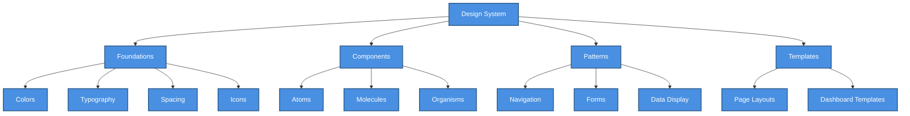

# 🎨 UI Design Guidelines

> Design system standards, component guidelines, and UI/UX best practices for the SHUNCOM RULR platform


**Platform:** SHUNCOM RULR IoT Platform v1.1 | **Last Updated:** January 2025



---

## 📋 Design System Overview

### Design Principles

```yaml
1. Clarity First:
   - Information should be immediately understandable
   - Prioritize data visibility in control interfaces
   - Avoid decorative elements that obscure meaning
   
2. Consistency:
   - Same action = same appearance everywhere
   - Predictable behavior builds user confidence
   - Unified visual language across all modules
   
3. Efficiency:
   - Minimize clicks for common operations
   - Support keyboard navigation
   - Optimize for repeat usage patterns
   
4. Accessibility:
   - WCAG 2.1 AA compliance minimum
   - Support for screen readers
   - Color-blind friendly palettes
   
5. Responsiveness:
   - Desktop-first, but mobile-capable
   - Touch-friendly targets on applicable devices
   - Graceful degradation on smaller screens
```

### Design System Architecture


    classDef default fill:#4A90E2,stroke:#2E5C8A,stroke-width:2px,color:#fff
    classDef primary fill:#7B68EE,stroke:#5A4FC4,stroke-width:2px,color:#fff
    classDef success fill:#50C878,stroke:#3A9B5C,stroke-width:2px,color:#fff
    classDef warning fill:#FFA500,stroke:#CC8400,stroke-width:2px,color:#fff
    classDef danger fill:#FF6B6B,stroke:#CC5555,stroke-width:2px,color:#fff


---

## 🎨 Color System

### Primary Palette

```yaml
Brand Colors:
  Primary:
    50:  "#EFF6FF"  # Light background
    100: "#DBEAFE"  # Hover states
    200: "#BFDBFE"  # Borders
    300: "#93C5FD"  # Disabled states
    400: "#60A5FA"  # Icons
    500: "#3B82F6"  # Primary buttons, links
    600: "#2563EB"  # Hover state
    700: "#1D4ED8"  # Active state
    800: "#1E40AF"  # Text on light
    900: "#1E3A8A"  # Dark text
    
  Secondary:
    500: "#6366F1"  # Indigo accent
    
  Neutral:
    50:  "#FAFAFA"  # Page background
    100: "#F4F4F5"  # Card backgrounds
    200: "#E4E4E7"  # Borders
    300: "#D4D4D8"  # Disabled elements
    400: "#A1A1AA"  # Placeholder text
    500: "#71717A"  # Secondary text
    600: "#52525B"  # Body text
    700: "#3F3F46"  # Headers
    800: "#27272A"  # Dark text
    900: "#18181B"  # Darkest text
```

### Semantic Colors

```yaml
Status Colors:
  Success:
    light: "#DCFCE7"  # Background
    main:  "#22C55E"  # Icons, borders
    dark:  "#166534"  # Text
    
  Warning:
    light: "#FEF3C7"
    main:  "#F59E0B"
    dark:  "#92400E"
    
  Error:
    light: "#FEE2E2"
    main:  "#EF4444"
    dark:  "#991B1B"
    
  Info:
    light: "#DBEAFE"
    main:  "#3B82F6"
    dark:  "#1E40AF"
    
Device Status:
  online:   "#22C55E"  # Green
  offline:  "#EF4444"  # Red
  warning:  "#F59E0B"  # Amber
  inactive: "#9CA3AF"  # Gray
```

### Dark Mode Palette

```yaml
Dark Mode Colors:
  Background:
    page:    "#0F172A"  # Slate 900
    surface: "#1E293B"  # Slate 800
    elevated: "#334155" # Slate 700
    
  Text:
    primary:   "#F8FAFC"  # Slate 50
    secondary: "#CBD5E1"  # Slate 300
    disabled:  "#64748B"  # Slate 500
    
  Borders:
    default: "#334155"  # Slate 700
    focus:   "#3B82F6"  # Primary
```

### Color Usage Guidelines

```yaml
DO:
  ✅ Use semantic colors for status indication
  ✅ Maintain 4.5:1 contrast ratio for text
  ✅ Use color + icon/text for accessibility
  ✅ Test colors in both light and dark modes
  
DON'T:
  ❌ Rely on color alone to convey meaning
  ❌ Use more than 5 colors per view
  ❌ Mix warm and cool colors without purpose
  ❌ Use pure black (#000) for text
```

---

## 🔤 Typography

### Font Stack

```yaml
Primary Font: Inter (sans-serif)
Fallbacks: -apple-system, BlinkMacSystemFont, 'Segoe UI', Roboto, sans-serif

Monospace: 'JetBrains Mono', 'Fira Code', Consolas, monospace
  Use for: Code, device IDs, technical values
```

### Type Scale

```yaml
Headings:
  h1:
    size: 2.25rem (36px)
    weight: 700 (Bold)
    line-height: 1.2
    use: Page titles
    
  h2:
    size: 1.875rem (30px)
    weight: 600 (Semi-bold)
    line-height: 1.25
    use: Section headers
    
  h3:
    size: 1.5rem (24px)
    weight: 600
    line-height: 1.3
    use: Card titles
    
  h4:
    size: 1.25rem (20px)
    weight: 600
    line-height: 1.4
    use: Subsection headers
    
  h5:
    size: 1.125rem (18px)
    weight: 600
    line-height: 1.4
    use: Widget titles
    
  h6:
    size: 1rem (16px)
    weight: 600
    line-height: 1.5
    use: List headers

Body Text:
  large:
    size: 1.125rem (18px)
    weight: 400
    line-height: 1.6
    
  default:
    size: 1rem (16px)
    weight: 400
    line-height: 1.5
    
  small:
    size: 0.875rem (14px)
    weight: 400
    line-height: 1.5
    
  caption:
    size: 0.75rem (12px)
    weight: 400
    line-height: 1.4
```

### Typography Guidelines

```yaml
DO:
  ✅ Use sentence case for UI text
  ✅ Limit line length to 65-75 characters
  ✅ Use bold sparingly for emphasis
  ✅ Maintain consistent heading hierarchy
  
DON'T:
  ❌ Use ALL CAPS for body text
  ❌ Underline text (except links)
  ❌ Use more than 2 font weights per view
  ❌ Justify text alignment
```

---

## 📏 Spacing System

### Base Unit

```yaml
Base: 4px

Scale:
  0:   0px
  0.5: 2px
  1:   4px
  1.5: 6px
  2:   8px
  2.5: 10px
  3:   12px
  4:   16px
  5:   20px
  6:   24px
  8:   32px
  10:  40px
  12:  48px
  16:  64px
  20:  80px
  24:  96px
```

### Spacing Usage

```yaml
Component Spacing:
  Button Padding:
    small:  4px 8px
    medium: 8px 16px
    large:  12px 24px
    
  Card Padding:
    compact: 12px
    default: 16px
    spacious: 24px
    
  Form Fields:
    label-to-input: 4px
    input-to-helper: 4px
    field-to-field: 16px
    
Layout Spacing:
  Section gap: 32px
  Card gap: 16px
  Grid gap: 16px
  Page margin: 24px
```

---

## 🧩 Component Guidelines

### Buttons

```yaml
Types:
  Primary:
    Use: Main actions, CTAs
    Style: Filled, primary color
    
  Secondary:
    Use: Secondary actions
    Style: Outlined, primary color border
    
  Tertiary:
    Use: Less important actions
    Style: Text only, no border
    
  Destructive:
    Use: Delete, remove actions
    Style: Filled, error color
    
States:
  Default: Normal appearance
  Hover: Slightly darker/lighter
  Active: Pressed state
  Disabled: Reduced opacity, no interaction
  Loading: Spinner, no text change
  
Sizes:
  Small: 32px height, 14px text
  Medium: 40px height, 16px text
  Large: 48px height, 18px text
```

#### Button Usage Guidelines
```yaml
DO:
  ✅ Use one primary button per view/section
  ✅ Place primary action on the right
  ✅ Use verb-based labels ("Save", not "OK")
  ✅ Include icon for clarity when helpful
  
DON'T:
  ❌ Use multiple primary buttons together
  ❌ Disable buttons without explanation
  ❌ Use generic labels ("Click Here")
  ❌ Make buttons too small for touch
```

### Form Controls

```yaml
Text Input:
  Height: 40px (medium)
  Border: 1px solid neutral-300
  Border Radius: 6px
  Padding: 8px 12px
  
  States:
    Default: neutral-300 border
    Focus: primary-500 border, ring
    Error: error border, helper text
    Disabled: neutral-200 bg, no interaction
    
Select/Dropdown:
  Same dimensions as text input
  Chevron icon on right
  Max dropdown height: 300px
  Search for >10 options
  
Checkbox/Radio:
  Size: 20px × 20px
  Border: 2px
  Check color: primary-500
  Label gap: 8px
  
Toggle Switch:
  Width: 44px
  Height: 24px
  Use for: Binary on/off settings
```

### Cards

```yaml
Standard Card:
  Background: white (light) / slate-800 (dark)
  Border: 1px solid neutral-200
  Border Radius: 8px
  Shadow: sm (0 1px 2px rgba(0,0,0,0.05))
  Padding: 16px
  
Elevated Card:
  Shadow: md (0 4px 6px rgba(0,0,0,0.1))
  Use for: Modals, dropdowns, floating elements
  
Interactive Card:
  Hover: Slight shadow increase
  Cursor: pointer
  Border: Highlight on hover
```

### Data Tables

```yaml
Structure:
  Header:
    Background: neutral-50
    Font Weight: 600
    Sticky: Yes (on scroll)
    
  Rows:
    Height: 48px minimum
    Hover: neutral-100 background
    Striped: Optional (alternate rows)
    
  Cells:
    Padding: 12px 16px
    Alignment: Left (text), Right (numbers)
    
Features:
  Sorting: Click header to sort
  Filtering: Filter row or sidebar
  Pagination: Bottom, with page size options
  Selection: Checkbox column
  Actions: Last column, icon buttons
```

### Modals/Dialogs

```yaml
Structure:
  Overlay: rgba(0,0,0,0.5)
  Container:
    Width: 400px (small), 600px (medium), 800px (large)
    Max Height: 90vh
    Border Radius: 12px
    
Anatomy:
  Header: Title + close button
  Body: Scrollable content
  Footer: Action buttons (Cancel | Primary)
  
Behavior:
  Open: Fade in + slide up
  Close: Click outside, Escape key, close button
  Focus: Trap focus within modal
```

---

## 🗺️ Navigation Patterns

### Primary Navigation

```yaml
Sidebar Navigation:
  Width: 240px (expanded), 64px (collapsed)
  Position: Fixed left
  
  Elements:
    - Logo/Brand (top)
    - Primary nav items
    - Collapse toggle
    - User menu (bottom)
    
  Item Style:
    Height: 44px
    Icon: 20px, left
    Active: Primary background
    Hover: Neutral-100 background
```

### Secondary Navigation

```yaml
Tab Navigation:
  Use for: Module sub-sections
  Style: Underline tabs
  
  Active Tab:
    Border bottom: 2px primary
    Text: Primary color
    
Breadcrumbs:
  Use for: Deep navigation hierarchy
  Separator: / or >
  Current page: Not linked
```

### Contextual Navigation

```yaml
Action Menus:
  Trigger: Three-dot icon (⋮)
  Position: Below trigger, aligned right
  
Quick Actions:
  Position: Top-right of page/section
  Style: Icon buttons or button group
```

---

## 📊 Data Visualization

### Chart Guidelines

```yaml
Color Usage:
  Primary Series: Primary-500
  Secondary Series: Secondary-500
  Additional: Use chart color palette
  
  Chart Palette:
    - "#3B82F6"  # Blue
    - "#22C55E"  # Green
    - "#F59E0B"  # Amber
    - "#EF4444"  # Red
    - "#8B5CF6"  # Purple
    - "#06B6D4"  # Cyan
    
Typography:
  Title: h5 (18px, semi-bold)
  Axis Labels: caption (12px)
  Data Labels: small (14px)
  
Accessibility:
  - Pattern fills in addition to colors
  - High contrast mode support
  - Screen reader descriptions
```

### Status Indicators

```yaml
Badges:
  Online:  Green bg, white text, "Online"
  Offline: Red bg, white text, "Offline"
  Warning: Amber bg, dark text, "Warning"
  
Dots:
  Size: 8px
  Use: Inline status next to text
  Colors: Same as status colors
  
Icons:
  Online:  Check circle (green)
  Offline: X circle (red)
  Warning: Alert triangle (amber)
```

### Loading States

```yaml
Spinner:
  Size: 16px (inline), 24px (button), 48px (page)
  Color: Primary-500 or current text color
  
Skeleton:
  Use for: Content placeholders
  Color: Neutral-200 (light), Slate-700 (dark)
  Animation: Pulse
  
Progress Bar:
  Height: 4px (determinate), 2px (indeterminate)
  Color: Primary-500
```

---

## ♿ Accessibility Guidelines

### WCAG Requirements

```yaml
Level AA Compliance:
  Contrast:
    Normal text: 4.5:1 minimum
    Large text: 3:1 minimum
    UI components: 3:1 minimum
    
  Focus:
    Visible focus indicator on all interactive elements
    Focus ring: 2px offset, primary color
    
  Keyboard:
    All functionality accessible via keyboard
    Logical tab order
    No keyboard traps
```

### ARIA Implementation

```yaml
Required ARIA:
  Forms:
    - aria-label for icon buttons
    - aria-describedby for helper text
    - aria-invalid for error states
    
  Navigation:
    - aria-current="page" for active nav
    - aria-expanded for dropdowns
    - role="navigation" for nav containers
    
  Dynamic Content:
    - aria-live for status messages
    - aria-busy for loading states
    - role="alert" for errors
```

### Touch Targets

```yaml
Minimum Sizes:
  Touch target: 44px × 44px minimum
  Spacing: 8px between targets
  
Implementation:
  - Extend clickable area with padding
  - Visual element can be smaller
  - Test on actual touch devices
```

---

## 📱 Responsive Design

### Breakpoints

```yaml
Breakpoints:
  xs: 0px      # Mobile portrait
  sm: 640px    # Mobile landscape
  md: 768px    # Tablet
  lg: 1024px   # Desktop
  xl: 1280px   # Large desktop
  2xl: 1536px  # Extra large
```

### Responsive Patterns

```yaml
Navigation:
  Desktop: Fixed sidebar
  Tablet: Collapsible sidebar
  Mobile: Bottom nav or hamburger menu
  
Tables:
  Desktop: Full table
  Tablet: Horizontal scroll
  Mobile: Card view or priority columns
  
Forms:
  Desktop: Multi-column layouts
  Tablet: Reduced columns
  Mobile: Single column, full width
  
Modals:
  Desktop: Centered, max-width
  Mobile: Full screen or bottom sheet
```

---

## 🎭 Animation Guidelines

### Motion Principles

```yaml
Principles:
  - Purposeful: Animation should aid understanding
  - Quick: Most animations under 300ms
  - Natural: Use easing, not linear
  - Respectful: Support reduced motion preference
```

### Timing Functions

```yaml
Easing:
  ease-in-out: Default for most animations
  ease-out: Elements entering
  ease-in: Elements exiting
  
Durations:
  Instant: 0ms (color changes)
  Fast: 100ms (hover states)
  Normal: 200ms (toggles, switches)
  Slow: 300ms (modals, panels)
  
Reduced Motion:
  @media (prefers-reduced-motion: reduce)
    - Remove decorative animations
    - Keep essential feedback
    - Instant transitions
```

### Common Animations

```yaml
Micro-interactions:
  Button Press: Scale 0.98
  Hover: Background color transition
  Focus: Ring animation
  
Page Transitions:
  Enter: Fade in + slide up
  Exit: Fade out
  Duration: 200ms
  
Notifications:
  Enter: Slide in from right
  Exit: Fade out
  Auto-dismiss: 5 seconds
```

---

## 🔗 Related Documentation

### Component Library
- **[UI Component Library](UI%20Component%20Library.md)** - Full component catalog
- **[Widget Reference](../07-Dashboard/Widget%20Reference.md)** - Dashboard widgets
- **[Customization Guide](../07-Dashboard/Customization%20Guide.md)** - User customization

### Implementation
- **[06-Dashboard Interface](../06-Project-Management/06-Dashboard%20Interface.md)** - Dashboard implementation
- **[[Frontend Development Guide]]** - Development setup
- **[Testing Scenarios](Testing%20Scenarios.md)** - UI testing

### Standards
- **[[Accessibility Checklist]]** - WCAG compliance
- **[Performance Benchmarks](Performance%20Benchmarks.md)** - UI performance targets

---

**Next Steps**: Review [UI Component Library](UI%20Component%20Library.md) for specific component implementations, or see [Widget Reference](../07-Dashboard/Widget%20Reference.md) for dashboard-specific components.
