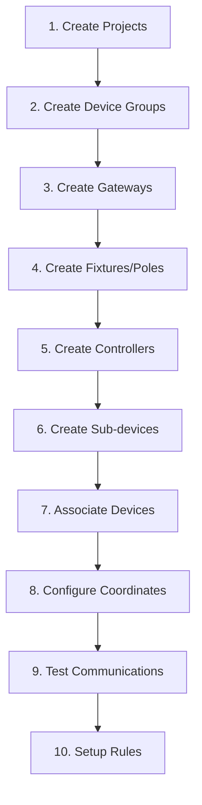

# 📋 Device Types Reference

> Quick reference guide for all 7 supported IoT device categories


**Platform:** SHUNCOM RULR IoT Platform v1.1 | **Last Updated:** January 2025



---

## 🔍 Device Category Quick Reference

### Overview Table
| Device Type | Communication | Gateway Required | Key Features | Configuration Complexity |
|-------------|---------------|------------------|--------------|-------------------------|
| **Smart Gateway** | Various protocols | No (Hub device) | Sub-device management, Loop control | High ⭐⭐⭐⭐ |
| **Smart Light Controller** | Zigbee/LoRa/NB-IoT/CAT.1 | Depends on type | Light control, Multi-protocol | Medium ⭐⭐⭐ |
| **Lighting Fixture** | Via Controller | No (Logical device) | Light association | Low ⭐ |
| **Lighting Pole** | Via attached devices | No (Container) | Physical infrastructure | Low ⭐ |
| **Power Distribution** | Via Gateway | Yes | Power management | Medium ⭐⭐ |
| **Loop Control** | Via Gateway | Yes | Circuit control | Medium ⭐⭐⭐ |
| **Smart Meter** | Via Gateway | Yes | Energy monitoring | Medium ⭐⭐⭐ |

---

## 🌟 Smart Gateway

### Quick Facts
```yaml
Role: Central hub for sub-devices
Communication: Multiple protocols supported
Sub-devices: Light controllers, meters, loop controllers
Special Feature: Loop control (Star box models)
```

### Essential Configuration
```yaml
Required Fields:
  - Device Name: "Gateway_[Location]_[Number]"
  - Product Name: "Star Box Gateway"
  - Device Number: "MAC Address (AA:BB:CC:DD:EE:FF)"

Critical Operations:
  - Circuit Configuration: Bulk circuit setup
  - Device Synchronization: Platform ↔ Device sync
  - Screen Password: 6-digit numeric lock
  - Local Rule Management: Clear/sync rules
```

### Common Use Cases
- **Industrial Lighting**: Central control for large lighting installations
- **Street Lighting**: Municipal lighting network hub
- **Campus Networks**: University/hospital lighting systems
- **Smart Buildings**: Commercial building automation

---

## 💡 Smart Light Controller

### Protocol Matrix
| Type | Gateway Required | Communication | Network Activation | Configuration Complexity |
|------|------------------|---------------|-------------------|-------------------------|
| **Zigbee V3** | ✅ Yes | Via Gateway | Automatic | Medium ⭐⭐ |
| **Dual-way Zigbee** | ✅ Yes | Via Gateway | Automatic | Medium ⭐⭐ |
| **NB-IoT** | ❌ No | Direct | Carrier network | High ⭐⭐⭐ |
| **CAT.1** | ❌ No | Direct | Carrier network | High ⭐⭐⭐ |
| **LoRa OTAA** | ❌ No | LoRaWAN | Over-the-Air | High ⭐⭐⭐⭐ |
| **LoRa ABP** | ❌ No | LoRaWAN | Activation by Personalization | High ⭐⭐⭐⭐ |

### Configuration Quick Start

#### Zigbee Controllers (Pass-through)
```yaml
Prerequisites: 
  - Gateway must exist ✅
  - Lighting fixture must exist ✅

Required Configuration:
  Device Name: "Light_Controller_[ID]"
  Product: "Zigbee_V3 Light Controller"
  Gateway: [Select from list]
  Light Pole: [Select from list]
  Associated Luminaries: [Critical - Select fixture]
```

#### NB-IoT/CAT.1 Controllers (Direct)
```yaml
Prerequisites:
  - SIM card activation ✅
  - Network coverage verification ✅
  - Lighting fixture must exist ✅

Required Configuration:
  Device Name: "NB_Controller_[ID]" 
  Product: "Cat.1-V3 Light Controller"
  Device Address: "Unique device identifier"
  Associated Luminaires: [Critical - Select fixture]
```

#### LoRa Controllers
```yaml
OTAA Mode:
  DEVEUI: "Device unique identifier"
  DEV_PROFILE: "LoRaWAN profile"
  APPEUI: "Application identifier"
  APPKEY: "Application key"

ABP Mode:
  DEVEUI: "Device unique identifier"
  DEVADDR: "Device address"
  APPSKEY: "Application session key"  
  NWKSKEY: "Network session key"
```

### Monitoring Capabilities
```yaml
Real-time Data:
  Electrical: Voltage, Current, Power, Energy
  Environmental: Illuminance, Color Temperature  
  Network: Signal Strength, Connection Status
  Performance: Run Time, Frequency, Power Factor
```

---

## 🏮 Lighting Fixture

### Essential Role
```yaml
Purpose: Logical representation of physical lights
Requirement: Must exist before light controller association
Critical: Without fixture → lamp uncontrollable
```

### Quick Configuration
```yaml
Basic Setup:
  Device Name: "LED_Fixture_[Location]_[Number]"
  Product Name: "High-Power LED Streetlight"
  Project: [Select project]
  Group: [Select group]
  
Association:
  Light Controller: [Link after both devices exist]
  
Flexibility:
  - Create fixture first → then controller
  - Create controller first → then fixture
  - Associate after both exist
```

---

## 🚏 Lighting Pole

### Infrastructure Role
```yaml
Function: Physical container for devices
Contains: Controllers, fixtures, sensors, meters
Purpose: Organize devices by physical location
```

### Configuration
```yaml
Basic Information:
  Device Name: "Pole_[Street]_[Number]"
  Product: "Standard Street Light Pole"
  Location: Physical address or coordinates
  
Tracking:
  Subordinate Devices: Auto-calculated count
  Associated Equipment: Linked automatically
```

---

## ⚡ Power Distribution Control

### Distribution Management
```yaml
Purpose: Smart distribution cabinet control
Function: Circuit monitoring and control
Integration: Works with gateways and circuits
```

### Quick Setup
```yaml
Configuration:
  Device Name: "Distribution_Box_[Area]_[ID]"
  Product: "Smart Distribution Cabinet"  
  Project: [Infrastructure project]
  Group: "Power Distribution"
  
Capabilities:
  - Individual circuit monitoring
  - Load balancing
  - Emergency controls
```

---

## 🔄 Loop Control

### Circuit Control System
```yaml
Types: Built-in vs Extended loop controllers
Purpose: Gateway circuit management  
Function: Open/close electrical circuits
```

### Configuration Matrix
| Type | Device Number | Channel | Protocol | Use Case |
|------|---------------|---------|----------|----------|
| **Built-in** | 0 (Fixed) | 11 (Fixed) | GWLOOP | Integrated gateway control |
| **Extended** | 4-255 | 1 or 2 | Modbus | External expansion |

### Quick Configuration
```yaml
Built-in Loop Controller:
  Device Number: 0 (automatic)
  Channel: 11 (automatic)
  Protocol: GWLOOP (automatic)
  Gateway: [Required selection]
  
Extended Loop Controller:
  Device Number: [4-255 range]
  Channel: [1 or 2 - check physical connection]
  Protocol: Modbus (automatic)
  Gateway: [Required selection]
```

---

## 📊 Smart Meter

### Energy Monitoring
```yaml
Type: 485 Three-phase electricity meter
Function: Detailed energy consumption monitoring
Protocol: dlt645_07 (Chinese standard)
```

### Configuration Requirements
```yaml
Required Information:
  Device Name: "Smart_Meter_[Location]_[ID]"
  Device Number: "12-digit meter address"
  Gateway: [Required association]
  Channel: 2 (default for meters)
  
Optional Settings:
  Transformer Ratio: Current transformer multiplier
  Data Display: Multiplication factor for readings
```

### Advanced Features
```yaml
Device Synchronization:
  - Sync meter info to gateway
  - Update configuration parameters
  
Three-phase Monitoring:
  - Individual phase monitoring
  - Total consumption calculation
  - Power quality measurements
```

---

## ⚠️ Critical Configuration Notes

### Must-Have Associations
```yaml
Critical Dependencies:
  Light Controller + Fixture: 
    ❌ Missing: "Lamp uncontrollable in list"
    ✅ Linked: Full control available
    
  Sub-devices + Gateway:
    ❌ Missing: No platform communication
    ✅ Linked: Full integration
    
  Device + Project:
    ❌ Unassigned: Visible to all users (security risk)
    ✅ Assigned: Proper access control
```

### Common Configuration Errors
```yaml
Fixture Association Missing:
  Problem: Light controller created without fixture
  Symptom: "Lamp status blank in list"
  Solution: Create fixture → associate → refresh
  
Gateway Association Missing:
  Problem: Sub-device created without gateway
  Symptom: "Device always offline"
  Solution: Verify gateway exists → associate → sync
  
Coordinate Data Missing:
  Problem: Sunrise/sunset rules fail
  Symptom: "Time-based rules not executing"
  Solution: Add lat/long coordinates → update rules
```

### Performance Optimization
```yaml
Batch Operations:
  Maximum: 5,000 devices per operation
  Templates: Use device-specific templates
  Validation: Check data before import
  
Device Limits:
  Recommended: <1000 devices per project for optimal UI performance
  Gateway load: <50 sub-devices per gateway
  Group size: <200 devices per multicast group
```

---

## 🔧 Configuration Workflow

### Recommended Setup Order


### Verification Checklist
```yaml
Device Registration Complete:
  ✅ Device appears in device list
  ✅ Online status shows correctly
  ✅ All required associations made
  ✅ Coordinates configured (if needed)
  ✅ Project assignment confirmed
  ✅ Group membership set
  
Communication Verified:
  ✅ Device responds to commands
  ✅ Data updates regularly  
  ✅ Control functions work
  ✅ Status changes reflect in UI
```

---

## 🔗 Quick Navigation Links

### Related Documentation
- **[03-Device Management Hub](03-Device-Management/03-Device%20Management%20Hub.md)** - Complete device management guide
- **[04-Rule Engine System](04-Rule-Management/04-Rule%20Engine%20System.md)** - Device automation setup
- **[05-Project Management](05-User-Management/05-Project%20Management.md)** - Project structure for devices
- **[06-Dashboard Interface](06-Project-Management/06-Dashboard%20Interface.md)** - Device monitoring and control

### Configuration Workflows
- **[[Device Registration Flow]]** - Step-by-step device setup
- **[[Gateway Configuration Process]]** - Gateway and sub-device setup
- **[[Batch Import Procedures]]** - Bulk device management
- **[[Device Association Guide]]** - Linking devices properly

---

**Quick Start**: Begin with [05-Project Management](05-User-Management/05-Project%20Management.md) to establish structure, then return to [03-Device Management Hub](03-Device-Management/03-Device%20Management%20Hub.md) for detailed device configuration procedures.