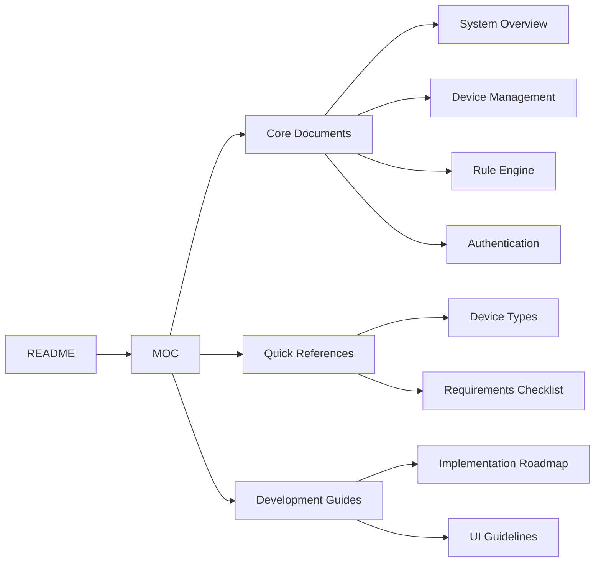
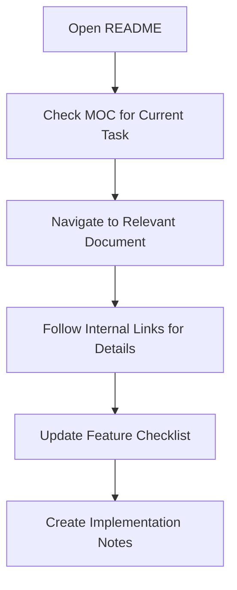
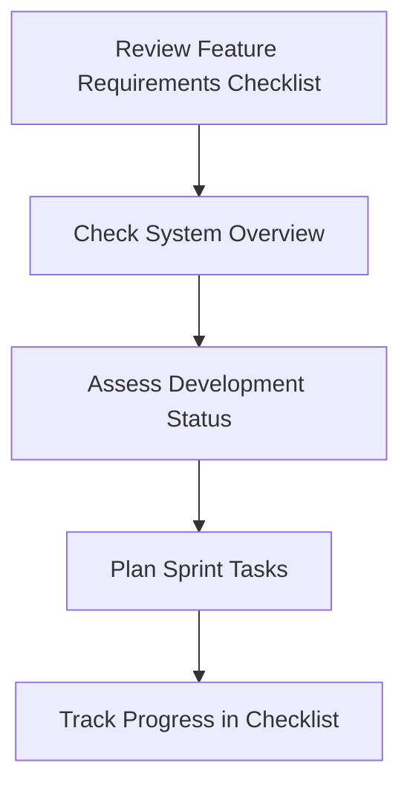
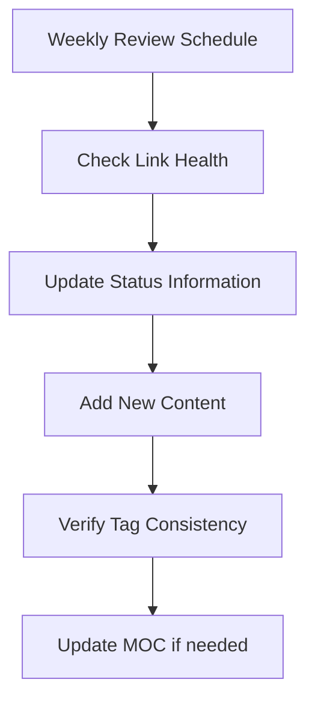

# 📁 Knowledge Base Setup Guide

> Complete setup instructions for the SHUNCOM RULR IoT Platform Obsidian Knowledge Base


**Platform:** SHUNCOM RULR IoT Platform v1.1 | **Last Updated:** January 2025



---

## 📋 Knowledge Base Overview

Tôi đã tạo một comprehensive knowledge base cho SHUNCOM RULR IoT Platform với cấu trúc được tối ưu hóa cho Obsidian. Knowledge base này bao gồm:

### 🏗️ Cấu Trúc Thư Mục
```
SHUNCOM RULR Knowledge Base/
├── README.md                           # Central hub và navigation
├── Map of Content (MOC).md            # Complete navigation map
├── Device Types Reference.md           # Quick reference cho 7 device types
├── Feature Requirements Checklist.md  # Development tracking checklist
├── 
├── 01-Overview/
│   └── 01-System Overview.md          # Complete architecture overview
├── 02-System-Architecture/
│   └── 02-Authentication System.md    # User management & RBAC
├── 03-Device-Management/
│   └── 03-Device Management Hub.md    # Complete device lifecycle guide
├── 04-Rule-Management/
│   └── 04-Rule Engine System.md       # Platform, Local & Alarm rules
├── 05-User-Management/                # [Ready for expansion]
├── 06-Project-Management/             # [Ready for expansion]  
├── 07-Dashboard/                      # [Ready for expansion]
├── 08-Development-Guide/              # [Ready for expansion]
└── 99-Templates/                      # [Templates for future docs]
```

---

## 🚀 Setup Instructions

### 1. Obsidian Installation
```bash
# Download Obsidian from https://obsidian.md
# Install and open Obsidian
# Create new vault or use existing vault
```

### 2. Knowledge Base Integration
```bash
# Copy the "SHUNCOM RULR Knowledge Base" folder to your Obsidian vault
# OR 
# Set your Obsidian vault to point to this directory
```

### 3. Obsidian Configuration
#### Recommended Settings
```yaml
Core Plugins (Enable):
  - File explorer: ✅
  - Search: ✅
  - Quick switcher: ✅
  - Graph view: ✅
  - Backlinks: ✅
  - Tag pane: ✅
  - Page preview: ✅
  - Note composer: ✅

Community Plugins (Recommended):
  - Dataview: For dynamic content
  - Mind Map: For visual brainstorming
  - Calendar: For date-based organization
  - Kanban: For project management
  - Advanced Tables: For better table editing
```

#### Hotkeys Setup
```yaml
Essential Hotkeys:
  Quick Switcher: Ctrl/Cmd + O
  Global Search: Ctrl/Cmd + Shift + F
  Open Graph View: Ctrl/Cmd + G
  Toggle Edit/Preview: Ctrl/Cmd + E
  Create New Note: Ctrl/Cmd + N
  Toggle Tag Pane: Ctrl/Cmd + Shift + T
```

---

## 🗺️ Navigation Guide

### Starting Points
1. **[README](README.md)** - Main hub với quick navigation
2. **[Map of Content (MOC)](Map%20of%20Content%20(MOC).md)** - Comprehensive navigation map  
3. **[Device Types Reference](Device%20Types%20Reference.md)** - Quick lookup for device info
4. **[Feature Requirements Checklist](Feature%20Requirements%20Checklist.md)** - Development progress tracking

### Navigation Patterns


### Link Structure
- **Bidirectional Links**: `[[Document Name]]` creates clickable links
- **Section Links**: `[[Document Name#Section]]` links to specific sections
- **Block Links**: `[[Document Name^block-id]]` links to specific blocks
- **Aliases**: `[[Document Name|Display Text]]` for custom link text

---

## 🏷️ Tag System

### Primary Tag Categories
```yaml
System Tags:
  #shuncom-rulr         # Main platform content
  #system-architecture  # Architecture documentation
  #development-guide    # Implementation guides
  #quick-reference      # Quick lookup documents

Feature Tags:
  #device-management    # Device lifecycle features
  #rule-engine         # Automation and rules
  #user-management     # Authentication/authorization
  #dashboard           # Frontend interface
  #gis-integration     # Mapping features
  #alarm-system        # Notifications/alerts

Development Tags:
  #ui-requirements     # Frontend development
  #backend-api         # Server-side implementation
  #database-schema     # Data model design
  #performance         # Optimization/scaling
  #security           # Security implementation
  #testing            # QA procedures
```

### Tag Usage Patterns
```yaml
Multiple Tags per Document:
  Example: #device-management #quick-reference #iot-devices

Tag Hierarchies:
  #development-guide/frontend
  #development-guide/backend
  #system-architecture/security

Tag Queries (using Dataview plugin):
  ```query
  tag:#device-management AND tag:#quick-reference
  ```
```

---

## 📊 Knowledge Base Features

### Core Documents Included
1. **[01-System Overview](01-Overview/01-System%20Overview.md)** - Complete architectural overview
2. **[02-Authentication System](02-System-Architecture/02-Authentication%20System.md)** - User management, RBAC, permissions
3. **[03-Device Management Hub](03-Device-Management/03-Device%20Management%20Hub.md)** - All 7 device types, lifecycle management
4. **[04-Rule Engine System](04-Rule-Management/04-Rule%20Engine%20System.md)** - Platform Rules, Local Rules, Alarm Rules
5. **[Device Types Reference](Device%20Types%20Reference.md)** - Quick reference for all supported devices
6. **[Feature Requirements Checklist](Feature%20Requirements%20Checklist.md)** - Comprehensive development checklist

### Key Features per Document
```yaml
System Overview:
  - High-level architecture diagrams
  - Component relationships  
  - Core workflows and user journeys
  - Business value propositions

Authentication System:
  - RBAC implementation details
  - User lifecycle management
  - Permission matrices
  - Organization management

Device Management Hub:
  - 7 device categories detailed
  - Configuration workflows
  - Batch operations procedures
  - Device relationship mapping

Rule Engine System:
  - 3-layer rule architecture
  - Complex condition logic
  - Synchronization mechanisms
  - Alarm management workflows
```

### Advanced Obsidian Features Utilized
```yaml
Mermaid Diagrams:
  - Architecture diagrams
  - Workflow sequences
  - Decision trees
  - Process flows

Code Blocks:
  - Configuration examples
  - YAML specifications  
  - API endpoint examples
  - Command line instructions

Tables:
  - Feature comparison matrices
  - Configuration requirements
  - Status tracking
  - Quick reference data

Cross-References:
  - Bidirectional linking
  - Tag-based connections
  - Block-level references
  - Section targeting
```

---

## 🔧 Customization Options

### Appearance Themes
```yaml
Recommended Themes:
  Light Mode: Default or Minimal
  Dark Mode: Obsidian or Blue Topaz
  
CSS Customizations:
  - Larger font sizes for presentations
  - Custom colors for tag categories  
  - Improved table styling
  - Better code block formatting
```

### Workspace Layouts
```yaml
Development Workspace:
  Left Panel: File explorer + Tag pane
  Center: Main editing area
  Right Panel: Backlinks + Local graph

Research Workspace:
  Left Panel: Search + File explorer
  Center: Split view (2 documents)
  Right Panel: Global graph view

Review Workspace:
  Left Panel: Tag pane
  Center: Document + Preview
  Right Panel: Backlinks + Outline
```

### Plugin Configurations
```yaml
Dataview Plugin Settings:
  Enable JavaScript: ✅
  Enable Inline Queries: ✅
  
Graph View Settings:
  Show Tags: ✅
  Show Attachments: ❌
  Show Existing Files Only: ✅
  
Search Settings:
  Show More Context: ✅
  Explain Search Term: ✅
```

---

## 📈 Usage Workflows

### For Developers


### For Project Managers


### For Documentation Maintenance


---

## 🧩 Extensions & Future Enhancements

### Planned Additions
```yaml
Additional Documents:
  - 05-Project Management.md (hierarchy, GIS, dashboards)
  - 06-Dashboard Interface.md (UI components, real-time features)  
  - 07-Development Roadmap.md (implementation timeline)
  - API Endpoints Map.md (complete API documentation)
  - Database Schema.md (data model relationships)

Template System:
  - Device Configuration Template
  - Rule Configuration Template
  - Feature Document Template
  - Troubleshooting Template

Integration Guides:
  - GIS Integration Guide
  - Real-time Communication Setup
  - Performance Optimization Guide
  - Security Implementation Guide
```

### Advanced Workflows
```yaml
Automated Content:
  - Dataview queries for progress tracking
  - Dynamic todo lists
  - Automatic link validation
  - Tag-based content organization

Version Control:
  - Git integration for change tracking
  - Collaborative editing workflows
  - Document version history
  - Change approval processes
```

---

## ✅ Setup Verification

### Checklist
- [ ] Obsidian installed and configured
- [ ] Knowledge base folder properly imported
- [ ] Core plugins enabled
- [ ] Tag pane configured and visible
- [ ] Graph view functional
- [ ] All internal links working
- [ ] Mermaid diagrams rendering correctly
- [ ] Search functionality working
- [ ] Backlinks panel functional

### Test Navigation
1. Open **[README](README.md)** - verify main navigation works
2. Click through to **[Map of Content (MOC)](Map%20of%20Content%20(MOC).md)** - check comprehensive navigation
3. Test **[Device Types Reference](Device%20Types%20Reference.md)** - verify quick reference functionality
4. Open **[Feature Requirements Checklist](Feature%20Requirements%20Checklist.md)** - confirm checklist display
5. Navigate between documents using internal links
6. Test search functionality with tags and content
7. Verify graph view shows document relationships

---

## 🆘 Troubleshooting

### Common Issues
```yaml
Links Not Working:
  - Check file names match exactly (case-sensitive)
  - Verify files are in correct vault
  - Refresh file index (Ctrl/Cmd + P > "Reload app without saving")

Diagrams Not Rendering:
  - Enable Mermaid plugin or use external renderer
  - Check diagram syntax for errors
  - Verify code block language is set to "mermaid"

Tags Not Showing:
  - Enable Tag pane plugin
  - Check tag formatting (#tag-name)
  - Refresh tag index

Performance Issues:
  - Close unused graph views  
  - Limit large file indexing
  - Reduce number of open notes
```

---

**Quick Start**: Mở **[README](README.md)** để bắt đầu, sau đó sử dụng **[Map of Content (MOC)](Map%20of%20Content%20(MOC).md)** để navigate toàn bộ knowledge base. Use tags và search để tìm thông tin nhanh chóng!