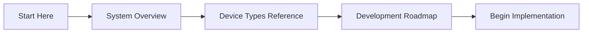
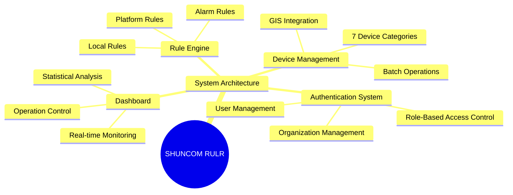
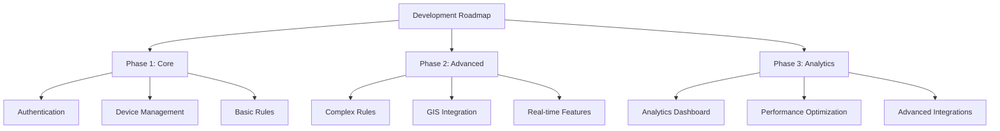
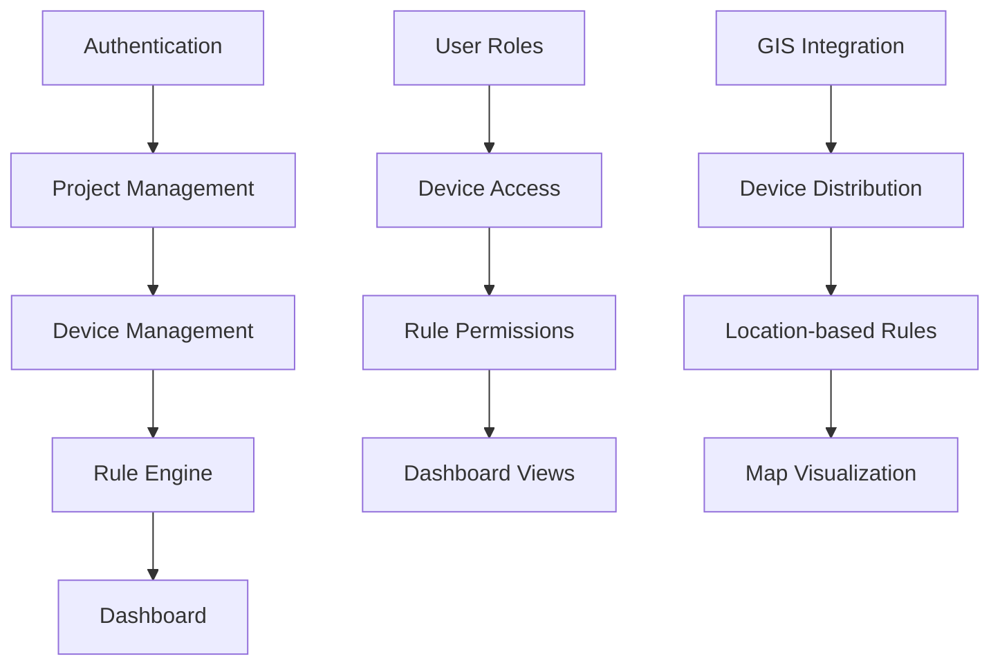

# 🗺️ Map of Content (MOC)

> Central navigation hub for SHUNCOM RULR IoT Platform Knowledge Base

**Tags**: #moc #navigation #knowledge-base #central-hub  
**Created**: 2025-01-22  
**Last Updated**: 2025-01-22

---

## 🚀 Getting Started Fast Track

### For New Team Members


1. **[[01-System Overview]]** - Understand the platform architecture
2. **[[Device Types Reference]]** - Learn supported devices  
3. **[[07-Development Roadmap]]** - See implementation plan
4. **[[Feature Requirements Checklist]]** - Track development progress

### For Project Managers
1. **[[Project Scope Summary]]** - Complete project overview
2. **[[Performance Benchmarks]]** - System requirements
3. **[[Testing Scenarios]]** - QA planning
4. **[[UI Design Guidelines]]** - Design standards
5. **[[Feature Requirements Checklist]]** - Track development progress

---

## 📚 Core Knowledge Areas

### 🏗️ System Architecture


#### Foundation Documents
- **[[01-System Overview]]** - Complete architectural overview
- **[[02-Authentication System]]** - User management and security
- **[[API Endpoints Map]]** - System integration points
- **[[Database Schema]]** - Data model relationships

#### Technical Deep Dives  
- **[[Performance Benchmarks]]** - System performance requirements
- **[[Security Architecture]]** - Security implementation details
- **[[Integration Patterns]]** - Third-party integration guide
- **[[Scalability Planning]]** - Growth and scaling strategies

### 🔧 Device Management
#### Quick References
- **[[Device Types Reference]]** - 7 device categories overview
- **[[Device Troubleshooting]]** - Common problems and solutions
- **[[Protocol Guides]]** - Zigbee, LoRa, NB-IoT, CAT.1, MQTT

#### Detailed Guides
- **[[03-Device Management Hub]]** - Complete device lifecycle
- **[[Gateway Configuration Guide]]** - Smart gateway setup
- **[[Light Controller Setup]]** - All controller types
- **[[Batch Operations Manual]]** - Import/export procedures

### ⚙️ Automation & Rules
#### Rule System Overview
- **[[04-Rule Engine System]]** - Complete rule system guide
- **[[Rule Configuration Patterns]]** - Common automation patterns
- **[[Alarm Management Guide]]** - Comprehensive alarm handling
- **[[Local Rules Best Practices]]** - Device-level automation

#### Implementation Examples
- **[[Platform Rules Examples]]** - Real-world automation scenarios
- **[[Alarm Configuration Examples]]** - Practical alarm setups
- **[[Rule Testing Procedures]]** - Validation and testing
- **[[Rule Performance Optimization]]** - Efficiency guidelines

### 👥 User & Project Management
#### User Management
- **[[02-Authentication System]]** - User lifecycle management
- **[[Role Design Patterns]]** - RBAC implementation
- **[[Permission Matrices]]** - Access control mapping
- **[[User Onboarding Guide]]** - New user procedures

#### Project Structure
- **[[05-Project Management]]** - Project hierarchy design
- **[[GIS Setup Guide]]** - Map and location features
- **[[Customization Guide]]** - Custom dashboard setup
- **[[Multi-tenant Architecture]]** - Organization isolation

---

## 🎯 Development Resources

### 💻 Development Guides


#### Planning & Architecture
- **[[07-Development Roadmap]]** - Complete implementation timeline
- **[[Feature Requirements Checklist]]** - Development tracking
- **[[Technical Debt Management]]** - Code quality maintenance
- **[[Architecture Decision Records]]** - Design decision history

#### Frontend Development  
- **[[UI Component Library]]** - Reusable UI components
- **[[06-Dashboard Interface]]** - Frontend implementation guide
- **[[UI Design Guidelines]]** - Design system standards
- **[[Widget Reference]]** - Dashboard widget catalog
- **[[Customization Guide]]** - Dashboard customization
- **[[Responsive Design Patterns]]** - Multi-device support

#### Backend Development
- **[[API Design Patterns]]** - RESTful API standards
- **[[Database Design Guide]]** - Data model implementation
- **[[Real-time Architecture]]** - WebSocket implementation
- **[[Microservices Patterns]]** - Service architecture

### 🧪 Quality Assurance
#### Testing Framework
- **[[Testing Scenarios]]** - Comprehensive test cases
- **[[Automated Testing Guide]]** - CI/CD integration
- **[[Performance Testing]]** - Load and stress testing
- **[[Security Testing]]** - Vulnerability assessment

#### Quality Standards
- **[[Code Review Guidelines]]** - Code quality standards
- **[[Documentation Standards]]** - Technical writing guide
- **[[Release Procedures]]** - Deployment workflows
- **[[Monitoring & Alerting]]** - Production monitoring

---

## 🔗 Cross-Reference Maps

### Feature Dependencies Map


### Technology Stack Map
```yaml
Frontend:
  Framework: React/Vue.js (TBD)
  State Management: Redux/Vuex
  UI Components: Custom component library
  Maps: GIS integration service
  Real-time: WebSocket client
  
Backend:  
  API: RESTful + GraphQL (optional)
  Real-time: WebSocket server
  Database: PostgreSQL/MongoDB (TBD)
  Authentication: JWT + RBAC
  Device Communication: MQTT/HTTP
  
Infrastructure:
  Hosting: Cloud platform (AWS/Azure/GCP)
  CDN: Static asset delivery
  Monitoring: Application performance monitoring
  Logging: Centralized logging system
```

### Integration Points Map
```yaml
External Integrations:
  GIS Services: Map data and geocoding
  Weather Services: Sunrise/sunset calculations
  SMS/Email: Notification delivery
  Mobile Apps: Push notifications
  
Internal Integrations:
  Device Protocols: Zigbee, LoRa, NB-IoT, CAT.1
  Database Systems: User data, device data, metrics
  File Systems: Document storage, exports
  Caching Systems: Performance optimization
```

---

## 📊 Progress Tracking

### Implementation Status
| Component | Status | Priority | Complexity | Dependencies |
|-----------|--------|----------|------------|--------------|
| **Authentication** | 🔄 Planning | High | Medium | None |
| **Device Management** | 📋 Designed | High | High | Authentication |
| **Rule Engine** | 📋 Designed | High | High | Device Management |
| **Dashboard** | 🔄 Planning | High | Medium | All above |
| **GIS Integration** | 📅 Future | Medium | High | Device Management |
| **Analytics** | 📅 Future | Low | Medium | Dashboard |

**Legend**: 📅 Not Started | 🔄 In Progress | 📋 Designed | ✅ Complete | ⚠️ Blocked

### Knowledge Base Health
```yaml
Documentation Coverage:
  Core Systems: ✅ 95% Complete
  API Documentation: 🔄 70% Complete  
  User Guides: 🔄 75% Complete
  Troubleshooting: ✅ 80% Complete
  
Link Health:
  Internal Links: ✅ All functional
  External Links: ⚠️ Need validation
  Bi-directional Links: ✅ Properly structured
  
Maintenance Status:
  Last Updated: 2025-01-23
  Next Review: Weekly
  Ownership: Development Team
  Total Files: 41 markdown documents
```

---

## 🏷️ Tag Directory

### System Tags
- `#shuncom-rulr` - Main platform content
- `#system-architecture` - Architecture documentation  
- `#development-guide` - Implementation guides
- `#quick-reference` - Quick lookup documents

### Feature Tags
- `#device-management` - Device lifecycle and configuration
- `#rule-engine` - Automation and rule processing
- `#user-management` - Authentication and authorization  
- `#dashboard` - Frontend interface components
- `#gis-integration` - Mapping and location services
- `#alarm-system` - Notification and alerting
- `#real-time` - Live monitoring and WebSocket features

### Development Tags
- `#ui-requirements` - Frontend development needs
- `#backend-api` - Server-side implementation
- `#database-schema` - Data model design
- `#performance` - Optimization and scaling
- `#security` - Security implementation
- `#testing` - Quality assurance procedures

---

## 🔍 Search Strategies

### Finding Information Quickly
```yaml
By Role:
  Developer: Search #development-guide + #ui-requirements
  DevOps: Search #performance + #security + #monitoring  
  Product Manager: Search #feature-requirements + #roadmap
  QA: Search #testing + #troubleshooting
  
By Feature:
  Authentication: Search #user-management + #security
  Devices: Search #device-management + #iot-devices
  Automation: Search #rule-engine + #automation
  UI: Search #dashboard + #ui-requirements
  
By Status:
  Planning: Search #roadmap + #requirements
  Implementation: Search #development-guide + #patterns
  Testing: Search #testing + #validation
  Deployment: Search #performance + #monitoring
```

### Obsidian-Specific Features
```yaml
Graph View: Visualize knowledge connections
Tags Pane: Browse by tag categories  
Search: Use boolean operators (AND, OR, NOT)
Backlinks: See incoming references
Local Graph: Focused connection view
Query Blocks: Dynamic content embedding
```

---

**Navigation Tips**: 
- Use `Ctrl/Cmd + O` to quick-open any file
- Use `Ctrl/Cmd + Shift + F` for global search
- Click any `[[Link]]` to navigate instantly
- Use graph view to explore connections visually