# SHUNCOM RULR IoT Platform - Phân Tích Hệ Thống Chi Tiết

## Thông Tin Cơ Bản
- **Tên hệ thống**: SHUNCOM RULR IoT Platform
- **Phiên bản**: User Manual V1.1
- **Công ty**: Shanghai Shuncom AIOT Co., Ltd
- **URL**: https://rulr-aiot.com
- **Trình duyệt khuyến nghị**: Google Chrome

---

## 🏗️ Kiến Trúc Hệ Thống Tổng Quan

### Cấu Trúc Chính
```
RULR IoT Platform
├── Frontend (Dashboard)
│   ├── Login System
│   ├── Home Page (Dashboard)
│   ├── Operation Control
│   ├── Statistical Analysis
│   ├── Operation & Maintenance
│   ├── Rule Management
│   └── System Log
└── Backend System (Settings)
    ├── Basic Configuration
    ├── Device Management
    ├── Project Management
    └── Rule Management
```

### Phân Chia Chức Năng Chính
1. **Part I - Platform Basic Introduction**
   - Login & Authentication
   - Home Page Dashboard
   - Preferences (Timezone)
   - Backend System Access

2. **Part II - Back-end System**
   - Basic Configuration (Users, Organizations, Permissions)
   - Device Management (Configuration, Groups, Import/Export)
   - Project Management (Projects, Associations, GIS Distribution)
   - Rule Management (Platform Rules, Local Rules, Alarm Rules)

---

## 🔐 Hệ Thống Đăng Nhập & Xác Thực

### Login Flow
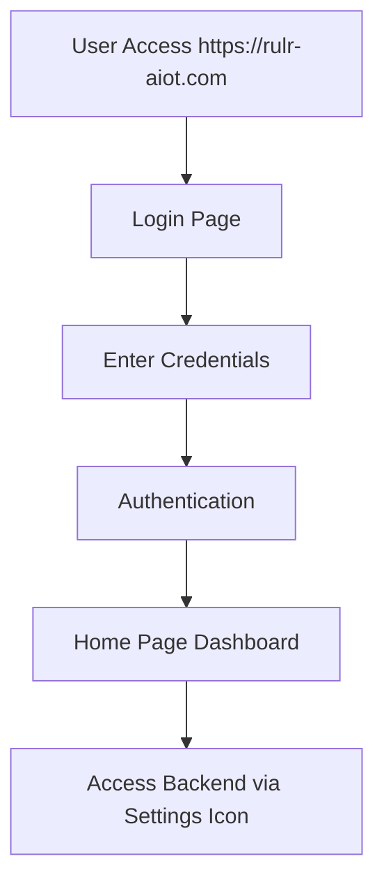

### Preferences System
- **Time Zone Configuration**: Ảnh hưởng đến local time của devices, thực thi Platform Rules, Local Rules và Alarm Rules
- **Location**: My Account > Preferences
- **Critical**: Time zone setting affects tất cả rule executions

---

## 👥 Hệ Thống Quản Lý Người Dùng & Tổ Chức

### User Management Architecture
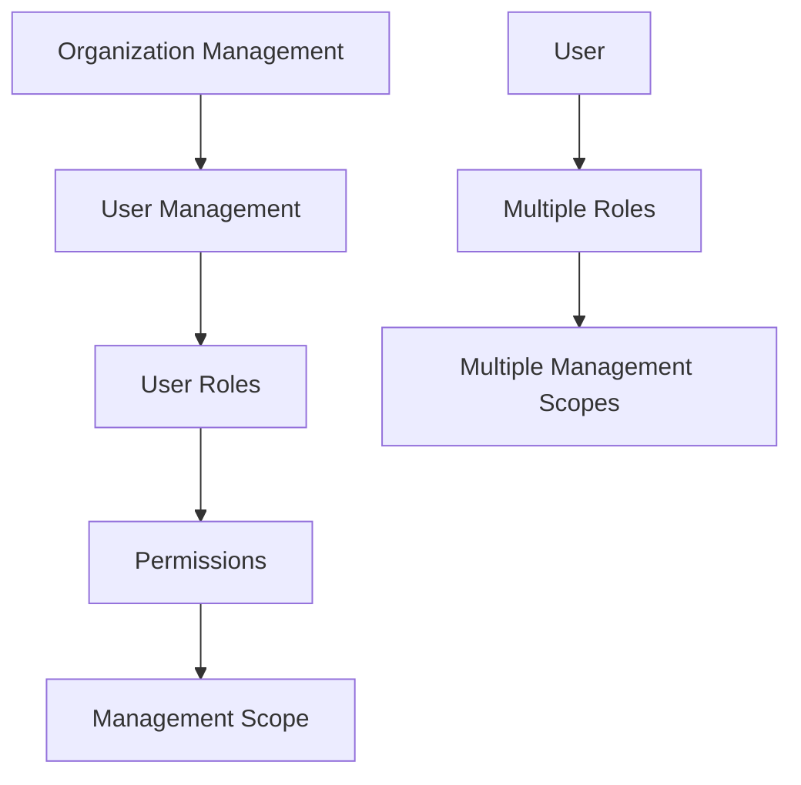

### User Management Features
#### 1. User List Management
- **Path**: Settings > Basic Configuration > Organization and Users > User Management
- **Features**:
  - Enable/Disable user accounts
  - Edit và delete users
  - Disabled users không thể login

#### 2. Add/Edit User Flow
- **Required Fields**: Account information, Platform Role, Management Scope
- **Access Path**: Organization and Users > User Management > +Add Users

#### 3. Role Association System
- **Concept**: Roles = function rights management
- **Flexibility**:
  - 1 user có thể có multiple roles
  - 1 role có thể assign cho multiple users

#### 4. Management Scope
- **Bao gồm**: Project management rights, Group management rights, Product Category management rights
- **Default**: Tenant administrators có tất cả management scopes
- **Regular Users**: Limited scope được config bởi administrator

### Organization Management
- **Logo Upload**: Logo hiển thị ở upper left corner
- **Path**: Settings > Basic Configuration > Organization and Users > Organization Management

### Permission System
#### User Roles
- **Function**: Determine which pages user can view và which functions can operate
- **Configuration**: Role name, description, permissions assignment
- **Granular Control**: Page-level và function-level permissions

#### Management Scope
- **Purpose**: Determines what projects, product categories, và groups user có thể view
- **Default Groups**:
  - Unassigned projects group
  - 'Ungrouped' group

---

## 🔧 Device Management System

### Supported Device Categories
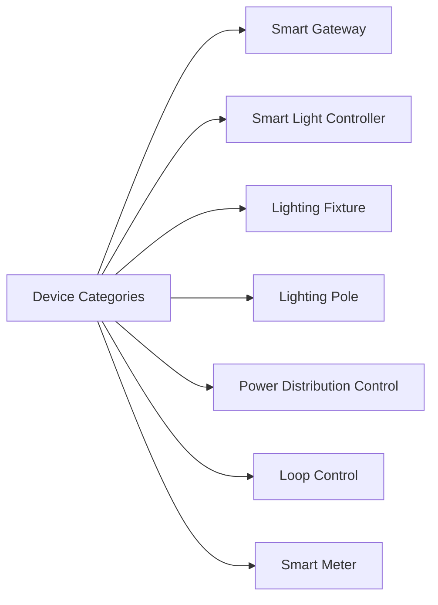

### 1. Smart Gateway
#### Features & Capabilities
- **Display Fields**: Device Name, Device Number, Associated Product, Online Status, Three-Phase Electricity Information, Loop Collection, Local Time, Screen Password, Update Time
- **Loop Control**: Nếu là loop control concentrator (Star box gateway), có thể control individual loops

#### Configuration Requirements
- **Mandatory Fields**: Device Name, Product Name, Device Number (MAC address)
- **Optional Fields**: Associated distribution box, Associated circuit control, Lat & Long, Altitude, Parent Project, Belonging Group

#### Circuit Configuration Process
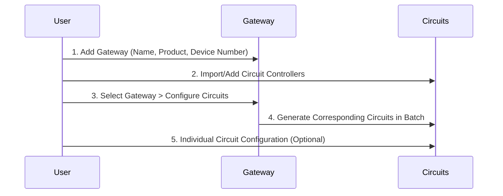

#### Gateway Operations
- Set 6-digit screen password
- Synchronize sub-device information
- Configure circuits in bulk
- Clear local rules
- Set three-phase electric ratio

### 2. Smart Light Controller
#### Device Types
1. **Pass-through Devices** (Zigbee_V3, Dual-way Zigbee_V3)
   - Requires Gateway association
   - Must associate với lighting fixture

2. **Direct Communication Devices** (NB-IoT, CAT.1)
   - No gateway required
   - Direct platform communication

3. **LoRa Light Controller**
   - **OTAA Mode**: DEVEUI, DEV_PROFILE, APPEUI, APPKEY
   - **ABP Mode**: DEVEUI, DEVE_PROFILE, DEVADDR, APPSKEY, NWKSKEY

#### Display Capabilities
- Device Name, Device Number, Product Name, Online Status, Lamp Status, Voltage, Current, Active Power, Power Factor, Active Energy, Run Time, Local Time, Frequency, Color Temperature, Illuminance, Signal Strength, IMSI, Version, Connected Base Station, Update Time

#### Configuration Commands
- Clear, timing calibration, enable local rules, read data, device synchronization, GPS switch

### 3. Lighting Fixture
#### Purpose
- Must be created trước khi associate với light controllers
- Essential for lamp control functionality

### 4. Lighting Pole
#### Structure Support
- Container for multiple devices
- Tracking subordinate device count

### 5. Power Distribution Control
#### Function
- Manages power distribution cabinets
- Association với gateways và circuits

### 6. Loop Control
#### Types
- **Built-in Loop Controller**: Device number = 0, Channel = 11, Protocol = GWLOOP
- **Extended Loop Controller**: Device number = 4-255, Channel = 1 or 2, Protocol = Modbus

### 7. Smart Meter
#### Capabilities
- **485 Three-phase Electricity Meter**
- **Features**: Device synchronization, three-phase transformer ratio setting
- **Protocol**: dlt645_07
- **Default Channel**: 2

### Device Group Management
#### Group Types
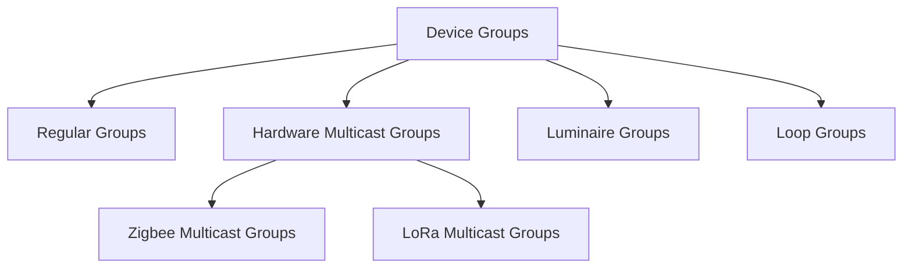

#### Multicast Functionality
- **Zigbee Multicast**: Group numbers 1-255, manual group number entry
- **LoRa Multicast**: Group numbers 1,2,3 với frequency band configuration
- **Synchronization**: Failed devices can be re-synced

#### Import/Export Capabilities
- **Batch Import**: 5,000 devices per import
- **Template Support**: Different templates per device type
- **Export**: Basic data export, filtered device export (5,000 limit)

#### Recycle Bin System
- **Data Retention**: Basic information retained, historical data lost
- **Recovery**: Restore to original location
- **Permanent Deletion**: Clear recycle bin = irreversible

---

## 📊 Project Management System

### Project Hierarchy
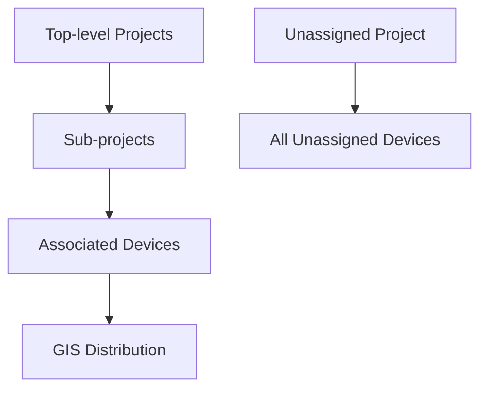

### Project Configuration
#### Basic Information
- **Auto-generated**: Top-level projects, unassigned projects (cannot delete)
- **Recommendation**: Associate tất cả devices với specific projects
- **Management**: Add, delete, modify theo project level

#### Display Information Configuration
##### 8 Dashboard Modules
1. **Basic Settings**: Technology style vs Future style
2. **Title Settings**: Name, font, color configuration
3. **Lighting Distribution**: GIS map display của light controllers
4. **Module Switches**: Enable/disable individual modules
5. **Content Requirements**: Some modules require content configuration

##### Lighting Schedules
- **Illuminance Sensor Association**: Light on/off threshold triggers
- **Time Options**:
  - Preset fixed time
  - Sunrise/sunset time (calculated từ device coordinates)
- **Display**: Configured schedules show on homepage

##### Electricity Consumption Plan (ECP)
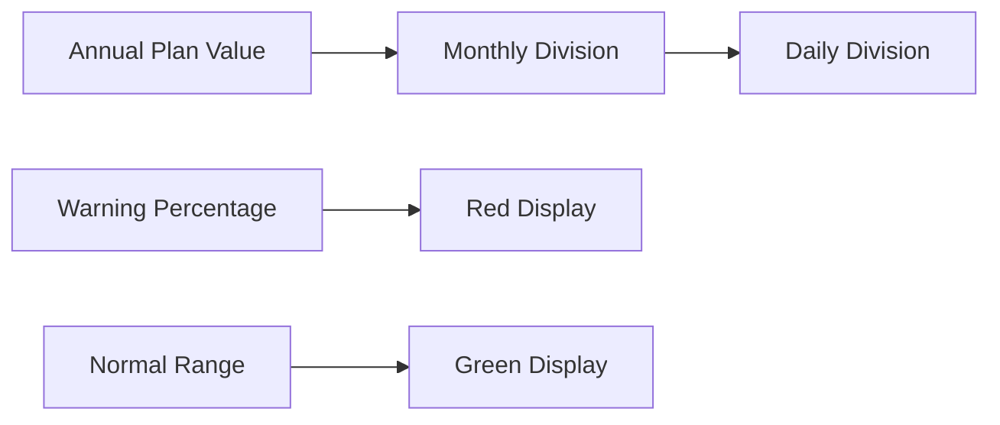

**Energy Saving Rate Formula**:
```
Energy Saving Rate = [(Planned Consumption to Yesterday - Actual Consumption to Yesterday) / Planned Consumption to Yesterday] × 100%
```

##### Energy Saving Overview
- Configuration của energy consumption sources

##### Preview System
- **Drag & Drop Interface**: Customize dashboard module arrangement

##### Batch Apply
- **Function**: Copy configurations to other projects

### Device Association
- **Path**: Settings > Equipment Management > Project > Associated Devices
- **Actions**: Associate/disassociate devices with projects
- **Alternative**: Direct association during device import

### GIS Map Distribution
#### Requirements
- **Availability**: Only trong second-level projects
- **Prerequisites**: Device must have coordinates (lat/long)

#### Distribution Methods
1. **Single Device Distribution**
   - Search location → Select 1 device → Batch distribution → Double-click to refresh

2. **Batch Device Distribution**
   - Search location → Select 2+ devices → Draw path → Double-click to terminate → Even distribution along path

3. **Fine-tuning Coordinates**
   - Click device → Drag to adjust → Save → Refresh location

---

## ⚙️ Rule Management System

### Rule Architecture Overview
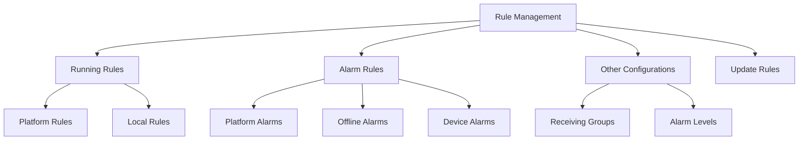

### 1. Platform Rules
#### Structure
- **Multi-sub-rule Support**: 1 platform rule có thể có multiple sub-rules
- **Independent Execution**: Each sub-rule executes independently
- **Condition Combinations**: Multiple trigger conditions per sub-rule
- **Action Support**: Multiple execution actions per sub-rule

#### Configuration Requirements
- Rule Name, Rule Type, Effective Date, Repeat Period (daily/weekly/monthly), Remarks

#### Trigger Conditions
##### 1. Attribute Trigger
- **Function**: Use device-reported attribute data để trigger actions
- **Device Limit**: 1 attribute trigger device = 1 device only

##### 2. Time Trigger
- **Options**:
  - Timing trigger
  - Sunrise/sunset time (requires lat/long)
  - Interval time

##### 3. Time Range
- **Constraint**: Cannot exist alone, usually combined với attribute triggers
- **Limit**: Only 1 time range per sub-rule

##### 4. Other Triggers
- **Online Status**: Online hoặc offline device status
- **Constraint**: Cannot exist alone, combine với attribute triggers

##### 5. Trigger Times
- **Logic**: Trong last XX minutes, if trigger condition meets specified count, execute action
- **Constraint**: Cannot exist alone, combine với attribute triggers

##### Condition Logic
- **Options**: "Meet both conditions" hoặc "Meet any condition"
- **Restrictions**:
  - Time trigger + time trigger cannot combine
  - Online status + time range cannot be sole trigger
  - Maximum 1 time range per sub-rule

#### Execute Actions
##### 1. Invoke Service
- **Product-specific**: Different services per product category
- **Examples**: Gateway services, smart light services

##### 2. Control Lamp
- **Operations**: Turn on/off/dimming light controllers

##### 3. Control Loop
- **Operations**: Connect/disconnect circuits tại gateway

#### Execute Action Devices
- **Device Constraint**: Same batch devices only per sub-rule
- **Selection Methods**:
  - Select Device: Choose specific associated devices
  - Select Group: All devices under group (default)
  - **Specific Selection**: For light controllers + gateways, có thể select specific fixtures/circuits

#### Platform Rules Examples
##### Light Controller Rules
1. **Time Range + Illuminance**: Trong 17:00-18:00, if both sensors > 50 lux → turn on lights
2. **Sunrise/Sunset**: Turn on tại sunset, turn off tại sunrise

##### Gateway Rules
1. **Schedule**: Close circuit tại 18:00, open tại 06:00

### 2. Local Rules
#### Architecture
- **Multi-sub-rule**: Each rule có thể có multiple sub-rules
- **Independent Execution**: Each sub-rule runs independently
- **Simplified Logic**: 1 condition + 1 action per sub-rule

#### Smart Gateway Local Rules
##### Trigger Conditions
- Scheduled trigger
- Sunrise time
- Sunset time
- Interval trigger

##### Actions
- Open circuit
- Close circuit

#### Smart Light Controller Local Rules
##### Trigger Conditions
- Scheduled trigger
- Latitude/longitude trigger
- Light sensitivity trigger

##### Actions
- Turn on lights
- Turn off lights
- Dim lights

#### Synchronization System
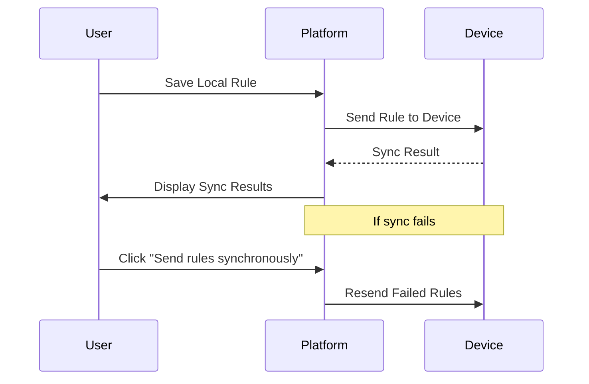

### 3. Alarm Rules System
#### Platform Alarms
##### Structure
- **Multi-sub-rule**: Multiple sub-rules per platform alarm
- **Condition Combinations**: Multiple trigger conditions per sub-rule (ANY hoặc ALL logic)
- **Single Action**: Only 1 execution action per sub-rule
- **Device Constraint**: Same batch devices only per rule

##### Configuration
- Rule name, Product name, Effective date, Repeat cycle, Effective time, Remarks
- **Effective Time Options**:
  - All day
  - Latitude/longitude time range

##### Trigger Conditions
###### 1. Attribute Trigger
- Use device property data để trigger actions

###### 2. Event Trigger
- **Offline Alarm Events**
- **Device Alarm Events** (consistent với Device Alarms section)

###### 3. Other Triggers
- Online/offline device status
- **Constraint**: Cannot exist alone, combine với attribute triggers

##### Execution Actions
- **Silent Period**: Default silence period for automatic alarm handling
- **Alarm Level Selection**: Choose from configured levels
- **Custom Alarm Name**: User-defined alarm names
- **Notification Options**: Enable/disable notifications
- **Recipient Groups**: Multiple group selection

##### Automatic Alarm Handling
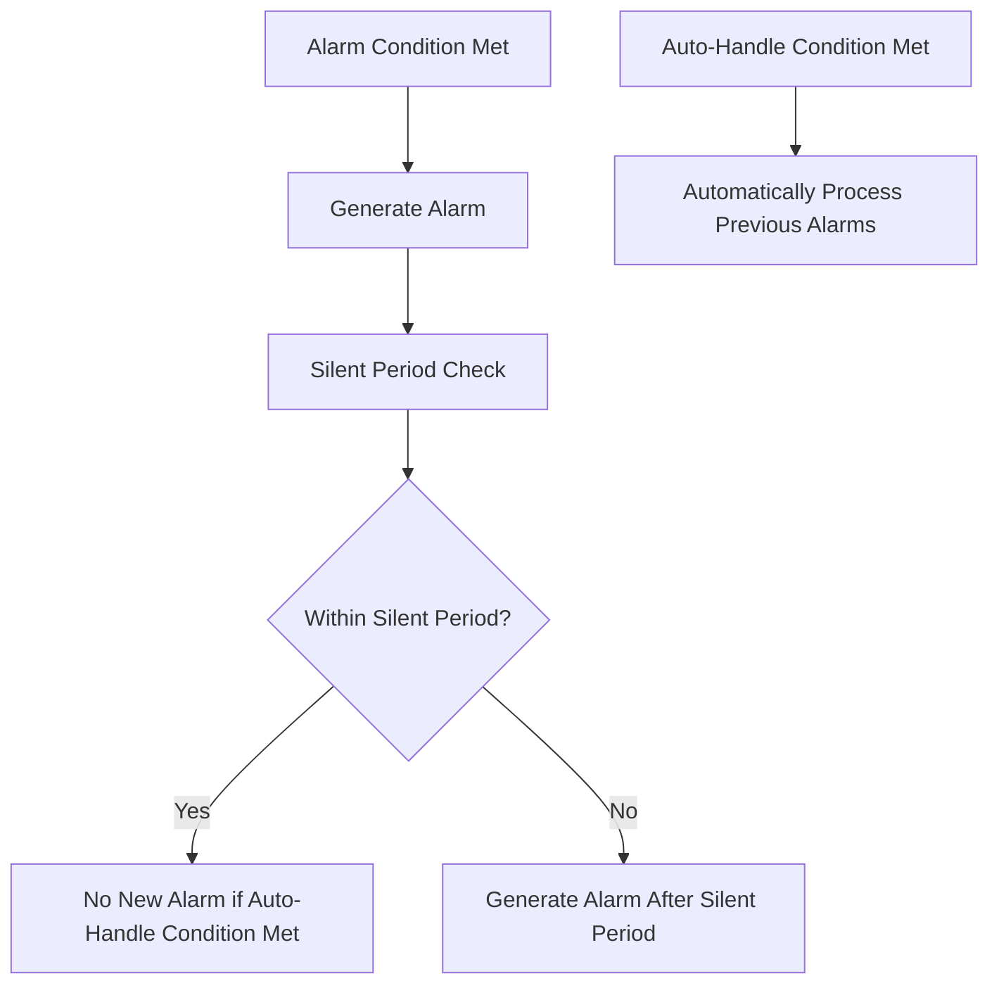

- **Default Silent Period**: 30 minutes for lighting control
- **Logic**: If auto-handle condition met during silent period → no alarm generation

##### Platform Alarm Example
- **Scenario**: Dual-way light controller alarm generation between 18:20-21:59
- **Condition**: Fixture 1 active power < 9 but > 0.01
- **Auto-Handle**: If power returns > 9 within 20 minutes → auto-process alarms

#### Offline Alarms
##### Configuration
- **Custom Offline Time**: Set device offline threshold (e.g., 30 minutes)
- **Enable/Disable**: Toggle offline alarm generation
- **Effective Time**: Alarm filtering time range
- **Silent Period**: Prevent alarm spam
- **Alarm Level**: Set severity level
- **Recipient Groups**: Notification targets
- **Device Exclusions**: Specify devices không trigger this alarm

##### Warning
- **Offline Time**: Không set quá ngắn → có thể cause alarm spam

#### Device Alarms
##### Features
- **Source**: Alarm events reported by devices themselves
- **Configuration**: Enable/disable, effective time, silent period, alarm level, recipient groups, device exclusions
- **Threshold Support**: All single-way và dual-way light controllers

### 4. Other Configurations
#### Receiving Group Configuration
##### Features
- **Notification Channels**: Multiple channel support
- **Notification Intervals**: Configurable timing
- **Notification Times**: Frequency settings

#### Alarm Level Configuration
##### Features
- **Custom Alarm Names**: User-defined level names
- **Level Management**: Hierarchical alarm severity

### 5. Update Rules
##### Purpose
- **Data Refresh**: Configure update intervals per product type
- **Mechanism**: Platform sends read commands tại intervals để retrieve latest device data
- **Activation**: Rule-based enabling

---

## 🏠 Homepage Dashboard System

### Statistical Data Overview
#### Configuration Dependencies
- **Source**: Data cần configure trong 2.3.1.2 Display Information
- **Project-based**: Data cho selected project only
- **Module Flexibility**: Different projects có thể choose different statistical modules (max 8)
- **Navigation**: Click product category → redirect to operation control page

### Operation Control
#### 1. GIS Map Interface
##### Requirements & Display
- **Project Environment**: Only if GIS map chosen during project creation
- **Device Requirements**: Must be added to project/type/group AND có lat/long coordinates
- **Icon System**: Different categories = different icons

##### Control Capabilities
###### Smart Light Controller Controls
- Turn on/off
- Dimming
- Read light data
- Read version number
- Read local time

###### Gateway Controls
- Full circuit disconnect/connect
- Read local time
- Read latitude/longitude
- **Group Control**: Control all light controllers under gateway
- Read three-phase electricity
- Read circuit status (3rd generation gateway feature)

#### 2. Device List Interface
##### Project Device List
- **View Options**: All devices hoặc individual product types
- **Navigation**: Operation > View hoặc double-click → device details

##### Device Details Page - 6 Major Sections
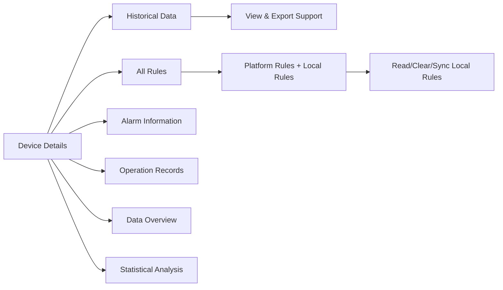

###### Historical Data Section
- **Export Support**: Data viewing và exporting capabilities

###### Rules Section
- **Platform Rules**: Display associated platform rules
- **Local Rules**:
  - Read local rules từ individual devices
  - Clear unknown/problematic local rules
  - Synchronize local rules to device end

###### Device Local Rules Management
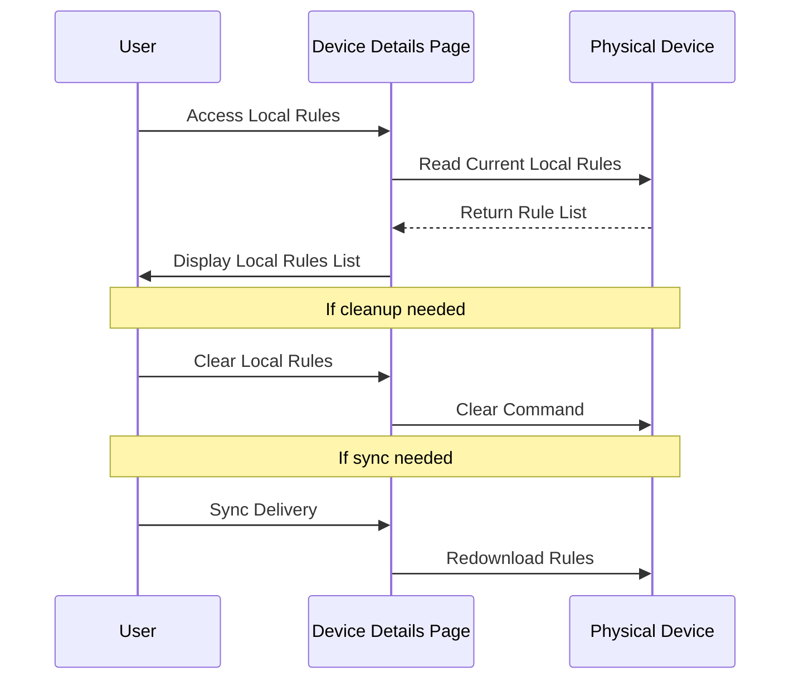

### Statistical Analysis
#### Project-based Analysis
- **Scope**: Selected project devices only
- **Module Management**: Column settings với show/hide operations
- **Export Functionality**: Quick report data export
  - **Selection Options**: Single hoặc multiple data items
  - **Time Range**: Configurable export periods
- **View Options**: Day, week, month, year statistics
- **Individual Module View**: Click to enlarge và view individually

### Operation and Maintenance
#### Alarm Management Interface
##### Three-Dimensional Display
- **Project Dimension**: Project-based alarm statistics
- **Type Dimension**: Device type alarm breakdown
- **Group Dimension**: Group-based alarm analysis
- **History Display**: Complete alarm history tracking

##### Alarm Processing Features
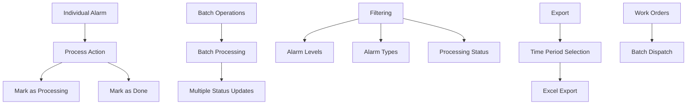

##### Processing Capabilities
- **Individual Processing**: Per-alarm status updates
- **Batch Processing**: Multiple alarm handling
- **Filtering Options**: Level, type, processing status
- **Export Features**: Time-based Excel exports
- **Work Order Management**: Batch work order dispatch

### Rule Management Dashboard
#### Overview Features
- **Device Status**: Running status của each device
- **Alarm Status**: Device alarm overview
- **Management Dimensions**: Project, Type, Group views
- **Content Consistency**: Same content as backend rule management
- **Access Limitation**: View-only + status changes (no content editing)

### System Log Interface
#### Log Management
- **Scope**: Device logs by project/type/group
- **Content**: Operation records viewing
- **Organization**: Hierarchical log structure

---

## 🔍 Các Tính Năng Quan Trọng Cần Chú Ý Khi Phát Triển UI

### 1. Real-time Status Indicators
#### Device Status Visualization
- **Unaddressed Alarms**: Exclamation mark "!" display
- **Unavailable Devices**: Special symbol marking
- **Online/Offline Status**: Clear visual indicators
- **Data Availability**: Dash "-" for missing data fields

### 2. Time Zone Dependencies
#### Critical Time-based Features
- **Global Impact**: Time zone affects ALL rules (Platform, Local, Alarm)
- **Device Local Time**: Synchronized với platform time zone
- **Rule Execution**: Time-based triggers depend on correct time zone
- **UI Requirement**: Prominent time zone selector trong preferences

### 3. Batch Operations Support
#### Import/Export Systems
- **Template System**: Different templates per device type
- **Volume Limits**: 5,000 device limit per operation
- **Progress Indicators**: Batch operation progress tracking
- **Error Handling**: Failed item identification và retry mechanisms

### 4. Hierarchical Data Management
#### Multi-level Relationships
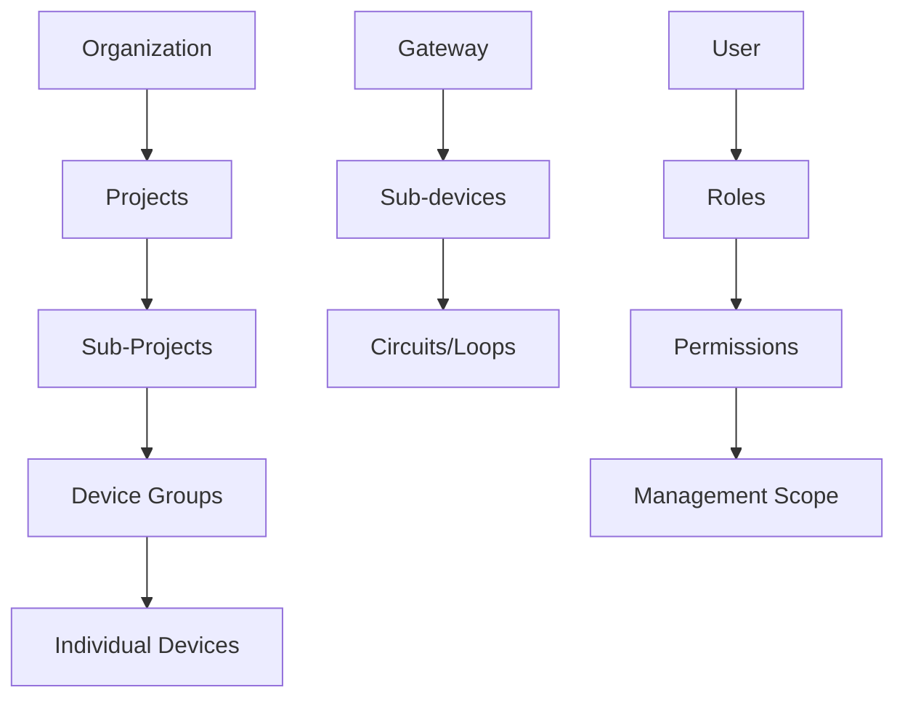

#### UI Requirements
- **Tree Navigation**: Expandable/collapsible hierarchy
- **Breadcrumb Navigation**: Clear path indication
- **Context Preservation**: Remember user's position trong hierarchy
- **Bulk Selection**: Multi-level selection support

### 5. GIS Map Integration
#### Essential Map Features
- **Device Distribution**: Drag-and-drop device positioning
- **Batch Distribution**: Path-based device arrangement
- **Coordinate Fine-tuning**: Individual device coordinate adjustment
- **Icon Differentiation**: Unique icons per device category
- **Search Integration**: Location search với map interaction

#### Technical Requirements
- **Coordinate System**: Lat/long support
- **Map Provider Integration**: GIS background map support
- **Real-time Updates**: Device status updates trên map
- **Zoom Levels**: Appropriate detail levels per zoom

### 6. Rule Configuration UI Complexity
#### Multi-condition Rule Builder
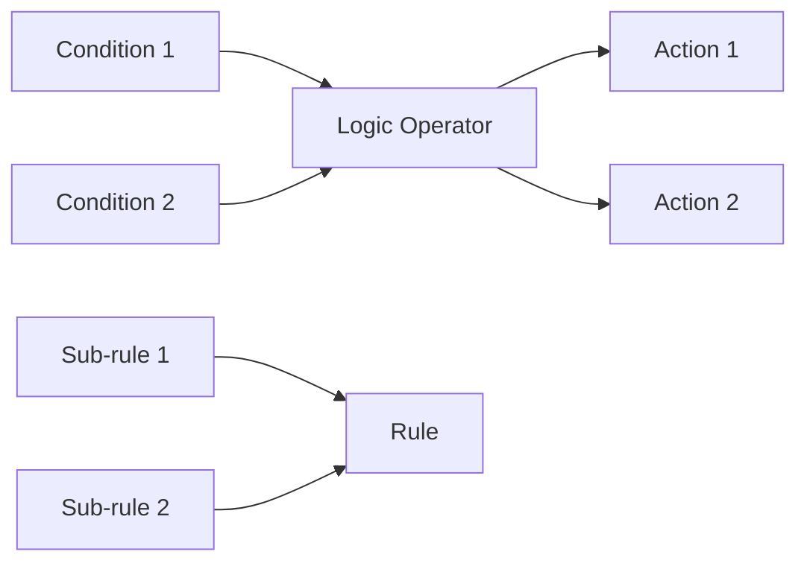

#### UI Design Requirements
- **Visual Rule Builder**: Drag-and-drop condition/action assembly
- **Condition Validation**: Real-time compatibility checking
- **Logic Operator Selection**: Clear AND/OR selection
- **Device Scope Visualization**: Clear device selection interface
- **Rule Testing**: Simulation hoặc preview functionality

### 7. Synchronization Status Management
#### Device Sync Tracking
- **Sync Results Display**: Per-device sync status
- **Failed Sync Identification**: Clear failure indication
- **Retry Mechanisms**: Individual và bulk retry options
- **Status Indicators**: Visual sync progress indicators

### 8. Alarm Management UI
#### Multi-dimensional Alarm Display
- **Filtering Systems**: Multiple simultaneous filter support
- **Status Workflow**: Clear processing state transitions
- **Batch Operations**: Efficient multi-alarm handling
- **Priority Visualization**: Alarm level color coding

### 9. Data Visualization Requirements
#### Statistical Dashboard Components
- **Module Configuration**: Drag-and-drop dashboard customization
- **Time Range Selection**: Flexible period selection
- **Export Integration**: One-click data export
- **Real-time Updates**: Live data refresh capabilities

### 10. Navigation & User Experience
#### Core Navigation Patterns
- **Dual Interface**: Frontend dashboard vs Backend settings
- **Context Switching**: Seamless frontend/backend transitions
- **Permission-based UI**: Dynamic UI based on user permissions
- **Breadcrumb Systems**: Clear navigation path indication

#### Performance Considerations
- **Large Dataset Handling**: 5,000+ device support
- **Real-time Updates**: Live device status monitoring
- **Map Performance**: Efficient large-scale device rendering
- **Export Performance**: Background processing cho large exports

---

## 📝 Kết Luận và Khuyến Nghị Phát Triển

### Ưu Tiên Phát Triển

#### Phase 1: Core Infrastructure
1. **Authentication & Authorization System**: Multi-role, multi-scope user management
2. **Device Management Framework**: Support 7 device categories với specific configurations
3. **Real-time Communication**: Device status monitoring và control capabilities

#### Phase 2: Advanced Features
1. **Rule Engine**: Complex multi-condition rule builder
2. **GIS Integration**: Full map-based device management
3. **Alarm System**: Comprehensive alarm processing workflow

#### Phase 3: Analytics & Optimization
1. **Statistical Dashboard**: Customizable analytics modules
2. **Export Systems**: Comprehensive data export capabilities
3. **Performance Optimization**: Large-scale data handling

### Critical Success Factors

1. **Time Zone Management**: Ensure consistent time handling across all features
2. **Device Synchronization**: Robust sync status tracking và error handling
3. **User Permission System**: Granular access control implementation
4. **Real-time Updates**: Live status monitoring cho devices và alarms
5. **Data Integrity**: Proper relationship management giữa devices, projects, và rules

### UI/UX Priorities

1. **Intuitive Navigation**: Clear separation giữa operational dashboard và configuration backend
2. **Visual Status Indicators**: Immediate device và system status visibility
3. **Efficient Batch Operations**: Streamlined bulk device management
4. **Responsive Design**: Support multiple screen sizes cho field operations
5. **Error Prevention**: Clear validation và user guidance throughout workflows
