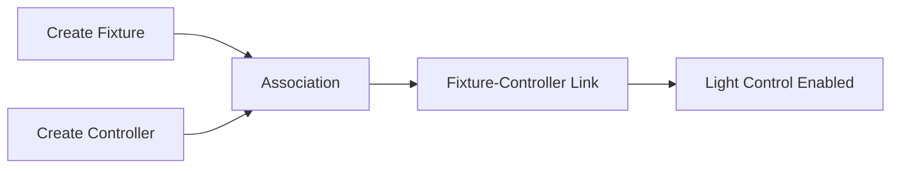

# Device Specifications & Hardware Requirements

**Document Version**: 1.0
**Date**: January 27, 2026
**Project**: SHUNCOM RULR IoT Platform
**Related Documents**: [02-System Requirements](./02-system-requirements.md)

---

## 1. Overview of Supported Devices

The SHUNCOM RULR IoT Platform supports **7 device categories** with specific communication protocols and configuration requirements.

### 1.1 Device Category Summary

| Device Type | Communication | Gateway Required | Quantity Support | Configuration Complexity |
|-------------|---------------|------------------|------------------|-------------------------|
| **Smart Gateway** | Various protocols | No (Hub device) | 500 sub-devices each | High ⭐⭐⭐⭐ |
| **Smart Light Controller** | Zigbee/LoRa/NB-IoT/CAT.1 | Depends on type | 100,000+ per deployment | Medium ⭐⭐⭐ |
| **Lighting Fixture** | Via Controller | No (Logical device) | Unlimited | Low ⭐ |
| **Lighting Pole** | Via attached devices | No (Container) | Unlimited | Low ⭐ |
| **Power Distribution** | Via Gateway | Yes | As needed | Medium ⭐⭐ |
| **Loop Control** | Via Gateway | Yes | Gateway-dependent | Medium ⭐⭐⭐ |
| **Smart Meter** | Via Gateway | Yes | As needed | Medium ⭐⭐⭐ |

---

## 2. Smart Gateway Specifications

### 2.1 Device Overview

**Role**: Central hub for sub-device management and circuit control

**Primary Functions**:
- Sub-device communication relay (Zigbee, Modbus, 485)
- Loop/circuit control and monitoring
- Local rule execution (autonomous operation)
- Three-phase electricity monitoring
- GPS time synchronization

### 2.2 Hardware Requirements

**Processing Unit**:
- ARM Cortex-A7 or higher
- Minimum 512MB RAM
- 4GB+ Flash storage
- Real-time clock (RTC) with battery backup

**Communication Interfaces**:
- **Ethernet**: 10/100 Mbps (primary)
- **4G LTE**: Optional cellular backup
- **Zigbee**: IEEE 802.15.4 coordinator
- **RS485**: Modbus RTU support
- **GPS Module**: Time sync and location

**Power Requirements**:
- Input: AC 100-240V, 50/60Hz
- Consumption: < 15W typical, < 30W peak
- Backup battery: 24-hour operation

**Environmental Specifications**:
- Operating temp: -40°C to +70°C
- Storage temp: -40°C to +85°C
- Humidity: 5% - 95% non-condensing
- IP65 rating (outdoor installation)

### 2.3 Configuration Parameters

**Mandatory Fields**:
```yaml
Device Name: "Gateway_[Location]_[Number]"
  Format: Alphanumeric, 50 characters max
  Example: "Gateway_MainSt_001"

Product Name: "Star Box Gateway"
  Type: Select from product catalog

Device Number: MAC Address
  Format: "AA:BB:CC:DD:EE:FF"
  Validation: Valid MAC format, unique per deployment
```

**Optional Fields**:
```yaml
Associated Distribution Box: Link to power cabinet
Associated Circuit Control: Circuit controller ID
GPS Coordinates:
  Latitude: -90.0 to 90.0
  Longitude: -180.0 to 180.0
  Altitude: Meters above sea level
Parent Project: Project hierarchy assignment
Belonging Group: Device grouping
```

### 2.4 Circuit Configuration

**Built-in Loop Controller**:
- Device Number: 0 (fixed)
- Channel: 11 (fixed)
- Protocol: GWLOOP (proprietary)
- Circuits: Up to 10 circuits per gateway

**Extended Loop Controllers**:
- Device Number: 4-255 (configurable)
- Channel: 1 or 2 (physical connection)
- Protocol: Modbus RTU
- Expansion: Up to 252 external controllers

**Circuit Operations**:
```yaml
Bulk Circuit Configuration:
  1. Add gateway
  2. Import circuit controllers
  3. Select gateway → Configure Circuits
  4. Generate circuits in batch
  5. Fine-tune individual circuits

Operations:
  - Open circuit (disconnect power)
  - Close circuit (connect power)
  - Schedule circuit operations
  - Monitor circuit status
  - Detect circuit faults
```

### 2.5 Gateway Operations

**Administrative Functions**:
```yaml
Screen Password:
  Type: 6-digit numeric
  Purpose: Physical device access control
  Default: 123456 (must be changed)

Sub-device Synchronization:
  Function: Sync platform data to gateway
  Direction: Bidirectional
  Frequency: On-demand or scheduled
  Timeout: 60 seconds

Local Rule Management:
  Clear Rules: Remove all local rules
  Sync Rules: Download rules from platform
  Execute Rules: Autonomous rule processing

Three-phase Configuration:
  Transformer Ratio: Current transformer multiplier
  Voltage Ratio: Voltage transformer ratio
  Data Display: Multiplication factor
```

### 2.6 Monitoring Capabilities

**Real-time Data Points**:
- Online/offline status
- Sub-device count (active/total)
- Circuit status (open/closed per circuit)
- Three-phase voltage (V-A, V-B, V-C)
- Three-phase current (I-A, I-B, I-C)
- Active power (kW)
- Reactive power (kVar)
- Power factor
- Total energy consumption (kWh)
- Local time
- GPS coordinates
- Signal strength (if cellular)
- Firmware version
- Last update timestamp

---

## 3. Smart Light Controller Specifications

### 3.1 Protocol Matrix

| Protocol Type | Gateway Required | Network Activation | Range | Power | Complexity |
|---------------|------------------|-------------------|-------|-------|------------|
| **Zigbee V3** | ✅ Yes | Automatic | 100m | Ultra-low | Medium ⭐⭐ |
| **Dual-way Zigbee** | ✅ Yes | Automatic | 100m | Ultra-low | Medium ⭐⭐ |
| **NB-IoT** | ❌ No | Carrier network | 10km+ | Low | High ⭐⭐⭐ |
| **CAT.1** | ❌ No | Carrier network | 10km+ | Medium | High ⭐⭐⭐ |
| **LoRa OTAA** | ❌ No | Over-the-Air | 5-15km | Ultra-low | High ⭐⭐⭐⭐ |
| **LoRa ABP** | ❌ No | Personalization | 5-15km | Ultra-low | High ⭐⭐⭐⭐ |

### 3.2 Zigbee Light Controller (Pass-through)

**Hardware Specifications**:
```yaml
Chip: Silicon Labs EFR32MG21 or equivalent
Protocol: Zigbee 3.0 IEEE 802.15.4
Frequency: 2.4 GHz
Network: Gateway coordinator required
Power: 3.3V DC, < 1W
```

**Configuration Requirements**:
```yaml
Mandatory:
  Device Name: "Light_Controller_[ID]"
  Product: "Zigbee_V3 Light Controller"
  Gateway: [Select from gateway list]
  Light Pole: [Select from pole list]
  Associated Luminaires: [CRITICAL - Must select]

Optional:
  Installation Location: Physical address
  GPS Coordinates: Lat/Long
  Group Assignment: Device group
```

**Control Capabilities**:
- On/Off control
- Dimming: 0-100% (1% increments)
- Color temperature: 2700K-6500K (if supported)
- Scene control
- Schedule execution
- Local rule processing

**Monitoring Data**:
```yaml
Electrical Parameters:
  - Voltage (V)
  - Current (A)
  - Active Power (W)
  - Power Factor
  - Energy Consumption (kWh)
  - Frequency (Hz)

Environmental:
  - Illuminance (Lux)
  - Color Temperature (K)

Network:
  - Signal Strength (dBm)
  - Link Quality Indicator (LQI)
  - Parent Node ID
  - Hop Count

Status:
  - Online/Offline
  - Lamp Status (On/Off/Dimming %)
  - Run Time (hours)
  - Local Time
  - Firmware Version
```

### 3.3 NB-IoT Light Controller (Direct)

**Hardware Specifications**:
```yaml
Modem: Quectel BC95/BC25 or equivalent
Protocol: NB-IoT (LTE Cat-NB1/NB2)
Frequency Bands: B3, B5, B8, B20 (regional)
SIM Card: Nano SIM (carrier activation required)
Power: 12V DC, < 3W typical, < 5W peak
```

**Network Requirements**:
```yaml
Carrier Network:
  - Coverage verification required
  - Signal strength: > -110 dBm
  - SIM card activation before deployment
  - APN configuration per carrier

Platform Communication:
  - Protocol: MQTT over TCP
  - Encryption: TLS 1.2
  - Heartbeat: Every 60 seconds
  - Data reporting: Event-driven + periodic (5 min)
```

**Configuration Requirements**:
```yaml
Mandatory:
  Device Name: "NB_Controller_[ID]"
  Product: "Cat.1-V3 Light Controller"
  Device Address: Unique device identifier (IMEI)
  Associated Luminaires: [CRITICAL - Must select]
  SIM ICCID: SIM card identifier

Optional:
  APN Settings: Carrier-specific
  Server Address: Custom MQTT broker
  Reporting Interval: 1-60 minutes
```

**Advantages**:
- No gateway required (direct cloud connection)
- Long-range communication (10km+)
- Deep penetration (underground, indoor)
- Low power consumption

**Limitations**:
- Carrier network dependency
- Monthly data charges
- Activation complexity
- Higher latency vs. Zigbee

### 3.4 LoRa Light Controller (LoRaWAN)

**Hardware Specifications**:
```yaml
Chip: Semtech SX1276/SX1278
Protocol: LoRaWAN 1.0.3 / 1.1
Frequency Bands:
  - EU868: 863-870 MHz
  - US915: 902-928 MHz
  - AS923: 915-928 MHz
  - CN470: 470-510 MHz
Power: 3.6V DC, < 0.5W
```

**OTAA Configuration (Recommended)**:
```yaml
Activation: Over-the-Air Activation
Security: Session keys generated dynamically

Required Parameters:
  DEVEUI: Device unique identifier (64-bit)
    Format: "70B3D57ED005XXXX"
    Source: Device label or firmware

  DEV_PROFILE: LoRaWAN device profile
    Example: "Class A, OTAA"

  APPEUI: Application identifier (64-bit)
    Format: "70B3D57ED0000000"
    Provided by: Network administrator

  APPKEY: Application key (128-bit)
    Format: "2B7E151628AED2A6ABF7158809CF4F3C"
    Security: Store securely, never expose
```

**ABP Configuration (Alternative)**:
```yaml
Activation: Activation by Personalization
Security: Pre-configured session keys

Required Parameters:
  DEVEUI: Device unique identifier (64-bit)

  DEV_PROFILE: LoRaWAN device profile

  DEVADDR: Device address (32-bit)
    Format: "26011XXX"
    Unique: Within network

  APPSKEY: Application session key (128-bit)
    Format: "2B7E151628AED2A6ABF7158809CF4F3C"

  NWKSKEY: Network session key (128-bit)
    Format: "3C4F0C8D09F71584A6D2AE2816157E2B"
```

**LoRaWAN Network Requirements**:
```yaml
Gateway Coverage:
  - LoRaWAN gateway within range
  - Gateway density: 1 per 2-5 km² (urban)
  - Line-of-sight preferred

Network Server:
  - ChirpStack / TTN / AWS IoT Core
  - Device registration required
  - Application integration configured

Data Rate:
  - DR0-DR5 (adaptive)
  - Typical: 5-50 kbps
  - Duty cycle: < 1% (EU), < 100% (US)
```

**Advantages**:
- Ultra-low power (10+ years battery)
- Long range (5-15km)
- No SIM card costs
- No gateway required (if LoRaWAN network exists)

**Limitations**:
- LoRaWAN infrastructure required
- Low data rate
- Higher configuration complexity
- Duty cycle restrictions

---

## 4. Lighting Fixture Specifications

### 4.1 Logical Device Role

**Purpose**: Represent physical lights in the system

**Critical Requirement**: Must exist before light controller association

**Relationship**: 1-to-1 mapping with light controller

### 4.2 Configuration Parameters

```yaml
Basic Information:
  Device Name: "LED_Fixture_[Location]_[Number]"
    Example: "LED_Fixture_MainSt_045"

  Product Name: "High-Power LED Streetlight"
    Types:
      - LED Streetlight (100W-400W)
      - LED Flood Light
      - LED Garden Light
      - Decorative Light

  Project Assignment: [Select project]
  Group Assignment: [Select group]

Physical Specifications:
  Wattage: Rated power (W)
  Voltage: Operating voltage (V)
  Luminous Flux: Light output (Lumens)
  Color Temperature: 2700K-6500K
  CRI: Color Rendering Index (>80)
  IP Rating: IP65-IP67

Installation Data:
  Installation Date: YYYY-MM-DD
  Warranty Expiry: YYYY-MM-DD
  Maintenance Interval: Days
```

### 4.3 Association Workflow



**Flexible Creation Order**:
1. ✅ Fixture first → Controller later → Associate
2. ✅ Controller first → Fixture later → Associate
3. ✅ Both created → Associate after

**Warning**: Without association, system displays "Lamp uncontrollable in list"

---

## 5. Lighting Pole Specifications

### 5.1 Infrastructure Container

**Purpose**: Organize devices by physical location

**Contains**:
- Light controllers
- Lighting fixtures
- Sensors (illuminance, motion)
- Smart meters
- Cameras (optional)

### 5.2 Configuration

```yaml
Basic Information:
  Device Name: "Pole_[Street]_[Number]"
    Example: "Pole_MainSt_045"

  Product: "Standard Street Light Pole"
    Types:
      - Single-arm pole
      - Double-arm pole
      - High-mast pole
      - Decorative pole

  Location: Physical address or GPS

Physical Specifications:
  Height: Meters
  Material: Steel/Aluminum/Concrete
  Foundation Type: Direct burial/Base plate

Tracking:
  Subordinate Devices: Auto-calculated count
  Associated Equipment: Auto-linked
  Installation Date: YYYY-MM-DD
```

---

## 6. Power Distribution Control Specifications

### 6.1 Smart Distribution Cabinet

**Purpose**: Monitor and control electrical circuits

**Integration**: Works with gateways and circuit controllers

### 6.2 Hardware Requirements

```yaml
Electrical:
  Input Voltage: 3-phase AC 380V/220V
  Rated Current: 63A-630A per circuit
  Frequency: 50/60 Hz
  Protection: MCB, RCD, SPD

Monitoring:
  Voltage: Per phase
  Current: Per phase
  Power: Active, reactive, apparent
  Energy: Cumulative kWh
  Temperature: Cabinet internal temp

Communication:
  Protocol: Modbus RTU/TCP
  Interface: RS485/Ethernet
  Gateway: Required for platform integration
```

### 6.3 Configuration

```yaml
Device Name: "Distribution_Box_[Area]_[ID]"
Product: "Smart Distribution Cabinet"
Project: [Infrastructure project]
Group: "Power Distribution"

Capabilities:
  - Individual circuit monitoring
  - Load balancing
  - Emergency disconnect
  - Scheduled operations
  - Fault detection
  - Energy reporting
```

---

## 7. Loop Control Specifications

### 7.1 Built-in Loop Controller

**Integration**: Inside gateway (Star Box models)

**Specifications**:
```yaml
Device Number: 0 (Fixed, auto-assigned)
Channel: 11 (Fixed)
Protocol: GWLOOP (Proprietary)
Gateway: Parent gateway (required)

Circuits: Up to 10 independent circuits
Operations:
  - Open circuit (disconnect)
  - Close circuit (connect)
  - Schedule control
  - Manual override

Status Monitoring:
  - Circuit state (open/closed)
  - Load current per circuit
  - Fault detection
```

### 7.2 Extended Loop Controller

**Integration**: External Modbus device

**Specifications**:
```yaml
Device Number: 4-255 (User-configured)
  Unique: Within gateway

Channel: 1 or 2
  Mapping: Physical RS485 connection
  Verification: Check physical wiring

Protocol: Modbus RTU
  Baud Rate: 9600/19200 bps
  Parity: None/Even/Odd
  Stop Bits: 1/2

Gateway: Parent gateway (required)
Expansion: Up to 252 controllers per gateway
```

**Configuration Matrix**:

| Type | Device Number | Channel | Protocol | Circuits |
|------|---------------|---------|----------|----------|
| Built-in | 0 (fixed) | 11 (fixed) | GWLOOP | 10 |
| Extended | 4-255 | 1 or 2 | Modbus | 2-10 per unit |

---

## 8. Smart Meter Specifications

### 8.1 485 Three-Phase Electricity Meter

**Purpose**: Detailed energy consumption monitoring

**Protocol**: DLT645-07 (Chinese national standard)

### 8.2 Hardware Requirements

```yaml
Electrical:
  Voltage: 3-phase 4-wire, 380V/220V
  Current: 5A-100A (direct) or via CT
  Frequency: 50 Hz
  Accuracy Class: 1.0 or 0.5S

Measurement:
  Active Energy: kWh (import/export)
  Reactive Energy: kVarh
  Voltage: Per phase (V)
  Current: Per phase (A)
  Power: Active, reactive, apparent (kW, kVar, kVA)
  Power Factor: Cosφ
  Frequency: Hz

Communication:
  Interface: RS485
  Protocol: DLT645-07
  Baud Rate: 1200/2400/4800/9600 bps
  Meter Address: 12-digit unique ID
```

### 8.3 Configuration Requirements

```yaml
Mandatory:
  Device Name: "Smart_Meter_[Location]_[ID]"
  Device Number: "12-digit meter address"
    Format: "XXXXXXXXXXXX"
    Source: Meter display or label

  Gateway: [Required association]
  Channel: 2 (Default for meters on gateway)

Optional:
  Transformer Ratio: Current transformer multiplier
    Example: 100/5 = 20
    Purpose: Multiply readings for actual consumption

  Data Display: Multiplication factor
    Purpose: Adjust displayed values

Advanced:
  Three-phase Configuration:
    - Phase A association
    - Phase B association
    - Phase C association
    - Total calculation method
```

### 8.4 Device Synchronization

**Sync Operations**:
```yaml
Sync Meter Info to Gateway:
  Function: Update meter configuration
  Direction: Platform → Gateway → Meter
  Data: Address, ratio, display settings

Update Parameters:
  Function: Configure meter settings
  Parameters: Reporting interval, alarms, thresholds

Read Meter Data:
  Function: Retrieve current readings
  Frequency: 5-60 minutes (configurable)
  Data Points: All electrical parameters
```

---

## 9. Common Configuration Errors & Solutions

### 9.1 Fixture Association Missing

**Problem**: Light controller created without fixture
**Symptom**: "Lamp status blank in list" or "Lamp uncontrollable"
**Solution**:
1. Create lighting fixture
2. Associate with controller
3. Refresh device list
4. Verify control operations

### 9.2 Gateway Association Missing

**Problem**: Sub-device created without gateway
**Symptom**: Device always shows offline
**Solution**:
1. Verify gateway exists and is online
2. Associate sub-device with gateway
3. Trigger device synchronization
4. Check gateway sub-device list

### 9.3 Coordinate Data Missing

**Problem**: GPS coordinates not configured
**Symptom**: Sunrise/sunset rules fail to execute
**Solution**:
1. Add latitude/longitude to device
2. Verify coordinate accuracy (Google Maps)
3. Update existing rules
4. Test rule execution

### 9.4 Time Zone Mismatch

**Problem**: Incorrect time zone setting
**Symptom**: Rules execute at wrong times
**Solution**:
1. Navigate to My Account → Preferences
2. Select correct time zone
3. Verify device local time updates
4. Resync local rules to devices
5. Test scheduled operations

---

## 10. Performance Optimization Guidelines

### 10.1 Batch Operations

```yaml
Maximum Limits:
  Import/Export: 5,000 devices per operation
  Reason: UI performance, database transaction size

Template Usage:
  - Use device-specific templates
  - Validate data before import
  - Fix errors incrementally
  - Monitor import progress

Best Practices:
  - Split large imports (>5000) into multiple batches
  - Import during low-traffic periods
  - Validate sample before full import
  - Keep backup of source data
```

### 10.2 Device Limits

```yaml
Recommended Limits:
  Devices per Project: <1,000 for optimal UI performance
  Gateway Sub-devices: <50 per gateway
  Multicast Group Size: <200 devices

Scaling Considerations:
  - Use sub-projects for large deployments
  - Distribute devices across multiple gateways
  - Limit real-time dashboard widgets
  - Use filtered views instead of "All Devices"
```

---

## 11. Device Procurement Checklist

### 11.1 Smart Gateway Procurement

```yaml
Specifications to Verify:
  ✅ ARM processor, 512MB+ RAM
  ✅ Zigbee coordinator support
  ✅ RS485 interface (Modbus RTU)
  ✅ GPS module for time sync
  ✅ 4G LTE backup (optional)
  ✅ IP65 outdoor rating
  ✅ -40°C to +70°C operating temp
  ✅ Firmware upgradeable (OTA)

Quantity Estimation:
  - 1 gateway per 30-50 Zigbee devices
  - 1 gateway per electrical distribution area
  - +20% spare units for failures
```

### 11.2 Light Controller Procurement

```yaml
Protocol Selection Criteria:

Zigbee V3:
  ✅ Use when: Gateway infrastructure exists
  ✅ Advantages: Low cost, low power, easy setup
  ❌ Limitations: Gateway dependent, 100m range

NB-IoT/CAT.1:
  ✅ Use when: Wide-area coverage needed, no gateways
  ✅ Advantages: Long range, no infrastructure
  ❌ Limitations: SIM costs, carrier dependency

LoRa:
  ✅ Use when: LoRaWAN network available, battery power
  ✅ Advantages: Ultra-low power, long range
  ❌ Limitations: Complex setup, LoRaWAN infrastructure

Quantity Estimation:
  - 1 controller per light (1-to-1 mapping)
  - +10% spare units for failures
  - Consider protocol mix for resilience
```

### 11.3 Supporting Equipment

```yaml
Lighting Fixtures:
  - Match controller quantity (1-to-1)
  - Verify voltage compatibility
  - Check dimming support (0-10V, PWM)
  - IP65+ rating for outdoor

Lighting Poles:
  - Infrastructure survey required
  - Existing pole mapping
  - New pole specifications

Smart Meters:
  - 1 meter per distribution cabinet
  - 1 meter per 10-20 lighting circuits
  - DLT645-07 protocol compliance
  - CT ratio calculation

Power Distribution:
  - Smart cabinet per lighting zone
  - MCB sizing per circuit load
  - RCD protection
  - SPD surge protection
```

---

**Next Document**: [04-Technical Architecture](./04-technical-architecture.md)

---

## Document Revision History

| Version | Date | Changes | Author |
|---------|------|---------|--------|
| 1.0 | 2026-01-27 | Initial device specifications | AI Assistant |
