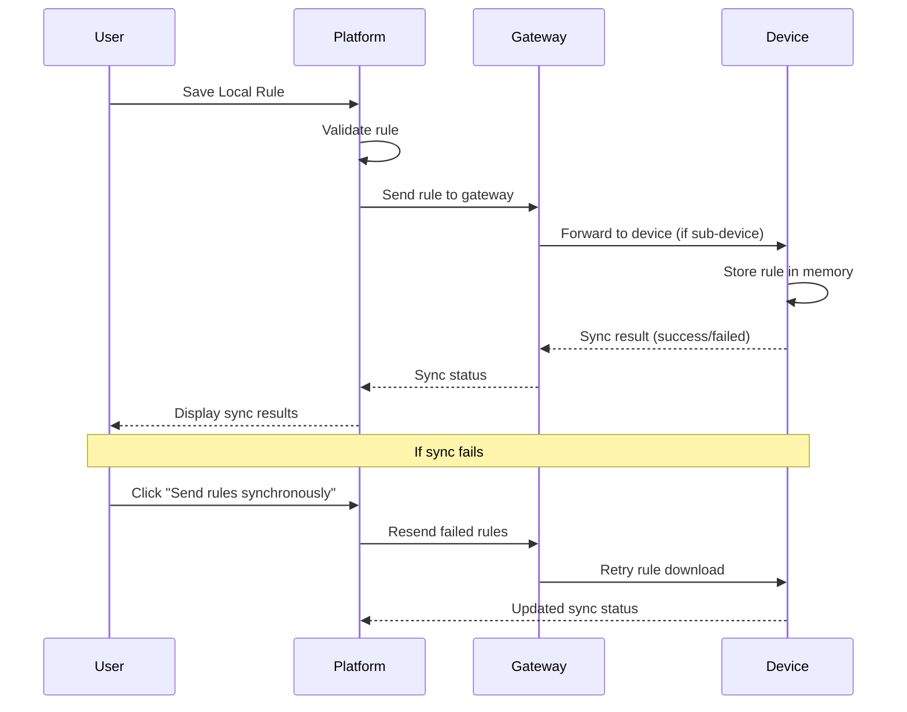
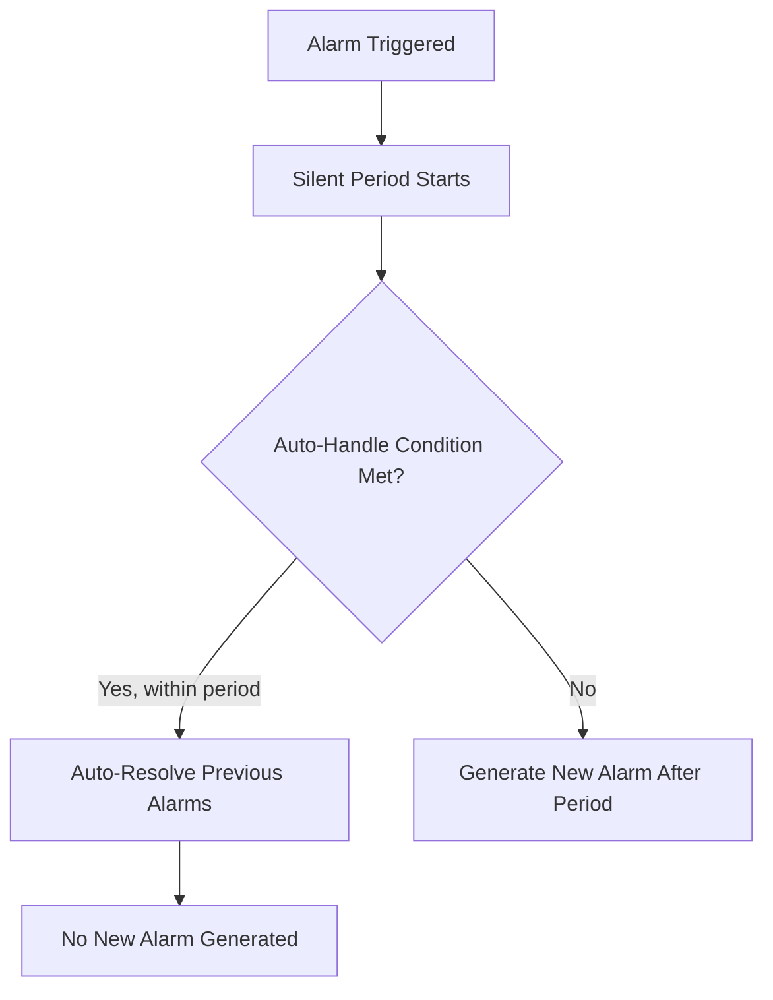

# Functional Requirements - Rule Engine & Dashboard

**Document Version**: 1.0
**Date**: January 27, 2026
**Project**: SHUNCOM RULR IoT Platform
**Related Documents**: [04-Technical Architecture](./04-technical-architecture.md)

---

## 1. Rule Engine System - Detailed Requirements

### 1.1 Platform Rules (Cloud-Based Automation)

#### FR-RULE-PLATFORM-001: Multi-Sub-Rule Architecture
**Priority**: Critical ⭐⭐⭐⭐⭐
**Phase**: 1

**Requirements**:
- System SHALL support multiple sub-rules within a single platform rule
- Each sub-rule SHALL execute independently
- System SHALL support unlimited sub-rules per platform rule
- Each sub-rule SHALL have its own trigger conditions and actions
- System SHALL maintain execution order for sub-rules

**Sub-Rule Execution Logic**:
```yaml
Rule: "Evening Lighting Control"
  Sub-rule 1:
    Condition: Time = 18:00
    Action: Turn on lights at 50% brightness

  Sub-rule 2:
    Condition: Time = 22:00
    Action: Dim lights to 20%

  Sub-rule 3:
    Condition: Time = 06:00
    Action: Turn off lights

Execution: All sub-rules evaluated independently
Result: Each fires at designated time
```

**Acceptance Criteria**:
- ✅ Multiple sub-rules can be added to single rule
- ✅ Sub-rules execute at correct times
- ✅ Failure of one sub-rule doesn't affect others
- ✅ Sub-rule execution logged independently

---

#### FR-RULE-PLATFORM-002: Trigger Conditions
**Priority**: Critical ⭐⭐⭐⭐⭐
**Phase**: 1

**Supported Trigger Types**:

**1. Attribute Trigger**
```yaml
Function: Use device-reported attribute data
Device Limit: 1 device per attribute trigger
Supported Attributes:
  - Electrical: voltage, current, power, energy
  - Environmental: illuminance, temperature, humidity
  - Status: online, offline, fault
Operators: =, !=, >, <, >=, <=, between
Examples:
  - Voltage > 240V
  - Illuminance < 50 lux
  - Power between 50W and 100W
```

**2. Time Trigger**
```yaml
Time Types:
  Fixed Time:
    Format: "HH:MM" (24-hour)
    Examples: "18:00", "06:30"
    Timezone: User's configured timezone

  Sunrise/Sunset:
    Requirement: Device lat/long coordinates
    Calculation: Daily automatic update
    Offset: +/- minutes from sunrise/sunset
    Examples:
      - Sunset (exact time)
      - Sunset - 30 minutes (30 min before)
      - Sunrise + 15 minutes (15 min after)

  Interval:
    Format: Every X minutes/hours
    Examples:
      - Every 30 minutes
      - Every 2 hours
    Range: 1 minute to 24 hours
```

**3. Time Range**
```yaml
Purpose: Constrain other triggers to time window
Constraint: Cannot exist alone
Limit: Only 1 time range per sub-rule
Format: "HH:MM - HH:MM"
Examples:
  - 17:00 - 22:00 (evening hours)
  - 00:00 - 06:00 (night hours)
Combination:
  - Attribute trigger + Time range
  - Example: "Voltage > 240V between 18:00-22:00"
```

**4. Online Status Trigger**
```yaml
States: Online, Offline
Constraint: Cannot exist alone
Combination: Must combine with attribute triggers
Examples:
  - Device online AND voltage > 220V
  - Device offline for 10 minutes
```

**5. Trigger Times (Occurrence Count)**
```yaml
Logic: "In last X minutes, if condition met Y times"
Constraint: Must combine with attribute triggers
Purpose: Reduce false alarms
Examples:
  - In last 10 minutes, voltage > 240V occurs 3 times → action
  - In last 30 minutes, offline event occurs 5 times → alarm
Parameters:
  - Time window: 1-60 minutes
  - Count threshold: 1-100 occurrences
```

**Condition Logic**:
```yaml
AND Logic: All conditions must be true
OR Logic: Any condition can be true

Restrictions:
  ❌ Time trigger + Time trigger (not allowed)
  ❌ Online status + Time range only (must have attribute)
  ✅ Attribute + Time range + Online status (allowed)
  ✅ Time trigger + Attribute (allowed)
  ✅ Multiple attributes with AND/OR (allowed)
```

**Acceptance Criteria**:
- ✅ All 5 trigger types functional
- ✅ Sunrise/sunset calculates correctly from coordinates
- ✅ Time range constrains trigger properly
- ✅ Trigger times counts occurrences accurately
- ✅ Invalid combinations show validation error

---

#### FR-RULE-PLATFORM-003: Execute Actions
**Priority**: Critical ⭐⭐⭐⭐⭐
**Phase**: 1

**Action Types**:

**1. Invoke Service**
```yaml
Purpose: Call device-specific services
Product-specific: Different services per device type

Gateway Services:
  - close_circuit(circuit_id)
  - open_circuit(circuit_id)
  - read_local_time()
  - sync_subdevices()
  - set_password(new_password)

Light Controller Services:
  - turn_on()
  - turn_off()
  - set_brightness(0-100)
  - set_color_temperature(2700-6500K)
  - read_data()
  - timing_calibration()

Smart Meter Services:
  - read_energy()
  - reset_energy()
  - sync_meter_info()
```

**2. Control Lamp**
```yaml
Operations:
  Turn On:
    Parameters: brightness (0-100%)
    Default: 100%

  Turn Off:
    No parameters

  Dimming:
    Parameters: brightness (0-100%)
    Step: 1%
    Transition: Smooth (configurable duration)

Target Selection:
  - Individual devices
  - Device groups
  - Specific fixtures (for light controllers)
```

**3. Control Loop**
```yaml
Operations:
  Connect Circuit:
    Action: Close relay, enable power
    Target: Specific circuit ID

  Disconnect Circuit:
    Action: Open relay, disable power
    Target: Specific circuit ID

Target Selection:
  - Individual circuits
  - Circuit groups
  - All circuits (emergency shutdown)

Safety:
  - Confirmation required for bulk disconnect
  - Auto-reconnect timeout (configurable)
```

**Device Selection Constraints**:
```yaml
Same Batch Only:
  Constraint: All action devices must be same product type
  Reason: Different products have different capabilities
  Validation: Check product type before saving

Selection Methods:
  Select Device:
    Mode: Choose specific devices
    Limit: No limit, but performance consideration

  Select Group:
    Mode: All devices in selected group
    Default: If no devices specified

  Specific Selection:
    For Light Controllers:
      - Select specific fixtures to control
    For Gateways:
      - Select specific circuits to control
```

**Acceptance Criteria**:
- ✅ All 3 action types execute correctly
- ✅ Device-specific services called successfully
- ✅ Lamp control operations work (on/off/dim)
- ✅ Loop control opens/closes circuits
- ✅ Same batch constraint enforced
- ✅ Group selection applies action to all members

---

#### FR-RULE-PLATFORM-004: Rule Scheduling
**Priority**: Critical ⭐⭐⭐⭐⭐
**Phase**: 1

**Requirements**:
```yaml
Effective Date:
  Start Date: YYYY-MM-DD
  End Date: YYYY-MM-DD (optional)
  Validation: End date must be after start date

Repeat Period:
  Daily: Execute every day
  Weekly: Select specific days (Mon-Sun)
  Monthly: Select specific dates (1-31)
  Custom: Advanced cron expression (optional)

Effective Time:
  All Day: 00:00 - 23:59
  Custom Range: HH:MM - HH:MM
  Purpose: Further constrain rule execution

Enable/Disable:
  Status: Active/Inactive
  Effect: Inactive rules skip execution
  Persistence: Rule configuration retained
```

**Execution Logic**:
```yaml
Rule Evaluation Flow:
  1. Check if current date within effective date range
  2. Check if current day matches repeat period
  3. Check if current time within effective time range
  4. Evaluate trigger conditions
  5. If all pass → Execute actions
  6. Log execution result

Timezone Handling:
  - All times interpreted in user's selected timezone
  - Critical: Timezone change affects all rules
  - Warning shown to user on timezone change
```

**Acceptance Criteria**:
- ✅ Daily repeat executes every day
- ✅ Weekly repeat executes on selected days only
- ✅ Monthly repeat executes on selected dates
- ✅ Effective date range enforced
- ✅ Disabled rules don't execute
- ✅ Timezone changes update execution times

---

### 1.2 Local Rules (Device-Level Automation)

#### FR-RULE-LOCAL-001: Simplified Rule Structure
**Priority**: High ⭐⭐⭐⭐
**Phase**: 1

**Constraints**:
```yaml
Rule Simplicity:
  Conditions: 1 condition per sub-rule only
  Actions: 1 action per sub-rule only
  Reason: Device processing limitations

Multi-Sub-Rule:
  Support: Yes (multiple sub-rules per rule)
  Execution: Independent per sub-rule
```

**Gateway Local Rules**:
```yaml
Trigger Conditions:
  - Scheduled trigger (fixed time)
  - Sunrise time
  - Sunset time
  - Interval trigger

Actions:
  - Open circuit
  - Close circuit

Example:
  Rule: "Automatic Street Lighting"
    Sub-rule 1:
      Trigger: Sunset
      Action: Close circuit 1

    Sub-rule 2:
      Trigger: Sunrise
      Action: Open circuit 1
```

**Light Controller Local Rules**:
```yaml
Trigger Conditions:
  - Scheduled trigger (fixed time)
  - Latitude/longitude trigger (sunrise/sunset)
  - Light sensitivity trigger (illuminance threshold)

Actions:
  - Turn on lights
  - Turn off lights
  - Dim lights (0-100%)

Example:
  Rule: "Dawn/Dusk Automation"
    Sub-rule 1:
      Trigger: Illuminance < 50 lux
      Action: Turn on at 80%

    Sub-rule 2:
      Trigger: Illuminance > 100 lux
      Action: Turn off
```

**Acceptance Criteria**:
- ✅ Only 1 condition + 1 action enforced
- ✅ Gateway rules control circuits correctly
- ✅ Light controller rules work offline
- ✅ Sunrise/sunset calculated locally on device

---

#### FR-RULE-LOCAL-002: Synchronization System
**Priority**: Critical ⭐⭐⭐⭐⭐
**Phase**: 1

**Sync Workflow**:


**Sync Status Tracking**:
```yaml
Status Values:
  pending: Rule saved, not yet synced
  syncing: Sync in progress
  synced: Successfully synced to device
  failed: Sync failed (with error message)
  partial: Some sub-rules synced, others failed

Retry Mechanism:
  Manual Retry: User-initiated via "Send rules synchronously"
  Auto Retry: 3 attempts with exponential backoff
  Retry Interval: 1 min, 5 min, 15 min

Bulk Sync:
  - Sync all pending rules for device
  - Sync all rules for device group
  - Progress tracking (X/Y rules synced)
```

**Requirements**:
- System SHALL sync local rules to devices after save
- System SHALL track sync status per rule
- System SHALL display sync results prominently
- System SHALL support manual retry for failed syncs
- System SHALL support bulk sync operations
- System SHALL log sync errors with device response
- System SHALL prevent device operations during sync

**Acceptance Criteria**:
- ✅ Rule syncs to device after save
- ✅ Sync status updates in real-time
- ✅ Failed sync shows error message
- ✅ Manual retry successful for failed rules
- ✅ Bulk sync processes multiple rules
- ✅ Progress indicator shown for long operations

---

### 1.3 Alarm Rules System

#### FR-ALARM-001: Platform Alarm Rules
**Priority**: Critical ⭐⭐⭐⭐⭐
**Phase**: 2

**Rule Structure**:
```yaml
Multi-Sub-Rule: Yes
Conditions: Multiple per sub-rule (AND/OR logic)
Actions: 1 action per sub-rule (alarm generation)
Device Constraint: Same product type only
```

**Trigger Conditions**:
```yaml
1. Attribute Trigger:
   - Same as platform rules
   - Device property thresholds
   - Examples: Voltage > 250V, Power < 5W

2. Event Trigger:
   - Offline alarm events
   - Device alarm events (device-reported)
   - System events

3. Other Triggers:
   - Online/offline status
   - Cannot exist alone
   - Must combine with attribute/event triggers
```

**Execution Action**:
```yaml
Alarm Generation:
  Alarm Name: Custom or default
  Alarm Level: Select from configured levels

  Silent Period:
    Duration: Minutes (default 30)
    Purpose: Prevent alarm spam
    Logic: If condition still true within period → no new alarm

  Auto-Handle Condition:
    Definition: Condition that auto-resolves alarm
    Example: If power returns > 9W → auto-resolve alarm
    Timeout: If met within silent period → auto-process

  Notification:
    Enable: Yes/No toggle
    Recipients: Select recipient groups (multiple)
    Channels: Email, SMS, Push, Webhook
```

**Auto-Handle Logic**:


**Example Configuration**:
```yaml
Rule: "Light Fixture Power Anomaly"
  Product: Dual-way Light Controller
  Effective Time: 18:20 - 21:59

  Sub-rule 1:
    Conditions:
      - Fixture 1 Active Power < 9W (AND)
      - Fixture 1 Active Power > 0.01W
    Action:
      - Generate alarm "Low Power Anomaly"
      - Level: High
      - Silent Period: 20 minutes
      - Auto-Handle: Power > 9W
      - Notify: Group "Maintenance Team"

  Logic:
    - If power drops between 0.01-9W → alarm
    - If power returns >9W within 20 min → auto-resolve
    - If power still low after 20 min → new alarm
```

**Acceptance Criteria**:
- ✅ Alarm generated when conditions met
- ✅ Silent period prevents spam
- ✅ Auto-handle resolves alarms correctly
- ✅ Notifications sent to recipient groups
- ✅ Alarm level displayed correctly

---

#### FR-ALARM-002: Offline Alarm Configuration
**Priority**: High ⭐⭐⭐⭐
**Phase**: 2

**Requirements**:
```yaml
Offline Threshold:
  Duration: Minutes (default 30)
  Trigger: Device offline for X minutes
  Warning: Don't set too short (network fluctuations)

Enable/Disable: Per product type

Effective Time:
  All Day: 00:00 - 23:59
  Custom Range: HH:MM - HH:MM
  Purpose: Filter alarms to business hours

Silent Period:
  Duration: Minutes
  Purpose: Group offline events

Alarm Configuration:
  Level: Select from alarm levels
  Notification: Enable/disable
  Recipients: Select groups

Device Exclusions:
  Purpose: Exclude specific devices from this alarm
  Use Case: Devices under maintenance
  Format: Array of device IDs
```

**Acceptance Criteria**:
- ✅ Alarm generated after offline threshold
- ✅ Effective time filters alarm generation
- ✅ Silent period groups related events
- ✅ Excluded devices don't trigger alarms
- ✅ Notifications sent to configured groups

---

#### FR-ALARM-003: Device Alarm Configuration
**Priority**: High ⭐⭐⭐⭐
**Phase**: 2

**Requirements**:
```yaml
Alarm Source: Device-reported events

Supported Devices:
  - Single-way light controllers
  - Dual-way light controllers
  - All controllers with threshold support

Alarm Event Types:
  - Over-voltage
  - Under-voltage
  - Over-current
  - Over-temperature
  - Hardware fault
  - Communication failure

Threshold Configuration:
  Custom Thresholds: Device-specific
  Examples:
    - Voltage: 200V - 250V (normal range)
    - Current: 0A - 10A (max current)
    - Temperature: -40°C - 85°C (operating range)

Configuration per Event Type:
  Enable/Disable: Toggle
  Effective Time: Time range
  Silent Period: Minutes
  Alarm Level: Select
  Notification: Enable/disable
  Recipients: Groups
  Excluded Devices: Array
```

**Acceptance Criteria**:
- ✅ Device alarms forwarded to platform
- ✅ Thresholds configurable per device type
- ✅ Alarms filtered by effective time
- ✅ Silent period prevents duplicate alarms

---

#### FR-ALARM-004: Alarm Instance Management
**Priority**: Critical ⭐⭐⭐⭐⭐
**Phase**: 2

**Alarm Lifecycle**:
```yaml
Status Flow:
  pending → processing → resolved
  pending → processing → auto_resolved

Status Meanings:
  pending: New alarm, not yet acknowledged
  processing: Acknowledged, work in progress
  resolved: Manually resolved by user
  auto_resolved: Auto-handled by system
```

**Alarm Operations**:
```yaml
Individual Operations:
  - View details
  - Acknowledge (pending → processing)
  - Resolve (processing → resolved)
  - Add resolution notes

Batch Operations:
  - Batch acknowledge (multiple alarms → processing)
  - Batch resolve
  - Batch dispatch work orders

Filtering:
  By Alarm Level: Critical, High, Medium, Low
  By Alarm Type: Platform, Offline, Device
  By Status: Pending, Processing, Resolved
  By Device: Specific device or group
  By Time Range: Date range picker

Export:
  Format: Excel/CSV
  Filters: Apply current filters
  Data: All alarm fields + custom notes
```

**Notification Management**:
```yaml
Notification Trigger:
  When: Alarm status = pending (new alarm)

Channels:
  Email:
    - HTML template
    - Alarm details + direct link
    - Delivery: < 1 minute

  SMS:
    - Text template
    - Alarm summary
    - Delivery: < 30 seconds

  Push Notification:
    - Mobile app notification
    - Click action: Open alarm details

  Webhook:
    - POST to configured URL
    - JSON payload with alarm data
    - Retry: 3 attempts

Delivery Status:
  - Track sent/failed per channel
  - Display in alarm details
  - Retry failed notifications
```

**Acceptance Criteria**:
- ✅ Alarm status updates correctly
- ✅ Batch operations process multiple alarms
- ✅ Filtering returns accurate results
- ✅ Export generates correct data
- ✅ Notifications sent via all channels
- ✅ Notification status tracked

---

## 2. Dashboard & Visualization Requirements

### 2.1 Homepage Dashboard

#### FR-DASH-001: Statistical Overview
**Priority**: High ⭐⭐⭐⭐
**Phase**: 2

**Requirements**:
- System SHALL display device count summaries per project
- System SHALL show status distribution (online/offline/alarm)
- System SHALL support project-based data filtering
- System SHALL update data in real-time (WebSocket)
- System SHALL support up to 8 configurable modules

**Dashboard Modules**:
```yaml
Available Modules:
  1. Device Count by Type
  2. Device Status Distribution (Pie chart)
  3. Energy Consumption (Line chart)
  4. Alarm Summary (Bar chart)
  5. Recent Alarms (List)
  6. Device Map (GIS integration)
  7. Lighting Schedule (Timeline)
  8. Custom Widgets (User-defined)

Module Configuration:
  - Enable/disable per module
  - Drag-and-drop arrangement
  - Resize modules (grid system)
  - Custom time ranges
  - Refresh intervals (real-time, 1min, 5min, 15min)
```

**Acceptance Criteria**:
- ✅ All 8 modules display correctly
- ✅ Real-time updates work
- ✅ Project filter applies to all modules
- ✅ Drag-and-drop saves layout
- ✅ Click-through to details works

---

#### FR-DASH-002: Device Lists
**Priority**: Critical ⭐⭐⭐⭐⭐
**Phase**: 1

**Requirements**:
```yaml
Pagination:
  Items per page: 10, 25, 50, 100
  Navigation: First, Previous, Next, Last
  Total count: Display total devices

Search:
  Fields: Device name, device number, address
  Type: Full-text search
  Performance: < 500ms response time

Filtering:
  By Type: All types + individual types
  By Status: Online, Offline, Alarm
  By Project: Hierarchical project selection
  By Group: Group selection
  Combined: Multiple filters simultaneously

Sorting:
  Fields: Name, Status, Last seen, Created date
  Direction: Ascending, Descending
  Persistence: Remember user preference

Column Customization:
  Show/Hide: Toggle columns
  Reorder: Drag columns
  Resize: Adjust column width
  Presets: Save column configurations
```

**Quick Actions**:
```yaml
Row Actions:
  - View details (eye icon)
  - Edit device (edit icon)
  - Send command (control icon)
  - View on map (location icon)
  - Delete (trash icon)

Batch Actions:
  - Select all / Select page
  - Batch control (on/off/dim)
  - Batch group assignment
  - Batch export
  - Batch delete
```

**Acceptance Criteria**:
- ✅ Pagination works correctly
- ✅ Search returns accurate results
- ✅ Filters apply correctly
- ✅ Sorting persists across sessions
- ✅ Column customization saves
- ✅ Quick actions execute successfully

---

### 2.2 GIS Map Interface

#### FR-GIS-001: Map Integration
**Priority**: High ⭐⭐⭐⭐
**Phase**: 2

**Requirements**:
```yaml
Map Provider: Leaflet.js + OpenStreetMap
Alternative: Google Maps, Mapbox

Map Controls:
  - Zoom in/out (+/- buttons)
  - Reset view (home button)
  - Full screen toggle
  - Map type selector (Roadmap, Satellite, Terrain)
  - Layer control (toggle device layers)

Device Display:
  Icon Differentiation:
    - Unique icon per device category
    - Icon color by status (green=online, red=offline, yellow=alarm)

  Clustering:
    - Enable at zoom levels < 15
    - Cluster size indicator
    - Click cluster → zoom to expand

  Info Popup:
    Trigger: Click device icon
    Content:
      - Device name
      - Device type
      - Online status
      - Key metrics
      - Quick actions (view, control)
```

**Device Distribution Workflow**:
```yaml
Prerequisites:
  - Device must have lat/long coordinates
  - Only available in second-level projects
  - GIS map must be enabled for project

Single Device Distribution:
  1. Search location (address or coordinates)
  2. Select 1 device from list
  3. Click "Batch Distribution"
  4. Double-click map to place device
  5. Click "Refresh Location" to save

Batch Device Distribution:
  1. Search location
  2. Select 2+ devices from list
  3. Click "Batch Distribution"
  4. Draw path on map (click multiple points)
  5. Double-click to terminate path
  6. Devices distributed evenly along path
  7. Click "Save" to commit

Fine-tuning:
  1. Click device icon on map
  2. Drag to new location
  3. Click "Save Coordinates"
  4. System updates device lat/long
```

**Acceptance Criteria**:
- ✅ Map loads with correct initial view
- ✅ Devices display with correct icons
- ✅ Clustering works at zoom levels
- ✅ Single device distribution saves correctly
- ✅ Batch distribution along path accurate
- ✅ Fine-tuning updates coordinates

---

### 2.3 Operation Control Interface

#### FR-CONTROL-001: Device Control
**Priority**: Critical ⭐⭐⭐⭐⭐
**Phase**: 1

**Light Controller Controls**:
```yaml
Operations:
  Turn On:
    UI: Toggle button
    Feedback: Visual confirmation
    Timeout: 10 seconds

  Turn Off:
    UI: Toggle button
    Confirmation: If controlling >10 devices

  Dimming:
    UI: Slider (0-100%)
    Step: 1%
    Real-time preview: Optional
    Apply: On slider release or explicit "Apply"

  Read Light Data:
    UI: Button "Refresh Data"
    Result: Update all metrics
    Frequency: Manual or auto (5 min intervals)

  Advanced:
    - Read version number
    - Read local time
    - Timing calibration
    - GPS switch toggle
```

**Gateway Controls**:
```yaml
Circuit Operations:
  Full Disconnect:
    UI: Button "Disconnect All Circuits"
    Confirmation: Required
    Action: Open all circuit relays

  Full Connect:
    UI: Button "Connect All Circuits"
    Action: Close all circuit relays

  Individual Circuit:
    UI: Toggle per circuit
    Feedback: Circuit status indicator

Group Control:
  Target: All light controllers under gateway
  Operations: Same as individual light control
  Confirmation: If >50 devices

Data Operations:
  - Read local time
  - Read latitude/longitude
  - Read three-phase electricity
  - Read circuit status (3rd gen gateway)
```

**Control Feedback**:
```yaml
Success:
  - Visual indicator (green checkmark)
  - Toast notification
  - Update device status immediately

Failure:
  - Error message with reason
  - Retry button
  - Log error for debugging

Timeout:
  - Show timeout message
  - Allow manual retry
  - Check device connectivity
```

**Acceptance Criteria**:
- ✅ Light on/off control works
- ✅ Dimming slider updates device
- ✅ Gateway circuit control functional
- ✅ Group control applies to all members
- ✅ Success/failure feedback displayed
- ✅ Timeout handled gracefully

---

### 2.4 Device Details Page

#### FR-DETAILS-001: Six Major Sections
**Priority**: High ⭐⭐⭐⭐
**Phase**: 2

**Section 1: Device Details**
```yaml
Basic Information:
  - Device name (editable inline)
  - Device number
  - Product name
  - Online status (real-time indicator)
  - Last seen timestamp
  - Firmware version
  - Installation date

Location:
  - Latitude/Longitude (editable)
  - Address (editable)
  - Map preview (mini-map)

Associations:
  - Parent device (gateway)
  - Associated fixture
  - Associated pole
  - Project assignment
  - Group membership

Configuration:
  - View device-specific config
  - Edit configuration (if permitted)
  - Apply changes
```

**Section 2: Historical Data**
```yaml
Time-Series Metrics:
  - Electrical parameters (voltage, current, power)
  - Environmental data (illuminance, temperature)
  - Energy consumption
  - Run time

Visualization:
  - Line charts for trends
  - Time range selector (1h, 24h, 7d, 30d, custom)
  - Metric selector (multi-select)
  - Export to CSV/Excel

Data Table:
  - Timestamp
  - All metrics
  - Pagination
  - Sort by timestamp
  - Export filtered data
```

**Section 3: All Rules**
```yaml
Platform Rules:
  - List of platform rules affecting this device
  - Rule name, type, status
  - Click to view rule details
  - Jump to rule editor

Local Rules:
  - List of local rules on device
  - Read local rules from device
  - Sync status per rule
  - Clear local rules (with confirmation)
  - Sync delivery (re-download rules)

Rule Operations:
  Read Local Rules:
    - Query device for current rules
    - Display rule list with details
    - Compare platform vs device rules

  Clear Local Rules:
    - Remove all rules from device
    - Confirmation required
    - Cannot be undone

  Sync Delivery:
    - Re-download all local rules
    - Retry failed syncs
    - Progress indicator
```

**Section 4: Alarm Information**
```yaml
Recent Alarms:
  - Last 10 alarms for this device
  - Alarm name, level, timestamp
  - Status (pending/processing/resolved)
  - Click to view alarm details

Alarm Summary:
  - Total alarms (all time)
  - Pending alarms count
  - Most frequent alarm type
  - Average resolution time

Quick Actions:
  - View all alarms (jump to alarm page filtered)
  - Create manual alarm
  - Configure alarm rules for this device
```

**Section 5: Operation Records**
```yaml
Activity Log:
  - All operations on this device
  - User actions (who did what, when)
  - System actions (auto-operations)
  - Command history

Log Entries:
  - Timestamp
  - User/System
  - Action type (create, update, control, delete)
  - Action details
  - Result (success/failure)

Filtering:
  - By user
  - By action type
  - By date range
  - By result status

Export:
  - CSV/Excel export
  - PDF report generation
```

**Section 6: Statistical Analysis**
```yaml
Data Overview:
  - Key performance indicators
  - Energy efficiency metrics
  - Uptime percentage
  - Fault rate

Charts:
  - Energy consumption trends
  - Voltage/current patterns
  - On-time distribution
  - Comparative analysis (vs group average)

Time Ranges:
  - Today
  - Yesterday
  - Last 7 days
  - Last 30 days
  - Custom range

Export:
  - Generate report
  - Download charts as images
  - Export data to Excel
```

**Acceptance Criteria**:
- ✅ All 6 sections display correctly
- ✅ Read local rules queries device
- ✅ Clear local rules removes rules from device
- ✅ Sync delivery re-downloads rules
- ✅ Historical data charts accurate
- ✅ Operation records complete
- ✅ Statistical analysis calculates correctly

---

**Next Document**: [06-Implementation Roadmap](./06-implementation-roadmap.md)

---

## Document Revision History

| Version | Date | Changes | Author |
|---------|------|---------|--------|
| 1.0 | 2026-01-27 | Initial functional requirements | AI Assistant |
