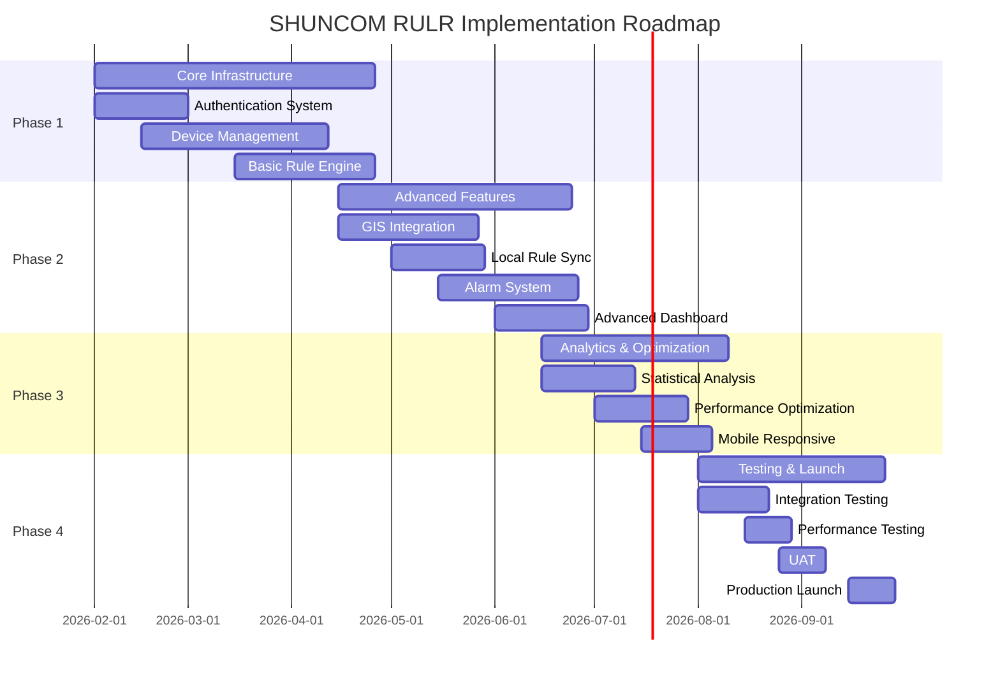

# Implementation Roadmap & Timeline

**Document Version**: 1.0
**Date**: January 27, 2026
**Project**: SHUNCOM RULR IoT Platform
**Related Documents**: [05-Functional Requirements](./05-functional-requirements.md)

---

## 1. Overall Timeline

### 1.1 Project Duration
**Total Duration**: 8 months (32 weeks)
**Start Date**: February 1, 2026
**Target Launch**: September 30, 2026

### 1.2 Phase Breakdown



---

## 2. Phase 1: Core Infrastructure (Weeks 1-12)

### 2.1 Month 1 (Weeks 1-4) - Foundation Setup

#### Week 1-2: Project Setup & Infrastructure
**Deliverables**:
```yaml
Development Environment:
  ✅ Version control setup (Git repository)
  ✅ CI/CD pipeline configuration (GitHub Actions)
  ✅ Development environment (Docker Compose)
  ✅ Code quality tools (ESLint, Prettier, Husky)

Infrastructure:
  ✅ Cloud environment provisioning (AWS/Azure/GCP)
  ✅ Database setup (PostgreSQL + Redis)
  ✅ Object storage configuration (S3/MinIO)
  ✅ Monitoring setup (Prometheus + Grafana)

Documentation:
  ✅ Technical design documents
  ✅ API contract definitions
  ✅ Database schema design
  ✅ Development guidelines
```

**Team Tasks**:
| Role | Tasks | Hours |
|------|-------|-------|
| DevOps Engineer | Cloud setup, CI/CD pipeline | 80h |
| Backend Lead | Architecture design, database schema | 60h |
| Frontend Lead | Project structure, component library setup | 40h |
| Project Manager | Sprint planning, documentation | 40h |

---

#### Week 3-4: Authentication System
**Deliverables**:
```yaml
Backend:
  ✅ User authentication endpoints (login, logout, refresh)
  ✅ JWT token implementation
  ✅ Password hashing (bcrypt)
  ✅ Session management (Redis)
  ✅ Password reset workflow
  ✅ Account lockout protection

Frontend:
  ✅ Login page UI
  ✅ Password reset flow
  ✅ Protected route wrapper
  ✅ Auth state management (Redux)

Database:
  ✅ Users table
  ✅ Sessions table
  ✅ Password reset tokens table
```

**Acceptance Criteria**:
- ✅ User can login with valid credentials
- ✅ Invalid login shows error message
- ✅ Account locks after 5 failed attempts
- ✅ Password reset email sent successfully
- ✅ JWT tokens expire correctly
- ✅ Refresh token rotation works

**Team Tasks**:
| Role | Tasks | Hours |
|------|-------|-------|
| Backend Developer (2) | Auth endpoints, JWT, password reset | 120h |
| Frontend Developer | Login UI, auth state management | 60h |
| QA Engineer | Test cases, security testing | 40h |

---

### 2.2 Month 2 (Weeks 5-8) - User & Device Management

#### Week 5-6: RBAC & User Management
**Deliverables**:
```yaml
Backend:
  ✅ Role management endpoints (CRUD)
  ✅ Permission system implementation
  ✅ Management scope logic
  ✅ Organization management
  ✅ User-role association

Frontend:
  ✅ User list page (paginated)
  ✅ Add/Edit user forms
  ✅ Role management interface
  ✅ Permission assignment UI
  ✅ Management scope selector

Database:
  ✅ Organizations table
  ✅ Roles table
  ✅ User_roles table
  ✅ Management_scopes table
```

**Acceptance Criteria**:
- ✅ Admin can create custom roles
- ✅ Permissions enforced at API level
- ✅ UI hides unauthorized features
- ✅ Management scope filters data correctly
- ✅ Multi-tenant isolation works

**Team Tasks**:
| Role | Tasks | Hours |
|------|-------|-------|
| Backend Developer (2) | RBAC logic, scope filtering | 140h |
| Frontend Developer (2) | User management UI, role editor | 120h |
| QA Engineer | Permission testing, edge cases | 40h |

---

#### Week 7-8: Device Management Core
**Deliverables**:
```yaml
Backend:
  ✅ Device registration endpoints (7 device types)
  ✅ Device CRUD operations
  ✅ Device association logic
  ✅ Device status tracking
  ✅ Product catalog management

Frontend:
  ✅ Device list page (filterable, sortable)
  ✅ Device registration forms (device-specific)
  ✅ Device detail page (6 sections)
  ✅ Device status indicators
  ✅ Quick actions (view, edit, delete)

Database:
  ✅ Products table
  ✅ Devices table
  ✅ Device_metrics table (TimescaleDB)
  ✅ Device_events table
```

**Acceptance Criteria**:
- ✅ All 7 device types can be registered
- ✅ Device associations validated
- ✅ Device list performance < 500ms
- ✅ Status indicators update in real-time
- ✅ Device filtering works correctly

**Team Tasks**:
| Role | Tasks | Hours |
|------|-------|-------|
| Backend Developer (3) | Device endpoints, validation, metrics | 200h |
| Frontend Developer (2) | Device UI, forms, status tracking | 140h |
| QA Engineer (2) | Device testing, data validation | 60h |

---

### 2.3 Month 3 (Weeks 9-12) - Basic Rule Engine

#### Week 9-10: Platform Rules
**Deliverables**:
```yaml
Backend:
  ✅ Platform rule endpoints (CRUD)
  ✅ Sub-rule management
  ✅ Trigger condition evaluation
  ✅ Action execution engine
  ✅ Rule scheduling logic

Frontend:
  ✅ Rule list page
  ✅ Visual rule builder
  ✅ Condition configuration UI
  ✅ Action configuration UI
  ✅ Device/group selector

Database:
  ✅ Platform_rules table
  ✅ Platform_rule_subrules table
  ✅ Rule_executions table
```

**Acceptance Criteria**:
- ✅ Rules execute at scheduled times
- ✅ Multi-condition logic works (AND/OR)
- ✅ Actions execute correctly
- ✅ Rule execution logged
- ✅ Visual builder user-friendly

**Team Tasks**:
| Role | Tasks | Hours |
|------|-------|-------|
| Backend Developer (3) | Rule engine, scheduler, executor | 200h |
| Frontend Developer (2) | Rule builder UI, form validation | 140h |
| QA Engineer | Rule testing, edge cases | 50h |

---

#### Week 11-12: IoT Communication Layer
**Deliverables**:
```yaml
Backend:
  ✅ MQTT broker integration (EMQX)
  ✅ Device communication handlers
  ✅ Protocol adapters (Zigbee, LoRa, NB-IoT)
  ✅ WebSocket server (Socket.IO)
  ✅ Real-time data streaming

IoT Gateway Integration:
  ✅ Gateway communication protocol
  ✅ Sub-device management
  ✅ Circuit control commands
  ✅ Data synchronization

Frontend:
  ✅ Real-time dashboard updates
  ✅ WebSocket connection management
  ✅ Live status indicators
```

**Acceptance Criteria**:
- ✅ MQTT messages received from devices
- ✅ Device status updates in real-time
- ✅ Gateway commands sent successfully
- ✅ WebSocket reconnection works
- ✅ Data streaming performance acceptable

**Team Tasks**:
| Role | Tasks | Hours |
|------|-------|-------|
| Backend Developer (3) | MQTT, WebSocket, protocol adapters | 220h |
| IoT Specialist | Device integration, protocol testing | 80h |
| Frontend Developer | Real-time UI updates | 60h |

---

### 2.4 Phase 1 Milestones

**End of Week 4**:
- ✅ Authentication system fully functional
- ✅ Users can login/logout securely
- 🎯 **Milestone**: User authentication complete

**End of Week 8**:
- ✅ RBAC system operational
- ✅ All 7 device types can be registered
- ✅ Device lists display correctly
- 🎯 **Milestone**: User & device management complete

**End of Week 12**:
- ✅ Platform rules execute correctly
- ✅ Real-time device communication works
- ✅ Basic dashboard functional
- 🎯 **Milestone**: Core infrastructure complete
- 🚀 **Demo**: Internal stakeholder demo

---

## 3. Phase 2: Advanced Features (Weeks 13-22)

### 3.1 Month 4 (Weeks 13-16) - GIS & Local Rules

#### Week 13-14: GIS Map Integration
**Deliverables**:
```yaml
Backend:
  ✅ Geocoding service integration
  ✅ Spatial query support (PostGIS)
  ✅ Device distribution endpoints
  ✅ Coordinate management API

Frontend:
  ✅ Leaflet.js map integration
  ✅ Device icon display
  ✅ Clustering implementation
  ✅ Single device distribution
  ✅ Batch device distribution (path drawing)
  ✅ Coordinate fine-tuning (drag-and-drop)

Features:
  ✅ Search location
  ✅ Info popups on device click
  ✅ Map controls (zoom, layers)
  ✅ Device filtering on map
```

**Acceptance Criteria**:
- ✅ Map loads with devices displayed
- ✅ Icons differentiated by device type
- ✅ Clustering works at zoom levels
- ✅ Path distribution accurate
- ✅ Coordinate updates save correctly

**Team Tasks**:
| Role | Tasks | Hours |
|------|-------|-------|
| Backend Developer | PostGIS, geocoding, spatial API | 80h |
| Frontend Developer (2) | Map UI, clustering, distribution | 140h |
| QA Engineer | Map testing, accuracy validation | 40h |

---

#### Week 15-16: Local Rules & Synchronization
**Deliverables**:
```yaml
Backend:
  ✅ Local rule endpoints (CRUD)
  ✅ Rule synchronization logic
  ✅ Sync status tracking
  ✅ Gateway communication for rule delivery
  ✅ Retry mechanism

Gateway Firmware:
  ✅ Local rule storage
  ✅ Rule execution engine (offline)
  ✅ Sync protocol implementation
  ✅ Rule validation

Frontend:
  ✅ Local rule builder (simplified)
  ✅ Sync status display
  ✅ Manual retry button
  ✅ Bulk sync interface
```

**Acceptance Criteria**:
- ✅ Local rules sync to gateways
- ✅ Sync status accurate
- ✅ Failed syncs can be retried
- ✅ Rules execute offline on gateway
- ✅ Bulk sync processes multiple rules

**Team Tasks**:
| Role | Tasks | Hours |
|------|-------|-------|
| Backend Developer (2) | Sync logic, gateway communication | 120h |
| IoT Specialist | Gateway firmware, rule execution | 100h |
| Frontend Developer | Local rule UI, sync indicators | 60h |
| QA Engineer | Sync testing, offline scenarios | 40h |

---

### 3.2 Month 5 (Weeks 17-20) - Alarm System

#### Week 17-18: Alarm Rules Configuration
**Deliverables**:
```yaml
Backend:
  ✅ Alarm rule endpoints (platform, offline, device)
  ✅ Alarm generation engine
  ✅ Silent period logic
  ✅ Auto-handle mechanism
  ✅ Recipient group management

Frontend:
  ✅ Alarm rule builder
  ✅ Platform alarm configuration
  ✅ Offline alarm settings
  ✅ Device alarm settings
  ✅ Recipient group manager
  ✅ Alarm level configuration

Database:
  ✅ Alarm_rules table
  ✅ Alarm_rule_subrules table
  ✅ Offline_alarm_configs table
  ✅ Device_alarm_configs table
  ✅ Alarm_levels table
  ✅ Recipient_groups table
```

**Acceptance Criteria**:
- ✅ Alarm rules generate alarms correctly
- ✅ Silent period prevents spam
- ✅ Auto-handle resolves alarms
- ✅ Recipient groups receive notifications
- ✅ Alarm levels display correctly

---

#### Week 19-20: Alarm Management & Notifications
**Deliverables**:
```yaml
Backend:
  ✅ Alarm instance endpoints
  ✅ Alarm status workflow
  ✅ Batch alarm operations
  ✅ Notification service (Email, SMS, Push, Webhook)
  ✅ Notification delivery tracking

Frontend:
  ✅ Alarm list page (filterable)
  ✅ Alarm detail page
  ✅ Batch operations UI
  ✅ Alarm filtering
  ✅ Export functionality
  ✅ Work order dispatch

Integrations:
  ✅ Email service (SendGrid/SES)
  ✅ SMS service (Twilio)
  ✅ Push notification service
  ✅ Webhook delivery
```

**Acceptance Criteria**:
- ✅ Alarms display correctly
- ✅ Batch operations work
- ✅ Notifications sent via all channels
- ✅ Filtering accurate
- ✅ Export generates correct data

**Team Tasks**:
| Role | Tasks | Hours |
|------|-------|-------|
| Backend Developer (2) | Alarm engine, notifications | 140h |
| Frontend Developer (2) | Alarm UI, filters, batch ops | 120h |
| DevOps Engineer | Email/SMS integration | 40h |
| QA Engineer | Alarm testing, notification delivery | 50h |

---

### 3.3 Month 6 (Weeks 21-22) - Advanced Dashboard

#### Week 21-22: Dashboard Customization
**Deliverables**:
```yaml
Frontend:
  ✅ 8 dashboard modules (all types)
  ✅ Drag-and-drop module arrangement
  ✅ Module enable/disable
  ✅ Time range selectors
  ✅ Chart visualizations (ECharts)
  ✅ Real-time data updates
  ✅ Dashboard preview
  ✅ Batch apply to projects

Backend:
  ✅ Dashboard configuration API
  ✅ Statistical data aggregation
  ✅ Chart data endpoints
  ✅ Export endpoints

Features:
  ✅ Device count summaries
  ✅ Status distribution charts
  ✅ Energy consumption graphs
  ✅ Alarm summary charts
  ✅ Lighting schedules display
  ✅ Custom widgets
```

**Acceptance Criteria**:
- ✅ All 8 modules functional
- ✅ Drag-and-drop saves layout
- ✅ Real-time updates work
- ✅ Charts display correctly
- ✅ Batch apply copies config

**Team Tasks**:
| Role | Tasks | Hours |
|------|-------|-------|
| Frontend Developer (2) | Dashboard UI, charts, widgets | 140h |
| Backend Developer | Aggregation queries, APIs | 60h |
| UI/UX Designer | Dashboard design, usability | 40h |

---

### 3.4 Phase 2 Milestones

**End of Week 16**:
- ✅ GIS map fully functional
- ✅ Local rules sync to devices
- 🎯 **Milestone**: GIS & local rules complete

**End of Week 20**:
- ✅ Comprehensive alarm system operational
- ✅ Notifications sent via all channels
- 🎯 **Milestone**: Alarm system complete

**End of Week 22**:
- ✅ Advanced dashboard customizable
- ✅ Real-time updates working
- 🎯 **Milestone**: Advanced features complete
- 🚀 **Demo**: Beta release to pilot customers

---

## 4. Phase 3: Analytics & Optimization (Weeks 23-30)

### 4.1 Month 7 (Weeks 23-26) - Analytics

#### Week 23-24: Statistical Analysis
**Deliverables**:
```yaml
Backend:
  ✅ Energy consumption analytics
  ✅ Device performance metrics
  ✅ Trend analysis algorithms
  ✅ Comparative analysis
  ✅ KPI calculations

Frontend:
  ✅ Statistical analysis page
  ✅ Time-series charts
  ✅ Comparative views
  ✅ Export reports (Excel, PDF)
  ✅ Custom date ranges

Features:
  ✅ Energy savings rate calculation
  ✅ Uptime percentage
  ✅ Fault rate analysis
  ✅ Cost analysis
  ✅ Environmental impact metrics
```

**Acceptance Criteria**:
- ✅ Analytics calculate correctly
- ✅ Charts display trends accurately
- ✅ Reports export successfully
- ✅ Date range filtering works

---

#### Week 25-26: Performance Optimization
**Deliverables**:
```yaml
Backend Optimization:
  ✅ Database query optimization
  ✅ Index tuning
  ✅ Caching strategy (Redis)
  ✅ Connection pooling
  ✅ Background job processing

Frontend Optimization:
  ✅ Code splitting
  ✅ Lazy loading
  ✅ Image optimization
  ✅ Virtual scrolling (large lists)
  ✅ Service workers (offline capability)

Infrastructure:
  ✅ CDN setup (CloudFlare)
  ✅ Load balancer configuration
  ✅ Auto-scaling policies
  ✅ Database read replicas
```

**Performance Targets**:
- ✅ API response time < 500ms (P95)
- ✅ Dashboard load < 2 seconds
- ✅ Device list pagination < 300ms
- ✅ Real-time latency < 1 second
- ✅ Support 100,000+ devices

**Team Tasks**:
| Role | Tasks | Hours |
|------|-------|-------|
| Backend Developer (2) | Query optimization, caching | 100h |
| Frontend Developer | Code splitting, lazy loading | 60h |
| DevOps Engineer | CDN, load balancer, scaling | 80h |
| QA Engineer | Performance testing | 40h |

---

### 4.2 Month 7-8 (Weeks 27-30) - Mobile & Testing

#### Week 27-28: Mobile Responsive Design
**Deliverables**:
```yaml
Frontend:
  ✅ Mobile-first responsive design
  ✅ Touch-friendly controls
  ✅ Mobile navigation
  ✅ Tablet optimization
  ✅ Progressive Web App (PWA) features

Features:
  ✅ Offline device status caching
  ✅ Push notifications (mobile)
  ✅ Camera integration (device photos)
  ✅ GPS integration (field operations)

Testing:
  ✅ iPhone (Safari)
  ✅ Android (Chrome)
  ✅ iPad
  ✅ Android tablets
```

**Acceptance Criteria**:
- ✅ All features work on mobile
- ✅ Touch controls responsive
- ✅ PWA installable
- ✅ Offline features functional

---

#### Week 29-30: Integration & UAT
**Deliverables**:
```yaml
Testing:
  ✅ Integration testing
  ✅ End-to-end testing
  ✅ Performance testing
  ✅ Security testing
  ✅ User acceptance testing (UAT)

Documentation:
  ✅ User manuals
  ✅ Admin guides
  ✅ API documentation (Swagger)
  ✅ Deployment guides
  ✅ Troubleshooting guides

Training:
  ✅ User training materials
  ✅ Admin training sessions
  ✅ Video tutorials
```

**Team Tasks**:
| Role | Tasks | Hours |
|------|-------|-------|
| QA Engineer (2) | Full regression testing | 160h |
| Technical Writer | Documentation | 60h |
| Project Manager | UAT coordination, training | 40h |

---

### 4.3 Phase 3 Milestones

**End of Week 26**:
- ✅ Statistical analysis complete
- ✅ Performance optimized
- 🎯 **Milestone**: Analytics & optimization complete

**End of Week 30**:
- ✅ Mobile responsive functional
- ✅ Integration testing passed
- ✅ Documentation complete
- 🎯 **Milestone**: Ready for production launch
- 🚀 **Demo**: Final stakeholder demo

---

## 5. Phase 4: Production Launch (Weeks 31-32)

### 5.1 Week 31: Pre-Launch Preparation
**Activities**:
```yaml
Infrastructure:
  ✅ Production environment setup
  ✅ Database migration scripts
  ✅ SSL certificates
  ✅ Backup procedures
  ✅ Monitoring dashboards

Security:
  ✅ Security audit
  ✅ Penetration testing
  ✅ GDPR compliance review
  ✅ Data encryption verification

Operations:
  ✅ Deployment runbook
  ✅ Rollback procedures
  ✅ On-call schedule
  ✅ Incident response plan
```

---

### 5.2 Week 32: Production Launch
**Launch Timeline**:
```yaml
Day 1-2:
  ✅ Database migration (off-peak hours)
  ✅ Application deployment
  ✅ Smoke testing
  ✅ DNS cutover

Day 3-4:
  ✅ Monitor system stability
  ✅ Address critical issues
  ✅ Performance tuning

Day 5-7:
  ✅ User onboarding
  ✅ Support ticket monitoring
  ✅ Post-launch review
```

**Launch Checklist**:
- ✅ All features tested and approved
- ✅ Performance targets met
- ✅ Security audit passed
- ✅ Documentation complete
- ✅ Support team trained
- ✅ Backup procedures verified
- ✅ Monitoring alerts configured
- ✅ Rollback plan ready

---

## 6. Post-Launch (Months 9-10)

### 6.1 Month 9: Stabilization
**Activities**:
```yaml
Support:
  ✅ 24/7 support coverage
  ✅ Bug fixes (priority 1-2)
  ✅ Performance monitoring
  ✅ User feedback collection

Optimization:
  ✅ Database query tuning
  ✅ Cache optimization
  ✅ API performance improvements
```

### 6.2 Month 10: Iteration
**Activities**:
```yaml
Enhancements:
  ✅ Minor feature additions
  ✅ UI/UX improvements
  ✅ Mobile app considerations
  ✅ Advanced analytics features

Planning:
  ✅ Roadmap for next version
  ✅ Feature prioritization
  ✅ Resource planning
```

---

## 7. Risk Management & Contingency

### 7.1 Schedule Risks

**Risk**: Device integration complexity
**Mitigation**: Allocate 2 weeks buffer for IoT integration
**Contingency**: Reduce supported device types for MVP

**Risk**: Performance issues with large datasets
**Mitigation**: Early performance testing, database optimization
**Contingency**: Implement pagination limits, add more hardware

**Risk**: Third-party API delays (GIS, notifications)
**Mitigation**: Early vendor selection, contract SLAs
**Contingency**: Use alternative providers, fallback mechanisms

---

## 8. Key Success Metrics

**Phase 1 Success Criteria**:
- ✅ 1,000+ devices registered
- ✅ User authentication 99.9% uptime
- ✅ Platform rules execute with 100% accuracy

**Phase 2 Success Criteria**:
- ✅ GIS map displays 10,000+ devices
- ✅ Local rules sync success rate > 95%
- ✅ Alarms generated within 60 seconds

**Phase 3 Success Criteria**:
- ✅ Dashboard load < 2 seconds
- ✅ Analytics reports generate < 5 seconds
- ✅ Mobile experience rated ≥ 4/5

**Launch Success Criteria**:
- ✅ 99.9% uptime in first month
- ✅ < 5 critical bugs per week
- ✅ User satisfaction ≥ 4.5/5

---

**Next Document**: [07-Resource Requirements](./07-resource-requirements.md)

---

## Document Revision History

| Version | Date | Changes | Author |
|---------|------|---------|--------|
| 1.0 | 2026-01-27 | Initial implementation roadmap | AI Assistant |
