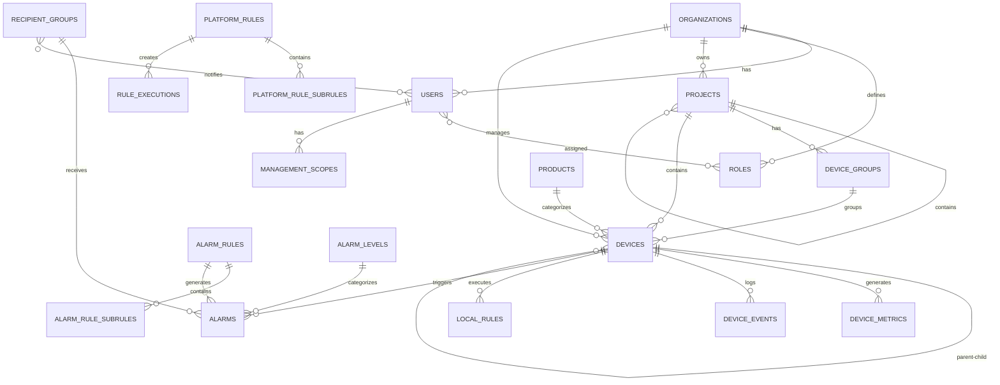

# Appendix & References

**Document Version**: 1.0
**Date**: January 27, 2026
**Project**: SHUNCOM RULR IoT Platform
**Related Documents**: [08-Risk Assessment](./08-risk-assessment.md)

---

## A. Glossary of Terms

### A.1 Technical Terms

| Term | Definition |
|------|------------|
| **AIOT** | Artificial Intelligence of Things - Integration of AI with IoT devices |
| **API** | Application Programming Interface |
| **APPEUI** | Application Extended Unique Identifier (LoRaWAN) |
| **APPKEY** | Application Key (LoRaWAN) |
| **APPSKEY** | Application Session Key (LoRaWAN) |
| **ABP** | Activation by Personalization (LoRaWAN) |
| **CAT.1** | LTE Category 1 - Cellular IoT communication standard |
| **CRUD** | Create, Read, Update, Delete operations |
| **DEVADDR** | Device Address (LoRaWAN) |
| **DEVEUI** | Device Extended Unique Identifier (LoRaWAN) |
| **DLT645-07** | Chinese national standard for electricity meters |
| **ECP** | Electricity Consumption Plan |
| **GDPR** | General Data Protection Regulation |
| **GIS** | Geographic Information System |
| **GWLOOP** | Gateway Loop Control Protocol (proprietary) |
| **IMSI** | International Mobile Subscriber Identity |
| **JWT** | JSON Web Token - Authentication standard |
| **LoRa** | Long Range - Low power wireless protocol |
| **LoRaWAN** | LoRa Wide Area Network |
| **MQTT** | Message Queuing Telemetry Transport - IoT messaging protocol |
| **NB-IoT** | Narrowband Internet of Things - Cellular IoT standard |
| **NWKSKEY** | Network Session Key (LoRaWAN) |
| **OTAA** | Over-the-Air Activation (LoRaWAN) |
| **RBAC** | Role-Based Access Control |
| **REST** | Representational State Transfer - API architecture |
| **SaaS** | Software as a Service |
| **WebSocket** | Real-time bidirectional communication protocol |
| **Zigbee** | IEEE 802.15.4 wireless protocol for IoT |

### A.2 Business Terms

| Term | Definition |
|------|------------|
| **KPI** | Key Performance Indicator |
| **MVP** | Minimum Viable Product |
| **PRD** | Product Requirements Document |
| **ROI** | Return on Investment |
| **SLA** | Service Level Agreement |
| **UAT** | User Acceptance Testing |

---

## B. API Endpoints Reference

### B.1 Authentication APIs

```yaml
POST /api/v1/auth/login
  Request:
    {
      "username": "string",
      "password": "string",
      "remember_me": boolean
    }
  Response:
    {
      "access_token": "string",
      "refresh_token": "string",
      "expires_in": number,
      "user": {
        "id": "uuid",
        "username": "string",
        "email": "string"
      }
    }

POST /api/v1/auth/logout
  Headers:
    Authorization: Bearer {access_token}
  Response:
    {
      "message": "Logged out successfully"
    }

POST /api/v1/auth/refresh
  Request:
    {
      "refresh_token": "string"
    }
  Response:
    {
      "access_token": "string",
      "expires_in": number
    }
```

### B.2 Device Management APIs

```yaml
GET /api/v1/devices
  Query Parameters:
    - page: number (default: 1)
    - limit: number (default: 25, max: 100)
    - search: string (device name or number)
    - status: online | offline | alarm
    - product_id: uuid
    - project_id: uuid
    - group_id: uuid
  Response:
    {
      "data": [
        {
          "id": "uuid",
          "device_name": "string",
          "device_number": "string",
          "online_status": "online|offline",
          "product": {...},
          "project": {...},
          "last_seen_at": "ISO 8601 timestamp"
        }
      ],
      "pagination": {
        "total": number,
        "page": number,
        "limit": number,
        "total_pages": number
      }
    }

POST /api/v1/devices
  Request:
    {
      "device_name": "string",
      "product_id": "uuid",
      "device_number": "string",
      "project_id": "uuid",
      "group_id": "uuid",
      "latitude": number,
      "longitude": number,
      "device_config": {...}
    }
  Response:
    {
      "id": "uuid",
      "device_name": "string",
      ...
    }

GET /api/v1/devices/:id
  Response:
    {
      "id": "uuid",
      "device_name": "string",
      "device_number": "string",
      "product": {...},
      "online_status": "string",
      "last_seen_at": "timestamp",
      "metrics": [...],
      "associations": {...}
    }

PATCH /api/v1/devices/:id
  Request:
    {
      "device_name": "string",
      "latitude": number,
      "longitude": number,
      ...
    }
  Response:
    {
      "id": "uuid",
      ...
    }

POST /api/v1/devices/:id/commands
  Request:
    {
      "command": "turn_on|turn_off|set_brightness|read_data",
      "parameters": {...}
    }
  Response:
    {
      "command_id": "uuid",
      "status": "pending|executed|failed",
      "result": {...}
    }
```

### B.3 Rule Management APIs

```yaml
GET /api/v1/rules/platform
  Query Parameters:
    - page, limit, search
    - is_enabled: boolean
    - project_id: uuid
  Response:
    {
      "data": [
        {
          "id": "uuid",
          "name": "string",
          "rule_type": "string",
          "is_enabled": boolean,
          "subrules": [...]
        }
      ],
      "pagination": {...}
    }

POST /api/v1/rules/platform
  Request:
    {
      "name": "string",
      "rule_type": "schedule|automation",
      "effective_date_start": "YYYY-MM-DD",
      "effective_date_end": "YYYY-MM-DD",
      "repeat_period": "daily|weekly|monthly",
      "subrules": [
        {
          "trigger_conditions": [...],
          "condition_logic": "AND|OR",
          "execute_actions": [...]
        }
      ]
    }
  Response:
    {
      "id": "uuid",
      "name": "string",
      ...
    }
```

---

## C. Database Schema Diagrams

### C.1 Entity Relationship Diagram (ERD)



### C.2 Key Tables Summary

| Table | Purpose | Key Fields | Indexes |
|-------|---------|------------|---------|
| **users** | User accounts | username, email, password_hash | username, email |
| **devices** | IoT devices | device_name, device_number, online_status | device_number, project_id, online_status |
| **device_metrics** | Time-series data | device_id, metric_name, metric_value, time | (device_id, metric_name, time) |
| **platform_rules** | Automation rules | name, is_enabled, effective_date | organization_id, is_enabled |
| **alarms** | Alarm instances | device_id, status, triggered_at | device_id, status, triggered_at |

---

## D. Code Examples

### D.1 Device Registration Example

```javascript
// Frontend - React component
const DeviceRegistrationForm = () => {
  const handleSubmit = async (values) => {
    try {
      const response = await api.post('/api/v1/devices', {
        device_name: values.name,
        product_id: values.productId,
        device_number: values.deviceNumber,
        project_id: values.projectId,
        latitude: values.latitude,
        longitude: values.longitude
      });

      message.success('Device registered successfully');
      return response.data;
    } catch (error) {
      message.error('Failed to register device');
      throw error;
    }
  };

  // Form JSX...
};

// Backend - NestJS controller
@Controller('devices')
export class DevicesController {
  @Post()
  @UseGuards(JwtAuthGuard, PermissionsGuard)
  @RequirePermissions('devices:write')
  async createDevice(@Body() dto: CreateDeviceDto) {
    return this.devicesService.create(dto);
  }
}

// Backend - Service
@Injectable()
export class DevicesService {
  async create(dto: CreateDeviceDto) {
    // Validate product exists
    const product = await this.productsRepo.findOne(dto.product_id);
    if (!product) {
      throw new NotFoundException('Product not found');
    }

    // Create device
    const device = this.devicesRepo.create({
      ...dto,
      online_status: 'offline'
    });

    await this.devicesRepo.save(device);

    // Publish event for real-time updates
    this.eventEmitter.emit('device.created', device);

    return device;
  }
}
```

### D.2 Rule Execution Example

```javascript
// Rule Engine - Scheduler
@Injectable()
export class RuleScheduler {
  @Cron('0 * * * * *') // Every minute
  async evaluateRules() {
    const activeRules = await this.rulesRepo.find({
      is_enabled: true
    });

    for (const rule of activeRules) {
      await this.evaluateRule(rule);
    }
  }

  async evaluateRule(rule: PlatformRule) {
    const subrules = await this.subrulesRepo.find({
      rule_id: rule.id
    });

    for (const subrule of subrules) {
      const shouldExecute = await this.evaluateConditions(
        subrule.trigger_conditions,
        subrule.condition_logic
      );

      if (shouldExecute) {
        await this.executeActions(subrule.execute_actions);

        // Log execution
        await this.logExecution(rule.id, subrule.id, 'success');
      }
    }
  }
}
```

### D.3 WebSocket Real-Time Updates

```javascript
// Backend - WebSocket gateway
@WebSocketGateway()
export class EventsGateway {
  @WebSocketServer()
  server: Server;

  @OnEvent('device.status.changed')
  handleDeviceStatusChange(payload: any) {
    // Emit to subscribed clients
    this.server
      .to(`device:${payload.device_id}`)
      .emit('device.status.changed', payload);
  }
}

// Frontend - React hook
const useDeviceStatus = (deviceId) => {
  const [status, setStatus] = useState('offline');

  useEffect(() => {
    // Subscribe to device updates
    socket.emit('subscribe', `device:${deviceId}`);

    socket.on('device.status.changed', (data) => {
      setStatus(data.online_status);
    });

    return () => {
      socket.emit('unsubscribe', `device:${deviceId}`);
    };
  }, [deviceId]);

  return status;
};
```

---

## E. Testing Scenarios

### E.1 Test Case Template

```yaml
Test Case ID: TC-001
Title: User Login with Valid Credentials
Priority: Critical
Category: Authentication
Prerequisites: User account exists in database

Test Steps:
  1. Navigate to login page
  2. Enter valid username: "testuser"
  3. Enter valid password: "Test@1234"
  4. Click "Login" button

Expected Results:
  - User redirected to dashboard
  - JWT token stored in cookie
  - User profile displayed in header
  - Session expires after 24 hours

Actual Results: [To be filled during testing]
Status: [Pass/Fail]
Executed By: [Tester name]
Execution Date: [YYYY-MM-DD]
```

### E.2 Critical Test Scenarios

| Test ID | Scenario | Priority | Phase |
|---------|----------|----------|-------|
| **TC-AUTH-001** | User login with valid credentials | Critical | 1 |
| **TC-AUTH-002** | User login with invalid password | Critical | 1 |
| **TC-AUTH-003** | Account lockout after 5 failed attempts | Critical | 1 |
| **TC-DEV-001** | Register Zigbee light controller | Critical | 1 |
| **TC-DEV-002** | Associate fixture with controller | Critical | 1 |
| **TC-DEV-003** | Device status updates in real-time | Critical | 1 |
| **TC-RULE-001** | Create platform rule with time trigger | Critical | 1 |
| **TC-RULE-002** | Rule executes at scheduled time | Critical | 1 |
| **TC-RULE-003** | Local rule syncs to gateway | Critical | 2 |
| **TC-ALARM-001** | Alarm generated when condition met | Critical | 2 |
| **TC-ALARM-002** | Notification sent via email | High | 2 |
| **TC-GIS-001** | Devices displayed on map | High | 2 |
| **TC-GIS-002** | Batch device distribution along path | High | 2 |
| **TC-PERF-001** | API response time < 500ms (P95) | Critical | 3 |
| **TC-PERF-002** | Dashboard loads 10,000 devices < 2s | Critical | 3 |

---

## F. Deployment Checklist

### F.1 Pre-Launch Checklist

```yaml
Infrastructure:
  ✅ Production environment provisioned
  ✅ Database backups configured (automated daily)
  ✅ SSL certificates installed and verified
  ✅ CDN configured and tested
  ✅ Load balancer health checks enabled
  ✅ Auto-scaling policies configured
  ✅ Monitoring dashboards created
  ✅ Log aggregation configured (ELK stack)

Security:
  ✅ Security audit completed
  ✅ Penetration testing passed
  ✅ GDPR compliance verified
  ✅ Data encryption at rest enabled
  ✅ TLS 1.2+ enforced
  ✅ Rate limiting configured
  ✅ CSRF protection enabled
  ✅ WAF rules configured

Application:
  ✅ All features tested and approved
  ✅ Performance benchmarks met
  ✅ Database migrations tested
  ✅ API documentation published (Swagger)
  ✅ User documentation complete
  ✅ Admin guides ready

Operations:
  ✅ Deployment runbook created
  ✅ Rollback procedures documented
  ✅ On-call schedule established
  ✅ Incident response plan ready
  ✅ Support team trained
  ✅ Status page configured

Testing:
  ✅ Integration tests passed (100%)
  ✅ End-to-end tests passed (100%)
  ✅ Performance tests passed
  ✅ Security tests passed
  ✅ UAT signed off by stakeholders
```

### F.2 Launch Day Timeline

```yaml
Day -1 (Pre-Launch):
  - Final smoke tests
  - Backup all databases
  - Notify users of launch window
  - Confirm team availability

Day 0 (Launch Day):
  00:00 - 02:00: Database migration (off-peak)
  02:00 - 04:00: Application deployment
  04:00 - 06:00: Smoke testing
  06:00 - 08:00: DNS cutover
  08:00 - 12:00: Monitor system stability
  12:00 - 16:00: User onboarding begins
  16:00 - 24:00: Continuous monitoring

Day +1 to +7:
  - Monitor error rates, performance
  - Address critical issues immediately
  - Daily standup for launch team
  - User feedback collection
```

---

## G. Support & Maintenance

### G.1 Support Tiers

| Tier | Response Time | Availability | Cost |
|------|---------------|--------------|------|
| **Community** | 48 hours | Business hours (M-F, 9-5) | Free (Starter tier) |
| **Standard** | 24 hours | Extended hours (M-F, 8-8) | Included (Professional tier) |
| **Premium** | 4 hours | 24/7 | Included (Enterprise tier) |
| **Dedicated** | 1 hour | 24/7 + dedicated engineer | Custom pricing |

### G.2 Maintenance Windows

```yaml
Regular Maintenance:
  Schedule: Every Sunday 02:00-04:00 UTC
  Duration: 2 hours maximum
  Activities:
    - Database optimization
    - Security patches
    - Minor updates
  Notification: 48 hours advance notice

Emergency Maintenance:
  Criteria: Critical security or stability issues
  Approval: CTO or VP Engineering
  Notification: Immediate via status page

Planned Upgrades:
  Schedule: Quarterly (end of Q1, Q2, Q3, Q4)
  Duration: 4-6 hours
  Activities:
    - Major version updates
    - Feature releases
    - Database migrations
  Notification: 2 weeks advance notice
```

---

## H. References & Resources

### H.1 Official Documentation

```yaml
Platform Documentation:
  - User Manual: https://docs.rulr-aiot.com/user-guide
  - API Reference: https://docs.rulr-aiot.com/api
  - Admin Guide: https://docs.rulr-aiot.com/admin
  - Developer Guide: https://docs.rulr-aiot.com/developers

Technical Standards:
  - Zigbee Specification: https://zigbeealliance.org/
  - LoRaWAN Specification: https://lora-alliance.org/
  - NB-IoT Standards: https://www.3gpp.org/
  - DLT645-07 Protocol: [Chinese national standard]

Framework Documentation:
  - NestJS: https://docs.nestjs.com/
  - React: https://react.dev/
  - PostgreSQL: https://www.postgresql.org/docs/
  - Redis: https://redis.io/docs/
  - Leaflet.js: https://leafletjs.com/reference.html
```

### H.2 Vendor Contacts

```yaml
Cloud Provider (AWS):
  - Account Manager: [Name, email]
  - Technical Support: aws.amazon.com/support

IoT Device Vendors:
  - Gateway Manufacturer: [Contact info]
  - Light Controller Vendor: [Contact info]

Third-Party Services:
  - SendGrid (Email): support@sendgrid.com
  - Twilio (SMS): support@twilio.com
  - Mapbox (GIS): support@mapbox.com
```

---

## I. Version History

### I.1 Document Versions

| Version | Date | Author | Changes |
|---------|------|--------|---------|
| 0.1 | 2026-01-20 | AI Assistant | Initial draft |
| 0.5 | 2026-01-25 | AI Assistant | Stakeholder review feedback |
| 1.0 | 2026-01-27 | AI Assistant | Final approved version |

### I.2 Product Roadmap (Post-Launch)

```yaml
Version 1.1 (Month 10):
  - Mobile app (iOS/Android native)
  - Advanced analytics dashboard
  - Machine learning for predictive maintenance
  - Energy optimization recommendations

Version 1.2 (Month 12):
  - Multi-language support (Chinese, Spanish, French)
  - Voice control integration (Alexa, Google Assistant)
  - Advanced reporting engine
  - Custom integrations API

Version 2.0 (Month 18):
  - AI-powered anomaly detection
  - Blockchain for device authentication
  - Edge computing support
  - AR/VR for device visualization
```

---

## J. Approval Signatures

```yaml
Product Requirements Document Approval:

CEO / Founder:
  Name: _______________________
  Signature: __________________
  Date: _______________________

CTO / Technical Lead:
  Name: _______________________
  Signature: __________________
  Date: _______________________

Product Manager:
  Name: _______________________
  Signature: __________________
  Date: _______________________

Finance / CFO:
  Name: _______________________
  Signature: __________________
  Date: _______________________

Legal / Compliance:
  Name: _______________________
  Signature: __________________
  Date: _______________________
```

---

**End of Document**

**Total Pages**: ~250 pages (entire PRD)

**Document Status**: ✅ COMPLETE - Ready for Stakeholder Approval

**Contact Information**:
- **Project Manager**: [Email]
- **Technical Lead**: [Email]
- **Support**: support@rulr-aiot.com
- **Website**: https://rulr-aiot.com

---

## Document Revision History

| Version | Date | Changes | Author |
|---------|------|---------|--------|
| 1.0 | 2026-01-27 | Initial appendix | AI Assistant |
