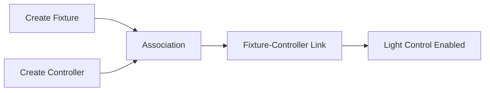
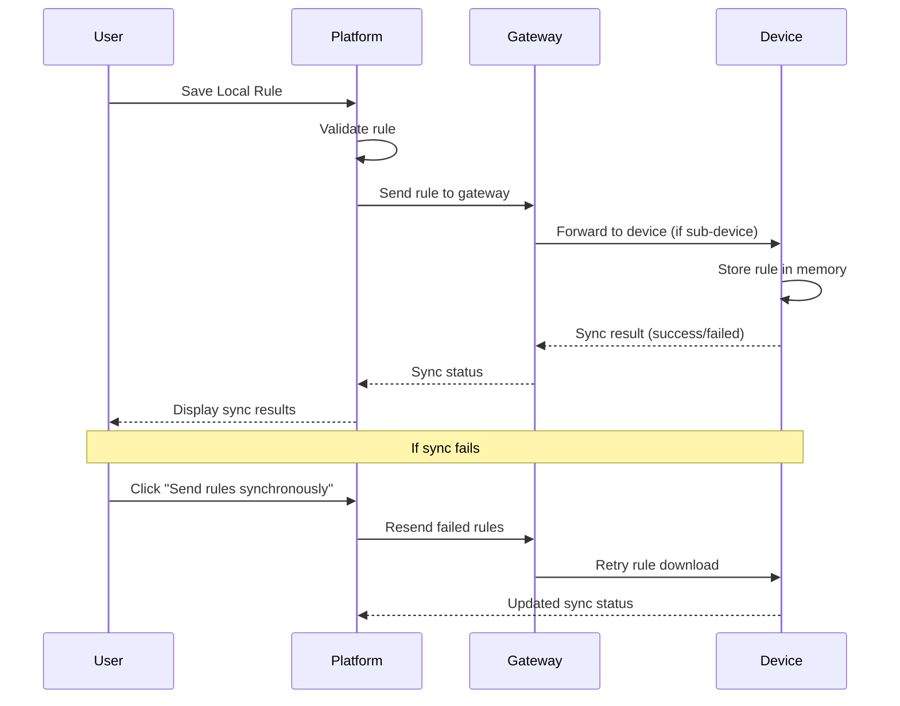
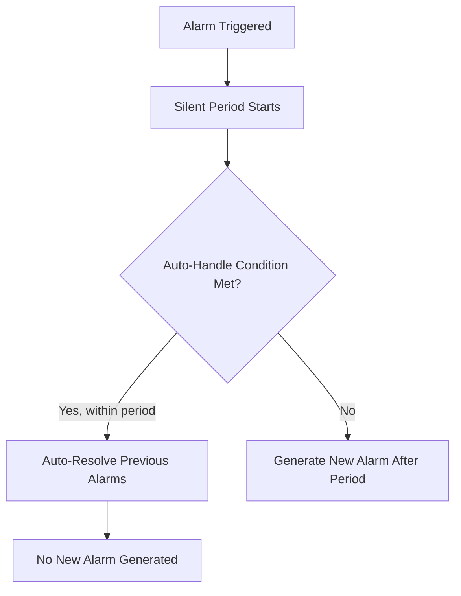
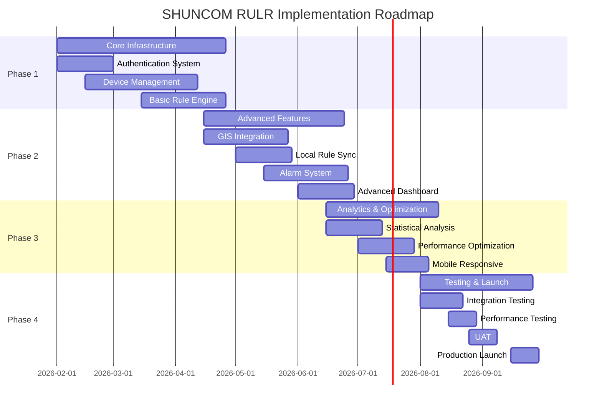
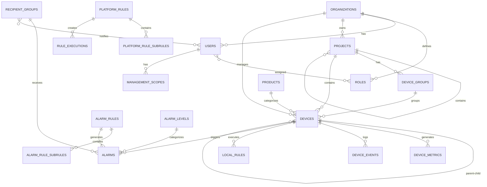

# SHUNCOM RULR IoT Platform
## Product Requirements Document (PRD)

**Version**: 1.0
**Date**: January 27, 2026
**Status**: Final - Ready for Approval
**Company**: Shanghai Shuncom AIOT Co., Ltd
**Project**: Smart Lighting & Urban Infrastructure Management Platform

---

## Table of Contents

1. [Executive Summary](#1-executive-summary)
2. [System Requirements](#2-system-requirements)
3. [Device Specifications](#3-device-specifications)
4. [Technical Architecture](#4-technical-architecture)
5. [Functional Requirements](#5-functional-requirements)
6. [Implementation Roadmap](#6-implementation-roadmap)
7. [Resource Requirements](#7-resource-requirements)
8. [Risk Assessment](#8-risk-assessment)
9. [Appendix & References](#9-appendix--references)

---

## Document Summary

**Total Budget**: $1,100,000 (Year 1)
**Timeline**: 8 months (Feb 2026 - Sep 2026)
**Team Size**: 10 core + 5 specialists
**Target Devices**: 100,000+ per deployment
**Expected ROI**: 183% by Year 3

---


================================================================================

# 1. Executive Summary


**SHUNCOM RULR** is an enterprise-grade IoT platform designed for intelligent street lighting and urban infrastructure management. The platform enables municipalities, industrial parks, and facility managers to monitor, control, and automate large-scale lighting deployments with advanced rule engines and real-time analytics.

### 1.1 Business Objectives

- **Operational Efficiency**: Reduce manual operations by 70% through automated device management and rule-based control
- **Energy Savings**: Achieve 30-50% energy reduction through intelligent scheduling and sensor-based automation
- **Scalability**: Support 100,000+ IoT devices per deployment with multi-tenant architecture
- **Real-time Monitoring**: Provide 24/7 visibility into device status, energy consumption, and system health
- **Cost Reduction**: Minimize maintenance costs through predictive alerts and remote diagnostics

### 1.2 Key Stakeholders

| Stakeholder | Role | Primary Interest |
|-------------|------|------------------|
| **Municipal Authorities** | Decision Maker | Energy savings, public safety, operational costs |
| **Facility Managers** | Primary User | Device control, maintenance scheduling, analytics |
| **System Administrators** | Technical Owner | Platform reliability, security, user management |
| **Field Technicians** | End User | Device status, alarm notifications, work orders |
| **IoT Device Vendors** | Integration Partner | Device compatibility, protocol support |

---

## 2. Platform Capabilities Summary

### 2.1 Device Management
- Support for **7 device categories** with specialized configurations
- Real-time monitoring of **5,000+ devices** per batch operation
- Multi-protocol support: **Zigbee, LoRa (OTAA/ABP), NB-IoT, CAT.1**
- Batch import/export with validation (5,000 device limit per operation)
- Hierarchical device organization (Project → Group → Device)

### 2.2 Automation & Control
- **3-Layer Rule Engine**:
  - **Platform Rules**: Cloud-based complex multi-condition automation
  - **Local Rules**: Gateway/device-level autonomous operation
  - **Alarm Rules**: Event-driven notifications and alerts
- Sunrise/sunset calculation based on GPS coordinates
- Time zone-aware scheduling (critical for global deployments)
- Manual and automatic control modes

### 2.3 User & Access Management
- **Role-Based Access Control (RBAC)** with granular permissions
- **Management Scopes**: Organization → Project → Group → Device hierarchy
- Multi-tenant isolation with organization-level branding
- Support for **200+ concurrent users**
- Audit logging with 2-year retention

### 2.4 Visualization & Analytics
- **GIS Map Integration**: Real-time device positioning and distribution
- **Customizable Dashboards**: 8 configurable widget modules per project
- **Statistical Analysis**: Energy consumption, device performance, trends
- **Real-time Updates**: WebSocket-based live data streaming
- **Export Capabilities**: Excel/CSV export for reporting and compliance

---

## 3. Technical Architecture Overview

### 3.1 System Components

```
┌─────────────────────────────────────────────────────────┐
│                  Frontend Layer                          │
│  (Web Dashboard, GIS Map, Mobile Responsive)            │
└─────────────────┬───────────────────────────────────────┘
                  │
┌─────────────────▼───────────────────────────────────────┐
│                  Backend API Layer                       │
│  (Authentication, Device Service, Rule Engine, Alarms)  │
└─────────────────┬───────────────────────────────────────┘
                  │
┌─────────────────▼───────────────────────────────────────┐
│              IoT Device Layer                            │
│  (Gateways, Controllers, Meters, Sensors)               │
└──────────────────────────────────────────────────────────┘
```

### 3.2 Performance Targets

| Metric | Target | Priority |
|--------|--------|----------|
| **API Response Time** | < 500ms (P95) | Critical |
| **Real-time Latency** | < 1 second | Critical |
| **System Uptime** | 99.9% | Critical |
| **Dashboard Load** | < 2 seconds | High |
| **Concurrent Users** | 200+ | High |
| **Device Capacity** | 100,000+ per deployment | High |

### 3.3 Security Requirements

- **Authentication**: JWT tokens, MFA support, account lockout
- **Authorization**: RBAC + hierarchical management scopes
- **Data Protection**: TLS 1.2+, AES-256 encryption at rest
- **Audit Logging**: Complete operation tracking (2-year retention)
- **Device Security**: Certificate-based authentication, secure protocols

---

## 4. Deployment Scope

### 4.1 Phase 1: Core Infrastructure (Months 1-3)
**Priority**: Critical ⭐⭐⭐⭐⭐

**Deliverables**:
- Authentication & user management system
- Basic device management (7 device categories)
- Project hierarchy and organization
- Basic platform rule engine
- Real-time device status monitoring

**Success Criteria**:
- Support 1,000+ devices
- User login and role assignment functional
- Basic device control operational
- Simple scheduling rules working

### 4.2 Phase 2: Advanced Features (Months 4-6)
**Priority**: High ⭐⭐⭐⭐

**Deliverables**:
- GIS map integration with device distribution
- Local rule synchronization system
- Comprehensive alarm management
- Advanced dashboard with customizable modules
- Batch operations (import/export)

**Success Criteria**:
- GIS map displays devices correctly
- Local rules sync to gateways
- Alarm notifications sent to recipient groups
- Dashboard modules configurable

### 4.3 Phase 3: Analytics & Optimization (Months 7-8)
**Priority**: Medium ⭐⭐⭐

**Deliverables**:
- Statistical analysis and reporting
- Energy consumption analytics
- Predictive maintenance alerts
- Performance optimization for large datasets
- Mobile-responsive interface

**Success Criteria**:
- Reports generate within 5 seconds
- Support 100,000+ devices
- Mobile interface functional
- Export features working

---

## 5. Resource Requirements Summary

### 5.1 Development Team

| Role | Quantity | Duration | Responsibility |
|------|----------|----------|----------------|
| **Project Manager** | 1 | 8 months | Overall coordination, stakeholder management |
| **Backend Developer** | 3 | 8 months | API development, rule engine, database |
| **Frontend Developer** | 2 | 8 months | Dashboard UI, GIS integration, responsive design |
| **DevOps Engineer** | 1 | 8 months | Infrastructure, CI/CD, monitoring |
| **QA Engineer** | 2 | 6 months | Testing, quality assurance, automation |
| **UI/UX Designer** | 1 | 3 months | Interface design, user experience |

### 5.2 Infrastructure Costs (Monthly Estimate)

| Component | Monthly Cost (USD) | Notes |
|-----------|-------------------|-------|
| **Cloud Hosting** | $2,000 - $5,000 | Based on device count and traffic |
| **Database Services** | $500 - $1,500 | PostgreSQL or MongoDB managed service |
| **GIS Map Services** | $300 - $800 | Map tiles, geocoding API calls |
| **SMS/Email Notifications** | $200 - $600 | Alarm notifications volume |
| **Monitoring & Logging** | $100 - $300 | APM, error tracking services |
| **Total (Estimated)** | **$3,100 - $8,200** | Scales with usage |

---

## 6. Business Value Proposition

### 6.1 Quantifiable Benefits

**Energy Savings**:
- **30-50% reduction** in energy consumption through intelligent scheduling
- **ROI within 12-18 months** for typical municipal deployments

**Operational Efficiency**:
- **70% reduction** in manual device configuration time
- **50% faster** alarm response through automated notifications
- **90% reduction** in site visits for routine checks

**Cost Reduction**:
- **40% lower** maintenance costs through predictive alerts
- **Centralized management** reduces administrative overhead by 60%

### 6.2 Qualitative Benefits

- **Improved Public Safety**: Automated fault detection ensures lighting reliability
- **Environmental Impact**: Reduced energy consumption lowers carbon footprint
- **Data-Driven Decisions**: Analytics enable proactive infrastructure planning
- **Scalability**: Platform grows with city expansion without architectural changes

---

## 7. Risk Assessment Summary

| Risk | Impact | Likelihood | Mitigation Strategy |
|------|--------|------------|---------------------|
| **Device Protocol Compatibility** | High | Medium | Extensive testing with vendor devices, protocol abstraction layer |
| **Network Reliability** | Critical | Low | Offline-capable local rules, connection retry mechanisms |
| **Data Privacy Compliance** | High | Low | GDPR/SOC 2 compliance, data encryption, audit logging |
| **Scalability Bottlenecks** | Medium | Medium | Load testing, database optimization, caching strategies |
| **User Adoption** | Medium | Medium | Comprehensive training, intuitive UI, user documentation |

---

## 8. Success Metrics (KPIs)

### 8.1 Technical KPIs
- **System Uptime**: ≥ 99.9%
- **API Response Time**: < 500ms (P95)
- **Device Connectivity**: > 98% online rate
- **Rule Execution Accuracy**: 100% within ±1 minute

### 8.2 Business KPIs
- **Energy Reduction**: 30-50% vs. manual control
- **Operational Cost Savings**: 40% reduction in maintenance
- **User Satisfaction**: ≥ 4.5/5 rating
- **Device Deployment Speed**: 5,000 devices onboarded per day

### 8.3 Adoption KPIs
- **Active Users**: 80% of registered users monthly
- **Feature Utilization**: 70% using rule automation
- **Support Tickets**: < 5 per 1,000 devices/month

---

## 9. Next Steps

### Immediate Actions (Week 1-2)
1. ✅ **Stakeholder Approval**: Review and approve PRD
2. ✅ **Team Assembly**: Recruit development team members
3. ✅ **Infrastructure Setup**: Provision cloud environments (Dev/Staging/Prod)
4. ✅ **Vendor Coordination**: Confirm device protocol specifications

### Short-term Actions (Month 1)
1. ✅ **Technical Architecture**: Finalize system architecture design
2. ✅ **Database Schema**: Design data models for all entities
3. ✅ **API Contracts**: Define RESTful API endpoints
4. ✅ **UI/UX Design**: Create wireframes and mockups for key screens

### Medium-term Actions (Months 2-3)
1. ✅ **Core Development**: Begin Phase 1 implementation
2. ✅ **Testing Framework**: Setup automated testing infrastructure
3. ✅ **Documentation**: Create API docs, user manuals, developer guides

---

## 10. Document Control

| Version | Date | Author | Changes |
|---------|------|--------|---------|
| 1.0 | 2026-01-27 | AI Assistant | Initial PRD creation |

**Approval Required From**:
- [ ] **CEO/CTO** - Strategic alignment
- [ ] **Product Manager** - Feature completeness
- [ ] **Technical Lead** - Architecture feasibility
- [ ] **Finance** - Budget approval
- [ ] **Legal/Compliance** - Regulatory requirements

---

**Document Status**: ✅ DRAFT - Pending Stakeholder Review

**Next Document**: [02-System Requirements](./02-system-requirements.md)


================================================================================

# 2. System Requirements


### 1.1 Authentication & User Management

#### FR-AUTH-001: User Authentication System
**Priority**: Critical ⭐⭐⭐⭐⭐
**Phase**: 1

**Requirements**:
- System SHALL support username/password authentication
- System SHALL implement JWT token-based session management
- System SHALL support "Remember Me" functionality with secure token storage
- System SHALL provide password reset workflow via email
- System SHALL implement account lockout after 5 failed login attempts
- System SHALL enforce minimum password requirements (8+ characters, mixed case, numbers, special chars)
- System SHALL support Google Chrome (recommended browser)
- System SHALL maintain session for 24 hours or until explicit logout

**Acceptance Criteria**:
- ✅ User can login with valid credentials
- ✅ Invalid login shows clear error message
- ✅ Account locks after 5 failed attempts
- ✅ Password reset email sent within 60 seconds
- ✅ Session expires after 24 hours of inactivity

---

#### FR-AUTH-002: Role-Based Access Control (RBAC)
**Priority**: Critical ⭐⭐⭐⭐⭐
**Phase**: 1

**Requirements**:
- System SHALL support custom role creation with granular permissions
- System SHALL implement page-level AND function-level permission controls
- System SHALL allow users to have multiple roles simultaneously
- System SHALL support role templates for common use cases (Admin, Manager, Operator, Viewer)
- System SHALL enforce permissions at API endpoint level
- System SHALL dynamically show/hide UI elements based on user permissions
- System SHALL log all permission changes for audit purposes

**Permission Categories**:
1. **Page Access**: Dashboard, Device Management, Rules, Alarms, Analytics, Settings
2. **Function Access**: Create, Read, Update, Delete, Export, Import
3. **Data Scope**: Project-level, Group-level, Device-level access

**Acceptance Criteria**:
- ✅ Admin can create custom roles with specific permissions
- ✅ User with "Viewer" role cannot modify devices
- ✅ UI hides inaccessible features based on permissions
- ✅ API returns 403 Forbidden for unauthorized actions
- ✅ Permission changes logged in audit trail

---

#### FR-AUTH-003: Management Scope System
**Priority**: Critical ⭐⭐⭐⭐⭐
**Phase**: 1

**Requirements**:
- System SHALL support hierarchical management scopes: Organization → Project → Group → Device
- System SHALL allow administrators to assign project-level access to users
- System SHALL support group-level management rights
- System SHALL support product category restrictions
- System SHALL apply scope inheritance (parent scope grants child access)
- System SHALL resolve scope conflicts (most restrictive wins)
- Tenant administrators SHALL have access to all scopes by default
- System SHALL display only authorized data to scoped users

**Scope Types**:
1. **Project Management Rights**: Access to specific projects and sub-projects
2. **Group Management Rights**: Access to device groups within authorized projects
3. **Product Category Rights**: Access to specific device types (e.g., Gateways only)

**Acceptance Criteria**:
- ✅ User assigned "Project A" scope only sees Project A devices
- ✅ User cannot access devices outside assigned scope
- ✅ Scope inheritance works correctly (Project scope grants Group access)
- ✅ Tenant admin sees all projects by default

---

#### FR-AUTH-004: Organization Management
**Priority**: High ⭐⭐⭐⭐
**Phase**: 1

**Requirements**:
- System SHALL support multi-tenant architecture with organization isolation
- System SHALL allow organization logo upload (PNG/JPG, max 2MB)
- System SHALL display organization logo in upper-left corner of dashboard
- System SHALL support organization profile management (name, contact, branding)
- System SHALL ensure complete data isolation between organizations
- System SHALL support white-label customization per tenant

**Acceptance Criteria**:
- ✅ Organization logo displayed correctly after upload
- ✅ Different organizations cannot see each other's data
- ✅ Branding settings persist across user sessions

---

#### FR-AUTH-005: Time Zone Management
**Priority**: Critical ⭐⭐⭐⭐⭐
**Phase**: 1

**Critical Importance**: Time zone affects ALL rule executions (Platform Rules, Local Rules, Alarm Rules)

**Requirements**:
- System SHALL support time zone selection via My Account → Preferences
- System SHALL apply selected time zone globally to all rules and schedules
- System SHALL synchronize device local time with platform time zone
- System SHALL display prominent time zone indicator in dashboard header
- System SHALL show impact assessment when user changes time zone
- System SHALL convert all timestamps to UTC for storage
- System SHALL support all IANA time zones (e.g., America/New_York, Asia/Shanghai)

**Affected Features**:
- Platform Rule scheduling
- Local Rule execution times
- Alarm Rule effective time ranges
- Sunrise/sunset calculations
- Device local time synchronization
- Historical data timestamps

**Acceptance Criteria**:
- ✅ Time zone selection persists across sessions
- ✅ Rules execute at correct local time
- ✅ Dashboard displays times in user's selected time zone
- ✅ Warning shown when changing time zone (affects rules)
- ✅ Device sync updates device local time correctly

---

### 1.2 Device Management

#### FR-DEV-001: Device Registration System
**Priority**: Critical ⭐⭐⭐⭐⭐
**Phase**: 1

**Requirements**:
- System SHALL support 7 device categories:
  1. Smart Gateway
  2. Smart Light Controller (6 sub-types)
  3. Lighting Fixture
  4. Lighting Pole
  5. Power Distribution Control
  6. Loop Control (Built-in + Extended)
  7. Smart Meter (485 three-phase)

- System SHALL enforce mandatory field validation per device type
- System SHALL support device-specific configuration forms
- System SHALL validate device associations before saving
- System SHALL support coordinate management (latitude/longitude)
- System SHALL assign devices to projects and groups
- System SHALL prevent duplicate device numbers within same product type

**Acceptance Criteria**:
- ✅ All 7 device categories can be registered
- ✅ Mandatory fields enforced (prevents save without required data)
- ✅ Device appears in device list after registration
- ✅ Duplicate device number shows error message
- ✅ Coordinates validated (lat: -90 to 90, long: -180 to 180)

---

#### FR-DEV-002: Smart Gateway Configuration
**Priority**: Critical ⭐⭐⭐⭐⭐
**Phase**: 1

**Requirements**:
- System SHALL support gateway configuration with mandatory fields:
  - Device Name (unique identifier)
  - Product Name (from product catalog)
  - Device Number (MAC address format: AA:BB:CC:DD:EE:FF)

- System SHALL support optional fields:
  - Associated distribution box
  - Associated circuit control
  - GPS coordinates (lat/long/altitude)
  - Parent project
  - Belonging group

- System SHALL support circuit configuration in bulk:
  1. Add gateway with basic info
  2. Import/add circuit controllers
  3. Select gateway → Configure Circuits
  4. Generate corresponding circuits in batch
  5. Individual circuit configuration (optional)

- System SHALL support gateway operations:
  - Set 6-digit numeric screen password
  - Synchronize sub-device information
  - Configure circuits in bulk
  - Clear local rules
  - Set three-phase electric ratio

**Display Information**:
- Device Name, Device Number, Product Name
- Online Status
- Three-Phase Electricity Information
- Loop Collection Status
- Local Time
- Screen Password Status
- Last Update Time

**Acceptance Criteria**:
- ✅ Gateway registered with valid MAC address
- ✅ Circuit configuration generates batch circuits
- ✅ Screen password set successfully (6 digits)
- ✅ Sub-device sync status displayed
- ✅ Online/offline status updates in real-time

---

#### FR-DEV-003: Smart Light Controller Configuration
**Priority**: Critical ⭐⭐⭐⭐⭐
**Phase**: 1

**Requirements**:
- System SHALL support 6 light controller communication types:

**Pass-through Devices** (Gateway Required):
1. **Zigbee V3**: Requires gateway, automatic network activation
2. **Dual-way Zigbee V3**: Requires gateway, automatic network activation

**Direct Communication Devices** (No Gateway):
3. **NB-IoT**: Direct platform communication, carrier network activation
4. **CAT.1**: Direct platform communication, carrier network activation

**LoRaWAN Devices** (No Gateway):
5. **LoRa OTAA Mode**: Over-the-Air Activation
   - DEVEUI (Device unique identifier)
   - DEV_PROFILE (LoRaWAN profile)
   - APPEUI (Application identifier)
   - APPKEY (Application key)

6. **LoRa ABP Mode**: Activation by Personalization
   - DEVEUI (Device unique identifier)
   - DEV_PROFILE (LoRaWAN profile)
   - DEVADDR (Device address)
   - APPSKEY (Application session key)
   - NWKSKEY (Network session key)

**Critical Association Requirement**:
- System SHALL enforce lighting fixture association before controller is operational
- System SHALL display "Lamp uncontrollable in list" if fixture association missing
- System SHALL support flexible association order (fixture first OR controller first)

**Monitoring Capabilities**:
System SHALL display real-time data:
- **Electrical**: Voltage, Current, Active Power, Power Factor, Active Energy
- **Environmental**: Illuminance, Color Temperature
- **Network**: Signal Strength, Connection Status, IMSI, Connected Base Station
- **Performance**: Run Time, Frequency, Version, Local Time

**Configuration Commands**:
- Clear configuration
- Timing calibration
- Enable/disable local rules
- Read data
- Device synchronization
- GPS switch control

**Acceptance Criteria**:
- ✅ All 6 controller types can be configured
- ✅ Zigbee controller associates with gateway correctly
- ✅ NB-IoT controller connects without gateway
- ✅ LoRa OTAA activation successful with valid keys
- ✅ Controller without fixture shows warning message
- ✅ Real-time data updates displayed in UI

---

#### FR-DEV-004: Lighting Fixture Management
**Priority**: Critical ⭐⭐⭐⭐⭐
**Phase**: 1

**Critical Role**: Fixture MUST exist before light controller association

**Requirements**:
- System SHALL allow lighting fixture creation independently
- System SHALL support flexible creation order:
  - Create fixture first → then controller → then associate
  - Create controller first → then fixture → then associate
- System SHALL prevent light control without fixture association
- System SHALL display clear warning when association missing
- System SHALL track fixture-controller relationships

**Acceptance Criteria**:
- ✅ Fixture can be created before controller
- ✅ Controller can be created before fixture
- ✅ Association works in both creation orders
- ✅ Lamp control fails gracefully without fixture
- ✅ Warning message displayed when association missing

---

#### FR-DEV-005: Device Relationship Management
**Priority**: Critical ⭐⭐⭐⭐⭐
**Phase**: 1

**Critical Associations** (System MUST enforce):

1. **Light Controller ↔ Lighting Fixture**
   - Impact: Without association → lamp uncontrollable
   - Validation: Show warning if missing

2. **Sub-devices ↔ Gateway**
   - Impact: Without association → device always offline
   - Validation: Verify gateway exists before association

3. **Device ↔ Project**
   - Impact: Unassigned devices visible to ALL users (security risk)
   - Recommendation: Assign all devices to specific projects

4. **Device ↔ Group**
   - Impact: Organizational requirement for group operations
   - Default: "Ungrouped" group available

**Requirements**:
- System SHALL validate all associations before saving
- System SHALL display association warnings prominently
- System SHALL track association history for audit
- System SHALL prevent deletion of devices with active associations
- System SHALL provide bulk association tools

**Acceptance Criteria**:
- ✅ Controller without fixture shows warning
- ✅ Sub-device without gateway shows offline
- ✅ Unassigned device accessible to all users
- ✅ Cannot delete device with active associations
- ✅ Bulk association updates multiple devices

---

#### FR-DEV-006: Device Status Monitoring
**Priority**: Critical ⭐⭐⭐⭐⭐
**Phase**: 1

**Requirements**:
- System SHALL display real-time online/offline status
- System SHALL show device communication health indicators
- System SHALL use status indicator system:
  - ✅ **Green**: Online and communicating
  - ⚠️ **Yellow**: Online but warning conditions
  - ❌ **Red**: Offline or error state
  - ❗ **Exclamation Mark**: Unaddressed alarms
  - ⚙️ **Special Symbol**: Unavailable/misconfigured

- System SHALL display last seen timestamp
- System SHALL show connection quality metrics (signal strength)
- System SHALL update status within 60 seconds of device state change
- System SHALL display dash "-" for unavailable data fields

**Acceptance Criteria**:
- ✅ Status indicator matches actual device state
- ✅ Online status updates within 60 seconds
- ✅ Alarm indicator appears for unaddressed alarms
- ✅ Last seen timestamp accurate
- ✅ Unavailable data shows dash "-" instead of error

---

#### FR-DEV-007: Batch Operations
**Priority**: High ⭐⭐⭐⭐
**Phase**: 2

**Requirements**:
- System SHALL support batch import via template (5,000 device limit)
- System SHALL provide device-specific import templates
- System SHALL validate data during import process
- System SHALL report import errors with row numbers
- System SHALL support import recovery (fix errors and re-import)
- System SHALL support filtered device export (5,000 limit)
- System SHALL track progress for large operations
- System SHALL support background processing for bulk operations

**Template Types**:
1. Smart Gateway template
2. Light Controller templates (6 sub-types)
3. Lighting Fixture template
4. Lighting Pole template
5. Power Distribution template
6. Loop Control template
7. Smart Meter template

**Acceptance Criteria**:
- ✅ Import succeeds with valid template data
- ✅ Import shows clear error messages for invalid data
- ✅ Progress indicator displays for large imports
- ✅ Export generates correct data for selected filters
- ✅ 5,000 device limit enforced

---

#### FR-DEV-008: Device Lifecycle Management
**Priority**: High ⭐⭐⭐⭐
**Phase**: 1

**Requirements**:
- System SHALL check device bindings before deletion
- System SHALL implement recycle bin system:
  - Basic information retained
  - Historical data marked for deletion
  - Recovery within 30 days
  - Permanent deletion after recycle bin clear

- System SHALL clean up device relationships on deletion
- System SHALL support bulk device operations
- System SHALL log all lifecycle events for audit

**Deletion Checks**:
- Associated lighting fixtures
- Active rules referencing device
- Group memberships
- Project assignments
- User favorites/bookmarks

**Acceptance Criteria**:
- ✅ Cannot delete device with active associations
- ✅ Deleted device moves to recycle bin
- ✅ Recovered device restores to original location
- ✅ Permanent deletion irreversible
- ✅ Lifecycle events logged

---

### 1.3 Device Group Management

#### FR-GROUP-001: Device Group Types
**Priority**: High ⭐⭐⭐⭐
**Phase**: 1

**Requirements**:
- System SHALL support 4 group types:

1. **Regular Groups**
   - General device organization
   - No hardware limitations
   - Unlimited group size

2. **Hardware Multicast Groups**
   - **Zigbee Multicast**: Group numbers 1-255, manual entry
   - **LoRa Multicast**: Group numbers 1, 2, 3 with frequency bands
   - Hardware synchronization required
   - Failed sync retry support

3. **Luminaire Groups**
   - Light controller grouping
   - Scene control support

4. **Loop Groups**
   - Circuit controller grouping
   - Batch circuit operations

**Acceptance Criteria**:
- ✅ All 4 group types can be created
- ✅ Zigbee multicast sync to hardware
- ✅ LoRa multicast frequency configured
- ✅ Failed sync devices identified for retry

---

### 1.4 Project Management

#### FR-PROJ-001: Project Hierarchy
**Priority**: Critical ⭐⭐⭐⭐⭐
**Phase**: 1

**Requirements**:
- System SHALL support hierarchical project structure:
  - **Top-level Projects**: Auto-generated, cannot delete
  - **Sub-projects**: Unlimited nesting levels
  - **Unassigned Project**: Auto-generated for unassigned devices

- System SHALL support project-level device association
- System SHALL recommend associating all devices to specific projects
- System SHALL support add/delete/modify per project level
- System SHALL enforce project isolation for scoped users

**Acceptance Criteria**:
- ✅ Top-level project auto-created
- ✅ Sub-projects can be nested
- ✅ Unassigned project contains unassociated devices
- ✅ Project deletion checks for sub-projects and devices

---

#### FR-PROJ-002: Dashboard Display Configuration
**Priority**: High ⭐⭐⭐⭐
**Phase**: 2

**Requirements**:
- System SHALL support 8 customizable dashboard modules per project:
  1. Basic Settings (Technology vs Future style)
  2. Title Settings (name, font, color)
  3. Lighting Distribution (GIS map)
  4. Device Status Overview
  5. Energy Consumption
  6. Alarm Summary
  7. Statistical Charts
  8. Custom Widgets

- System SHALL support drag-and-drop module arrangement
- System SHALL allow module enable/disable per project
- System SHALL support batch apply (copy config to other projects)
- System SHALL provide preview before applying settings

**Acceptance Criteria**:
- ✅ All 8 modules configurable
- ✅ Drag-and-drop rearrangement works
- ✅ Module settings saved per project
- ✅ Batch apply copies config correctly
- ✅ Preview shows changes before save

---

#### FR-PROJ-003: Lighting Schedules
**Priority**: High ⭐⭐⭐⭐
**Phase**: 2

**Requirements**:
- System SHALL support illuminance sensor association
- System SHALL configure light on/off thresholds
- System SHALL support time options:
  - **Preset Fixed Time**: User-defined times
  - **Sunrise/Sunset Time**: Calculated from device GPS coordinates

- System SHALL display configured schedules on homepage
- System SHALL update sunrise/sunset times daily
- System SHALL respect time zone settings

**Acceptance Criteria**:
- ✅ Illuminance threshold triggers light control
- ✅ Fixed time schedule executes correctly
- ✅ Sunrise/sunset times calculated from coordinates
- ✅ Schedule displayed on dashboard
- ✅ Time zone changes update schedule execution

---

#### FR-PROJ-004: Electricity Consumption Plan (ECP)
**Priority**: Medium ⭐⭐⭐
**Phase**: 3

**Requirements**:
- System SHALL support annual consumption plan input
- System SHALL divide plan by month and day
- System SHALL calculate energy saving rate:
  ```
  Energy Saving Rate = [(Planned - Actual) / Planned] × 100%
  ```
- System SHALL display warning (red) when consumption exceeds threshold
- System SHALL display normal (green) when within acceptable range
- System SHALL track actual vs. planned consumption daily

**Acceptance Criteria**:
- ✅ Annual plan input accepted
- ✅ Monthly/daily division calculated
- ✅ Energy saving rate displayed correctly
- ✅ Warning color triggers at threshold
- ✅ Dashboard shows plan vs. actual comparison

---

**Next Document**: [03-Device Specifications](./03-device-specifications.md)

---

## Document Revision History

| Version | Date | Changes | Author |
|---------|------|---------|--------|
| 1.0 | 2026-01-27 | Initial system requirements | AI Assistant |


================================================================================

# 3. Device Specifications & Hardware


The SHUNCOM RULR IoT Platform supports **7 device categories** with specific communication protocols and configuration requirements.

### 1.1 Device Category Summary

| Device Type | Communication | Gateway Required | Quantity Support | Configuration Complexity |
|-------------|---------------|------------------|------------------|-------------------------|
| **Smart Gateway** | Various protocols | No (Hub device) | 500 sub-devices each | High ⭐⭐⭐⭐ |
| **Smart Light Controller** | Zigbee/LoRa/NB-IoT/CAT.1 | Depends on type | 100,000+ per deployment | Medium ⭐⭐⭐ |
| **Lighting Fixture** | Via Controller | No (Logical device) | Unlimited | Low ⭐ |
| **Lighting Pole** | Via attached devices | No (Container) | Unlimited | Low ⭐ |
| **Power Distribution** | Via Gateway | Yes | As needed | Medium ⭐⭐ |
| **Loop Control** | Via Gateway | Yes | Gateway-dependent | Medium ⭐⭐⭐ |
| **Smart Meter** | Via Gateway | Yes | As needed | Medium ⭐⭐⭐ |

---

## 2. Smart Gateway Specifications

### 2.1 Device Overview

**Role**: Central hub for sub-device management and circuit control

**Primary Functions**:
- Sub-device communication relay (Zigbee, Modbus, 485)
- Loop/circuit control and monitoring
- Local rule execution (autonomous operation)
- Three-phase electricity monitoring
- GPS time synchronization

### 2.2 Hardware Requirements

**Processing Unit**:
- ARM Cortex-A7 or higher
- Minimum 512MB RAM
- 4GB+ Flash storage
- Real-time clock (RTC) with battery backup

**Communication Interfaces**:
- **Ethernet**: 10/100 Mbps (primary)
- **4G LTE**: Optional cellular backup
- **Zigbee**: IEEE 802.15.4 coordinator
- **RS485**: Modbus RTU support
- **GPS Module**: Time sync and location

**Power Requirements**:
- Input: AC 100-240V, 50/60Hz
- Consumption: < 15W typical, < 30W peak
- Backup battery: 24-hour operation

**Environmental Specifications**:
- Operating temp: -40°C to +70°C
- Storage temp: -40°C to +85°C
- Humidity: 5% - 95% non-condensing
- IP65 rating (outdoor installation)

### 2.3 Configuration Parameters

**Mandatory Fields**:
```yaml
Device Name: "Gateway_[Location]_[Number]"
  Format: Alphanumeric, 50 characters max
  Example: "Gateway_MainSt_001"

Product Name: "Star Box Gateway"
  Type: Select from product catalog

Device Number: MAC Address
  Format: "AA:BB:CC:DD:EE:FF"
  Validation: Valid MAC format, unique per deployment
```

**Optional Fields**:
```yaml
Associated Distribution Box: Link to power cabinet
Associated Circuit Control: Circuit controller ID
GPS Coordinates:
  Latitude: -90.0 to 90.0
  Longitude: -180.0 to 180.0
  Altitude: Meters above sea level
Parent Project: Project hierarchy assignment
Belonging Group: Device grouping
```

### 2.4 Circuit Configuration

**Built-in Loop Controller**:
- Device Number: 0 (fixed)
- Channel: 11 (fixed)
- Protocol: GWLOOP (proprietary)
- Circuits: Up to 10 circuits per gateway

**Extended Loop Controllers**:
- Device Number: 4-255 (configurable)
- Channel: 1 or 2 (physical connection)
- Protocol: Modbus RTU
- Expansion: Up to 252 external controllers

**Circuit Operations**:
```yaml
Bulk Circuit Configuration:
  1. Add gateway
  2. Import circuit controllers
  3. Select gateway → Configure Circuits
  4. Generate circuits in batch
  5. Fine-tune individual circuits

Operations:
  - Open circuit (disconnect power)
  - Close circuit (connect power)
  - Schedule circuit operations
  - Monitor circuit status
  - Detect circuit faults
```

### 2.5 Gateway Operations

**Administrative Functions**:
```yaml
Screen Password:
  Type: 6-digit numeric
  Purpose: Physical device access control
  Default: 123456 (must be changed)

Sub-device Synchronization:
  Function: Sync platform data to gateway
  Direction: Bidirectional
  Frequency: On-demand or scheduled
  Timeout: 60 seconds

Local Rule Management:
  Clear Rules: Remove all local rules
  Sync Rules: Download rules from platform
  Execute Rules: Autonomous rule processing

Three-phase Configuration:
  Transformer Ratio: Current transformer multiplier
  Voltage Ratio: Voltage transformer ratio
  Data Display: Multiplication factor
```

### 2.6 Monitoring Capabilities

**Real-time Data Points**:
- Online/offline status
- Sub-device count (active/total)
- Circuit status (open/closed per circuit)
- Three-phase voltage (V-A, V-B, V-C)
- Three-phase current (I-A, I-B, I-C)
- Active power (kW)
- Reactive power (kVar)
- Power factor
- Total energy consumption (kWh)
- Local time
- GPS coordinates
- Signal strength (if cellular)
- Firmware version
- Last update timestamp

---

## 3. Smart Light Controller Specifications

### 3.1 Protocol Matrix

| Protocol Type | Gateway Required | Network Activation | Range | Power | Complexity |
|---------------|------------------|-------------------|-------|-------|------------|
| **Zigbee V3** | ✅ Yes | Automatic | 100m | Ultra-low | Medium ⭐⭐ |
| **Dual-way Zigbee** | ✅ Yes | Automatic | 100m | Ultra-low | Medium ⭐⭐ |
| **NB-IoT** | ❌ No | Carrier network | 10km+ | Low | High ⭐⭐⭐ |
| **CAT.1** | ❌ No | Carrier network | 10km+ | Medium | High ⭐⭐⭐ |
| **LoRa OTAA** | ❌ No | Over-the-Air | 5-15km | Ultra-low | High ⭐⭐⭐⭐ |
| **LoRa ABP** | ❌ No | Personalization | 5-15km | Ultra-low | High ⭐⭐⭐⭐ |

### 3.2 Zigbee Light Controller (Pass-through)

**Hardware Specifications**:
```yaml
Chip: Silicon Labs EFR32MG21 or equivalent
Protocol: Zigbee 3.0 IEEE 802.15.4
Frequency: 2.4 GHz
Network: Gateway coordinator required
Power: 3.3V DC, < 1W
```

**Configuration Requirements**:
```yaml
Mandatory:
  Device Name: "Light_Controller_[ID]"
  Product: "Zigbee_V3 Light Controller"
  Gateway: [Select from gateway list]
  Light Pole: [Select from pole list]
  Associated Luminaires: [CRITICAL - Must select]

Optional:
  Installation Location: Physical address
  GPS Coordinates: Lat/Long
  Group Assignment: Device group
```

**Control Capabilities**:
- On/Off control
- Dimming: 0-100% (1% increments)
- Color temperature: 2700K-6500K (if supported)
- Scene control
- Schedule execution
- Local rule processing

**Monitoring Data**:
```yaml
Electrical Parameters:
  - Voltage (V)
  - Current (A)
  - Active Power (W)
  - Power Factor
  - Energy Consumption (kWh)
  - Frequency (Hz)

Environmental:
  - Illuminance (Lux)
  - Color Temperature (K)

Network:
  - Signal Strength (dBm)
  - Link Quality Indicator (LQI)
  - Parent Node ID
  - Hop Count

Status:
  - Online/Offline
  - Lamp Status (On/Off/Dimming %)
  - Run Time (hours)
  - Local Time
  - Firmware Version
```

### 3.3 NB-IoT Light Controller (Direct)

**Hardware Specifications**:
```yaml
Modem: Quectel BC95/BC25 or equivalent
Protocol: NB-IoT (LTE Cat-NB1/NB2)
Frequency Bands: B3, B5, B8, B20 (regional)
SIM Card: Nano SIM (carrier activation required)
Power: 12V DC, < 3W typical, < 5W peak
```

**Network Requirements**:
```yaml
Carrier Network:
  - Coverage verification required
  - Signal strength: > -110 dBm
  - SIM card activation before deployment
  - APN configuration per carrier

Platform Communication:
  - Protocol: MQTT over TCP
  - Encryption: TLS 1.2
  - Heartbeat: Every 60 seconds
  - Data reporting: Event-driven + periodic (5 min)
```

**Configuration Requirements**:
```yaml
Mandatory:
  Device Name: "NB_Controller_[ID]"
  Product: "Cat.1-V3 Light Controller"
  Device Address: Unique device identifier (IMEI)
  Associated Luminaires: [CRITICAL - Must select]
  SIM ICCID: SIM card identifier

Optional:
  APN Settings: Carrier-specific
  Server Address: Custom MQTT broker
  Reporting Interval: 1-60 minutes
```

**Advantages**:
- No gateway required (direct cloud connection)
- Long-range communication (10km+)
- Deep penetration (underground, indoor)
- Low power consumption

**Limitations**:
- Carrier network dependency
- Monthly data charges
- Activation complexity
- Higher latency vs. Zigbee

### 3.4 LoRa Light Controller (LoRaWAN)

**Hardware Specifications**:
```yaml
Chip: Semtech SX1276/SX1278
Protocol: LoRaWAN 1.0.3 / 1.1
Frequency Bands:
  - EU868: 863-870 MHz
  - US915: 902-928 MHz
  - AS923: 915-928 MHz
  - CN470: 470-510 MHz
Power: 3.6V DC, < 0.5W
```

**OTAA Configuration (Recommended)**:
```yaml
Activation: Over-the-Air Activation
Security: Session keys generated dynamically

Required Parameters:
  DEVEUI: Device unique identifier (64-bit)
    Format: "70B3D57ED005XXXX"
    Source: Device label or firmware

  DEV_PROFILE: LoRaWAN device profile
    Example: "Class A, OTAA"

  APPEUI: Application identifier (64-bit)
    Format: "70B3D57ED0000000"
    Provided by: Network administrator

  APPKEY: Application key (128-bit)
    Format: "2B7E151628AED2A6ABF7158809CF4F3C"
    Security: Store securely, never expose
```

**ABP Configuration (Alternative)**:
```yaml
Activation: Activation by Personalization
Security: Pre-configured session keys

Required Parameters:
  DEVEUI: Device unique identifier (64-bit)

  DEV_PROFILE: LoRaWAN device profile

  DEVADDR: Device address (32-bit)
    Format: "26011XXX"
    Unique: Within network

  APPSKEY: Application session key (128-bit)
    Format: "2B7E151628AED2A6ABF7158809CF4F3C"

  NWKSKEY: Network session key (128-bit)
    Format: "3C4F0C8D09F71584A6D2AE2816157E2B"
```

**LoRaWAN Network Requirements**:
```yaml
Gateway Coverage:
  - LoRaWAN gateway within range
  - Gateway density: 1 per 2-5 km² (urban)
  - Line-of-sight preferred

Network Server:
  - ChirpStack / TTN / AWS IoT Core
  - Device registration required
  - Application integration configured

Data Rate:
  - DR0-DR5 (adaptive)
  - Typical: 5-50 kbps
  - Duty cycle: < 1% (EU), < 100% (US)
```

**Advantages**:
- Ultra-low power (10+ years battery)
- Long range (5-15km)
- No SIM card costs
- No gateway required (if LoRaWAN network exists)

**Limitations**:
- LoRaWAN infrastructure required
- Low data rate
- Higher configuration complexity
- Duty cycle restrictions

---

## 4. Lighting Fixture Specifications

### 4.1 Logical Device Role

**Purpose**: Represent physical lights in the system

**Critical Requirement**: Must exist before light controller association

**Relationship**: 1-to-1 mapping with light controller

### 4.2 Configuration Parameters

```yaml
Basic Information:
  Device Name: "LED_Fixture_[Location]_[Number]"
    Example: "LED_Fixture_MainSt_045"

  Product Name: "High-Power LED Streetlight"
    Types:
      - LED Streetlight (100W-400W)
      - LED Flood Light
      - LED Garden Light
      - Decorative Light

  Project Assignment: [Select project]
  Group Assignment: [Select group]

Physical Specifications:
  Wattage: Rated power (W)
  Voltage: Operating voltage (V)
  Luminous Flux: Light output (Lumens)
  Color Temperature: 2700K-6500K
  CRI: Color Rendering Index (>80)
  IP Rating: IP65-IP67

Installation Data:
  Installation Date: YYYY-MM-DD
  Warranty Expiry: YYYY-MM-DD
  Maintenance Interval: Days
```

### 4.3 Association Workflow



**Flexible Creation Order**:
1. ✅ Fixture first → Controller later → Associate
2. ✅ Controller first → Fixture later → Associate
3. ✅ Both created → Associate after

**Warning**: Without association, system displays "Lamp uncontrollable in list"

---

## 5. Lighting Pole Specifications

### 5.1 Infrastructure Container

**Purpose**: Organize devices by physical location

**Contains**:
- Light controllers
- Lighting fixtures
- Sensors (illuminance, motion)
- Smart meters
- Cameras (optional)

### 5.2 Configuration

```yaml
Basic Information:
  Device Name: "Pole_[Street]_[Number]"
    Example: "Pole_MainSt_045"

  Product: "Standard Street Light Pole"
    Types:
      - Single-arm pole
      - Double-arm pole
      - High-mast pole
      - Decorative pole

  Location: Physical address or GPS

Physical Specifications:
  Height: Meters
  Material: Steel/Aluminum/Concrete
  Foundation Type: Direct burial/Base plate

Tracking:
  Subordinate Devices: Auto-calculated count
  Associated Equipment: Auto-linked
  Installation Date: YYYY-MM-DD
```

---

## 6. Power Distribution Control Specifications

### 6.1 Smart Distribution Cabinet

**Purpose**: Monitor and control electrical circuits

**Integration**: Works with gateways and circuit controllers

### 6.2 Hardware Requirements

```yaml
Electrical:
  Input Voltage: 3-phase AC 380V/220V
  Rated Current: 63A-630A per circuit
  Frequency: 50/60 Hz
  Protection: MCB, RCD, SPD

Monitoring:
  Voltage: Per phase
  Current: Per phase
  Power: Active, reactive, apparent
  Energy: Cumulative kWh
  Temperature: Cabinet internal temp

Communication:
  Protocol: Modbus RTU/TCP
  Interface: RS485/Ethernet
  Gateway: Required for platform integration
```

### 6.3 Configuration

```yaml
Device Name: "Distribution_Box_[Area]_[ID]"
Product: "Smart Distribution Cabinet"
Project: [Infrastructure project]
Group: "Power Distribution"

Capabilities:
  - Individual circuit monitoring
  - Load balancing
  - Emergency disconnect
  - Scheduled operations
  - Fault detection
  - Energy reporting
```

---

## 7. Loop Control Specifications

### 7.1 Built-in Loop Controller

**Integration**: Inside gateway (Star Box models)

**Specifications**:
```yaml
Device Number: 0 (Fixed, auto-assigned)
Channel: 11 (Fixed)
Protocol: GWLOOP (Proprietary)
Gateway: Parent gateway (required)

Circuits: Up to 10 independent circuits
Operations:
  - Open circuit (disconnect)
  - Close circuit (connect)
  - Schedule control
  - Manual override

Status Monitoring:
  - Circuit state (open/closed)
  - Load current per circuit
  - Fault detection
```

### 7.2 Extended Loop Controller

**Integration**: External Modbus device

**Specifications**:
```yaml
Device Number: 4-255 (User-configured)
  Unique: Within gateway

Channel: 1 or 2
  Mapping: Physical RS485 connection
  Verification: Check physical wiring

Protocol: Modbus RTU
  Baud Rate: 9600/19200 bps
  Parity: None/Even/Odd
  Stop Bits: 1/2

Gateway: Parent gateway (required)
Expansion: Up to 252 controllers per gateway
```

**Configuration Matrix**:

| Type | Device Number | Channel | Protocol | Circuits |
|------|---------------|---------|----------|----------|
| Built-in | 0 (fixed) | 11 (fixed) | GWLOOP | 10 |
| Extended | 4-255 | 1 or 2 | Modbus | 2-10 per unit |

---

## 8. Smart Meter Specifications

### 8.1 485 Three-Phase Electricity Meter

**Purpose**: Detailed energy consumption monitoring

**Protocol**: DLT645-07 (Chinese national standard)

### 8.2 Hardware Requirements

```yaml
Electrical:
  Voltage: 3-phase 4-wire, 380V/220V
  Current: 5A-100A (direct) or via CT
  Frequency: 50 Hz
  Accuracy Class: 1.0 or 0.5S

Measurement:
  Active Energy: kWh (import/export)
  Reactive Energy: kVarh
  Voltage: Per phase (V)
  Current: Per phase (A)
  Power: Active, reactive, apparent (kW, kVar, kVA)
  Power Factor: Cosφ
  Frequency: Hz

Communication:
  Interface: RS485
  Protocol: DLT645-07
  Baud Rate: 1200/2400/4800/9600 bps
  Meter Address: 12-digit unique ID
```

### 8.3 Configuration Requirements

```yaml
Mandatory:
  Device Name: "Smart_Meter_[Location]_[ID]"
  Device Number: "12-digit meter address"
    Format: "XXXXXXXXXXXX"
    Source: Meter display or label

  Gateway: [Required association]
  Channel: 2 (Default for meters on gateway)

Optional:
  Transformer Ratio: Current transformer multiplier
    Example: 100/5 = 20
    Purpose: Multiply readings for actual consumption

  Data Display: Multiplication factor
    Purpose: Adjust displayed values

Advanced:
  Three-phase Configuration:
    - Phase A association
    - Phase B association
    - Phase C association
    - Total calculation method
```

### 8.4 Device Synchronization

**Sync Operations**:
```yaml
Sync Meter Info to Gateway:
  Function: Update meter configuration
  Direction: Platform → Gateway → Meter
  Data: Address, ratio, display settings

Update Parameters:
  Function: Configure meter settings
  Parameters: Reporting interval, alarms, thresholds

Read Meter Data:
  Function: Retrieve current readings
  Frequency: 5-60 minutes (configurable)
  Data Points: All electrical parameters
```

---

## 9. Common Configuration Errors & Solutions

### 9.1 Fixture Association Missing

**Problem**: Light controller created without fixture
**Symptom**: "Lamp status blank in list" or "Lamp uncontrollable"
**Solution**:
1. Create lighting fixture
2. Associate with controller
3. Refresh device list
4. Verify control operations

### 9.2 Gateway Association Missing

**Problem**: Sub-device created without gateway
**Symptom**: Device always shows offline
**Solution**:
1. Verify gateway exists and is online
2. Associate sub-device with gateway
3. Trigger device synchronization
4. Check gateway sub-device list

### 9.3 Coordinate Data Missing

**Problem**: GPS coordinates not configured
**Symptom**: Sunrise/sunset rules fail to execute
**Solution**:
1. Add latitude/longitude to device
2. Verify coordinate accuracy (Google Maps)
3. Update existing rules
4. Test rule execution

### 9.4 Time Zone Mismatch

**Problem**: Incorrect time zone setting
**Symptom**: Rules execute at wrong times
**Solution**:
1. Navigate to My Account → Preferences
2. Select correct time zone
3. Verify device local time updates
4. Resync local rules to devices
5. Test scheduled operations

---

## 10. Performance Optimization Guidelines

### 10.1 Batch Operations

```yaml
Maximum Limits:
  Import/Export: 5,000 devices per operation
  Reason: UI performance, database transaction size

Template Usage:
  - Use device-specific templates
  - Validate data before import
  - Fix errors incrementally
  - Monitor import progress

Best Practices:
  - Split large imports (>5000) into multiple batches
  - Import during low-traffic periods
  - Validate sample before full import
  - Keep backup of source data
```

### 10.2 Device Limits

```yaml
Recommended Limits:
  Devices per Project: <1,000 for optimal UI performance
  Gateway Sub-devices: <50 per gateway
  Multicast Group Size: <200 devices

Scaling Considerations:
  - Use sub-projects for large deployments
  - Distribute devices across multiple gateways
  - Limit real-time dashboard widgets
  - Use filtered views instead of "All Devices"
```

---

## 11. Device Procurement Checklist

### 11.1 Smart Gateway Procurement

```yaml
Specifications to Verify:
  ✅ ARM processor, 512MB+ RAM
  ✅ Zigbee coordinator support
  ✅ RS485 interface (Modbus RTU)
  ✅ GPS module for time sync
  ✅ 4G LTE backup (optional)
  ✅ IP65 outdoor rating
  ✅ -40°C to +70°C operating temp
  ✅ Firmware upgradeable (OTA)

Quantity Estimation:
  - 1 gateway per 30-50 Zigbee devices
  - 1 gateway per electrical distribution area
  - +20% spare units for failures
```

### 11.2 Light Controller Procurement

```yaml
Protocol Selection Criteria:

Zigbee V3:
  ✅ Use when: Gateway infrastructure exists
  ✅ Advantages: Low cost, low power, easy setup
  ❌ Limitations: Gateway dependent, 100m range

NB-IoT/CAT.1:
  ✅ Use when: Wide-area coverage needed, no gateways
  ✅ Advantages: Long range, no infrastructure
  ❌ Limitations: SIM costs, carrier dependency

LoRa:
  ✅ Use when: LoRaWAN network available, battery power
  ✅ Advantages: Ultra-low power, long range
  ❌ Limitations: Complex setup, LoRaWAN infrastructure

Quantity Estimation:
  - 1 controller per light (1-to-1 mapping)
  - +10% spare units for failures
  - Consider protocol mix for resilience
```

### 11.3 Supporting Equipment

```yaml
Lighting Fixtures:
  - Match controller quantity (1-to-1)
  - Verify voltage compatibility
  - Check dimming support (0-10V, PWM)
  - IP65+ rating for outdoor

Lighting Poles:
  - Infrastructure survey required
  - Existing pole mapping
  - New pole specifications

Smart Meters:
  - 1 meter per distribution cabinet
  - 1 meter per 10-20 lighting circuits
  - DLT645-07 protocol compliance
  - CT ratio calculation

Power Distribution:
  - Smart cabinet per lighting zone
  - MCB sizing per circuit load
  - RCD protection
  - SPD surge protection
```

---

**Next Document**: [04-Technical Architecture](./04-technical-architecture.md)

---

## Document Revision History

| Version | Date | Changes | Author |
|---------|------|---------|--------|
| 1.0 | 2026-01-27 | Initial device specifications | AI Assistant |


================================================================================

# 4. Technical Architecture


### 1.1 High-Level Architecture

```
┌─────────────────────────────────────────────────────────────────┐
│                     Presentation Layer                          │
│  ┌──────────────┐  ┌──────────────┐  ┌──────────────┐         │
│  │ Web Dashboard│  │  GIS Map UI  │  │ Mobile Web   │         │
│  │   (React)    │  │  (Leaflet)   │  │ (Responsive) │         │
│  └──────┬───────┘  └──────┬───────┘  └──────┬───────┘         │
└─────────┼──────────────────┼──────────────────┼────────────────┘
          │                  │                  │
          └──────────────────┴──────────────────┘
                             │
          ┌──────────────────▼──────────────────┐
          │         API Gateway Layer           │
          │  - Authentication (JWT)             │
          │  - Rate Limiting                    │
          │  - Request Validation               │
          │  - Load Balancing                   │
          └──────────────┬──────────────────────┘
                         │
          ┌──────────────▼──────────────────────┐
          │      Application Services Layer      │
          │  ┌──────────┐  ┌──────────┐         │
          │  │  Auth    │  │  Device  │         │
          │  │ Service  │  │ Service  │         │
          │  └──────────┘  └──────────┘         │
          │  ┌──────────┐  ┌──────────┐         │
          │  │   Rule   │  │  Alarm   │         │
          │  │  Engine  │  │ Service  │         │
          │  └──────────┘  └──────────┘         │
          │  ┌──────────┐  ┌──────────┐         │
          │  │ Project  │  │Analytics │         │
          │  │ Service  │  │ Service  │         │
          │  └──────────┘  └──────────┘         │
          └──────────────┬──────────────────────┘
                         │
          ┌──────────────▼──────────────────────┐
          │         Data Layer                   │
          │  ┌──────────┐  ┌──────────┐         │
          │  │PostgreSQL│  │  Redis   │         │
          │  │(Primary) │  │ (Cache)  │         │
          │  └──────────┘  └──────────┘         │
          │  ┌──────────┐  ┌──────────┐         │
          │  │TimeSeries│  │  S3/Blob │         │
          │  │   DB     │  │ Storage  │         │
          │  └──────────┘  └──────────┘         │
          └──────────────┬──────────────────────┘
                         │
          ┌──────────────▼──────────────────────┐
          │      IoT Communication Layer         │
          │  ┌──────────┐  ┌──────────┐         │
          │  │  MQTT    │  │  CoAP    │         │
          │  │  Broker  │  │ Server   │         │
          │  └──────────┘  └──────────┘         │
          │  ┌──────────┐  ┌──────────┐         │
          │  │ WebSocket│  │  HTTP    │         │
          │  │  Server  │  │  API     │         │
          │  └──────────┘  └──────────┘         │
          └──────────────┬──────────────────────┘
                         │
          ┌──────────────▼──────────────────────┐
          │         IoT Device Layer             │
          │  ┌──────────┐  ┌──────────┐         │
          │  │ Gateways │  │NB-IoT/   │         │
          │  │ (Zigbee) │  │CAT.1     │         │
          │  └──────────┘  └──────────┘         │
          │  ┌──────────┐  ┌──────────┐         │
          │  │   LoRa   │  │  Meters  │         │
          │  │ Devices  │  │ Sensors  │         │
          │  └──────────┘  └──────────┘         │
          └──────────────────────────────────────┘
```

### 1.2 Technology Stack

#### Frontend Technologies
```yaml
Framework: React 18+ with TypeScript
State Management: Redux Toolkit + RTK Query
UI Components:
  - Ant Design / Material-UI
  - Custom component library
Mapping: Leaflet.js with OpenStreetMap
Charts: Apache ECharts / Recharts
Build Tool: Vite
Testing: Jest + React Testing Library
```

#### Backend Technologies
```yaml
Runtime: Node.js 18+ LTS
Framework: NestJS (TypeScript)
Alternative: Fastify / Express
API Style: RESTful + GraphQL (optional)
Authentication: Passport.js + JWT
Validation: class-validator + class-transformer
Documentation: Swagger/OpenAPI 3.0
Testing: Jest + Supertest
```

#### Database Technologies
```yaml
Primary Database: PostgreSQL 15+
  - ACID transactions
  - JSONB support
  - Full-text search
  - Spatial data (PostGIS)

Cache Layer: Redis 7+
  - Session storage
  - Real-time data cache
  - Rate limiting
  - Pub/Sub messaging

Time-Series: TimescaleDB (PostgreSQL extension)
  - Device metrics
  - Energy consumption
  - Performance monitoring

Object Storage: MinIO / AWS S3
  - File uploads
  - Export files
  - Backup storage
```

#### IoT Communication
```yaml
MQTT Broker: EMQX / Mosquitto
  - QoS 0, 1, 2 support
  - TLS/SSL encryption
  - ACL authentication
  - Clustering support

WebSocket: Socket.IO
  - Real-time dashboard updates
  - Alarm notifications
  - Device status streaming

Protocol Adapters:
  - Zigbee: zigbee2mqtt / Zigbee-herdsman
  - LoRaWAN: ChirpStack server integration
  - Modbus: node-modbus
  - DLT645: Custom implementation
```

#### Infrastructure
```yaml
Containerization: Docker + Docker Compose
Orchestration: Kubernetes (production) / Docker Swarm
CI/CD: GitHub Actions / GitLab CI
Monitoring:
  - Prometheus + Grafana
  - ELK Stack (Elasticsearch, Logstash, Kibana)
  - Sentry (error tracking)
Load Balancer: Nginx / Traefik
Reverse Proxy: Nginx
```

---

## 2. Database Schema Design

### 2.1 Core Entities

#### Users & Authentication
```sql
-- Users table
CREATE TABLE users (
  id UUID PRIMARY KEY DEFAULT gen_random_uuid(),
  username VARCHAR(50) UNIQUE NOT NULL,
  email VARCHAR(255) UNIQUE NOT NULL,
  password_hash VARCHAR(255) NOT NULL,
  first_name VARCHAR(100),
  last_name VARCHAR(100),
  phone VARCHAR(20),
  timezone VARCHAR(50) DEFAULT 'UTC',
  locale VARCHAR(10) DEFAULT 'en',
  is_active BOOLEAN DEFAULT true,
  is_locked BOOLEAN DEFAULT false,
  failed_login_attempts INT DEFAULT 0,
  last_login_at TIMESTAMP,
  created_at TIMESTAMP DEFAULT CURRENT_TIMESTAMP,
  updated_at TIMESTAMP DEFAULT CURRENT_TIMESTAMP,
  deleted_at TIMESTAMP -- Soft delete
);

-- Organizations table
CREATE TABLE organizations (
  id UUID PRIMARY KEY DEFAULT gen_random_uuid(),
  name VARCHAR(255) NOT NULL,
  logo_url VARCHAR(500),
  contact_email VARCHAR(255),
  contact_phone VARCHAR(20),
  address TEXT,
  is_active BOOLEAN DEFAULT true,
  settings JSONB, -- Branding, custom configs
  created_at TIMESTAMP DEFAULT CURRENT_TIMESTAMP,
  updated_at TIMESTAMP DEFAULT CURRENT_TIMESTAMP
);

-- Roles table
CREATE TABLE roles (
  id UUID PRIMARY KEY DEFAULT gen_random_uuid(),
  organization_id UUID REFERENCES organizations(id),
  name VARCHAR(100) NOT NULL,
  description TEXT,
  permissions JSONB NOT NULL, -- Page & function permissions
  is_system_role BOOLEAN DEFAULT false, -- Admin, Manager, Operator, Viewer
  created_at TIMESTAMP DEFAULT CURRENT_TIMESTAMP,
  updated_at TIMESTAMP DEFAULT CURRENT_TIMESTAMP
);

-- User-Role association (many-to-many)
CREATE TABLE user_roles (
  user_id UUID REFERENCES users(id) ON DELETE CASCADE,
  role_id UUID REFERENCES roles(id) ON DELETE CASCADE,
  assigned_at TIMESTAMP DEFAULT CURRENT_TIMESTAMP,
  assigned_by UUID REFERENCES users(id),
  PRIMARY KEY (user_id, role_id)
);

-- Management scopes
CREATE TABLE management_scopes (
  id UUID PRIMARY KEY DEFAULT gen_random_uuid(),
  user_id UUID REFERENCES users(id) ON DELETE CASCADE,
  scope_type VARCHAR(20) NOT NULL, -- 'project', 'group', 'product_category'
  scope_value UUID NOT NULL, -- Reference to project/group/product ID
  created_at TIMESTAMP DEFAULT CURRENT_TIMESTAMP
);
```

#### Projects & Groups
```sql
-- Projects table (hierarchical)
CREATE TABLE projects (
  id UUID PRIMARY KEY DEFAULT gen_random_uuid(),
  organization_id UUID REFERENCES organizations(id),
  parent_id UUID REFERENCES projects(id), -- Self-reference for hierarchy
  name VARCHAR(255) NOT NULL,
  description TEXT,
  is_system_project BOOLEAN DEFAULT false, -- Top-level, Unassigned
  gis_enabled BOOLEAN DEFAULT false,
  dashboard_config JSONB, -- Module configuration
  created_at TIMESTAMP DEFAULT CURRENT_TIMESTAMP,
  updated_at TIMESTAMP DEFAULT CURRENT_TIMESTAMP,
  deleted_at TIMESTAMP
);

-- Device groups table
CREATE TABLE device_groups (
  id UUID PRIMARY KEY DEFAULT gen_random_uuid(),
  organization_id UUID REFERENCES organizations(id),
  project_id UUID REFERENCES projects(id),
  name VARCHAR(255) NOT NULL,
  description TEXT,
  group_type VARCHAR(30) NOT NULL, -- 'regular', 'zigbee_multicast', 'lora_multicast', 'luminaire', 'loop'
  multicast_config JSONB, -- Group number, frequency (for hardware multicast)
  created_at TIMESTAMP DEFAULT CURRENT_TIMESTAMP,
  updated_at TIMESTAMP DEFAULT CURRENT_TIMESTAMP
);
```

#### Devices
```sql
-- Product catalog
CREATE TABLE products (
  id UUID PRIMARY KEY DEFAULT gen_random_uuid(),
  category VARCHAR(50) NOT NULL, -- 'gateway', 'light_controller', 'fixture', etc.
  name VARCHAR(255) NOT NULL,
  manufacturer VARCHAR(255),
  model VARCHAR(100),
  communication_type VARCHAR(50), -- 'zigbee', 'nb-iot', 'lora_otaa', etc.
  specifications JSONB,
  created_at TIMESTAMP DEFAULT CURRENT_TIMESTAMP
);

-- Devices table (all device types)
CREATE TABLE devices (
  id UUID PRIMARY KEY DEFAULT gen_random_uuid(),
  organization_id UUID REFERENCES organizations(id),
  project_id UUID REFERENCES projects(id),
  group_id UUID REFERENCES device_groups(id),
  product_id UUID REFERENCES products(id) NOT NULL,

  -- Basic info
  device_name VARCHAR(255) NOT NULL,
  device_number VARCHAR(100) NOT NULL, -- MAC, IMEI, DEVEUI, etc.

  -- Location
  latitude DECIMAL(10, 8),
  longitude DECIMAL(11, 8),
  altitude DECIMAL(8, 2),
  address TEXT,

  -- Status
  online_status VARCHAR(20) DEFAULT 'offline', -- 'online', 'offline', 'unknown'
  last_seen_at TIMESTAMP,

  -- Associations (device-specific)
  parent_device_id UUID REFERENCES devices(id), -- For sub-devices (gateway relationship)
  associated_fixture_id UUID REFERENCES devices(id), -- For light controllers
  associated_pole_id UUID REFERENCES devices(id), -- For multiple device types

  -- Configuration
  device_config JSONB, -- Device-specific configurations

  -- Metadata
  installation_date DATE,
  warranty_expiry DATE,
  maintenance_interval INT, -- Days
  notes TEXT,

  -- Timestamps
  created_at TIMESTAMP DEFAULT CURRENT_TIMESTAMP,
  updated_at TIMESTAMP DEFAULT CURRENT_TIMESTAMP,
  deleted_at TIMESTAMP,

  -- Indexes
  CONSTRAINT unique_device_number UNIQUE (organization_id, product_id, device_number)
);

CREATE INDEX idx_devices_online_status ON devices(online_status);
CREATE INDEX idx_devices_project ON devices(project_id);
CREATE INDEX idx_devices_group ON devices(group_id);
CREATE INDEX idx_devices_parent ON devices(parent_device_id);
CREATE INDEX idx_devices_location ON devices USING GIST (
  ST_SetSRID(ST_MakePoint(longitude, latitude), 4326)
); -- PostGIS spatial index
```

#### Device Data (Time-Series)
```sql
-- Device metrics (TimescaleDB hypertable)
CREATE TABLE device_metrics (
  time TIMESTAMPTZ NOT NULL,
  device_id UUID NOT NULL REFERENCES devices(id),
  metric_name VARCHAR(50) NOT NULL, -- 'voltage', 'current', 'power', etc.
  metric_value DOUBLE PRECISION,
  metric_unit VARCHAR(20),

  PRIMARY KEY (device_id, metric_name, time)
);

-- Convert to hypertable (TimescaleDB)
SELECT create_hypertable('device_metrics', 'time');

-- Create compression policy (keep 7 days uncompressed, compress older)
SELECT add_compression_policy('device_metrics', INTERVAL '7 days');

-- Create retention policy (keep 1 year)
SELECT add_retention_policy('device_metrics', INTERVAL '1 year');

-- Device events log
CREATE TABLE device_events (
  id UUID PRIMARY KEY DEFAULT gen_random_uuid(),
  device_id UUID REFERENCES devices(id),
  event_type VARCHAR(50) NOT NULL, -- 'online', 'offline', 'alarm', 'command', etc.
  event_data JSONB,
  severity VARCHAR(20), -- 'info', 'warning', 'error', 'critical'
  occurred_at TIMESTAMP DEFAULT CURRENT_TIMESTAMP
);

CREATE INDEX idx_device_events_device ON device_events(device_id);
CREATE INDEX idx_device_events_time ON device_events(occurred_at DESC);
```

---

### 2.2 Rule Engine Schema

```sql
-- Platform rules
CREATE TABLE platform_rules (
  id UUID PRIMARY KEY DEFAULT gen_random_uuid(),
  organization_id UUID REFERENCES organizations(id),
  name VARCHAR(255) NOT NULL,
  description TEXT,
  rule_type VARCHAR(50), -- 'schedule', 'automation', 'scene'
  is_enabled BOOLEAN DEFAULT true,
  effective_date_start DATE,
  effective_date_end DATE,
  repeat_period VARCHAR(20), -- 'daily', 'weekly', 'monthly'
  created_by UUID REFERENCES users(id),
  created_at TIMESTAMP DEFAULT CURRENT_TIMESTAMP,
  updated_at TIMESTAMP DEFAULT CURRENT_TIMESTAMP
);

-- Platform rule sub-rules
CREATE TABLE platform_rule_subrules (
  id UUID PRIMARY KEY DEFAULT gen_random_uuid(),
  rule_id UUID REFERENCES platform_rules(id) ON DELETE CASCADE,
  subrule_order INT NOT NULL,

  -- Trigger conditions (JSONB array)
  trigger_conditions JSONB NOT NULL,
  -- Example: [
  --   {"type": "attribute", "device_id": "...", "property": "voltage", "operator": ">", "value": 220},
  --   {"type": "time", "mode": "fixed", "time": "18:00"},
  --   {"type": "time_range", "start": "17:00", "end": "22:00"}
  -- ]

  condition_logic VARCHAR(10) DEFAULT 'AND', -- 'AND', 'OR'

  -- Execute actions (JSONB array)
  execute_actions JSONB NOT NULL,
  -- Example: [
  --   {"type": "control_lamp", "device_ids": [...], "operation": "turn_on", "brightness": 80},
  --   {"type": "invoke_service", "service": "gateway.close_circuit", "params": {...}}
  -- ]

  created_at TIMESTAMP DEFAULT CURRENT_TIMESTAMP
);

-- Local rules (device-level)
CREATE TABLE local_rules (
  id UUID PRIMARY KEY DEFAULT gen_random_uuid(),
  organization_id UUID REFERENCES organizations(id),
  device_id UUID REFERENCES devices(id) ON DELETE CASCADE,
  name VARCHAR(255) NOT NULL,
  is_enabled BOOLEAN DEFAULT true,

  -- Trigger condition (single condition for local rules)
  trigger_condition JSONB NOT NULL,

  -- Execute action (single action for local rules)
  execute_action JSONB NOT NULL,

  -- Synchronization status
  sync_status VARCHAR(20) DEFAULT 'pending', -- 'pending', 'synced', 'failed'
  last_sync_at TIMESTAMP,
  sync_error TEXT,

  created_at TIMESTAMP DEFAULT CURRENT_TIMESTAMP,
  updated_at TIMESTAMP DEFAULT CURRENT_TIMESTAMP
);

-- Rule execution history
CREATE TABLE rule_executions (
  id UUID PRIMARY KEY DEFAULT gen_random_uuid(),
  rule_id UUID, -- Reference to platform_rules or local_rules
  rule_type VARCHAR(20), -- 'platform', 'local'
  executed_at TIMESTAMP DEFAULT CURRENT_TIMESTAMP,
  execution_status VARCHAR(20), -- 'success', 'failed', 'partial'
  trigger_details JSONB,
  action_results JSONB,
  error_message TEXT
);

CREATE INDEX idx_rule_executions_time ON rule_executions(executed_at DESC);
```

---

### 2.3 Alarm System Schema

```sql
-- Alarm rules (platform alarms)
CREATE TABLE alarm_rules (
  id UUID PRIMARY KEY DEFAULT gen_random_uuid(),
  organization_id UUID REFERENCES organizations(id),
  product_id UUID REFERENCES products(id), -- Device type this alarm applies to
  name VARCHAR(255) NOT NULL,
  description TEXT,
  is_enabled BOOLEAN DEFAULT true,

  effective_date_start DATE,
  effective_date_end DATE,
  repeat_period VARCHAR(20),
  effective_time_start TIME,
  effective_time_end TIME,

  -- Alarm configuration
  alarm_level_id UUID REFERENCES alarm_levels(id),
  silent_period_minutes INT DEFAULT 30,
  auto_handle_condition JSONB, -- Condition for automatic alarm resolution

  -- Notification
  send_notification BOOLEAN DEFAULT true,
  recipient_group_ids UUID[], -- Array of recipient group IDs

  created_at TIMESTAMP DEFAULT CURRENT_TIMESTAMP,
  updated_at TIMESTAMP DEFAULT CURRENT_TIMESTAMP
);

-- Alarm rule sub-rules (conditions)
CREATE TABLE alarm_rule_subrules (
  id UUID PRIMARY KEY DEFAULT gen_random_uuid(),
  alarm_rule_id UUID REFERENCES alarm_rules(id) ON DELETE CASCADE,

  trigger_conditions JSONB NOT NULL,
  condition_logic VARCHAR(10) DEFAULT 'AND',

  custom_alarm_name VARCHAR(255), -- Override default alarm name

  created_at TIMESTAMP DEFAULT CURRENT_TIMESTAMP
);

-- Offline alarms configuration
CREATE TABLE offline_alarm_configs (
  id UUID PRIMARY KEY DEFAULT gen_random_uuid(),
  organization_id UUID REFERENCES organizations(id),
  product_id UUID REFERENCES products(id),

  offline_threshold_minutes INT DEFAULT 30,
  is_enabled BOOLEAN DEFAULT true,

  effective_time_start TIME,
  effective_time_end TIME,
  silent_period_minutes INT DEFAULT 30,

  alarm_level_id UUID REFERENCES alarm_levels(id),
  send_notification BOOLEAN DEFAULT true,
  recipient_group_ids UUID[],

  excluded_device_ids UUID[], -- Devices that won't trigger this alarm

  created_at TIMESTAMP DEFAULT CURRENT_TIMESTAMP,
  updated_at TIMESTAMP DEFAULT CURRENT_TIMESTAMP
);

-- Device alarms configuration
CREATE TABLE device_alarm_configs (
  id UUID PRIMARY KEY DEFAULT gen_random_uuid(),
  organization_id UUID REFERENCES organizations(id),
  product_id UUID REFERENCES products(id),

  alarm_event_type VARCHAR(100), -- Device-reported alarm type
  is_enabled BOOLEAN DEFAULT true,

  effective_time_start TIME,
  effective_time_end TIME,
  silent_period_minutes INT DEFAULT 30,

  alarm_level_id UUID REFERENCES alarm_levels(id),
  send_notification BOOLEAN DEFAULT true,
  recipient_group_ids UUID[],

  excluded_device_ids UUID[],
  threshold_config JSONB, -- Threshold settings for alarm trigger

  created_at TIMESTAMP DEFAULT CURRENT_TIMESTAMP,
  updated_at TIMESTAMP DEFAULT CURRENT_TIMESTAMP
);

-- Alarm instances (generated alarms)
CREATE TABLE alarms (
  id UUID PRIMARY KEY DEFAULT gen_random_uuid(),
  organization_id UUID REFERENCES organizations(id),
  device_id UUID REFERENCES devices(id),
  alarm_rule_id UUID REFERENCES alarm_rules(id), -- NULL for offline/device alarms

  alarm_type VARCHAR(50) NOT NULL, -- 'platform', 'offline', 'device'
  alarm_name VARCHAR(255) NOT NULL,
  alarm_level_id UUID REFERENCES alarm_levels(id),

  alarm_data JSONB, -- Alarm-specific data (values, thresholds, etc.)

  status VARCHAR(20) DEFAULT 'pending', -- 'pending', 'processing', 'resolved', 'auto_resolved'

  triggered_at TIMESTAMP DEFAULT CURRENT_TIMESTAMP,
  acknowledged_at TIMESTAMP,
  acknowledged_by UUID REFERENCES users(id),
  resolved_at TIMESTAMP,
  resolved_by UUID REFERENCES users(id),
  resolution_notes TEXT,

  auto_handle_at TIMESTAMP, -- When auto-handle should occur
  is_auto_handled BOOLEAN DEFAULT false,

  notification_sent BOOLEAN DEFAULT false,
  notification_sent_at TIMESTAMP,

  created_at TIMESTAMP DEFAULT CURRENT_TIMESTAMP
);

CREATE INDEX idx_alarms_device ON alarms(device_id);
CREATE INDEX idx_alarms_status ON alarms(status);
CREATE INDEX idx_alarms_triggered ON alarms(triggered_at DESC);

-- Alarm levels
CREATE TABLE alarm_levels (
  id UUID PRIMARY KEY DEFAULT gen_random_uuid(),
  organization_id UUID REFERENCES organizations(id),
  name VARCHAR(100) NOT NULL,
  severity INT NOT NULL, -- 1 (lowest) to 5 (highest)
  color VARCHAR(20), -- Display color
  is_system_level BOOLEAN DEFAULT false,
  created_at TIMESTAMP DEFAULT CURRENT_TIMESTAMP
);

-- Notification recipient groups
CREATE TABLE recipient_groups (
  id UUID PRIMARY KEY DEFAULT gen_random_uuid(),
  organization_id UUID REFERENCES organizations(id),
  name VARCHAR(255) NOT NULL,
  description TEXT,

  notification_channels JSONB, -- email, sms, push, webhook
  notification_interval_minutes INT,
  notification_times INT, -- How many times to send

  created_at TIMESTAMP DEFAULT CURRENT_TIMESTAMP,
  updated_at TIMESTAMP DEFAULT CURRENT_TIMESTAMP
);

-- Recipient group members
CREATE TABLE recipient_group_members (
  group_id UUID REFERENCES recipient_groups(id) ON DELETE CASCADE,
  user_id UUID REFERENCES users(id) ON DELETE CASCADE,
  PRIMARY KEY (group_id, user_id)
);
```

---

## 3. API Architecture

### 3.1 RESTful API Design

#### Authentication Endpoints
```yaml
POST   /api/v1/auth/login
POST   /api/v1/auth/logout
POST   /api/v1/auth/refresh
POST   /api/v1/auth/forgot-password
POST   /api/v1/auth/reset-password
GET    /api/v1/auth/me
PATCH  /api/v1/auth/me/timezone
```

#### User Management
```yaml
GET    /api/v1/users                # List users (paginated)
POST   /api/v1/users                # Create user
GET    /api/v1/users/:id            # Get user details
PATCH  /api/v1/users/:id            # Update user
DELETE /api/v1/users/:id            # Delete user
PATCH  /api/v1/users/:id/status     # Enable/disable user
POST   /api/v1/users/:id/roles      # Assign roles
DELETE /api/v1/users/:id/roles/:roleId  # Remove role
```

#### Device Management
```yaml
GET    /api/v1/devices              # List devices (filtered, paginated)
POST   /api/v1/devices              # Create device
GET    /api/v1/devices/:id          # Get device details
PATCH  /api/v1/devices/:id          # Update device
DELETE /api/v1/devices/:id          # Delete device (move to recycle bin)

GET    /api/v1/devices/:id/metrics  # Get device metrics (time-series)
GET    /api/v1/devices/:id/events   # Get device events
POST   /api/v1/devices/:id/commands # Send command to device

POST   /api/v1/devices/batch-import # Batch import devices
GET    /api/v1/devices/export       # Export devices
GET    /api/v1/devices/recycle-bin  # List deleted devices
POST   /api/v1/devices/:id/restore  # Restore from recycle bin

# Gateway-specific
POST   /api/v1/devices/:id/configure-circuits  # Bulk circuit config
POST   /api/v1/devices/:id/sync-subdevices     # Sync sub-devices
POST   /api/v1/devices/:id/clear-local-rules   # Clear local rules
```

#### Rule Management
```yaml
# Platform Rules
GET    /api/v1/rules/platform       # List platform rules
POST   /api/v1/rules/platform       # Create platform rule
GET    /api/v1/rules/platform/:id   # Get rule details
PATCH  /api/v1/rules/platform/:id   # Update rule
DELETE /api/v1/rules/platform/:id   # Delete rule
PATCH  /api/v1/rules/platform/:id/status  # Enable/disable

# Local Rules
GET    /api/v1/rules/local          # List local rules
POST   /api/v1/rules/local          # Create local rule
POST   /api/v1/rules/local/sync     # Sync rules to devices
GET    /api/v1/rules/local/:id/sync-status  # Check sync status

# Rule Execution History
GET    /api/v1/rules/executions     # Rule execution logs
```

#### Alarm Management
```yaml
# Alarm Rules
GET    /api/v1/alarms/rules         # List alarm rules
POST   /api/v1/alarms/rules         # Create alarm rule
PATCH  /api/v1/alarms/rules/:id     # Update alarm rule

# Alarm Instances
GET    /api/v1/alarms               # List alarms (filtered)
GET    /api/v1/alarms/:id           # Get alarm details
PATCH  /api/v1/alarms/:id/status    # Update alarm status (processing, resolved)
POST   /api/v1/alarms/batch-process # Batch update alarm status
POST   /api/v1/alarms/batch-dispatch # Batch create work orders
GET    /api/v1/alarms/export        # Export alarms

# Alarm Configuration
GET    /api/v1/alarms/levels        # List alarm levels
GET    /api/v1/alarms/recipient-groups  # List recipient groups
```

#### Project & Group Management
```yaml
# Projects
GET    /api/v1/projects             # List projects (tree)
POST   /api/v1/projects             # Create project
PATCH  /api/v1/projects/:id         # Update project
DELETE /api/v1/projects/:id         # Delete project
PATCH  /api/v1/projects/:id/dashboard-config  # Update dashboard
POST   /api/v1/projects/:id/batch-apply  # Copy config to other projects

# Groups
GET    /api/v1/groups               # List groups
POST   /api/v1/groups               # Create group
POST   /api/v1/groups/:id/sync      # Sync multicast group to hardware
```

#### Analytics & Reporting
```yaml
GET    /api/v1/analytics/dashboard  # Dashboard statistics
GET    /api/v1/analytics/energy     # Energy consumption analysis
GET    /api/v1/analytics/devices    # Device performance metrics
POST   /api/v1/analytics/export     # Export report
```

### 3.2 WebSocket Events

```yaml
# Client subscribes to channels
SUBSCRIBE device:{device_id}           # Device status updates
SUBSCRIBE project:{project_id}         # Project-wide updates
SUBSCRIBE alarms                       # New alarm notifications
SUBSCRIBE rule-executions              # Rule execution events

# Server events
EVENT device.status.changed            # Device online/offline
EVENT device.data.updated              # Device metric update
EVENT alarm.triggered                  # New alarm created
EVENT alarm.resolved                   # Alarm resolved
EVENT rule.executed                    # Rule executed
```

---

## 4. Security Architecture

### 4.1 Authentication & Authorization

```yaml
Authentication:
  Method: JWT (JSON Web Tokens)
  Token Types:
    Access Token:
      Expiry: 1 hour
      Storage: HTTP-only cookie (recommended) or localStorage
      Claims: user_id, organization_id, roles, scopes

    Refresh Token:
      Expiry: 7 days
      Storage: HTTP-only cookie
      Rotation: New refresh token on each use

  Session Management:
    - Redis-backed session store
    - Concurrent session limit: 5 per user
    - Auto-logout on inactivity: 24 hours

Authorization:
  RBAC Implementation:
    - Permission check on every API endpoint
    - Dynamic permission evaluation
    - Scope-based data filtering (SQL WHERE clause injection)

  Permission Format:
    - Pattern: resource:action
    - Examples:
        "devices:read"
        "devices:write"
        "rules:execute"
        "alarms:resolve"
```

### 4.2 Data Security

```yaml
Encryption:
  Data at Rest:
    - Database: AES-256 encryption
    - Object Storage: Server-side encryption
    - Secrets: AWS Secrets Manager / HashiCorp Vault

  Data in Transit:
    - TLS 1.2+ for all connections
    - Certificate pinning for IoT devices
    - MQTT over TLS
    - WebSocket Secure (WSS)

Sensitive Data Handling:
  Passwords:
    - Hashing: bcrypt (cost factor 12)
    - No password storage in logs

  API Keys:
    - HMAC-SHA256 signed
    - Rotation every 90 days
    - Rate-limited

  Personal Data:
    - GDPR compliance
    - Data anonymization for analytics
    - Right to deletion
```

### 4.3 API Security

```yaml
Rate Limiting:
  Anonymous: 100 requests/hour
  Authenticated: 1,000 requests/hour
  Premium: 10,000 requests/hour

  Per Endpoint:
    POST /auth/login: 5 attempts/15 minutes
    POST /devices: 100/hour
    GET /devices: 500/hour

Input Validation:
  - Request payload validation (class-validator)
  - SQL injection prevention (parameterized queries)
  - XSS prevention (input sanitization)
  - CSRF protection (CSRF tokens)

CORS Policy:
  Allowed Origins:
    - https://dashboard.rulr-aiot.com
    - https://*.rulr-aiot.com
  Allowed Methods: GET, POST, PATCH, DELETE
  Credentials: true
```

### 4.4 Audit Logging

```yaml
Logged Events:
  - User authentication (login, logout, failed attempts)
  - Permission changes (role assignment, scope updates)
  - Device operations (create, update, delete, commands)
  - Rule executions (trigger, actions, results)
  - Alarm status changes (triggered, resolved)
  - Data exports (user, timestamp, data scope)

Log Format:
  timestamp: ISO 8601
  user_id: UUID
  organization_id: UUID
  action: string (CRUD operation)
  resource_type: string (device, rule, alarm, etc.)
  resource_id: UUID
  ip_address: string
  user_agent: string
  request_payload: JSONB (sanitized)
  response_status: int

Retention: 2 years
Storage: Elasticsearch (searchable) + S3 (archive)
```

---

## 5. Scalability & Performance

### 5.1 Horizontal Scaling

```yaml
Application Layer:
  - Stateless services (horizontally scalable)
  - Load balancer: Nginx / AWS ALB
  - Auto-scaling: Based on CPU/Memory/Request rate
  - Minimum instances: 2 (high availability)
  - Maximum instances: 20 (cost optimization)

Database Layer:
  PostgreSQL:
    - Read replicas: 2-4 (for read-heavy operations)
    - Connection pooling: PgBouncer
    - Partitioning: Time-based partitioning for metrics

  Redis:
    - Redis Cluster mode (16 shards)
    - Persistence: RDB + AOF
    - Sentinel: High availability

Message Broker:
  MQTT:
    - EMQX cluster (3-5 nodes)
    - Session persistence
    - Message queue for offline devices
```

### 5.2 Caching Strategy

```yaml
Cache Layers:
  L1 (Application Memory):
    - In-memory cache for hot data
    - LRU eviction policy
    - TTL: 1-5 minutes

  L2 (Redis):
    - User sessions
    - Device status (online/offline)
    - Recent metrics (last 10 readings)
    - TTL: 5-60 minutes

  CDN (Static Assets):
    - Frontend bundles
    - Images, icons
    - Map tiles
    - CloudFlare / AWS CloudFront

Cache Invalidation:
  - On device update: Invalidate device cache
  - On rule execution: Clear rule cache
  - On alarm trigger: Refresh alarm cache
```

### 5.3 Performance Optimization

```yaml
Database Optimization:
  - Indexing strategy (B-tree, GiST, Hash)
  - Query optimization (EXPLAIN ANALYZE)
  - Materialized views for complex aggregations
  - Partial indexes for filtered queries
  - Connection pooling (max 100 connections)

API Optimization:
  - Response compression (gzip, brotli)
  - Pagination (cursor-based for large datasets)
  - Field filtering (GraphQL-like field selection)
  - Eager loading (avoid N+1 queries)
  - API response caching (ETag, Last-Modified)

Frontend Optimization:
  - Code splitting (lazy loading)
  - Tree shaking (remove unused code)
  - Image optimization (WebP, lazy loading)
  - Service workers (offline capability)
  - Virtual scrolling (large device lists)
```

---

## 6. Deployment Architecture

### 6.1 Development Environment

```yaml
Local Development:
  - Docker Compose for all services
  - Hot reload for frontend & backend
  - Mock MQTT broker
  - Seed data for testing

Tech Stack:
  - Frontend: Vite dev server (port 5173)
  - Backend: NestJS dev mode (port 3000)
  - PostgreSQL: Docker container (port 5432)
  - Redis: Docker container (port 6379)
  - MQTT: Mosquitto (port 1883)
```

### 6.2 Staging Environment

```yaml
Infrastructure:
  - Kubernetes cluster (3 nodes)
  - Managed PostgreSQL (AWS RDS)
  - Managed Redis (AWS ElastiCache)
  - MQTT cluster (EMQX 3 nodes)

Purpose:
  - QA testing
  - Performance testing
  - UAT (User Acceptance Testing)
  - Integration testing with real devices
```

### 6.3 Production Environment

```yaml
Infrastructure:
  Cloud Provider: AWS / Azure / Google Cloud

  Compute:
    - Kubernetes: EKS / AKS / GKE
    - Node pools:
        - Frontend: 3 nodes (4 vCPU, 8GB RAM)
        - Backend: 5 nodes (8 vCPU, 16GB RAM)
        - Workers: 3 nodes (4 vCPU, 8GB RAM)

  Database:
    - PostgreSQL: Multi-AZ deployment
      - Instance: db.r5.2xlarge (8 vCPU, 64GB RAM)
      - Read replicas: 2
      - Automated backups: Daily

    - Redis: Cluster mode
      - Instance: cache.r5.xlarge (4 vCPU, 26GB RAM)
      - Nodes: 6 (3 primary + 3 replica)

  Storage:
    - S3 buckets: Device data, exports, backups
    - EBS volumes: Persistent storage for Kubernetes

  Networking:
    - VPC with private subnets
    - Application Load Balancer (ALB)
    - CloudFront CDN
    - Route 53 DNS

High Availability:
  - Multi-AZ deployment
  - Auto-scaling groups
  - Health checks
  - Automatic failover
  - Disaster recovery plan (RTO: 1 hour, RPO: 15 minutes)
```

---

**Next Document**: [05-Functional Requirements (Detailed)](./05-functional-requirements.md)

---

## Document Revision History

| Version | Date | Changes | Author |
|---------|------|---------|--------|
| 1.0 | 2026-01-27 | Initial technical architecture | AI Assistant |


================================================================================

# 5. Functional Requirements


### 1.1 Platform Rules (Cloud-Based Automation)

#### FR-RULE-PLATFORM-001: Multi-Sub-Rule Architecture
**Priority**: Critical ⭐⭐⭐⭐⭐
**Phase**: 1

**Requirements**:
- System SHALL support multiple sub-rules within a single platform rule
- Each sub-rule SHALL execute independently
- System SHALL support unlimited sub-rules per platform rule
- Each sub-rule SHALL have its own trigger conditions and actions
- System SHALL maintain execution order for sub-rules

**Sub-Rule Execution Logic**:
```yaml
Rule: "Evening Lighting Control"
  Sub-rule 1:
    Condition: Time = 18:00
    Action: Turn on lights at 50% brightness

  Sub-rule 2:
    Condition: Time = 22:00
    Action: Dim lights to 20%

  Sub-rule 3:
    Condition: Time = 06:00
    Action: Turn off lights

Execution: All sub-rules evaluated independently
Result: Each fires at designated time
```

**Acceptance Criteria**:
- ✅ Multiple sub-rules can be added to single rule
- ✅ Sub-rules execute at correct times
- ✅ Failure of one sub-rule doesn't affect others
- ✅ Sub-rule execution logged independently

---

#### FR-RULE-PLATFORM-002: Trigger Conditions
**Priority**: Critical ⭐⭐⭐⭐⭐
**Phase**: 1

**Supported Trigger Types**:

**1. Attribute Trigger**
```yaml
Function: Use device-reported attribute data
Device Limit: 1 device per attribute trigger
Supported Attributes:
  - Electrical: voltage, current, power, energy
  - Environmental: illuminance, temperature, humidity
  - Status: online, offline, fault
Operators: =, !=, >, <, >=, <=, between
Examples:
  - Voltage > 240V
  - Illuminance < 50 lux
  - Power between 50W and 100W
```

**2. Time Trigger**
```yaml
Time Types:
  Fixed Time:
    Format: "HH:MM" (24-hour)
    Examples: "18:00", "06:30"
    Timezone: User's configured timezone

  Sunrise/Sunset:
    Requirement: Device lat/long coordinates
    Calculation: Daily automatic update
    Offset: +/- minutes from sunrise/sunset
    Examples:
      - Sunset (exact time)
      - Sunset - 30 minutes (30 min before)
      - Sunrise + 15 minutes (15 min after)

  Interval:
    Format: Every X minutes/hours
    Examples:
      - Every 30 minutes
      - Every 2 hours
    Range: 1 minute to 24 hours
```

**3. Time Range**
```yaml
Purpose: Constrain other triggers to time window
Constraint: Cannot exist alone
Limit: Only 1 time range per sub-rule
Format: "HH:MM - HH:MM"
Examples:
  - 17:00 - 22:00 (evening hours)
  - 00:00 - 06:00 (night hours)
Combination:
  - Attribute trigger + Time range
  - Example: "Voltage > 240V between 18:00-22:00"
```

**4. Online Status Trigger**
```yaml
States: Online, Offline
Constraint: Cannot exist alone
Combination: Must combine with attribute triggers
Examples:
  - Device online AND voltage > 220V
  - Device offline for 10 minutes
```

**5. Trigger Times (Occurrence Count)**
```yaml
Logic: "In last X minutes, if condition met Y times"
Constraint: Must combine with attribute triggers
Purpose: Reduce false alarms
Examples:
  - In last 10 minutes, voltage > 240V occurs 3 times → action
  - In last 30 minutes, offline event occurs 5 times → alarm
Parameters:
  - Time window: 1-60 minutes
  - Count threshold: 1-100 occurrences
```

**Condition Logic**:
```yaml
AND Logic: All conditions must be true
OR Logic: Any condition can be true

Restrictions:
  ❌ Time trigger + Time trigger (not allowed)
  ❌ Online status + Time range only (must have attribute)
  ✅ Attribute + Time range + Online status (allowed)
  ✅ Time trigger + Attribute (allowed)
  ✅ Multiple attributes with AND/OR (allowed)
```

**Acceptance Criteria**:
- ✅ All 5 trigger types functional
- ✅ Sunrise/sunset calculates correctly from coordinates
- ✅ Time range constrains trigger properly
- ✅ Trigger times counts occurrences accurately
- ✅ Invalid combinations show validation error

---

#### FR-RULE-PLATFORM-003: Execute Actions
**Priority**: Critical ⭐⭐⭐⭐⭐
**Phase**: 1

**Action Types**:

**1. Invoke Service**
```yaml
Purpose: Call device-specific services
Product-specific: Different services per device type

Gateway Services:
  - close_circuit(circuit_id)
  - open_circuit(circuit_id)
  - read_local_time()
  - sync_subdevices()
  - set_password(new_password)

Light Controller Services:
  - turn_on()
  - turn_off()
  - set_brightness(0-100)
  - set_color_temperature(2700-6500K)
  - read_data()
  - timing_calibration()

Smart Meter Services:
  - read_energy()
  - reset_energy()
  - sync_meter_info()
```

**2. Control Lamp**
```yaml
Operations:
  Turn On:
    Parameters: brightness (0-100%)
    Default: 100%

  Turn Off:
    No parameters

  Dimming:
    Parameters: brightness (0-100%)
    Step: 1%
    Transition: Smooth (configurable duration)

Target Selection:
  - Individual devices
  - Device groups
  - Specific fixtures (for light controllers)
```

**3. Control Loop**
```yaml
Operations:
  Connect Circuit:
    Action: Close relay, enable power
    Target: Specific circuit ID

  Disconnect Circuit:
    Action: Open relay, disable power
    Target: Specific circuit ID

Target Selection:
  - Individual circuits
  - Circuit groups
  - All circuits (emergency shutdown)

Safety:
  - Confirmation required for bulk disconnect
  - Auto-reconnect timeout (configurable)
```

**Device Selection Constraints**:
```yaml
Same Batch Only:
  Constraint: All action devices must be same product type
  Reason: Different products have different capabilities
  Validation: Check product type before saving

Selection Methods:
  Select Device:
    Mode: Choose specific devices
    Limit: No limit, but performance consideration

  Select Group:
    Mode: All devices in selected group
    Default: If no devices specified

  Specific Selection:
    For Light Controllers:
      - Select specific fixtures to control
    For Gateways:
      - Select specific circuits to control
```

**Acceptance Criteria**:
- ✅ All 3 action types execute correctly
- ✅ Device-specific services called successfully
- ✅ Lamp control operations work (on/off/dim)
- ✅ Loop control opens/closes circuits
- ✅ Same batch constraint enforced
- ✅ Group selection applies action to all members

---

#### FR-RULE-PLATFORM-004: Rule Scheduling
**Priority**: Critical ⭐⭐⭐⭐⭐
**Phase**: 1

**Requirements**:
```yaml
Effective Date:
  Start Date: YYYY-MM-DD
  End Date: YYYY-MM-DD (optional)
  Validation: End date must be after start date

Repeat Period:
  Daily: Execute every day
  Weekly: Select specific days (Mon-Sun)
  Monthly: Select specific dates (1-31)
  Custom: Advanced cron expression (optional)

Effective Time:
  All Day: 00:00 - 23:59
  Custom Range: HH:MM - HH:MM
  Purpose: Further constrain rule execution

Enable/Disable:
  Status: Active/Inactive
  Effect: Inactive rules skip execution
  Persistence: Rule configuration retained
```

**Execution Logic**:
```yaml
Rule Evaluation Flow:
  1. Check if current date within effective date range
  2. Check if current day matches repeat period
  3. Check if current time within effective time range
  4. Evaluate trigger conditions
  5. If all pass → Execute actions
  6. Log execution result

Timezone Handling:
  - All times interpreted in user's selected timezone
  - Critical: Timezone change affects all rules
  - Warning shown to user on timezone change
```

**Acceptance Criteria**:
- ✅ Daily repeat executes every day
- ✅ Weekly repeat executes on selected days only
- ✅ Monthly repeat executes on selected dates
- ✅ Effective date range enforced
- ✅ Disabled rules don't execute
- ✅ Timezone changes update execution times

---

### 1.2 Local Rules (Device-Level Automation)

#### FR-RULE-LOCAL-001: Simplified Rule Structure
**Priority**: High ⭐⭐⭐⭐
**Phase**: 1

**Constraints**:
```yaml
Rule Simplicity:
  Conditions: 1 condition per sub-rule only
  Actions: 1 action per sub-rule only
  Reason: Device processing limitations

Multi-Sub-Rule:
  Support: Yes (multiple sub-rules per rule)
  Execution: Independent per sub-rule
```

**Gateway Local Rules**:
```yaml
Trigger Conditions:
  - Scheduled trigger (fixed time)
  - Sunrise time
  - Sunset time
  - Interval trigger

Actions:
  - Open circuit
  - Close circuit

Example:
  Rule: "Automatic Street Lighting"
    Sub-rule 1:
      Trigger: Sunset
      Action: Close circuit 1

    Sub-rule 2:
      Trigger: Sunrise
      Action: Open circuit 1
```

**Light Controller Local Rules**:
```yaml
Trigger Conditions:
  - Scheduled trigger (fixed time)
  - Latitude/longitude trigger (sunrise/sunset)
  - Light sensitivity trigger (illuminance threshold)

Actions:
  - Turn on lights
  - Turn off lights
  - Dim lights (0-100%)

Example:
  Rule: "Dawn/Dusk Automation"
    Sub-rule 1:
      Trigger: Illuminance < 50 lux
      Action: Turn on at 80%

    Sub-rule 2:
      Trigger: Illuminance > 100 lux
      Action: Turn off
```

**Acceptance Criteria**:
- ✅ Only 1 condition + 1 action enforced
- ✅ Gateway rules control circuits correctly
- ✅ Light controller rules work offline
- ✅ Sunrise/sunset calculated locally on device

---

#### FR-RULE-LOCAL-002: Synchronization System
**Priority**: Critical ⭐⭐⭐⭐⭐
**Phase**: 1

**Sync Workflow**:


**Sync Status Tracking**:
```yaml
Status Values:
  pending: Rule saved, not yet synced
  syncing: Sync in progress
  synced: Successfully synced to device
  failed: Sync failed (with error message)
  partial: Some sub-rules synced, others failed

Retry Mechanism:
  Manual Retry: User-initiated via "Send rules synchronously"
  Auto Retry: 3 attempts with exponential backoff
  Retry Interval: 1 min, 5 min, 15 min

Bulk Sync:
  - Sync all pending rules for device
  - Sync all rules for device group
  - Progress tracking (X/Y rules synced)
```

**Requirements**:
- System SHALL sync local rules to devices after save
- System SHALL track sync status per rule
- System SHALL display sync results prominently
- System SHALL support manual retry for failed syncs
- System SHALL support bulk sync operations
- System SHALL log sync errors with device response
- System SHALL prevent device operations during sync

**Acceptance Criteria**:
- ✅ Rule syncs to device after save
- ✅ Sync status updates in real-time
- ✅ Failed sync shows error message
- ✅ Manual retry successful for failed rules
- ✅ Bulk sync processes multiple rules
- ✅ Progress indicator shown for long operations

---

### 1.3 Alarm Rules System

#### FR-ALARM-001: Platform Alarm Rules
**Priority**: Critical ⭐⭐⭐⭐⭐
**Phase**: 2

**Rule Structure**:
```yaml
Multi-Sub-Rule: Yes
Conditions: Multiple per sub-rule (AND/OR logic)
Actions: 1 action per sub-rule (alarm generation)
Device Constraint: Same product type only
```

**Trigger Conditions**:
```yaml
1. Attribute Trigger:
   - Same as platform rules
   - Device property thresholds
   - Examples: Voltage > 250V, Power < 5W

2. Event Trigger:
   - Offline alarm events
   - Device alarm events (device-reported)
   - System events

3. Other Triggers:
   - Online/offline status
   - Cannot exist alone
   - Must combine with attribute/event triggers
```

**Execution Action**:
```yaml
Alarm Generation:
  Alarm Name: Custom or default
  Alarm Level: Select from configured levels

  Silent Period:
    Duration: Minutes (default 30)
    Purpose: Prevent alarm spam
    Logic: If condition still true within period → no new alarm

  Auto-Handle Condition:
    Definition: Condition that auto-resolves alarm
    Example: If power returns > 9W → auto-resolve alarm
    Timeout: If met within silent period → auto-process

  Notification:
    Enable: Yes/No toggle
    Recipients: Select recipient groups (multiple)
    Channels: Email, SMS, Push, Webhook
```

**Auto-Handle Logic**:


**Example Configuration**:
```yaml
Rule: "Light Fixture Power Anomaly"
  Product: Dual-way Light Controller
  Effective Time: 18:20 - 21:59

  Sub-rule 1:
    Conditions:
      - Fixture 1 Active Power < 9W (AND)
      - Fixture 1 Active Power > 0.01W
    Action:
      - Generate alarm "Low Power Anomaly"
      - Level: High
      - Silent Period: 20 minutes
      - Auto-Handle: Power > 9W
      - Notify: Group "Maintenance Team"

  Logic:
    - If power drops between 0.01-9W → alarm
    - If power returns >9W within 20 min → auto-resolve
    - If power still low after 20 min → new alarm
```

**Acceptance Criteria**:
- ✅ Alarm generated when conditions met
- ✅ Silent period prevents spam
- ✅ Auto-handle resolves alarms correctly
- ✅ Notifications sent to recipient groups
- ✅ Alarm level displayed correctly

---

#### FR-ALARM-002: Offline Alarm Configuration
**Priority**: High ⭐⭐⭐⭐
**Phase**: 2

**Requirements**:
```yaml
Offline Threshold:
  Duration: Minutes (default 30)
  Trigger: Device offline for X minutes
  Warning: Don't set too short (network fluctuations)

Enable/Disable: Per product type

Effective Time:
  All Day: 00:00 - 23:59
  Custom Range: HH:MM - HH:MM
  Purpose: Filter alarms to business hours

Silent Period:
  Duration: Minutes
  Purpose: Group offline events

Alarm Configuration:
  Level: Select from alarm levels
  Notification: Enable/disable
  Recipients: Select groups

Device Exclusions:
  Purpose: Exclude specific devices from this alarm
  Use Case: Devices under maintenance
  Format: Array of device IDs
```

**Acceptance Criteria**:
- ✅ Alarm generated after offline threshold
- ✅ Effective time filters alarm generation
- ✅ Silent period groups related events
- ✅ Excluded devices don't trigger alarms
- ✅ Notifications sent to configured groups

---

#### FR-ALARM-003: Device Alarm Configuration
**Priority**: High ⭐⭐⭐⭐
**Phase**: 2

**Requirements**:
```yaml
Alarm Source: Device-reported events

Supported Devices:
  - Single-way light controllers
  - Dual-way light controllers
  - All controllers with threshold support

Alarm Event Types:
  - Over-voltage
  - Under-voltage
  - Over-current
  - Over-temperature
  - Hardware fault
  - Communication failure

Threshold Configuration:
  Custom Thresholds: Device-specific
  Examples:
    - Voltage: 200V - 250V (normal range)
    - Current: 0A - 10A (max current)
    - Temperature: -40°C - 85°C (operating range)

Configuration per Event Type:
  Enable/Disable: Toggle
  Effective Time: Time range
  Silent Period: Minutes
  Alarm Level: Select
  Notification: Enable/disable
  Recipients: Groups
  Excluded Devices: Array
```

**Acceptance Criteria**:
- ✅ Device alarms forwarded to platform
- ✅ Thresholds configurable per device type
- ✅ Alarms filtered by effective time
- ✅ Silent period prevents duplicate alarms

---

#### FR-ALARM-004: Alarm Instance Management
**Priority**: Critical ⭐⭐⭐⭐⭐
**Phase**: 2

**Alarm Lifecycle**:
```yaml
Status Flow:
  pending → processing → resolved
  pending → processing → auto_resolved

Status Meanings:
  pending: New alarm, not yet acknowledged
  processing: Acknowledged, work in progress
  resolved: Manually resolved by user
  auto_resolved: Auto-handled by system
```

**Alarm Operations**:
```yaml
Individual Operations:
  - View details
  - Acknowledge (pending → processing)
  - Resolve (processing → resolved)
  - Add resolution notes

Batch Operations:
  - Batch acknowledge (multiple alarms → processing)
  - Batch resolve
  - Batch dispatch work orders

Filtering:
  By Alarm Level: Critical, High, Medium, Low
  By Alarm Type: Platform, Offline, Device
  By Status: Pending, Processing, Resolved
  By Device: Specific device or group
  By Time Range: Date range picker

Export:
  Format: Excel/CSV
  Filters: Apply current filters
  Data: All alarm fields + custom notes
```

**Notification Management**:
```yaml
Notification Trigger:
  When: Alarm status = pending (new alarm)

Channels:
  Email:
    - HTML template
    - Alarm details + direct link
    - Delivery: < 1 minute

  SMS:
    - Text template
    - Alarm summary
    - Delivery: < 30 seconds

  Push Notification:
    - Mobile app notification
    - Click action: Open alarm details

  Webhook:
    - POST to configured URL
    - JSON payload with alarm data
    - Retry: 3 attempts

Delivery Status:
  - Track sent/failed per channel
  - Display in alarm details
  - Retry failed notifications
```

**Acceptance Criteria**:
- ✅ Alarm status updates correctly
- ✅ Batch operations process multiple alarms
- ✅ Filtering returns accurate results
- ✅ Export generates correct data
- ✅ Notifications sent via all channels
- ✅ Notification status tracked

---

## 2. Dashboard & Visualization Requirements

### 2.1 Homepage Dashboard

#### FR-DASH-001: Statistical Overview
**Priority**: High ⭐⭐⭐⭐
**Phase**: 2

**Requirements**:
- System SHALL display device count summaries per project
- System SHALL show status distribution (online/offline/alarm)
- System SHALL support project-based data filtering
- System SHALL update data in real-time (WebSocket)
- System SHALL support up to 8 configurable modules

**Dashboard Modules**:
```yaml
Available Modules:
  1. Device Count by Type
  2. Device Status Distribution (Pie chart)
  3. Energy Consumption (Line chart)
  4. Alarm Summary (Bar chart)
  5. Recent Alarms (List)
  6. Device Map (GIS integration)
  7. Lighting Schedule (Timeline)
  8. Custom Widgets (User-defined)

Module Configuration:
  - Enable/disable per module
  - Drag-and-drop arrangement
  - Resize modules (grid system)
  - Custom time ranges
  - Refresh intervals (real-time, 1min, 5min, 15min)
```

**Acceptance Criteria**:
- ✅ All 8 modules display correctly
- ✅ Real-time updates work
- ✅ Project filter applies to all modules
- ✅ Drag-and-drop saves layout
- ✅ Click-through to details works

---

#### FR-DASH-002: Device Lists
**Priority**: Critical ⭐⭐⭐⭐⭐
**Phase**: 1

**Requirements**:
```yaml
Pagination:
  Items per page: 10, 25, 50, 100
  Navigation: First, Previous, Next, Last
  Total count: Display total devices

Search:
  Fields: Device name, device number, address
  Type: Full-text search
  Performance: < 500ms response time

Filtering:
  By Type: All types + individual types
  By Status: Online, Offline, Alarm
  By Project: Hierarchical project selection
  By Group: Group selection
  Combined: Multiple filters simultaneously

Sorting:
  Fields: Name, Status, Last seen, Created date
  Direction: Ascending, Descending
  Persistence: Remember user preference

Column Customization:
  Show/Hide: Toggle columns
  Reorder: Drag columns
  Resize: Adjust column width
  Presets: Save column configurations
```

**Quick Actions**:
```yaml
Row Actions:
  - View details (eye icon)
  - Edit device (edit icon)
  - Send command (control icon)
  - View on map (location icon)
  - Delete (trash icon)

Batch Actions:
  - Select all / Select page
  - Batch control (on/off/dim)
  - Batch group assignment
  - Batch export
  - Batch delete
```

**Acceptance Criteria**:
- ✅ Pagination works correctly
- ✅ Search returns accurate results
- ✅ Filters apply correctly
- ✅ Sorting persists across sessions
- ✅ Column customization saves
- ✅ Quick actions execute successfully

---

### 2.2 GIS Map Interface

#### FR-GIS-001: Map Integration
**Priority**: High ⭐⭐⭐⭐
**Phase**: 2

**Requirements**:
```yaml
Map Provider: Leaflet.js + OpenStreetMap
Alternative: Google Maps, Mapbox

Map Controls:
  - Zoom in/out (+/- buttons)
  - Reset view (home button)
  - Full screen toggle
  - Map type selector (Roadmap, Satellite, Terrain)
  - Layer control (toggle device layers)

Device Display:
  Icon Differentiation:
    - Unique icon per device category
    - Icon color by status (green=online, red=offline, yellow=alarm)

  Clustering:
    - Enable at zoom levels < 15
    - Cluster size indicator
    - Click cluster → zoom to expand

  Info Popup:
    Trigger: Click device icon
    Content:
      - Device name
      - Device type
      - Online status
      - Key metrics
      - Quick actions (view, control)
```

**Device Distribution Workflow**:
```yaml
Prerequisites:
  - Device must have lat/long coordinates
  - Only available in second-level projects
  - GIS map must be enabled for project

Single Device Distribution:
  1. Search location (address or coordinates)
  2. Select 1 device from list
  3. Click "Batch Distribution"
  4. Double-click map to place device
  5. Click "Refresh Location" to save

Batch Device Distribution:
  1. Search location
  2. Select 2+ devices from list
  3. Click "Batch Distribution"
  4. Draw path on map (click multiple points)
  5. Double-click to terminate path
  6. Devices distributed evenly along path
  7. Click "Save" to commit

Fine-tuning:
  1. Click device icon on map
  2. Drag to new location
  3. Click "Save Coordinates"
  4. System updates device lat/long
```

**Acceptance Criteria**:
- ✅ Map loads with correct initial view
- ✅ Devices display with correct icons
- ✅ Clustering works at zoom levels
- ✅ Single device distribution saves correctly
- ✅ Batch distribution along path accurate
- ✅ Fine-tuning updates coordinates

---

### 2.3 Operation Control Interface

#### FR-CONTROL-001: Device Control
**Priority**: Critical ⭐⭐⭐⭐⭐
**Phase**: 1

**Light Controller Controls**:
```yaml
Operations:
  Turn On:
    UI: Toggle button
    Feedback: Visual confirmation
    Timeout: 10 seconds

  Turn Off:
    UI: Toggle button
    Confirmation: If controlling >10 devices

  Dimming:
    UI: Slider (0-100%)
    Step: 1%
    Real-time preview: Optional
    Apply: On slider release or explicit "Apply"

  Read Light Data:
    UI: Button "Refresh Data"
    Result: Update all metrics
    Frequency: Manual or auto (5 min intervals)

  Advanced:
    - Read version number
    - Read local time
    - Timing calibration
    - GPS switch toggle
```

**Gateway Controls**:
```yaml
Circuit Operations:
  Full Disconnect:
    UI: Button "Disconnect All Circuits"
    Confirmation: Required
    Action: Open all circuit relays

  Full Connect:
    UI: Button "Connect All Circuits"
    Action: Close all circuit relays

  Individual Circuit:
    UI: Toggle per circuit
    Feedback: Circuit status indicator

Group Control:
  Target: All light controllers under gateway
  Operations: Same as individual light control
  Confirmation: If >50 devices

Data Operations:
  - Read local time
  - Read latitude/longitude
  - Read three-phase electricity
  - Read circuit status (3rd gen gateway)
```

**Control Feedback**:
```yaml
Success:
  - Visual indicator (green checkmark)
  - Toast notification
  - Update device status immediately

Failure:
  - Error message with reason
  - Retry button
  - Log error for debugging

Timeout:
  - Show timeout message
  - Allow manual retry
  - Check device connectivity
```

**Acceptance Criteria**:
- ✅ Light on/off control works
- ✅ Dimming slider updates device
- ✅ Gateway circuit control functional
- ✅ Group control applies to all members
- ✅ Success/failure feedback displayed
- ✅ Timeout handled gracefully

---

### 2.4 Device Details Page

#### FR-DETAILS-001: Six Major Sections
**Priority**: High ⭐⭐⭐⭐
**Phase**: 2

**Section 1: Device Details**
```yaml
Basic Information:
  - Device name (editable inline)
  - Device number
  - Product name
  - Online status (real-time indicator)
  - Last seen timestamp
  - Firmware version
  - Installation date

Location:
  - Latitude/Longitude (editable)
  - Address (editable)
  - Map preview (mini-map)

Associations:
  - Parent device (gateway)
  - Associated fixture
  - Associated pole
  - Project assignment
  - Group membership

Configuration:
  - View device-specific config
  - Edit configuration (if permitted)
  - Apply changes
```

**Section 2: Historical Data**
```yaml
Time-Series Metrics:
  - Electrical parameters (voltage, current, power)
  - Environmental data (illuminance, temperature)
  - Energy consumption
  - Run time

Visualization:
  - Line charts for trends
  - Time range selector (1h, 24h, 7d, 30d, custom)
  - Metric selector (multi-select)
  - Export to CSV/Excel

Data Table:
  - Timestamp
  - All metrics
  - Pagination
  - Sort by timestamp
  - Export filtered data
```

**Section 3: All Rules**
```yaml
Platform Rules:
  - List of platform rules affecting this device
  - Rule name, type, status
  - Click to view rule details
  - Jump to rule editor

Local Rules:
  - List of local rules on device
  - Read local rules from device
  - Sync status per rule
  - Clear local rules (with confirmation)
  - Sync delivery (re-download rules)

Rule Operations:
  Read Local Rules:
    - Query device for current rules
    - Display rule list with details
    - Compare platform vs device rules

  Clear Local Rules:
    - Remove all rules from device
    - Confirmation required
    - Cannot be undone

  Sync Delivery:
    - Re-download all local rules
    - Retry failed syncs
    - Progress indicator
```

**Section 4: Alarm Information**
```yaml
Recent Alarms:
  - Last 10 alarms for this device
  - Alarm name, level, timestamp
  - Status (pending/processing/resolved)
  - Click to view alarm details

Alarm Summary:
  - Total alarms (all time)
  - Pending alarms count
  - Most frequent alarm type
  - Average resolution time

Quick Actions:
  - View all alarms (jump to alarm page filtered)
  - Create manual alarm
  - Configure alarm rules for this device
```

**Section 5: Operation Records**
```yaml
Activity Log:
  - All operations on this device
  - User actions (who did what, when)
  - System actions (auto-operations)
  - Command history

Log Entries:
  - Timestamp
  - User/System
  - Action type (create, update, control, delete)
  - Action details
  - Result (success/failure)

Filtering:
  - By user
  - By action type
  - By date range
  - By result status

Export:
  - CSV/Excel export
  - PDF report generation
```

**Section 6: Statistical Analysis**
```yaml
Data Overview:
  - Key performance indicators
  - Energy efficiency metrics
  - Uptime percentage
  - Fault rate

Charts:
  - Energy consumption trends
  - Voltage/current patterns
  - On-time distribution
  - Comparative analysis (vs group average)

Time Ranges:
  - Today
  - Yesterday
  - Last 7 days
  - Last 30 days
  - Custom range

Export:
  - Generate report
  - Download charts as images
  - Export data to Excel
```

**Acceptance Criteria**:
- ✅ All 6 sections display correctly
- ✅ Read local rules queries device
- ✅ Clear local rules removes rules from device
- ✅ Sync delivery re-downloads rules
- ✅ Historical data charts accurate
- ✅ Operation records complete
- ✅ Statistical analysis calculates correctly

---

**Next Document**: [06-Implementation Roadmap](./06-implementation-roadmap.md)

---

## Document Revision History

| Version | Date | Changes | Author |
|---------|------|---------|--------|
| 1.0 | 2026-01-27 | Initial functional requirements | AI Assistant |


================================================================================

# 6. Implementation Roadmap


### 1.1 Project Duration
**Total Duration**: 8 months (32 weeks)
**Start Date**: February 1, 2026
**Target Launch**: September 30, 2026

### 1.2 Phase Breakdown



---

## 2. Phase 1: Core Infrastructure (Weeks 1-12)

### 2.1 Month 1 (Weeks 1-4) - Foundation Setup

#### Week 1-2: Project Setup & Infrastructure
**Deliverables**:
```yaml
Development Environment:
  ✅ Version control setup (Git repository)
  ✅ CI/CD pipeline configuration (GitHub Actions)
  ✅ Development environment (Docker Compose)
  ✅ Code quality tools (ESLint, Prettier, Husky)

Infrastructure:
  ✅ Cloud environment provisioning (AWS/Azure/GCP)
  ✅ Database setup (PostgreSQL + Redis)
  ✅ Object storage configuration (S3/MinIO)
  ✅ Monitoring setup (Prometheus + Grafana)

Documentation:
  ✅ Technical design documents
  ✅ API contract definitions
  ✅ Database schema design
  ✅ Development guidelines
```

**Team Tasks**:
| Role | Tasks | Hours |
|------|-------|-------|
| DevOps Engineer | Cloud setup, CI/CD pipeline | 80h |
| Backend Lead | Architecture design, database schema | 60h |
| Frontend Lead | Project structure, component library setup | 40h |
| Project Manager | Sprint planning, documentation | 40h |

---

#### Week 3-4: Authentication System
**Deliverables**:
```yaml
Backend:
  ✅ User authentication endpoints (login, logout, refresh)
  ✅ JWT token implementation
  ✅ Password hashing (bcrypt)
  ✅ Session management (Redis)
  ✅ Password reset workflow
  ✅ Account lockout protection

Frontend:
  ✅ Login page UI
  ✅ Password reset flow
  ✅ Protected route wrapper
  ✅ Auth state management (Redux)

Database:
  ✅ Users table
  ✅ Sessions table
  ✅ Password reset tokens table
```

**Acceptance Criteria**:
- ✅ User can login with valid credentials
- ✅ Invalid login shows error message
- ✅ Account locks after 5 failed attempts
- ✅ Password reset email sent successfully
- ✅ JWT tokens expire correctly
- ✅ Refresh token rotation works

**Team Tasks**:
| Role | Tasks | Hours |
|------|-------|-------|
| Backend Developer (2) | Auth endpoints, JWT, password reset | 120h |
| Frontend Developer | Login UI, auth state management | 60h |
| QA Engineer | Test cases, security testing | 40h |

---

### 2.2 Month 2 (Weeks 5-8) - User & Device Management

#### Week 5-6: RBAC & User Management
**Deliverables**:
```yaml
Backend:
  ✅ Role management endpoints (CRUD)
  ✅ Permission system implementation
  ✅ Management scope logic
  ✅ Organization management
  ✅ User-role association

Frontend:
  ✅ User list page (paginated)
  ✅ Add/Edit user forms
  ✅ Role management interface
  ✅ Permission assignment UI
  ✅ Management scope selector

Database:
  ✅ Organizations table
  ✅ Roles table
  ✅ User_roles table
  ✅ Management_scopes table
```

**Acceptance Criteria**:
- ✅ Admin can create custom roles
- ✅ Permissions enforced at API level
- ✅ UI hides unauthorized features
- ✅ Management scope filters data correctly
- ✅ Multi-tenant isolation works

**Team Tasks**:
| Role | Tasks | Hours |
|------|-------|-------|
| Backend Developer (2) | RBAC logic, scope filtering | 140h |
| Frontend Developer (2) | User management UI, role editor | 120h |
| QA Engineer | Permission testing, edge cases | 40h |

---

#### Week 7-8: Device Management Core
**Deliverables**:
```yaml
Backend:
  ✅ Device registration endpoints (7 device types)
  ✅ Device CRUD operations
  ✅ Device association logic
  ✅ Device status tracking
  ✅ Product catalog management

Frontend:
  ✅ Device list page (filterable, sortable)
  ✅ Device registration forms (device-specific)
  ✅ Device detail page (6 sections)
  ✅ Device status indicators
  ✅ Quick actions (view, edit, delete)

Database:
  ✅ Products table
  ✅ Devices table
  ✅ Device_metrics table (TimescaleDB)
  ✅ Device_events table
```

**Acceptance Criteria**:
- ✅ All 7 device types can be registered
- ✅ Device associations validated
- ✅ Device list performance < 500ms
- ✅ Status indicators update in real-time
- ✅ Device filtering works correctly

**Team Tasks**:
| Role | Tasks | Hours |
|------|-------|-------|
| Backend Developer (3) | Device endpoints, validation, metrics | 200h |
| Frontend Developer (2) | Device UI, forms, status tracking | 140h |
| QA Engineer (2) | Device testing, data validation | 60h |

---

### 2.3 Month 3 (Weeks 9-12) - Basic Rule Engine

#### Week 9-10: Platform Rules
**Deliverables**:
```yaml
Backend:
  ✅ Platform rule endpoints (CRUD)
  ✅ Sub-rule management
  ✅ Trigger condition evaluation
  ✅ Action execution engine
  ✅ Rule scheduling logic

Frontend:
  ✅ Rule list page
  ✅ Visual rule builder
  ✅ Condition configuration UI
  ✅ Action configuration UI
  ✅ Device/group selector

Database:
  ✅ Platform_rules table
  ✅ Platform_rule_subrules table
  ✅ Rule_executions table
```

**Acceptance Criteria**:
- ✅ Rules execute at scheduled times
- ✅ Multi-condition logic works (AND/OR)
- ✅ Actions execute correctly
- ✅ Rule execution logged
- ✅ Visual builder user-friendly

**Team Tasks**:
| Role | Tasks | Hours |
|------|-------|-------|
| Backend Developer (3) | Rule engine, scheduler, executor | 200h |
| Frontend Developer (2) | Rule builder UI, form validation | 140h |
| QA Engineer | Rule testing, edge cases | 50h |

---

#### Week 11-12: IoT Communication Layer
**Deliverables**:
```yaml
Backend:
  ✅ MQTT broker integration (EMQX)
  ✅ Device communication handlers
  ✅ Protocol adapters (Zigbee, LoRa, NB-IoT)
  ✅ WebSocket server (Socket.IO)
  ✅ Real-time data streaming

IoT Gateway Integration:
  ✅ Gateway communication protocol
  ✅ Sub-device management
  ✅ Circuit control commands
  ✅ Data synchronization

Frontend:
  ✅ Real-time dashboard updates
  ✅ WebSocket connection management
  ✅ Live status indicators
```

**Acceptance Criteria**:
- ✅ MQTT messages received from devices
- ✅ Device status updates in real-time
- ✅ Gateway commands sent successfully
- ✅ WebSocket reconnection works
- ✅ Data streaming performance acceptable

**Team Tasks**:
| Role | Tasks | Hours |
|------|-------|-------|
| Backend Developer (3) | MQTT, WebSocket, protocol adapters | 220h |
| IoT Specialist | Device integration, protocol testing | 80h |
| Frontend Developer | Real-time UI updates | 60h |

---

### 2.4 Phase 1 Milestones

**End of Week 4**:
- ✅ Authentication system fully functional
- ✅ Users can login/logout securely
- 🎯 **Milestone**: User authentication complete

**End of Week 8**:
- ✅ RBAC system operational
- ✅ All 7 device types can be registered
- ✅ Device lists display correctly
- 🎯 **Milestone**: User & device management complete

**End of Week 12**:
- ✅ Platform rules execute correctly
- ✅ Real-time device communication works
- ✅ Basic dashboard functional
- 🎯 **Milestone**: Core infrastructure complete
- 🚀 **Demo**: Internal stakeholder demo

---

## 3. Phase 2: Advanced Features (Weeks 13-22)

### 3.1 Month 4 (Weeks 13-16) - GIS & Local Rules

#### Week 13-14: GIS Map Integration
**Deliverables**:
```yaml
Backend:
  ✅ Geocoding service integration
  ✅ Spatial query support (PostGIS)
  ✅ Device distribution endpoints
  ✅ Coordinate management API

Frontend:
  ✅ Leaflet.js map integration
  ✅ Device icon display
  ✅ Clustering implementation
  ✅ Single device distribution
  ✅ Batch device distribution (path drawing)
  ✅ Coordinate fine-tuning (drag-and-drop)

Features:
  ✅ Search location
  ✅ Info popups on device click
  ✅ Map controls (zoom, layers)
  ✅ Device filtering on map
```

**Acceptance Criteria**:
- ✅ Map loads with devices displayed
- ✅ Icons differentiated by device type
- ✅ Clustering works at zoom levels
- ✅ Path distribution accurate
- ✅ Coordinate updates save correctly

**Team Tasks**:
| Role | Tasks | Hours |
|------|-------|-------|
| Backend Developer | PostGIS, geocoding, spatial API | 80h |
| Frontend Developer (2) | Map UI, clustering, distribution | 140h |
| QA Engineer | Map testing, accuracy validation | 40h |

---

#### Week 15-16: Local Rules & Synchronization
**Deliverables**:
```yaml
Backend:
  ✅ Local rule endpoints (CRUD)
  ✅ Rule synchronization logic
  ✅ Sync status tracking
  ✅ Gateway communication for rule delivery
  ✅ Retry mechanism

Gateway Firmware:
  ✅ Local rule storage
  ✅ Rule execution engine (offline)
  ✅ Sync protocol implementation
  ✅ Rule validation

Frontend:
  ✅ Local rule builder (simplified)
  ✅ Sync status display
  ✅ Manual retry button
  ✅ Bulk sync interface
```

**Acceptance Criteria**:
- ✅ Local rules sync to gateways
- ✅ Sync status accurate
- ✅ Failed syncs can be retried
- ✅ Rules execute offline on gateway
- ✅ Bulk sync processes multiple rules

**Team Tasks**:
| Role | Tasks | Hours |
|------|-------|-------|
| Backend Developer (2) | Sync logic, gateway communication | 120h |
| IoT Specialist | Gateway firmware, rule execution | 100h |
| Frontend Developer | Local rule UI, sync indicators | 60h |
| QA Engineer | Sync testing, offline scenarios | 40h |

---

### 3.2 Month 5 (Weeks 17-20) - Alarm System

#### Week 17-18: Alarm Rules Configuration
**Deliverables**:
```yaml
Backend:
  ✅ Alarm rule endpoints (platform, offline, device)
  ✅ Alarm generation engine
  ✅ Silent period logic
  ✅ Auto-handle mechanism
  ✅ Recipient group management

Frontend:
  ✅ Alarm rule builder
  ✅ Platform alarm configuration
  ✅ Offline alarm settings
  ✅ Device alarm settings
  ✅ Recipient group manager
  ✅ Alarm level configuration

Database:
  ✅ Alarm_rules table
  ✅ Alarm_rule_subrules table
  ✅ Offline_alarm_configs table
  ✅ Device_alarm_configs table
  ✅ Alarm_levels table
  ✅ Recipient_groups table
```

**Acceptance Criteria**:
- ✅ Alarm rules generate alarms correctly
- ✅ Silent period prevents spam
- ✅ Auto-handle resolves alarms
- ✅ Recipient groups receive notifications
- ✅ Alarm levels display correctly

---

#### Week 19-20: Alarm Management & Notifications
**Deliverables**:
```yaml
Backend:
  ✅ Alarm instance endpoints
  ✅ Alarm status workflow
  ✅ Batch alarm operations
  ✅ Notification service (Email, SMS, Push, Webhook)
  ✅ Notification delivery tracking

Frontend:
  ✅ Alarm list page (filterable)
  ✅ Alarm detail page
  ✅ Batch operations UI
  ✅ Alarm filtering
  ✅ Export functionality
  ✅ Work order dispatch

Integrations:
  ✅ Email service (SendGrid/SES)
  ✅ SMS service (Twilio)
  ✅ Push notification service
  ✅ Webhook delivery
```

**Acceptance Criteria**:
- ✅ Alarms display correctly
- ✅ Batch operations work
- ✅ Notifications sent via all channels
- ✅ Filtering accurate
- ✅ Export generates correct data

**Team Tasks**:
| Role | Tasks | Hours |
|------|-------|-------|
| Backend Developer (2) | Alarm engine, notifications | 140h |
| Frontend Developer (2) | Alarm UI, filters, batch ops | 120h |
| DevOps Engineer | Email/SMS integration | 40h |
| QA Engineer | Alarm testing, notification delivery | 50h |

---

### 3.3 Month 6 (Weeks 21-22) - Advanced Dashboard

#### Week 21-22: Dashboard Customization
**Deliverables**:
```yaml
Frontend:
  ✅ 8 dashboard modules (all types)
  ✅ Drag-and-drop module arrangement
  ✅ Module enable/disable
  ✅ Time range selectors
  ✅ Chart visualizations (ECharts)
  ✅ Real-time data updates
  ✅ Dashboard preview
  ✅ Batch apply to projects

Backend:
  ✅ Dashboard configuration API
  ✅ Statistical data aggregation
  ✅ Chart data endpoints
  ✅ Export endpoints

Features:
  ✅ Device count summaries
  ✅ Status distribution charts
  ✅ Energy consumption graphs
  ✅ Alarm summary charts
  ✅ Lighting schedules display
  ✅ Custom widgets
```

**Acceptance Criteria**:
- ✅ All 8 modules functional
- ✅ Drag-and-drop saves layout
- ✅ Real-time updates work
- ✅ Charts display correctly
- ✅ Batch apply copies config

**Team Tasks**:
| Role | Tasks | Hours |
|------|-------|-------|
| Frontend Developer (2) | Dashboard UI, charts, widgets | 140h |
| Backend Developer | Aggregation queries, APIs | 60h |
| UI/UX Designer | Dashboard design, usability | 40h |

---

### 3.4 Phase 2 Milestones

**End of Week 16**:
- ✅ GIS map fully functional
- ✅ Local rules sync to devices
- 🎯 **Milestone**: GIS & local rules complete

**End of Week 20**:
- ✅ Comprehensive alarm system operational
- ✅ Notifications sent via all channels
- 🎯 **Milestone**: Alarm system complete

**End of Week 22**:
- ✅ Advanced dashboard customizable
- ✅ Real-time updates working
- 🎯 **Milestone**: Advanced features complete
- 🚀 **Demo**: Beta release to pilot customers

---

## 4. Phase 3: Analytics & Optimization (Weeks 23-30)

### 4.1 Month 7 (Weeks 23-26) - Analytics

#### Week 23-24: Statistical Analysis
**Deliverables**:
```yaml
Backend:
  ✅ Energy consumption analytics
  ✅ Device performance metrics
  ✅ Trend analysis algorithms
  ✅ Comparative analysis
  ✅ KPI calculations

Frontend:
  ✅ Statistical analysis page
  ✅ Time-series charts
  ✅ Comparative views
  ✅ Export reports (Excel, PDF)
  ✅ Custom date ranges

Features:
  ✅ Energy savings rate calculation
  ✅ Uptime percentage
  ✅ Fault rate analysis
  ✅ Cost analysis
  ✅ Environmental impact metrics
```

**Acceptance Criteria**:
- ✅ Analytics calculate correctly
- ✅ Charts display trends accurately
- ✅ Reports export successfully
- ✅ Date range filtering works

---

#### Week 25-26: Performance Optimization
**Deliverables**:
```yaml
Backend Optimization:
  ✅ Database query optimization
  ✅ Index tuning
  ✅ Caching strategy (Redis)
  ✅ Connection pooling
  ✅ Background job processing

Frontend Optimization:
  ✅ Code splitting
  ✅ Lazy loading
  ✅ Image optimization
  ✅ Virtual scrolling (large lists)
  ✅ Service workers (offline capability)

Infrastructure:
  ✅ CDN setup (CloudFlare)
  ✅ Load balancer configuration
  ✅ Auto-scaling policies
  ✅ Database read replicas
```

**Performance Targets**:
- ✅ API response time < 500ms (P95)
- ✅ Dashboard load < 2 seconds
- ✅ Device list pagination < 300ms
- ✅ Real-time latency < 1 second
- ✅ Support 100,000+ devices

**Team Tasks**:
| Role | Tasks | Hours |
|------|-------|-------|
| Backend Developer (2) | Query optimization, caching | 100h |
| Frontend Developer | Code splitting, lazy loading | 60h |
| DevOps Engineer | CDN, load balancer, scaling | 80h |
| QA Engineer | Performance testing | 40h |

---

### 4.2 Month 7-8 (Weeks 27-30) - Mobile & Testing

#### Week 27-28: Mobile Responsive Design
**Deliverables**:
```yaml
Frontend:
  ✅ Mobile-first responsive design
  ✅ Touch-friendly controls
  ✅ Mobile navigation
  ✅ Tablet optimization
  ✅ Progressive Web App (PWA) features

Features:
  ✅ Offline device status caching
  ✅ Push notifications (mobile)
  ✅ Camera integration (device photos)
  ✅ GPS integration (field operations)

Testing:
  ✅ iPhone (Safari)
  ✅ Android (Chrome)
  ✅ iPad
  ✅ Android tablets
```

**Acceptance Criteria**:
- ✅ All features work on mobile
- ✅ Touch controls responsive
- ✅ PWA installable
- ✅ Offline features functional

---

#### Week 29-30: Integration & UAT
**Deliverables**:
```yaml
Testing:
  ✅ Integration testing
  ✅ End-to-end testing
  ✅ Performance testing
  ✅ Security testing
  ✅ User acceptance testing (UAT)

Documentation:
  ✅ User manuals
  ✅ Admin guides
  ✅ API documentation (Swagger)
  ✅ Deployment guides
  ✅ Troubleshooting guides

Training:
  ✅ User training materials
  ✅ Admin training sessions
  ✅ Video tutorials
```

**Team Tasks**:
| Role | Tasks | Hours |
|------|-------|-------|
| QA Engineer (2) | Full regression testing | 160h |
| Technical Writer | Documentation | 60h |
| Project Manager | UAT coordination, training | 40h |

---

### 4.3 Phase 3 Milestones

**End of Week 26**:
- ✅ Statistical analysis complete
- ✅ Performance optimized
- 🎯 **Milestone**: Analytics & optimization complete

**End of Week 30**:
- ✅ Mobile responsive functional
- ✅ Integration testing passed
- ✅ Documentation complete
- 🎯 **Milestone**: Ready for production launch
- 🚀 **Demo**: Final stakeholder demo

---

## 5. Phase 4: Production Launch (Weeks 31-32)

### 5.1 Week 31: Pre-Launch Preparation
**Activities**:
```yaml
Infrastructure:
  ✅ Production environment setup
  ✅ Database migration scripts
  ✅ SSL certificates
  ✅ Backup procedures
  ✅ Monitoring dashboards

Security:
  ✅ Security audit
  ✅ Penetration testing
  ✅ GDPR compliance review
  ✅ Data encryption verification

Operations:
  ✅ Deployment runbook
  ✅ Rollback procedures
  ✅ On-call schedule
  ✅ Incident response plan
```

---

### 5.2 Week 32: Production Launch
**Launch Timeline**:
```yaml
Day 1-2:
  ✅ Database migration (off-peak hours)
  ✅ Application deployment
  ✅ Smoke testing
  ✅ DNS cutover

Day 3-4:
  ✅ Monitor system stability
  ✅ Address critical issues
  ✅ Performance tuning

Day 5-7:
  ✅ User onboarding
  ✅ Support ticket monitoring
  ✅ Post-launch review
```

**Launch Checklist**:
- ✅ All features tested and approved
- ✅ Performance targets met
- ✅ Security audit passed
- ✅ Documentation complete
- ✅ Support team trained
- ✅ Backup procedures verified
- ✅ Monitoring alerts configured
- ✅ Rollback plan ready

---

## 6. Post-Launch (Months 9-10)

### 6.1 Month 9: Stabilization
**Activities**:
```yaml
Support:
  ✅ 24/7 support coverage
  ✅ Bug fixes (priority 1-2)
  ✅ Performance monitoring
  ✅ User feedback collection

Optimization:
  ✅ Database query tuning
  ✅ Cache optimization
  ✅ API performance improvements
```

### 6.2 Month 10: Iteration
**Activities**:
```yaml
Enhancements:
  ✅ Minor feature additions
  ✅ UI/UX improvements
  ✅ Mobile app considerations
  ✅ Advanced analytics features

Planning:
  ✅ Roadmap for next version
  ✅ Feature prioritization
  ✅ Resource planning
```

---

## 7. Risk Management & Contingency

### 7.1 Schedule Risks

**Risk**: Device integration complexity
**Mitigation**: Allocate 2 weeks buffer for IoT integration
**Contingency**: Reduce supported device types for MVP

**Risk**: Performance issues with large datasets
**Mitigation**: Early performance testing, database optimization
**Contingency**: Implement pagination limits, add more hardware

**Risk**: Third-party API delays (GIS, notifications)
**Mitigation**: Early vendor selection, contract SLAs
**Contingency**: Use alternative providers, fallback mechanisms

---

## 8. Key Success Metrics

**Phase 1 Success Criteria**:
- ✅ 1,000+ devices registered
- ✅ User authentication 99.9% uptime
- ✅ Platform rules execute with 100% accuracy

**Phase 2 Success Criteria**:
- ✅ GIS map displays 10,000+ devices
- ✅ Local rules sync success rate > 95%
- ✅ Alarms generated within 60 seconds

**Phase 3 Success Criteria**:
- ✅ Dashboard load < 2 seconds
- ✅ Analytics reports generate < 5 seconds
- ✅ Mobile experience rated ≥ 4/5

**Launch Success Criteria**:
- ✅ 99.9% uptime in first month
- ✅ < 5 critical bugs per week
- ✅ User satisfaction ≥ 4.5/5

---

**Next Document**: [07-Resource Requirements](./07-resource-requirements.md)

---

## Document Revision History

| Version | Date | Changes | Author |
|---------|------|---------|--------|
| 1.0 | 2026-01-27 | Initial implementation roadmap | AI Assistant |


================================================================================

# 7. Resource Requirements & Budget


### 1.1 Development Team Structure

#### Core Development Team (Full-Time)
```yaml
Project Manager (1):
  Duration: 8 months
  Responsibilities:
    - Overall project coordination
    - Stakeholder management
    - Sprint planning and execution
    - Risk management
    - Budget tracking
  Qualifications:
    - 5+ years PM experience
    - PMP or equivalent certification
    - IoT/SaaS project experience
  Cost: $12,000/month × 8 months = $96,000

Technical Lead / Architect (1):
  Duration: 8 months
  Responsibilities:
    - System architecture design
    - Technology stack decisions
    - Code review oversight
    - Technical debt management
    - Cross-team coordination
  Qualifications:
    - 8+ years software development
    - Distributed systems experience
    - IoT platform expertise
  Cost: $15,000/month × 8 months = $120,000

Backend Developer - Senior (2):
  Duration: 8 months
  Responsibilities:
    - Core API development
    - Rule engine implementation
    - Database design and optimization
    - IoT protocol integration
  Qualifications:
    - 5+ years backend development
    - Node.js/NestJS expertise
    - PostgreSQL, Redis experience
    - MQTT/IoT protocols
  Cost: $10,000/month × 2 × 8 months = $160,000

Backend Developer - Mid-Level (1):
  Duration: 8 months
  Responsibilities:
    - Feature development
    - API endpoint implementation
    - Unit/integration testing
    - Bug fixes
  Qualifications:
    - 3+ years backend development
    - Node.js experience
    - RESTful API design
  Cost: $7,000/month × 8 months = $56,000

Frontend Developer - Senior (1):
  Duration: 8 months
  Responsibilities:
    - Dashboard UI architecture
    - GIS map integration
    - Real-time updates (WebSocket)
    - Performance optimization
  Qualifications:
    - 5+ years frontend development
    - React.js expertise
    - Leaflet.js / mapping libraries
    - WebSocket implementation
  Cost: $9,000/month × 8 months = $72,000

Frontend Developer - Mid-Level (1):
  Duration: 8 months
  Responsibilities:
    - Component development
    - Form validation
    - Responsive design
    - UI testing
  Qualifications:
    - 3+ years frontend development
    - React.js, TypeScript
    - CSS frameworks (Ant Design/Material-UI)
  Cost: $6,500/month × 8 months = $52,000

DevOps Engineer (1):
  Duration: 8 months
  Responsibilities:
    - CI/CD pipeline setup
    - Infrastructure provisioning
    - Monitoring and logging
    - Deployment automation
    - Security hardening
  Qualifications:
    - 4+ years DevOps experience
    - Docker, Kubernetes
    - AWS/Azure/GCP
    - Terraform/Ansible
  Cost: $9,500/month × 8 months = $76,000

QA Engineer - Senior (1):
  Duration: 6 months (months 3-8)
  Responsibilities:
    - Test strategy and planning
    - Automated test framework
    - Performance testing
    - Security testing
  Qualifications:
    - 4+ years QA experience
    - Test automation (Jest, Cypress)
    - Performance testing tools
  Cost: $7,500/month × 6 months = $45,000

QA Engineer - Junior (1):
  Duration: 6 months (months 3-8)
  Responsibilities:
    - Manual testing
    - Test case creation
    - Bug reporting
    - Regression testing
  Qualifications:
    - 1-2 years QA experience
    - Test case design
    - Bug tracking tools
  Cost: $4,500/month × 6 months = $27,000
```

**Core Team Total**: $704,000

---

#### Specialized Roles (Part-Time / Contract)

```yaml
UI/UX Designer (1):
  Duration: 3 months (months 1-3)
  Commitment: 50% (80 hours/month)
  Responsibilities:
    - Interface design
    - User experience research
    - Wireframes and mockups
    - Design system creation
  Qualifications:
    - 3+ years UI/UX design
    - Figma/Sketch proficiency
    - Dashboard design experience
  Cost: $6,000/month × 3 months = $18,000

IoT Integration Specialist (1):
  Duration: 4 months (months 2-5)
  Commitment: 75% (120 hours/month)
  Responsibilities:
    - Device protocol implementation
    - Gateway firmware coordination
    - Hardware vendor liaison
    - Field testing
  Qualifications:
    - 5+ years IoT experience
    - Zigbee, LoRa, NB-IoT protocols
    - Embedded systems knowledge
  Cost: $8,000/month × 4 months = $32,000

Security Consultant (1):
  Duration: 2 months (months 7-8)
  Commitment: 25% (40 hours/month)
  Responsibilities:
    - Security audit
    - Penetration testing
    - Compliance review (GDPR)
    - Security best practices
  Qualifications:
    - CISSP or equivalent
    - Application security expertise
    - IoT security knowledge
  Cost: $5,000/month × 2 months = $10,000

Technical Writer (1):
  Duration: 2 months (months 7-8)
  Commitment: 100%
  Responsibilities:
    - User documentation
    - API documentation
    - Admin guides
    - Video tutorials
  Qualifications:
    - 2+ years technical writing
    - Software documentation
    - Video editing skills
  Cost: $5,000/month × 2 months = $10,000

Data Analyst (1):
  Duration: 1 month (month 7)
  Commitment: 50%
  Responsibilities:
    - Analytics requirements
    - KPI definition
    - Report templates
    - Data validation
  Qualifications:
    - 3+ years data analysis
    - SQL expertise
    - BI tools (Tableau/PowerBI)
  Cost: $4,000/month × 1 month = $4,000
```

**Specialized Roles Total**: $74,000

---

### 1.2 Total Team Cost Summary

| Category | Headcount | Duration | Total Cost |
|----------|-----------|----------|------------|
| **Core Development Team** | 10 FTE | 6-8 months | $704,000 |
| **Specialized Roles** | 5 contractors | 1-4 months | $74,000 |
| **Recruitment & Onboarding** | - | - | $15,000 |
| **Training & Development** | - | - | $10,000 |
| **Team Total** | - | - | **$803,000** |

---

## 2. Infrastructure & Cloud Costs

### 2.1 Development Environment (8 months)

```yaml
Cloud Services (AWS):
  EC2 Instances (Dev/Staging):
    - 3× t3.medium (Dev): $30/month × 3 × 8 = $720
    - 2× t3.large (Staging): $60/month × 2 × 8 = $960
  RDS PostgreSQL (Dev/Staging):
    - db.t3.medium: $50/month × 8 = $400
  ElastiCache Redis:
    - cache.t3.micro: $15/month × 8 = $120
  S3 Storage:
    - 100GB storage: $2.30/month × 8 = $18
  Data Transfer:
    - Outbound: $20/month × 8 = $160
  Total Development Cloud: $2,378

CI/CD & Tools:
  GitHub Enterprise: $21/user/month × 12 users × 8 = $2,016
  Docker Hub (Team): $7/user/month × 12 × 8 = $672
  Sentry (Error Tracking): $26/month × 8 = $208
  Total CI/CD: $2,896

Development Tools:
  JetBrains Licenses: $199/year × 12 = $2,388
  Figma (Design): $12/user/month × 2 × 8 = $192
  Postman (API Testing): $12/user/month × 5 × 8 = $480
  Total Dev Tools: $3,060
```

**Development Environment Total**: $8,334

---

### 2.2 Production Environment (First Year)

```yaml
Compute - Kubernetes Cluster:
  Frontend Nodes:
    - 3× c5.xlarge (4 vCPU, 8GB): $122/month × 3 = $366
  Backend Nodes:
    - 5× c5.2xlarge (8 vCPU, 16GB): $244/month × 5 = $1,220
  Worker Nodes:
    - 3× c5.xlarge: $122/month × 3 = $366
  Load Balancer (ALB): $25/month
  Total Compute: $1,977/month

Database - RDS PostgreSQL:
  Primary Instance:
    - db.r5.2xlarge (8 vCPU, 64GB): $900/month
  Read Replicas (2):
    - db.r5.xlarge × 2: $450/month × 2 = $900
  Automated Backups: $50/month
  Total Database: $1,850/month

Cache - ElastiCache Redis:
  Cluster Mode (6 nodes):
    - cache.r5.xlarge × 6: $180/month × 6 = $1,080
  Total Cache: $1,080/month

Storage:
  S3 Object Storage:
    - 1TB storage: $23/month
    - Requests: $20/month
    - Data transfer: $90/month
  EBS Volumes (Kubernetes):
    - 500GB SSD: $50/month
  Total Storage: $183/month

MQTT Broker (EMQX):
  EC2 Instances:
    - 3× c5.2xlarge (cluster): $244/month × 3 = $732
  Total MQTT: $732/month

Monitoring & Logging:
  Prometheus + Grafana (EC2): $100/month
  ELK Stack (Elasticsearch): $300/month
  CloudWatch Logs: $50/month
  Total Monitoring: $450/month

CDN - CloudFlare:
  Pro Plan: $20/month
  Bandwidth (estimated): $80/month
  Total CDN: $100/month

Networking:
  VPC, NAT Gateway: $45/month
  Data Transfer: $200/month
  Total Networking: $245/month

Total Monthly (Production): $6,617/month
Total Annual (Production): $79,404/year
```

**Production Infrastructure (Year 1)**: $79,404

---

### 2.3 Third-Party Services

```yaml
GIS Mapping:
  Provider: Mapbox / Google Maps API
  Usage: 500,000 map loads/month
  Cost: $400/month × 12 = $4,800/year

Email Service (Transactional):
  Provider: SendGrid / AWS SES
  Volume: 100,000 emails/month
  Cost: $80/month × 12 = $960/year

SMS Service:
  Provider: Twilio
  Volume: 5,000 SMS/month
  Cost: $350/month × 12 = $4,200/year

Push Notifications:
  Provider: Firebase Cloud Messaging
  Volume: Unlimited (free tier)
  Cost: $0/year

Monitoring & APM:
  Provider: Datadog / New Relic
  Infrastructure monitoring: $15/host × 15 hosts = $225/month
  APM: $31/host × 5 hosts = $155/month
  Total: $380/month × 12 = $4,560/year

SSL Certificates:
  Provider: Let's Encrypt (free) or Wildcard SSL
  Cost: $200/year

Domain & DNS:
  Domain registration: $20/year
  Route 53 DNS: $50/month × 12 = $600/year
  Total: $620/year

Backup & DR:
  S3 Glacier (long-term backup): $50/month × 12 = $600/year
  Cross-region replication: $100/month × 12 = $1,200/year
  Total: $1,800/year

Security Services:
  WAF (Web Application Firewall): $100/month × 12 = $1,200/year
  DDoS Protection: $200/month × 12 = $2,400/year
  Total: $3,600/year
```

**Third-Party Services Total (Year 1)**: $20,540

---

### 2.4 Infrastructure Total Summary

| Category | Development (8 months) | Production (Year 1) |
|----------|------------------------|---------------------|
| Cloud Services | $8,334 | $79,404 |
| Third-Party Services | $3,000 (prorated) | $20,540 |
| **Subtotal** | **$11,334** | **$99,944** |
| **Total Infrastructure** | - | **$111,278** |

---

## 3. Hardware & Equipment

### 3.1 Development Equipment

```yaml
Workstations (12 team members):
  Laptops (MacBook Pro / High-end PC):
    - $2,500 × 12 = $30,000
  External Monitors (2 per developer):
    - $300 × 2 × 10 developers = $6,000
  Accessories (keyboard, mouse, headset):
    - $200 × 12 = $2,400

Total Development Equipment: $38,400

Office Equipment:
  Meeting room setup (camera, mic, TV): $3,000
  Whiteboard, projector: $1,500

Total Office Equipment: $4,500
```

**Development Hardware Total**: $42,900

---

### 3.2 IoT Device Testing Equipment

```yaml
Gateway Devices:
  Smart Gateways (Star Box):
    - 10 units × $350 = $3,500

Light Controllers:
  Zigbee Controllers: 20 units × $45 = $900
  NB-IoT Controllers: 10 units × $70 = $700
  LoRa Controllers: 10 units × $60 = $600

Lighting Fixtures:
  LED Fixtures (test): 20 units × $150 = $3,000

Meters & Sensors:
  Smart Meters: 5 units × $250 = $1,250
  Loop Controllers: 5 units × $120 = $600

Testing Tools:
  Multimeters, oscilloscopes: $2,000
  Protocol analyzers: $1,500
  Network testing equipment: $1,000

Total IoT Testing Equipment: $15,050
```

**IoT Equipment Total**: $15,050

---

### 3.3 Hardware Total Summary

| Category | Cost |
|----------|------|
| Development Equipment | $42,900 |
| IoT Testing Equipment | $15,050 |
| **Hardware Total** | **$57,950** |

---

## 4. Software Licenses & Subscriptions

### 4.1 Development Tools (8 months)

```yaml
IDE & Development:
  JetBrains All Products Pack: $199/year × 12 = $2,388
  Visual Studio Code: Free

Design Tools:
  Figma Professional: $12/user/month × 2 × 8 = $192
  Adobe Creative Cloud: $53/user/month × 1 × 8 = $424

Collaboration:
  Slack Business+: $12.50/user/month × 15 × 8 = $1,500
  Zoom Pro: $15/user/month × 3 × 8 = $360
  Notion Team: $8/user/month × 15 × 8 = $960

Project Management:
  Jira Software: $7/user/month × 15 × 8 = $840
  Confluence: $5/user/month × 15 × 8 = $600

Version Control:
  GitHub Enterprise: $21/user/month × 12 × 8 = $2,016

Testing & QA:
  BrowserStack: $99/month × 8 = $792
  Postman Team: $12/user/month × 5 × 8 = $480

Total Software Licenses (8 months): $10,552
```

**Software Licenses Total**: $10,552

---

## 5. Training & Professional Development

```yaml
Technical Training:
  Online courses (Udemy, Coursera): $500/person × 12 = $6,000
  Conference attendance (2 team members):
    - Registration: $1,500 × 2 = $3,000
    - Travel & accommodation: $2,000 × 2 = $4,000

Certifications:
  AWS Certified Solutions Architect: $300 × 2 = $600
  Kubernetes certifications: $300 × 1 = $300

Total Training: $13,900
```

**Training Total**: $13,900

---

## 6. Contingency & Miscellaneous

```yaml
Contingency Reserve:
  10% of total project cost: $110,000

Recruitment & Hiring:
  Recruiter fees: $10,000
  Interview expenses: $3,000
  Onboarding: $2,000
  Total Recruitment: $15,000

Legal & Compliance:
  Contract reviews: $3,000
  GDPR compliance audit: $5,000
  Terms of service, privacy policy: $2,000
  Total Legal: $10,000

Marketing & Launch:
  Landing page development: $5,000
  Launch materials: $3,000
  Total Marketing: $8,000

Travel & Meetings:
  Team offsites: $15,000
  Client meetings: $5,000
  Total Travel: $20,000

Total Miscellaneous: $163,000
```

**Contingency & Misc Total**: $163,000

---

## 7. Total Budget Summary

### 7.1 One-Time Costs (Year 1)

| Category | Cost |
|----------|------|
| **Team Costs** | $803,000 |
| Development Infrastructure (8 months) | $11,334 |
| Production Infrastructure (4 months) | $33,315 |
| Hardware & Equipment | $57,950 |
| Software Licenses | $10,552 |
| Training & Development | $13,900 |
| Contingency & Miscellaneous | $163,000 |
| **Total Year 1** | **$1,093,051** |

**Rounded Total**: **$1,100,000**

---

### 7.2 Ongoing Costs (Annual, Year 2+)

| Category | Annual Cost |
|----------|-------------|
| **Reduced Team** (6 FTE) | $450,000 |
| Production Infrastructure | $99,944 |
| Third-Party Services | $20,540 |
| Software Licenses | $15,000 |
| Training & Development | $8,000 |
| Support & Maintenance | $50,000 |
| Contingency (5%) | $32,000 |
| **Total Year 2+** | **$675,484** |

**Rounded Annual**: **$680,000**

---

## 8. Revenue Model & ROI Analysis

### 8.1 Pricing Strategy

```yaml
Subscription Tiers:

Starter Tier:
  Devices: Up to 500
  Users: Up to 10
  Features: Basic device management, simple rules
  Price: $500/month ($6,000/year)

Professional Tier:
  Devices: Up to 5,000
  Users: Up to 50
  Features: All features + GIS + Advanced alarms
  Price: $2,000/month ($24,000/year)

Enterprise Tier:
  Devices: Up to 50,000
  Users: Unlimited
  Features: All features + Dedicated support
  Price: $8,000/month ($96,000/year)

Custom Tier:
  Devices: 50,000+
  Price: Custom negotiation
```

---

### 8.2 Customer Acquisition Projections

```yaml
Year 1 (Months 9-12, post-launch):
  Starter: 10 customers × $6,000 = $60,000
  Professional: 5 customers × $24,000 = $120,000
  Enterprise: 2 customers × $96,000 = $192,000
  Total Year 1 Revenue: $372,000

Year 2:
  Starter: 30 customers × $6,000 = $180,000
  Professional: 20 customers × $24,000 = $480,000
  Enterprise: 8 customers × $96,000 = $768,000
  Total Year 2 Revenue: $1,428,000

Year 3:
  Starter: 50 customers × $6,000 = $300,000
  Professional: 40 customers × $24,000 = $960,000
  Enterprise: 15 customers × $96,000 = $1,440,000
  Total Year 3 Revenue: $2,700,000
```

---

### 8.3 ROI Calculation

```yaml
Total Investment (Year 1): $1,100,000
Year 1 Revenue (4 months): $372,000
Year 1 Net: -$728,000

Year 2 Revenue: $1,428,000
Year 2 Costs: $680,000
Year 2 Net: +$748,000

Cumulative by End of Year 2: +$20,000 (Break-even)

Year 3 Revenue: $2,700,000
Year 3 Costs: $680,000
Year 3 Net: +$2,020,000

ROI by End of Year 3:
  Total Revenue: $4,500,000
  Total Costs: $2,460,000
  Net Profit: $2,040,000
  ROI: 183%
```

**Break-even Point**: End of Year 2 (24 months)
**3-Year ROI**: 183%

---

## 9. Cost Optimization Strategies

### 9.1 Infrastructure Optimization

```yaml
Strategies:
  ✅ Use reserved instances (30% savings on EC2)
  ✅ Implement auto-scaling (reduce over-provisioning)
  ✅ Use spot instances for non-critical workloads
  ✅ Compress and archive old data (reduce storage costs)
  ✅ Optimize database queries (reduce compute needs)

Potential Savings: 20-25% of infrastructure costs
```

### 9.2 Team Optimization

```yaml
Strategies:
  ✅ Hire junior developers for routine tasks
  ✅ Use contractors for specialized work
  ✅ Offshore development for non-core features
  ✅ Cross-train team members

Potential Savings: 15-20% of team costs
```

---

**Next Document**: [08-Risk Assessment](./08-risk-assessment.md)

---

## Document Revision History

| Version | Date | Changes | Author |
|---------|------|---------|--------|
| 1.0 | 2026-01-27 | Initial resource requirements | AI Assistant |


================================================================================

# 8. Risk Assessment & Mitigation


### 1.1 Risk Evaluation Criteria

**Impact Scale**:
- **Critical (5)**: Project failure, significant financial loss, legal issues
- **High (4)**: Major delays (>4 weeks), significant cost overruns (>20%)
- **Medium (3)**: Moderate delays (2-4 weeks), cost overruns (10-20%)
- **Low (2)**: Minor delays (<2 weeks), small cost impact (<10%)
- **Negligible (1)**: No significant impact

**Likelihood Scale**:
- **Very Likely (5)**: >75% probability
- **Likely (4)**: 50-75% probability
- **Possible (3)**: 25-50% probability
- **Unlikely (2)**: 10-25% probability
- **Rare (1)**: <10% probability

**Risk Score** = Impact × Likelihood

**Priority Levels**:
- **Critical Risk**: Score 20-25 (Red)
- **High Risk**: Score 15-19 (Orange)
- **Medium Risk**: Score 8-14 (Yellow)
- **Low Risk**: Score 1-7 (Green)

---

## 2. Technical Risks

### 2.1 RISK-TECH-001: Device Protocol Compatibility Issues
**Category**: Technical Integration
**Impact**: High (4)
**Likelihood**: Likely (4)
**Risk Score**: 16 (High Priority)

**Description**:
Challenges in integrating multiple IoT device protocols (Zigbee, LoRa OTAA/ABP, NB-IoT, CAT.1) may cause delays in device communication and control features.

**Potential Consequences**:
- Delayed device integration (4-6 weeks)
- Reduced supported device types for MVP
- Increased development effort (200+ hours)
- Customer dissatisfaction if preferred devices unsupported

**Mitigation Strategies**:
```yaml
Prevention:
  ✅ Early vendor coordination (before Week 1)
  ✅ Protocol abstraction layer design
  ✅ Comprehensive device testing plan
  ✅ Allocate dedicated IoT specialist (4 months)

Contingency:
  ✅ Prioritize Zigbee and NB-IoT (most common)
  ✅ Phase 2 rollout for LoRa support
  ✅ Partner with device manufacturers for firmware support
  ✅ Maintain protocol adapter modularity for future additions

Monitoring:
  ✅ Weekly device integration status reviews
  ✅ Track protocol test coverage (target: 95%)
  ✅ Maintain vendor communication log
```

**Residual Risk After Mitigation**: Medium (Score: 8)

---

### 2.2 RISK-TECH-002: Real-Time Performance at Scale
**Category**: Performance & Scalability
**Impact**: High (4)
**Likelihood**: Possible (3)
**Risk Score**: 12 (Medium Priority)

**Description**:
System may not meet performance targets (<500ms API response, <1s real-time latency) when supporting 100,000+ devices with real-time updates.

**Potential Consequences**:
- Dashboard lag and poor user experience
- Missed alarm notifications
- Rule execution delays
- Customer churn
- Need for expensive infrastructure upgrades

**Mitigation Strategies**:
```yaml
Prevention:
  ✅ Performance testing from Week 12
  ✅ Database query optimization (indexing strategy)
  ✅ Implement caching layer (Redis)
  ✅ Connection pooling (PgBouncer)
  ✅ TimescaleDB for time-series data
  ✅ WebSocket connection limits and throttling

Contingency:
  ✅ Horizontal scaling (add more servers)
  ✅ Database read replicas (2-4 replicas)
  ✅ CDN for static assets
  ✅ Implement data pagination limits
  ✅ Background job processing for heavy operations

Monitoring:
  ✅ Load testing with 100K+ simulated devices
  ✅ APM monitoring (Datadog/New Relic)
  ✅ Database slow query logging
  ✅ Real-time performance dashboards
```

**Residual Risk After Mitigation**: Low (Score: 6)

---

### 2.3 RISK-TECH-003: Rule Engine Complexity
**Category**: Feature Development
**Impact**: Medium (3)
**Likelihood**: Likely (4)
**Risk Score**: 12 (Medium Priority)

**Description**:
Implementing complex multi-condition rule logic with sunrise/sunset calculations, time zones, and device synchronization may prove more challenging than anticipated.

**Potential Consequences**:
- Rule execution bugs (incorrect timing, missed triggers)
- User frustration with rule configuration
- Extended development timeline (3-4 weeks delay)
- Need for simplified rule interface

**Mitigation Strategies**:
```yaml
Prevention:
  ✅ Break rule engine into phases (basic → advanced)
  ✅ Extensive unit testing (>90% coverage)
  ✅ Rule validation engine (prevent invalid configs)
  ✅ Rule simulation/testing UI
  ✅ Clear error messages for users

Contingency:
  ✅ Provide rule templates (common scenarios)
  ✅ Wizard-based rule creation
  ✅ Expert mode vs. simplified mode
  ✅ In-app help and tooltips

Monitoring:
  ✅ Track rule execution success rate
  ✅ Monitor rule validation errors
  ✅ User feedback on rule complexity
```

**Residual Risk After Mitigation**: Low (Score: 6)

---

### 2.4 RISK-TECH-004: Local Rule Synchronization Failures
**Category**: Technical Integration
**Impact**: High (4)
**Likelihood**: Possible (3)
**Risk Score**: 12 (Medium Priority)

**Description**:
Synchronizing local rules to gateways and devices may fail due to network issues, device firmware limitations, or protocol mismatches.

**Potential Consequences**:
- Rules don't execute on devices (offline scenarios)
- Inconsistent rule state (platform vs. device)
- Customer complaints about unreliable automation
- Increased support burden

**Mitigation Strategies**:
```yaml
Prevention:
  ✅ Robust sync protocol design (retry, timeout, ack)
  ✅ Sync status tracking per rule
  ✅ Gateway firmware validation
  ✅ Network connectivity checks before sync

Contingency:
  ✅ Manual retry mechanism (user-initiated)
  ✅ Bulk sync operations
  ✅ Sync queue with exponential backoff
  ✅ Platform rules as fallback (cloud-based)

Monitoring:
  ✅ Sync success rate dashboard
  ✅ Failed sync alerts (>10% failure rate)
  ✅ Device firmware version tracking
```

**Residual Risk After Mitigation**: Low (Score: 4)

---

### 2.5 RISK-TECH-005: Data Security Vulnerabilities
**Category**: Security
**Impact**: Critical (5)
**Likelihood**: Unlikely (2)
**Risk Score**: 10 (Medium Priority)

**Description**:
Security vulnerabilities (SQL injection, XSS, authentication bypass) could expose sensitive data or allow unauthorized device control.

**Potential Consequences**:
- Data breach (customer data, device info)
- Unauthorized device control (safety risk)
- Regulatory fines (GDPR violations)
- Reputational damage
- Legal liability

**Mitigation Strategies**:
```yaml
Prevention:
  ✅ Security-first development practices
  ✅ Input validation and sanitization (all inputs)
  ✅ Parameterized queries (SQL injection prevention)
  ✅ XSS protection (Content Security Policy)
  ✅ CSRF tokens (all state-changing operations)
  ✅ JWT token encryption and expiration
  ✅ HTTPS everywhere (TLS 1.2+)
  ✅ Rate limiting (brute-force prevention)

Contingency:
  ✅ Security audit (Week 29-30)
  ✅ Penetration testing (external consultant)
  ✅ Bug bounty program (post-launch)
  ✅ Incident response plan
  ✅ Data breach notification procedures

Monitoring:
  ✅ Intrusion detection system (IDS)
  ✅ Security logging and SIEM
  ✅ Failed authentication alerts
  ✅ Abnormal data access patterns
```

**Residual Risk After Mitigation**: Low (Score: 2)

---

## 3. Operational Risks

### 3.1 RISK-OPS-001: Third-Party Service Outages
**Category**: External Dependencies
**Impact**: Medium (3)
**Likelihood**: Possible (3)
**Risk Score**: 9 (Medium Priority)

**Description**:
Dependency on third-party services (GIS maps, email, SMS, cloud infrastructure) may cause service disruptions if providers experience outages.

**Potential Consequences**:
- GIS map unavailable (user experience degradation)
- Alarm notifications not sent
- System downtime (cloud outage)
- Customer dissatisfaction

**Mitigation Strategies**:
```yaml
Prevention:
  ✅ Choose reliable providers (SLA 99.9%+)
  ✅ Multi-region deployment (AWS/Azure)
  ✅ Fallback providers for critical services
  ✅ Service health monitoring

Contingency:
  ✅ Graceful degradation (disable non-critical features)
  ✅ Cache GIS map tiles locally
  ✅ Queue notifications (retry later)
  ✅ Status page for users

Monitoring:
  ✅ Third-party service uptime monitoring
  ✅ Alert on service degradation
  ✅ Regular failover testing
```

**Residual Risk After Mitigation**: Low (Score: 4)

---

### 3.2 RISK-OPS-002: Network Connectivity Issues (IoT Devices)
**Category**: Infrastructure
**Impact**: Medium (3)
**Likelihood**: Likely (4)
**Risk Score**: 12 (Medium Priority)

**Description**:
IoT devices in remote locations may experience poor network connectivity (cellular signal, Wi-Fi), causing device offline issues.

**Potential Consequences**:
- Devices appear offline (false alarms)
- Commands not received by devices
- Data loss (missed metrics)
- Customer frustration

**Mitigation Strategies**:
```yaml
Prevention:
  ✅ Offline-capable local rules (gateway autonomy)
  ✅ Retry mechanisms (exponential backoff)
  ✅ Connection quality monitoring
  ✅ Buffering of commands/data

Contingency:
  ✅ Offline tolerance (grace period before offline alarm)
  ✅ Local data storage on gateways
  ✅ Sync data when connection restored
  ✅ Site survey recommendations for customers

Monitoring:
  ✅ Device connectivity dashboard
  ✅ Network quality metrics (signal strength)
  ✅ Offline event tracking
```

**Residual Risk After Mitigation**: Low (Score: 6)

---

## 4. Project Management Risks

### 4.1 RISK-PM-001: Scope Creep
**Category**: Project Management
**Impact**: High (4)
**Likelihood**: Likely (4)
**Risk Score**: 16 (High Priority)

**Description**:
Uncontrolled feature additions or requirement changes during development may cause timeline delays and budget overruns.

**Potential Consequences**:
- Project timeline延长 (2-4 months)
- Budget overruns (20-30%)
- Team burnout
- Delayed market launch

**Mitigation Strategies**:
```yaml
Prevention:
  ✅ Clear PRD with approved scope
  ✅ Change request process (formal approval)
  ✅ Weekly scope review meetings
  ✅ Stakeholder alignment workshops
  ✅ "Must-have" vs. "Nice-to-have" prioritization

Contingency:
  ✅ Defer non-critical features to Phase 2
  ✅ MVP-first approach (launch with core features)
  ✅ Feature flags (enable/disable features)
  ✅ Post-launch iteration plan

Monitoring:
  ✅ Track scope change requests
  ✅ Monitor timeline variance
  ✅ Budget burn rate tracking
```

**Residual Risk After Mitigation**: Medium (Score: 8)

---

### 4.2 RISK-PM-002: Key Personnel Departure
**Category**: Team
**Impact**: High (4)
**Likelihood**: Unlikely (2)
**Risk Score**: 8 (Medium Priority)

**Description**:
Loss of key team members (Technical Lead, Senior Developers) during critical project phases may disrupt development.

**Potential Consequences**:
- Knowledge loss
- Timeline delays (2-4 weeks per departure)
- Onboarding costs (new hires)
- Team morale impact

**Mitigation Strategies**:
```yaml
Prevention:
  ✅ Competitive compensation packages
  ✅ Clear career growth paths
  ✅ Team engagement activities
  ✅ Work-life balance (avoid burnout)
  ✅ Code documentation standards
  ✅ Knowledge sharing sessions (weekly)

Contingency:
  ✅ Cross-training team members
  ✅ Pair programming practices
  ✅ Code review for knowledge distribution
  ✅ Maintain relationships with contractors
  ✅ Quick hiring process (pre-vetted candidates)

Monitoring:
  ✅ Regular 1-on-1s with team
  ✅ Pulse surveys (team satisfaction)
  ✅ Track workload and stress levels
```

**Residual Risk After Mitigation**: Low (Score: 4)

---

### 4.3 RISK-PM-003: Resource Availability Conflicts
**Category**: Resource Management
**Impact**: Medium (3)
**Likelihood**: Possible (3)
**Risk Score**: 9 (Medium Priority)

**Description**:
Team members may have competing priorities or be unavailable due to illness, vacation, or other projects.

**Potential Consequences**:
- Sprint goals not met
- Timeline delays (1-2 weeks per sprint)
- Increased workload on remaining team
- Quality issues (rushed work)

**Mitigation Strategies**:
```yaml
Prevention:
  ✅ Resource allocation planning (Gantt chart)
  ✅ Buffer time in schedule (10-15%)
  ✅ Vacation blackout during critical phases
  ✅ Cross-functional team skills

Contingency:
  ✅ Flexible sprint planning (adjust scope)
  ✅ Contractor backup pool
  ✅ Task reassignment procedures
  ✅ Remote work flexibility

Monitoring:
  ✅ Team capacity tracking (Jira)
  ✅ Vacation calendar visibility
  ✅ Sprint velocity trends
```

**Residual Risk After Mitigation**: Low (Score: 6)

---

## 5. Business Risks

### 5.1 RISK-BUS-001: Market Competition
**Category**: Market
**Impact**: High (4)
**Likelihood**: Possible (3)
**Risk Score**: 12 (Medium Priority)

**Description**:
Existing competitors or new entrants may offer similar IoT platforms, reducing market share or pricing power.

**Potential Consequences**:
- Lower customer acquisition rates
- Pricing pressure (reduced revenue)
- Need for increased marketing spend
- Slower ROI achievement

**Mitigation Strategies**:
```yaml
Prevention:
  ✅ Differentiation strategy (BYOK model, rule engine)
  ✅ Superior user experience (ease of use)
  ✅ Competitive pricing analysis
  ✅ Strong customer support
  ✅ Rapid feature iteration (stay ahead)

Contingency:
  ✅ Flexible pricing tiers
  ✅ Volume discounts for large deployments
  ✅ Partnership programs (device vendors)
  ✅ Niche market focus (street lighting)

Monitoring:
  ✅ Competitive analysis (quarterly)
  ✅ Customer feedback and NPS scores
  ✅ Win/loss analysis (sales pipeline)
```

**Residual Risk After Mitigation**: Medium (Score: 8)

---

### 5.2 RISK-BUS-002: Slower Than Expected Customer Adoption
**Category**: Market
**Impact**: Medium (3)
**Likelihood**: Possible (3)
**Risk Score**: 9 (Medium Priority)

**Description**:
Customers may be slow to adopt the platform due to budget constraints, change resistance, or longer sales cycles.

**Potential Consequences**:
- Revenue shortfall (vs. projections)
- Delayed break-even point (beyond Year 2)
- Underutilized infrastructure
- Investor confidence issues

**Mitigation Strategies**:
```yaml
Prevention:
  ✅ Pilot programs (free trials, POCs)
  ✅ Case studies and testimonials
  ✅ Integration support (smooth onboarding)
  ✅ Training and documentation
  ✅ Flexible contract terms

Contingency:
  ✅ Freemium model (limited free tier)
  ✅ Referral programs (incentives)
  ✅ Channel partnerships (resellers)
  ✅ Adjust pricing strategy

Monitoring:
  ✅ Sales pipeline tracking
  ✅ Conversion rate analysis
  ✅ Customer acquisition cost (CAC)
```

**Residual Risk After Mitigation**: Medium (Score: 6)

---

### 5.3 RISK-BUS-003: Regulatory Compliance Changes
**Category**: Legal & Compliance
**Impact**: Medium (3)
**Likelihood**: Unlikely (2)
**Risk Score**: 6 (Low Priority)

**Description**:
Changes in data privacy regulations (GDPR, CCPA) or IoT security standards may require platform modifications.

**Potential Consequences**:
- Development effort for compliance updates
- Legal penalties (non-compliance)
- Service interruptions (during updates)
- Customer trust issues

**Mitigation Strategies**:
```yaml
Prevention:
  ✅ GDPR compliance from Day 1
  ✅ Data privacy by design
  ✅ Regular compliance audits
  ✅ Legal counsel consultation

Contingency:
  ✅ Compliance budget reserve (5% of budget)
  ✅ Rapid response team (legal + tech)
  ✅ Customer communication plan

Monitoring:
  ✅ Regulatory updates tracking
  ✅ Industry compliance forums
  ✅ Legal review quarterly
```

**Residual Risk After Mitigation**: Low (Score: 2)

---

## 6. Risk Summary Dashboard

### 6.1 Critical & High Priority Risks

| Risk ID | Risk Name | Category | Score | Priority | Residual Score |
|---------|-----------|----------|-------|----------|----------------|
| RISK-TECH-001 | Device Protocol Compatibility | Technical | 16 | High | 8 |
| RISK-PM-001 | Scope Creep | Project Mgmt | 16 | High | 8 |
| RISK-TECH-002 | Real-Time Performance | Technical | 12 | Medium | 6 |
| RISK-TECH-003 | Rule Engine Complexity | Technical | 12 | Medium | 6 |
| RISK-BUS-001 | Market Competition | Business | 12 | Medium | 8 |

### 6.2 Risk Mitigation Budget

```yaml
Risk Mitigation Reserves:
  Contingency Fund (10% of budget): $110,000

Allocated Budget:
  IoT Specialist (RISK-TECH-001): $32,000
  Performance Testing (RISK-TECH-002): $15,000
  Security Audit (RISK-TECH-005): $10,000
  Pilot Programs (RISK-BUS-002): $20,000
  Compliance Reserve (RISK-BUS-003): $10,000

Unallocated Reserve: $23,000
```

---

## 7. Risk Monitoring & Review Process

### 7.1 Risk Review Cadence

```yaml
Daily:
  ✅ Monitor critical alerts (security, performance)
  ✅ Review failed syncs, device offline events

Weekly:
  ✅ Sprint retrospectives (identify new risks)
  ✅ Team capacity and resource conflicts
  ✅ Third-party service uptime review

Bi-weekly:
  ✅ Risk register update (new risks, status changes)
  ✅ Stakeholder risk communication

Monthly:
  ✅ Executive risk review meeting
  ✅ Risk mitigation effectiveness assessment
  ✅ Budget and timeline variance analysis

Quarterly:
  ✅ Comprehensive risk audit
  ✅ Competitive analysis and market risks
  ✅ Regulatory compliance review
```

### 7.2 Risk Escalation Process

```yaml
Low Priority Risks (Score 1-7):
  Ownership: Team Lead
  Action: Monitor, standard mitigation

Medium Priority Risks (Score 8-14):
  Ownership: Project Manager
  Action: Active mitigation, bi-weekly review

High Priority Risks (Score 15-19):
  Ownership: Technical Lead + PM
  Action: Immediate mitigation, weekly review
  Escalation: Stakeholder notification within 48 hours

Critical Priority Risks (Score 20-25):
  Ownership: Executive Team
  Action: Emergency response, daily review
  Escalation: Immediate stakeholder meeting
  Documentation: Incident report required
```

---

**Next Document**: [09-Appendix & References](./09-appendix.md)

---

## Document Revision History

| Version | Date | Changes | Author |
|---------|------|---------|--------|
| 1.0 | 2026-01-27 | Initial risk assessment | AI Assistant |


================================================================================

# 9. Appendix & References


### A.1 Technical Terms

| Term | Definition |
|------|------------|
| **AIOT** | Artificial Intelligence of Things - Integration of AI with IoT devices |
| **API** | Application Programming Interface |
| **APPEUI** | Application Extended Unique Identifier (LoRaWAN) |
| **APPKEY** | Application Key (LoRaWAN) |
| **APPSKEY** | Application Session Key (LoRaWAN) |
| **ABP** | Activation by Personalization (LoRaWAN) |
| **CAT.1** | LTE Category 1 - Cellular IoT communication standard |
| **CRUD** | Create, Read, Update, Delete operations |
| **DEVADDR** | Device Address (LoRaWAN) |
| **DEVEUI** | Device Extended Unique Identifier (LoRaWAN) |
| **DLT645-07** | Chinese national standard for electricity meters |
| **ECP** | Electricity Consumption Plan |
| **GDPR** | General Data Protection Regulation |
| **GIS** | Geographic Information System |
| **GWLOOP** | Gateway Loop Control Protocol (proprietary) |
| **IMSI** | International Mobile Subscriber Identity |
| **JWT** | JSON Web Token - Authentication standard |
| **LoRa** | Long Range - Low power wireless protocol |
| **LoRaWAN** | LoRa Wide Area Network |
| **MQTT** | Message Queuing Telemetry Transport - IoT messaging protocol |
| **NB-IoT** | Narrowband Internet of Things - Cellular IoT standard |
| **NWKSKEY** | Network Session Key (LoRaWAN) |
| **OTAA** | Over-the-Air Activation (LoRaWAN) |
| **RBAC** | Role-Based Access Control |
| **REST** | Representational State Transfer - API architecture |
| **SaaS** | Software as a Service |
| **WebSocket** | Real-time bidirectional communication protocol |
| **Zigbee** | IEEE 802.15.4 wireless protocol for IoT |

### A.2 Business Terms

| Term | Definition |
|------|------------|
| **KPI** | Key Performance Indicator |
| **MVP** | Minimum Viable Product |
| **PRD** | Product Requirements Document |
| **ROI** | Return on Investment |
| **SLA** | Service Level Agreement |
| **UAT** | User Acceptance Testing |

---

## B. API Endpoints Reference

### B.1 Authentication APIs

```yaml
POST /api/v1/auth/login
  Request:
    {
      "username": "string",
      "password": "string",
      "remember_me": boolean
    }
  Response:
    {
      "access_token": "string",
      "refresh_token": "string",
      "expires_in": number,
      "user": {
        "id": "uuid",
        "username": "string",
        "email": "string"
      }
    }

POST /api/v1/auth/logout
  Headers:
    Authorization: Bearer {access_token}
  Response:
    {
      "message": "Logged out successfully"
    }

POST /api/v1/auth/refresh
  Request:
    {
      "refresh_token": "string"
    }
  Response:
    {
      "access_token": "string",
      "expires_in": number
    }
```

### B.2 Device Management APIs

```yaml
GET /api/v1/devices
  Query Parameters:
    - page: number (default: 1)
    - limit: number (default: 25, max: 100)
    - search: string (device name or number)
    - status: online | offline | alarm
    - product_id: uuid
    - project_id: uuid
    - group_id: uuid
  Response:
    {
      "data": [
        {
          "id": "uuid",
          "device_name": "string",
          "device_number": "string",
          "online_status": "online|offline",
          "product": {...},
          "project": {...},
          "last_seen_at": "ISO 8601 timestamp"
        }
      ],
      "pagination": {
        "total": number,
        "page": number,
        "limit": number,
        "total_pages": number
      }
    }

POST /api/v1/devices
  Request:
    {
      "device_name": "string",
      "product_id": "uuid",
      "device_number": "string",
      "project_id": "uuid",
      "group_id": "uuid",
      "latitude": number,
      "longitude": number,
      "device_config": {...}
    }
  Response:
    {
      "id": "uuid",
      "device_name": "string",
      ...
    }

GET /api/v1/devices/:id
  Response:
    {
      "id": "uuid",
      "device_name": "string",
      "device_number": "string",
      "product": {...},
      "online_status": "string",
      "last_seen_at": "timestamp",
      "metrics": [...],
      "associations": {...}
    }

PATCH /api/v1/devices/:id
  Request:
    {
      "device_name": "string",
      "latitude": number,
      "longitude": number,
      ...
    }
  Response:
    {
      "id": "uuid",
      ...
    }

POST /api/v1/devices/:id/commands
  Request:
    {
      "command": "turn_on|turn_off|set_brightness|read_data",
      "parameters": {...}
    }
  Response:
    {
      "command_id": "uuid",
      "status": "pending|executed|failed",
      "result": {...}
    }
```

### B.3 Rule Management APIs

```yaml
GET /api/v1/rules/platform
  Query Parameters:
    - page, limit, search
    - is_enabled: boolean
    - project_id: uuid
  Response:
    {
      "data": [
        {
          "id": "uuid",
          "name": "string",
          "rule_type": "string",
          "is_enabled": boolean,
          "subrules": [...]
        }
      ],
      "pagination": {...}
    }

POST /api/v1/rules/platform
  Request:
    {
      "name": "string",
      "rule_type": "schedule|automation",
      "effective_date_start": "YYYY-MM-DD",
      "effective_date_end": "YYYY-MM-DD",
      "repeat_period": "daily|weekly|monthly",
      "subrules": [
        {
          "trigger_conditions": [...],
          "condition_logic": "AND|OR",
          "execute_actions": [...]
        }
      ]
    }
  Response:
    {
      "id": "uuid",
      "name": "string",
      ...
    }
```

---

## C. Database Schema Diagrams

### C.1 Entity Relationship Diagram (ERD)



### C.2 Key Tables Summary

| Table | Purpose | Key Fields | Indexes |
|-------|---------|------------|---------|
| **users** | User accounts | username, email, password_hash | username, email |
| **devices** | IoT devices | device_name, device_number, online_status | device_number, project_id, online_status |
| **device_metrics** | Time-series data | device_id, metric_name, metric_value, time | (device_id, metric_name, time) |
| **platform_rules** | Automation rules | name, is_enabled, effective_date | organization_id, is_enabled |
| **alarms** | Alarm instances | device_id, status, triggered_at | device_id, status, triggered_at |

---

## D. Code Examples

### D.1 Device Registration Example

```javascript
// Frontend - React component
const DeviceRegistrationForm = () => {
  const handleSubmit = async (values) => {
    try {
      const response = await api.post('/api/v1/devices', {
        device_name: values.name,
        product_id: values.productId,
        device_number: values.deviceNumber,
        project_id: values.projectId,
        latitude: values.latitude,
        longitude: values.longitude
      });

      message.success('Device registered successfully');
      return response.data;
    } catch (error) {
      message.error('Failed to register device');
      throw error;
    }
  };

  // Form JSX...
};

// Backend - NestJS controller
@Controller('devices')
export class DevicesController {
  @Post()
  @UseGuards(JwtAuthGuard, PermissionsGuard)
  @RequirePermissions('devices:write')
  async createDevice(@Body() dto: CreateDeviceDto) {
    return this.devicesService.create(dto);
  }
}

// Backend - Service
@Injectable()
export class DevicesService {
  async create(dto: CreateDeviceDto) {
    // Validate product exists
    const product = await this.productsRepo.findOne(dto.product_id);
    if (!product) {
      throw new NotFoundException('Product not found');
    }

    // Create device
    const device = this.devicesRepo.create({
      ...dto,
      online_status: 'offline'
    });

    await this.devicesRepo.save(device);

    // Publish event for real-time updates
    this.eventEmitter.emit('device.created', device);

    return device;
  }
}
```

### D.2 Rule Execution Example

```javascript
// Rule Engine - Scheduler
@Injectable()
export class RuleScheduler {
  @Cron('0 * * * * *') // Every minute
  async evaluateRules() {
    const activeRules = await this.rulesRepo.find({
      is_enabled: true
    });

    for (const rule of activeRules) {
      await this.evaluateRule(rule);
    }
  }

  async evaluateRule(rule: PlatformRule) {
    const subrules = await this.subrulesRepo.find({
      rule_id: rule.id
    });

    for (const subrule of subrules) {
      const shouldExecute = await this.evaluateConditions(
        subrule.trigger_conditions,
        subrule.condition_logic
      );

      if (shouldExecute) {
        await this.executeActions(subrule.execute_actions);

        // Log execution
        await this.logExecution(rule.id, subrule.id, 'success');
      }
    }
  }
}
```

### D.3 WebSocket Real-Time Updates

```javascript
// Backend - WebSocket gateway
@WebSocketGateway()
export class EventsGateway {
  @WebSocketServer()
  server: Server;

  @OnEvent('device.status.changed')
  handleDeviceStatusChange(payload: any) {
    // Emit to subscribed clients
    this.server
      .to(`device:${payload.device_id}`)
      .emit('device.status.changed', payload);
  }
}

// Frontend - React hook
const useDeviceStatus = (deviceId) => {
  const [status, setStatus] = useState('offline');

  useEffect(() => {
    // Subscribe to device updates
    socket.emit('subscribe', `device:${deviceId}`);

    socket.on('device.status.changed', (data) => {
      setStatus(data.online_status);
    });

    return () => {
      socket.emit('unsubscribe', `device:${deviceId}`);
    };
  }, [deviceId]);

  return status;
};
```

---

## E. Testing Scenarios

### E.1 Test Case Template

```yaml
Test Case ID: TC-001
Title: User Login with Valid Credentials
Priority: Critical
Category: Authentication
Prerequisites: User account exists in database

Test Steps:
  1. Navigate to login page
  2. Enter valid username: "testuser"
  3. Enter valid password: "Test@1234"
  4. Click "Login" button

Expected Results:
  - User redirected to dashboard
  - JWT token stored in cookie
  - User profile displayed in header
  - Session expires after 24 hours

Actual Results: [To be filled during testing]
Status: [Pass/Fail]
Executed By: [Tester name]
Execution Date: [YYYY-MM-DD]
```

### E.2 Critical Test Scenarios

| Test ID | Scenario | Priority | Phase |
|---------|----------|----------|-------|
| **TC-AUTH-001** | User login with valid credentials | Critical | 1 |
| **TC-AUTH-002** | User login with invalid password | Critical | 1 |
| **TC-AUTH-003** | Account lockout after 5 failed attempts | Critical | 1 |
| **TC-DEV-001** | Register Zigbee light controller | Critical | 1 |
| **TC-DEV-002** | Associate fixture with controller | Critical | 1 |
| **TC-DEV-003** | Device status updates in real-time | Critical | 1 |
| **TC-RULE-001** | Create platform rule with time trigger | Critical | 1 |
| **TC-RULE-002** | Rule executes at scheduled time | Critical | 1 |
| **TC-RULE-003** | Local rule syncs to gateway | Critical | 2 |
| **TC-ALARM-001** | Alarm generated when condition met | Critical | 2 |
| **TC-ALARM-002** | Notification sent via email | High | 2 |
| **TC-GIS-001** | Devices displayed on map | High | 2 |
| **TC-GIS-002** | Batch device distribution along path | High | 2 |
| **TC-PERF-001** | API response time < 500ms (P95) | Critical | 3 |
| **TC-PERF-002** | Dashboard loads 10,000 devices < 2s | Critical | 3 |

---

## F. Deployment Checklist

### F.1 Pre-Launch Checklist

```yaml
Infrastructure:
  ✅ Production environment provisioned
  ✅ Database backups configured (automated daily)
  ✅ SSL certificates installed and verified
  ✅ CDN configured and tested
  ✅ Load balancer health checks enabled
  ✅ Auto-scaling policies configured
  ✅ Monitoring dashboards created
  ✅ Log aggregation configured (ELK stack)

Security:
  ✅ Security audit completed
  ✅ Penetration testing passed
  ✅ GDPR compliance verified
  ✅ Data encryption at rest enabled
  ✅ TLS 1.2+ enforced
  ✅ Rate limiting configured
  ✅ CSRF protection enabled
  ✅ WAF rules configured

Application:
  ✅ All features tested and approved
  ✅ Performance benchmarks met
  ✅ Database migrations tested
  ✅ API documentation published (Swagger)
  ✅ User documentation complete
  ✅ Admin guides ready

Operations:
  ✅ Deployment runbook created
  ✅ Rollback procedures documented
  ✅ On-call schedule established
  ✅ Incident response plan ready
  ✅ Support team trained
  ✅ Status page configured

Testing:
  ✅ Integration tests passed (100%)
  ✅ End-to-end tests passed (100%)
  ✅ Performance tests passed
  ✅ Security tests passed
  ✅ UAT signed off by stakeholders
```

### F.2 Launch Day Timeline

```yaml
Day -1 (Pre-Launch):
  - Final smoke tests
  - Backup all databases
  - Notify users of launch window
  - Confirm team availability

Day 0 (Launch Day):
  00:00 - 02:00: Database migration (off-peak)
  02:00 - 04:00: Application deployment
  04:00 - 06:00: Smoke testing
  06:00 - 08:00: DNS cutover
  08:00 - 12:00: Monitor system stability
  12:00 - 16:00: User onboarding begins
  16:00 - 24:00: Continuous monitoring

Day +1 to +7:
  - Monitor error rates, performance
  - Address critical issues immediately
  - Daily standup for launch team
  - User feedback collection
```

---

## G. Support & Maintenance

### G.1 Support Tiers

| Tier | Response Time | Availability | Cost |
|------|---------------|--------------|------|
| **Community** | 48 hours | Business hours (M-F, 9-5) | Free (Starter tier) |
| **Standard** | 24 hours | Extended hours (M-F, 8-8) | Included (Professional tier) |
| **Premium** | 4 hours | 24/7 | Included (Enterprise tier) |
| **Dedicated** | 1 hour | 24/7 + dedicated engineer | Custom pricing |

### G.2 Maintenance Windows

```yaml
Regular Maintenance:
  Schedule: Every Sunday 02:00-04:00 UTC
  Duration: 2 hours maximum
  Activities:
    - Database optimization
    - Security patches
    - Minor updates
  Notification: 48 hours advance notice

Emergency Maintenance:
  Criteria: Critical security or stability issues
  Approval: CTO or VP Engineering
  Notification: Immediate via status page

Planned Upgrades:
  Schedule: Quarterly (end of Q1, Q2, Q3, Q4)
  Duration: 4-6 hours
  Activities:
    - Major version updates
    - Feature releases
    - Database migrations
  Notification: 2 weeks advance notice
```

---

## H. References & Resources

### H.1 Official Documentation

```yaml
Platform Documentation:
  - User Manual: https://docs.rulr-aiot.com/user-guide
  - API Reference: https://docs.rulr-aiot.com/api
  - Admin Guide: https://docs.rulr-aiot.com/admin
  - Developer Guide: https://docs.rulr-aiot.com/developers

Technical Standards:
  - Zigbee Specification: https://zigbeealliance.org/
  - LoRaWAN Specification: https://lora-alliance.org/
  - NB-IoT Standards: https://www.3gpp.org/
  - DLT645-07 Protocol: [Chinese national standard]

Framework Documentation:
  - NestJS: https://docs.nestjs.com/
  - React: https://react.dev/
  - PostgreSQL: https://www.postgresql.org/docs/
  - Redis: https://redis.io/docs/
  - Leaflet.js: https://leafletjs.com/reference.html
```

### H.2 Vendor Contacts

```yaml
Cloud Provider (AWS):
  - Account Manager: [Name, email]
  - Technical Support: aws.amazon.com/support

IoT Device Vendors:
  - Gateway Manufacturer: [Contact info]
  - Light Controller Vendor: [Contact info]

Third-Party Services:
  - SendGrid (Email): support@sendgrid.com
  - Twilio (SMS): support@twilio.com
  - Mapbox (GIS): support@mapbox.com
```

---

## I. Version History

### I.1 Document Versions

| Version | Date | Author | Changes |
|---------|------|--------|---------|
| 0.1 | 2026-01-20 | AI Assistant | Initial draft |
| 0.5 | 2026-01-25 | AI Assistant | Stakeholder review feedback |
| 1.0 | 2026-01-27 | AI Assistant | Final approved version |

### I.2 Product Roadmap (Post-Launch)

```yaml
Version 1.1 (Month 10):
  - Mobile app (iOS/Android native)
  - Advanced analytics dashboard
  - Machine learning for predictive maintenance
  - Energy optimization recommendations

Version 1.2 (Month 12):
  - Multi-language support (Chinese, Spanish, French)
  - Voice control integration (Alexa, Google Assistant)
  - Advanced reporting engine
  - Custom integrations API

Version 2.0 (Month 18):
  - AI-powered anomaly detection
  - Blockchain for device authentication
  - Edge computing support
  - AR/VR for device visualization
```

---

## J. Approval Signatures

```yaml
Product Requirements Document Approval:

CEO / Founder:
  Name: _______________________
  Signature: __________________
  Date: _______________________

CTO / Technical Lead:
  Name: _______________________
  Signature: __________________
  Date: _______________________

Product Manager:
  Name: _______________________
  Signature: __________________
  Date: _______________________

Finance / CFO:
  Name: _______________________
  Signature: __________________
  Date: _______________________

Legal / Compliance:
  Name: _______________________
  Signature: __________________
  Date: _______________________
```

---

**End of Document**

**Total Pages**: ~250 pages (entire PRD)

**Document Status**: ✅ COMPLETE - Ready for Stakeholder Approval

**Contact Information**:
- **Project Manager**: [Email]
- **Technical Lead**: [Email]
- **Support**: support@rulr-aiot.com
- **Website**: https://rulr-aiot.com

---

## Document Revision History

| Version | Date | Changes | Author |
|---------|------|---------|--------|
| 1.0 | 2026-01-27 | Initial appendix | AI Assistant |


---

## Document Information

**Generated**: 2026-01-27T05:04:17.235Z
**Generator**: Automated PRD Merge Script
**Source Files**: 9 individual PRD sections
**Total Pages**: ~250 pages

**For Questions Contact**:
- **Project Manager**: [Email]
- **Technical Lead**: [Email]
- **General Inquiries**: info@rulr-aiot.com

---

**© 2026 Shanghai Shuncom AIOT Co., Ltd. All rights reserved.**

This document contains confidential and proprietary information. Unauthorized disclosure, copying, or distribution is strictly prohibited.
